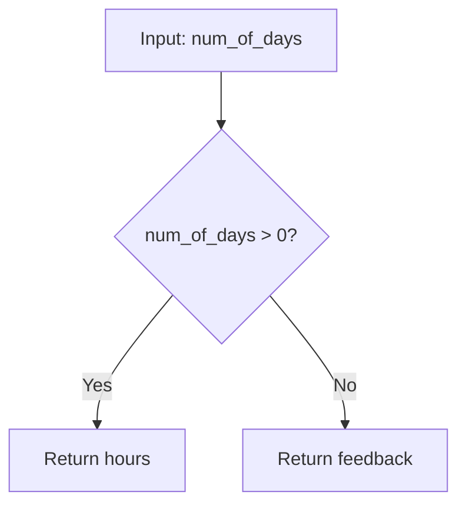

## Introduction to Conditional Statements

Conditional statements are fundamental constructs in programming that allow us to make decisions based on certain conditions. These conditions are evaluated to determine whether a specific block of code should be executed or not. In the context of validating user input, conditional statements help ensure that the input meets the required criteria before proceeding with further operations.

### What is a Conditional Statement?

A conditional statement is a logical construct that evaluates an expression and executes different blocks of code depending on whether the expression is `true` or `false`. The most common form of a conditional statement is the `if-else` structure.

#### Syntax of an `if-else` Statement

The basic syntax of an `if-else` statement in Python looks like this:

```python
if condition:
    # Code to execute if the condition is true
else:
    # Code to execute if the condition is false
```

### Example: Days to Units Function

Let's consider the example provided in the lecture, where we have a function that validates user input to ensure it is greater than zero.

```python
def days_to_units(num_of_days):
    if num_of_days > 0:
        return f"{num_of_days} days are {num_of_days * 24} hours"
    else:
        return "Please enter a positive number of days."
```

In this function, `num_of_days` is the input parameter. The `if-else` statement checks whether `num_of_days` is greater than zero. If it is, the function returns a string indicating the number of hours corresponding to the given number of days. Otherwise, it returns a feedback message asking the user to enter a positive number.

### Why Use Conditional Statements?

Conditional statements are crucial for several reasons:

1. **Validation**: They ensure that inputs meet specific criteria before further processing.
2. **Control Flow**: They control the flow of execution based on different conditions.
3. **Error Handling**: They can provide feedback or handle errors gracefully when inputs do not meet expectations.

### How Conditional Statements Work

Conditional statements work by evaluating a boolean expression. A boolean expression is one that results in either `true` or `false`. In the example above, `num_of_days > 0` is a boolean expression. If `num_of_days` is greater than zero, the expression evaluates to `true`, and the code inside the `if` block is executed. Otherwise, the code inside the `else` block is executed.

### Boolean Data Type

In programming, boolean values are represented by the `Boolean` data type. There are two possible boolean values: `True` and `False`.

#### Example: Printing Boolean Values

To demonstrate the evaluation of boolean expressions, let's modify the function to print the boolean value before performing the check.

```python
def days_to_units(num_of_days):
    print(f"Is the input greater than zero? {num_of_days > 0}")
    if num_of_days > 0:
        return f"{num_of_days} days are {num_of_days * 24} hours"
    else:
        return "Please enter a positive number of days."

# Test the function with positive and negative inputs
print(days_to_units(10))  # Should print True and the result
print(days_to_units(-10))  # Should print False and the feedback message
```

### Mermaid Diagram: Conditional Flow

A mermaid diagram can help visualize the flow of the conditional statement.



### Real-World Examples and Security Implications

Conditional statements are widely used in various applications, including web forms, user authentication, and data validation. However, improper handling of these conditions can lead to security vulnerabilities.

#### Example: SQL Injection

Consider a web application that uses a conditional statement to validate user input before executing a database query. If the validation is weak, it can lead to SQL injection attacks.

```sql
-- Vulnerable code
if (input != "") {
    query = "SELECT * FROM users WHERE username = '" + input + "'";
    execute(query);
}
```

In this example, if the user input is not properly validated, an attacker could inject malicious SQL code.

#### Secure Code Example

To prevent SQL injection, use parameterized queries or prepared statements.

```sql
-- Secure code
if (input != "") {
    query = "SELECT * FROM users WHERE username = ?";
    execute(query, [input]);
}
```

### Common Pitfalls and Best Practices

#### Common Pitfalls

1. **Neglecting Edge Cases**: Always consider edge cases, such as zero or negative numbers.
2. **Inadequate Validation**: Ensure thorough validation of all inputs.
3. **Complex Conditions**: Avoid overly complex conditions that can be difficult to debug.

#### Best Practices

1. **Use Clear and Concise Conditions**: Make conditions easy to read and understand.
2. **Validate All Inputs**: Ensure all inputs are validated before use.
3. **Use Secure Coding Practices**: Follow secure coding guidelines to prevent vulnerabilities.

### How to Prevent / Defend

#### Detection

Regularly review and test your code for potential vulnerabilities. Use static analysis tools to identify issues.

#### Prevention

1. **Input Validation**: Validate all inputs to ensure they meet the required criteria.
2. **Secure Coding Practices**: Follow secure coding practices to prevent common vulnerabilities.
3. **Code Reviews**: Conduct regular code reviews to catch potential issues.

#### Secure-Coding Fixes

Compare the vulnerable and secure versions of the code side by side.

**Vulnerable Code**

```python
def days_to_units(num_of_days):
    if num_of_days > 0:
        return f"{num_of_days} days are {num_of_days * 24} hours"
    else:
        return "Please enter a positive number of days."
```

**Secure Code**

```python
def days_to_units(num_of_days):
    if isinstance(num_of_days, int) and num_of_days > 0:
        return f"{num_of_days} days are {num_of_days * 24} hours"
    else:
        return "Please enter a valid positive integer."
```

### Hands-On Labs

For practical experience with conditional statements and input validation, consider the following labs:

- **PortSwigger Web Security Academy**: Offers exercises on SQL injection and other web vulnerabilities.
- **OWASP Juice Shop**: Provides a vulnerable web application for practicing security testing.
- **DVWA (Damn Vulnerable Web Application)**: Another web application for learning about web vulnerabilities.

By thoroughly understanding and implementing conditional statements correctly, you can ensure robust and secure applications.

---
<!-- nav -->
[[04-Introduction to Conditional Statements in Python|Introduction to Conditional Statements in Python]] | [[DevOps/DevOps Bootcamp/11-Miscellaneous/21-Validating User Input With Conditionals/00-Overview|Overview]] | [[06-Introduction to User Input Validation with Conditionals|Introduction to User Input Validation with Conditionals]]
