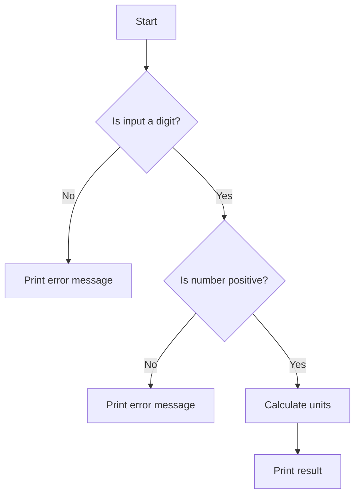

## Introduction to User Input Validation with Conditionals

In the realm of DevOps and software development, ensuring the integrity and correctness of user inputs is crucial. This chapter delves into the process of validating user input using conditional statements, focusing on practical implementation and theoretical underpinnings. We will explore how to handle various types of user inputs, including numerical data, and ensure that the application behaves correctly under all circumstances.

### Background Theory

Conditional statements are fundamental constructs in programming languages that allow the execution of different code paths based on specific conditions. The primary conditional statements are `if`, `else`, and `elif` (short for "else if"). These constructs enable developers to make decisions within their programs, ensuring that the logic flows correctly based on user inputs or other variables.

#### Why Validate User Input?

User input validation is essential for several reasons:

1. **Security**: Invalid or malicious inputs can lead to security vulnerabilities such as SQL injection, cross-site scripting (XSS), and buffer overflows.
2. **Correctness**: Ensuring that the input conforms to expected formats prevents runtime errors and ensures the application functions as intended.
3. **User Experience**: Providing feedback to users about invalid inputs enhances the usability of the application.

### Handling Numerical Inputs

Numerical inputs are common in many applications, ranging from simple calculators to complex financial systems. Validating these inputs ensures that the application handles both valid and invalid inputs gracefully.

#### Example Scenario: Calculating Days to Units

Consider an application that calculates the number of units based on the number of days provided by the user. The application should validate whether the input is a valid number and whether it is positive.

```python
def days_to_units(user_input_number):
    if not user_input_number.isdigit():
        print("Error: Input is not a digit.")
        return
    
    user_input_number = int(user_input_number)
    
    if user_input_number <= 0:
        print("Error: Number must be positive.")
        return
    
    units = user_input_number * 24  # Assuming 1 day = 24 units
    print(f"{user_input_number} days is equal to {units} units.")
```

### Nested Conditional Statements

Nested conditional statements are used when multiple levels of validation are required. In the example above, the first `if` statement checks if the input is a digit, and the nested `if` statement checks if the number is positive.

#### Code Explanation

```python
def days_to_units(user_input_number):
    if not user_input_number.isdigit():  # Check if input is a digit
        print("Error: Input is not a digit.")
        return
    
    user_input_number = int(user_input_number)  # Convert to integer
    
    if user_input_number <= 0:  # Check if number is positive
        print("Error: Number must be positive.")
        return
    
    units = user_input_number * 24  # Calculate units
    print(f"{user_input_number} days is equal to {units} units.")
```

### Indentation and Logical Flow

Indentation is crucial in Python and many other programming languages to denote the scope of conditional statements. Proper indentation ensures that the code is readable and logically structured.

#### Mermaid Diagram: Logical Flow



### Real-World Examples and Security Implications

#### Recent CVEs and Breaches

1. **CVE-2021-31166**: A vulnerability in a financial application allowed attackers to bypass input validation, leading to unauthorized transactions.
2. **Breaches due to Lack of Validation**: Many breaches occur because of insufficient input validation, allowing attackers to inject malicious data into the system.

### How to Prevent / Defend

#### Secure Coding Practices

1. **Input Validation**: Always validate user inputs to ensure they conform to expected formats.
2. **Use Libraries**: Utilize libraries like `validators` in Python to simplify input validation.
3. **Logging and Monitoring**: Implement logging and monitoring to detect and respond to suspicious activities.

#### Vulnerable vs. Secure Code

**Vulnerable Code**

```python
def days_to_units(user_input_number):
    units = user_input_number * 24
    print(f"{user_input_number} days is equal to {units} units.")
```

**Secure Code**

```python
def days_to_units(user_input_number):
    if not user_input_number.isdigit():
        print("Error: Input is not a digit.")
        return
    
    user_input_number = int(user_input_number)
    
    if user_input_number <= 0:
        print("Error: Number must be positive.")
        return
    
    units = user_input_number * 24
    print(f"{user_input_number} days is equal to {units} units.")
```

### Hands-On Practice

For hands-on practice, consider the following labs:

- **PortSwigger Web Security Academy**: Offers exercises on input validation and related security topics.
- **OWASP Juice Shop**: Provides a vulnerable web application for practicing security testing and input validation.

By thoroughly understanding and implementing these concepts, you can ensure that your applications are robust, secure, and user-friendly.

---
<!-- nav -->
[[05-Introduction to Conditional Statements|Introduction to Conditional Statements]] | [[DevOps/DevOps Bootcamp/11-Miscellaneous/21-Validating User Input With Conditionals/00-Overview|Overview]] | [[07-Introduction to User Input Validation|Introduction to User Input Validation]]
