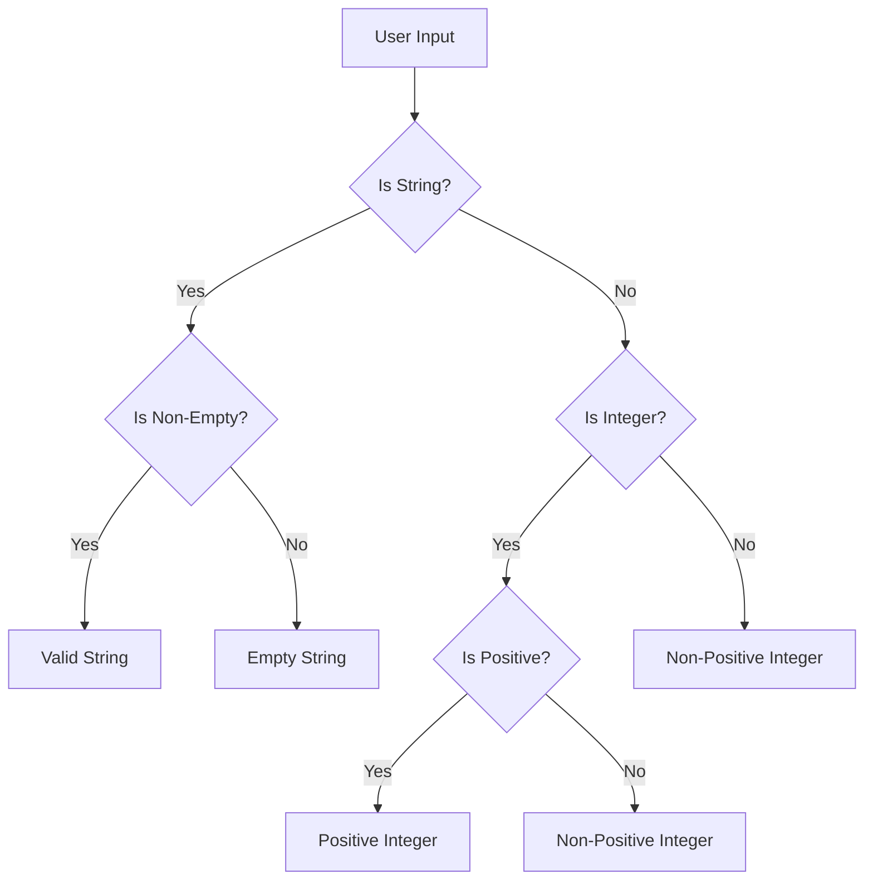

## Understanding Nested Conditional Statements

In programming, conditional statements are used to make decisions based on certain conditions. These conditions can be simple or complex, and they often involve comparing values or checking the truthiness of expressions. One common scenario is when you need to validate user input, which can come in various forms such as text, numbers, or selections from a list. To handle these validations, developers often use `if`, `else`, and `elif` (short for "else if") statements.

### What Are Nested Conditional Statements?

Nested conditional statements occur when one conditional statement is placed inside another. This means that the inner conditional statement is executed only if the outer conditional statement evaluates to true. Here’s an example:

```python
def validate_input(user_input):
    if isinstance(user_input, str):
        if len(user_input) > 0:
            print("Valid string input")
        else:
            print("Empty string input")
    elif isinstance(user_input, int):
        if user_input > 0:
            print("Positive integer input")
        else:
            print("Non-positive integer input")
    else:
        print("Invalid input type")

validate_input("Hello")
validate_input(10)
validate_input(-5)
validate_input([])
```

In this example, the `validate_input` function checks the type of `user_input`. If it is a string, it further checks if the string is non-empty. If it is an integer, it checks if the integer is positive. This structure allows for detailed validation but can become complex and difficult to read if there are many levels of nesting.

### Why Avoid Deeply Nested Conditionals?

Deeply nested conditionals can lead to several issues:

1. **Readability**: As the number of nested levels increases, the code becomes harder to read and understand. This can make maintenance and debugging more challenging.
2. **Maintainability**: Adding new conditions or modifying existing ones in deeply nested structures can be error-prone and time-consuming.
3. **Performance**: While modern compilers and interpreters optimize code execution, deeply nested conditionals can still introduce inefficiencies, especially in performance-critical applications.

### Real-World Examples and Impacts

#### Example 1: CVE-2021-21972

CVE-2021-21972 is a vulnerability found in the Apache Struts framework. The issue arises from a complex series of nested conditional statements that fail to properly validate user input, leading to remote code execution. The vulnerability occurs because the input validation logic is too deeply nested, making it difficult to ensure all possible inputs are correctly handled.

#### Example 2: Heartbleed Bug (CVE-2014-0160)

The Heartbleed bug in OpenSSL is another example where improper handling of user input led to a critical vulnerability. Although not directly related to nested conditionals, the bug demonstrates the importance of thorough input validation. In this case, the lack of proper boundary checks allowed attackers to extract sensitive information from memory.

### Best Practices for Handling User Input Validation

To avoid the pitfalls of deeply nested conditionals, follow these best practices:

1. **Use Functions**: Break down complex validation logic into smaller, reusable functions. Each function should handle a specific aspect of the validation.
2. **Early Returns**: Use early returns to exit the function as soon as a condition is met. This reduces the need for deep nesting.
3. **Guard Clauses**: Place checks at the beginning of a function to return immediately if the input is invalid. This simplifies the main logic of the function.

### Example Code with Best Practices

Here’s an improved version of the previous example using functions and guard clauses:

```python
def is_valid_string(input_str):
    return isinstance(input_str, str) and len(input_str) > 0

def is_positive_integer(input_int):
    return isinstance(input_int, int) and input_int > 0

def validate_input(user_input):
    if is_valid_string(user_input):
        print("Valid string input")
    elif is_positive_integer(user_input):
        print("Positive integer input")
    else:
        print("Invalid input type")

validate_input("Hello")
validate_input(10)
validate_input(-5)
validate_input([])
```

### Mermaid Diagrams for Conditional Flow

A mermaid diagram can help visualize the flow of conditional statements:



### How to Prevent / Defend Against Complex Nested Conditionals

#### Detection

To detect overly complex nested conditionals, you can use static analysis tools like SonarQube, ESLint, or PyLint. These tools can flag code that exceeds a certain complexity threshold, helping you identify areas that need refactoring.

#### Prevention

1. **Refactor Early**: Regularly review and refactor code to simplify complex structures. Use code reviews to catch and address issues early.
2. **Code Guidelines**: Establish coding guidelines that discourage deeply nested conditionals. Encourage the use of functions and guard clauses instead.
3. **Automated Testing**: Implement comprehensive unit tests to ensure that all input scenarios are handled correctly. Automated testing can help catch edge cases that might otherwise be missed.

#### Secure Coding Fixes

Compare the vulnerable code with the secure version:

**Vulnerable Code:**

```python
def validate_input(user_input):
    if isinstance(user_input, str):
        if len(user_input) > 0:
            print("Valid string input")
        else:
            print("Empty string input")
    elif isinstance(user_input, int):
        if user_input > 0:
            print("Positive integer input")
        else:
            print("Non-positive integer input")
    else:
        print("Invalid input type")
```

**Secure Code:**

```python
def is_valid_string(input_str):
    return isinstance(input_str, str) and len(input_str) > 0

def is_positive_integer(input_int):
    return isinstance(input_int, int) and input_int > 0

def validate_input(user_input):
    if is_valid_string(user_input):
        print("Valid string input")
    elif is_positive_integer(user_input):
        print("Positive integer input")
    else:
        print("Invalid input type")
```

### Conclusion

Handling user input validation with conditionals is a fundamental task in programming. While nested conditionals can be necessary, deeply nested structures should be avoided due to readability and maintainability issues. By following best practices such as using functions, early returns, and guard clauses, you can write cleaner and more robust code. Static analysis tools and automated testing can help detect and prevent complex nested conditionals, ensuring your code remains secure and efficient.

### Hands-On Practice

For hands-on practice with validating user input and handling conditionals, consider the following labs:

- **PortSwigger Web Security Academy**: Offers interactive labs on input validation and conditional logic in web applications.
- **OWASP Juice Shop**: Provides a vulnerable web application where you can practice identifying and fixing input validation issues.
- **DVWA (Damn Vulnerable Web Application)**: Another great resource for practicing web application security, including input validation.

These labs provide real-world scenarios where you can apply the concepts learned in this chapter.

---
<!-- nav -->
[[08-Nested Function Calls and Type Checking in Python|Nested Function Calls and Type Checking in Python]] | [[DevOps/DevOps Bootcamp/11-Miscellaneous/21-Validating User Input With Conditionals/00-Overview|Overview]] | [[10-Validating User Input With Conditionals|Validating User Input With Conditionals]]
