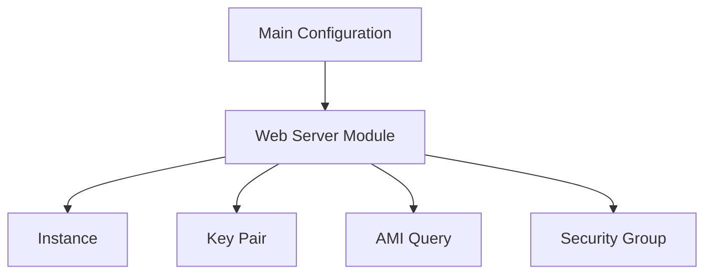

## Introduction to Web Server Configuration Module Extraction

In the context of DevOps, managing infrastructure as code (IaC) is crucial for maintaining consistency, scalability, and security. One of the most popular tools for IaC is Terraform, which allows you to define your infrastructure using declarative configuration files. In this chapter, we will delve into the process of extracting web server configuration into a separate module, focusing on the practical aspects and theoretical underpinnings.

### Background Theory

#### Infrastructure as Code (IaC)

Infrastructure as Code (IaC) is the practice of managing and provisioning computer data centers through machine-readable definition files, rather than physical hardware configuration or interactive configuration tools. This approach enables teams to manage their infrastructure in a more consistent, repeatable, and automated manner.

#### Terraform

Terraform is an open-source infrastructure as code software tool created by HashiCorp. It allows you to safely and predictably create, change, and improve infrastructure. It is an essential tool for DevOps engineers, enabling them to define and provision infrastructure across multiple cloud providers and on-premises environments.

### Extracting Web Server Configuration

The goal is to isolate the configuration related to the web server into its own module. This separation helps in maintaining a clean and modular structure, making it easier to manage and scale the infrastructure.

#### Components Involved

1. **Instance**: The virtual machine or container where the web server runs.
2. **Key Pair**: The SSH key pair used to securely access the instance.
3. **AMI Query**: The Amazon Machine Image (AMI) used to launch the instance.
4. **Security Group**: The firewall rules that control inbound and outbound traffic to the instance.

### Step-by-Step Process

Let's walk through the process of extracting the web server configuration into a separate module.

#### Initial Configuration

Assume we have the following initial configuration in `main.tf`:

```hcl
resource "aws_instance" "web_server" {
  ami           = "ami-0c94855ba95b798c7"
  instance_type = "t2.micro"

  key_name = aws_key_pair.web_server.key_name

  vpc_security_group_ids = [aws_security_group.web_server.id]

  tags = {
    Name = "web-server"
  }
}

resource "aws_key_pair" "web_server" {
  key_name   = "web_server"
  public_key = file("~/.ssh/id_rsa.pub")
}

data "aws_ami" "latest_amazon_linux" {
  most_recent = true
  owners      = ["amazon"]

  filter {
    name   = "name"
    values = ["amzn2-ami-hvm*"]
  }
}

resource "aws_security_group" "web_server" {
  name        = "web_server_sg"
  description = "Allow HTTP and SSH access"

  ingress {
    from_port   = 22
    to_port     = 22
    protocol    = "tcp"
    cidr_blocks = ["0.0.0.0/0"]
  }

  ingress {
    from_port   = 80
    to_port     = 80
    protocol    = "tcp"
    cidr_blocks = ["0.0.0.0/0"]
  }
}
```

#### Extracting into a Separate Module

1. **Create a New Directory for the Module**

   Create a new directory named `web_server` and move the relevant configuration into it.

   ```sh
   mkdir web_server
   mv main.tf web_server/main.tf
   ```

2. **Update the Main Configuration**

   Update the main configuration to reference the new module.

   ```hcl
   module "web_server" {
     source = "./web_server"

     vpc_id = var.vpc_id
     my_ip  = var.my_ip
   }
   ```

3. **Parameterize the Module**

   Modify the `main.tf` inside the `web_server` directory to accept parameters.

   ```hcl
   variable "vpc_id" {}
   variable "my_ip" {}

   resource "aws_instance" "web_server" {
     ami           = var.ami_name
     instance_type = "t2.micro"

     key_name = aws_key_pair.web_server.key_name

     vpc_security_group_ids = [aws_security_group.web_server.id]
     subnet_id              = data.aws_subnet.default.id

     tags = {
       Name = "web-server"
     }
   }

   resource "aws_key_pair" "web_server" {
     key_name   = "web_server"
     public_key = file("~/.ssh/id_rsa.pub")
   }

   data "aws_ami" "latest_amazon_linux" {
     most_recent = true
     owners      = ["amazon"]

     filter {
       name   = "name"
       values = ["amzn2-ami-hvm*"]
     }
   }

   resource "aws_security_group" "web_erver" {
     name        = "web_server_sg"
     description = "Allow HTTP and SSH access"

     ingress {
       from_port   = 22
       to_port     = 22
       protocol    = "tcp"
       cidr_blocks = [var.my_ip]
     }

     ingress {
       from_port   = 80
       to_port     = 80
       protocol    = "tcp"
       cidr_blocks = ["0.0.0.0/0"]
     }
   }
   ```

4. **Pass Parameters from the Main Configuration**

   Ensure the main configuration passes the required parameters to the module.

   ```hcl
   variable "vpc_id" {}
   variable "my_ip" {}

   module "web_server" {
     source = "./web_server"

     vpc_id = var.vpc_id
     my_ip  = var.my_ip
     ami_name = "ami-0c94855ba95b798c7"
   }
   ```

### Diagramming the Architecture

To better understand the architecture, let's use a Mermaid diagram to visualize the components and their relationships.



### Common Pitfalls and How to Avoid Them

#### Hardcoding Values

One common pitfall is hardcoding values such as AMI IDs or IP addresses. This can lead to issues when you need to deploy the same configuration in different environments or when the values change.

**How to Prevent / Defend:**

- **Use Variables:** Define variables for values that may change, such as AMI IDs or IP addresses.
- **Parameterize the Module:** Pass these variables as parameters to the module.

#### Inconsistent Security Settings

Another issue is inconsistent security settings, such as allowing unrestricted access to sensitive ports.

**How to Prevent / Defend:**

- **Restrict Access:** Limit access to sensitive ports (e.g., SSH) to trusted IP addresses.
- **Use Security Groups:** Configure security groups to enforce strict access controls.

### Real-World Examples

#### CVE-2021-20225: Unrestricted SSH Access

In 2021, a vulnerability was discovered where unrestricted SSH access was allowed due to misconfigured security groups. This led to unauthorized access to instances.

**Example:**

```hcl
resource "aws_security_group" "web_server" {
  name        = "web_server_sg"
  description = "Allow HTTP and SSH access"

  ingress {
    from_port   = 22
    to_port     = 22
    protocol    = "tcp"
    cidr_blocks = ["0.0.0.0/0"]  # Vulnerable setting
  }

  ingress {
    from_port   = 80
    to_port     = 80
    protocol    = "tcp"
    cidr_blocks = ["0.0.0.0/0"]
  }
}
```

**Secure Version:**

```hcl
resource "aws_security_group" "web_server" {
  name        = "web_server_sg"
  description = "Allow HTTP and SSH access"

  ingress {
    from_port   = 22
    to_port     = 22
    protocol    = "tcp"
    cidr_blocks = [var.my_ip]  # Secure setting
  }

  ingress {
    from_port   = 80
    to_port     = 80
    protocol    = "tcp"
    cidr_blocks = ["0.0.0.0/0"]
  }
}
```

### Detection and Prevention

#### Detection

- **Automated Scanning Tools:** Use tools like AWS Trusted Advisor to scan for misconfigurations.
- **Logging and Monitoring:** Implement logging and monitoring to detect unauthorized access attempts.

#### Prevention

- **Least Privilege Principle:** Apply the principle of least privilege to ensure that only necessary permissions are granted.
- **Regular Audits:** Conduct regular audits of your infrastructure to identify and mitigate vulnerabilities.

### Hands-On Labs

For hands-on practice, consider the following labs:

- **PortSwigger Web Security Academy:** Focuses on web application security and includes modules on securing web servers.
- **OWASP Juice Shop:** An intentionally insecure web application for practicing web security skills.
- **DVWA (Damn Vulnerable Web Application):** Another intentionally vulnerable web application for learning web security.

These labs provide practical experience in configuring and securing web servers, reinforcing the concepts covered in this chapter.

### Conclusion

Extracting web server configuration into a separate module is a powerful technique for maintaining a clean and scalable infrastructure. By parameterizing the module and ensuring proper security settings, you can avoid common pitfalls and maintain a robust and secure environment. Through real-world examples and hands-on labs, you can gain a deeper understanding of the principles and practices involved in web server configuration.

---
<!-- nav -->
[[DevOps/DevOps Bootcamp/11-Miscellaneous/22-Web Server Configuration Module Extraction/00-Overview|Overview]] | [[02-Introduction to Web Server Configuration Using Modules in Terraform|Introduction to Web Server Configuration Using Modules in Terraform]]
