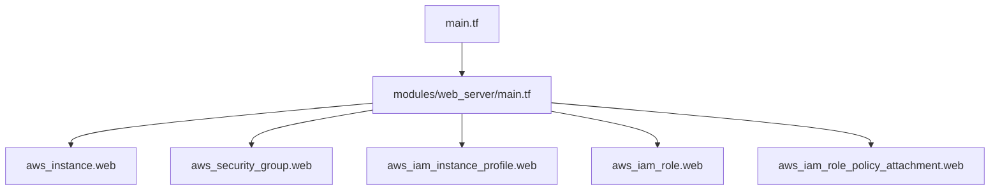
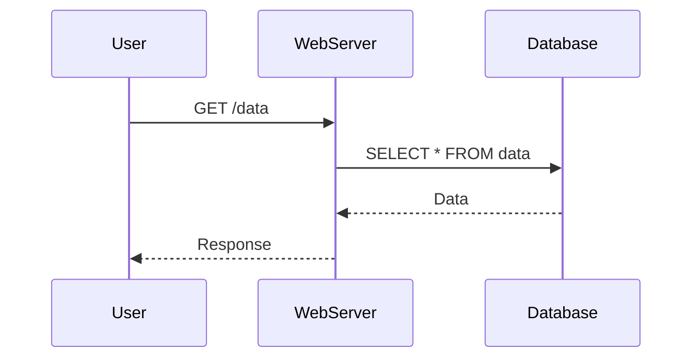

## Introduction to Web Server Configuration Using Modules in Terraform

In the realm of DevOps, managing infrastructure as code (IaC) is crucial for maintaining consistency, scalability, and security. One of the most powerful tools for achieving this is Terraform, an open-source infrastructure as code software tool created by HashiCorp. This chapter delves into the concept of modules in Terraform, specifically focusing on how to configure web servers using these modules. By the end of this chapter, you will understand the importance of modularizing your Terraform configurations, how to create and use modules effectively, and how to manage these configurations in a version control system like Git.

### What Are Modules in Terraform?

Modules in Terraform are reusable components that encapsulate a group of related resources. They allow you to break down complex configurations into smaller, more manageable pieces. This modular approach enhances readability, maintainability, and reusability of your Terraform code.

#### Why Use Modules?

1. **Reusability**: Modules can be reused across different projects, reducing redundancy and improving efficiency.
2. **Encapsulation**: Modules encapsulate logic and resources, making it easier to manage and update specific parts of your infrastructure.
3. **Maintainability**: By grouping related resources together, modules make it easier to understand and maintain your infrastructure.
4. **Parameterization**: Modules can accept input variables, allowing you to customize their behavior without modifying the underlying code.

### Creating and Using Modules

To illustrate the creation and usage of modules, let's walk through an example of configuring a web server using Terraform modules.

#### Step 1: Define the Module

First, we need to define a module that sets up a basic web server. This module will include resources such as an EC2 instance, a security group, and an IAM role.

```hcl
# modules/web_server/main.tf
resource "aws_instance" "web" {
  ami           = var.ami
  instance_type = var.instance_type

  vpc_security_group_ids = [aws_security_group.web.id]
  iam_instance_profile   = aws_iam_instance_profile.web.name
}

resource "aws_security_group" "web" {
  name        = "web-server-sg"
  description = "Security group for web server"

  ingress {
    from_port   = 80
    to_port     = 80
    protocol    = "tcp"
    cidr_blocks = ["0.0.0.0/0"]
  }
}

resource "aws_iam_instance_profile" "web" {
  name = "web-server-profile"
}

resource "aws_iam_role" "web" {
  name = "web-server-role"

  assume_role_policy = jsonencode({
    Version = "2012-10-17"
    Statement = [
      {
        Action = "sts:AssumeRole"
        Effect = "Allow"
        Principal = {
          Service = "ec2.amazonaws.com"
        }
      }
    ]
  })
}

resource "aws_iam_role_policy_attachment" "web" {
  policy_arn = "arn:aws:iam::aws:policy/AmazonSSMManagedInstanceCore"
  role_name  = aws_iam_role.web.name
}
```

#### Step 2: Parameterize the Module

Next, we parameterize the module by defining input variables. This allows us to customize the behavior of the module without modifying its core logic.

```hcl
# modules/web_server/variables.tf
variable "ami" {
  description = "The AMI to use for the web server."
  type        = string
}

variable "instance_type" {
  description = "The instance type to use for the web server."
  type        = string
}
```

#### Step 3: Use the Module

Now, we can use the module in our main Terraform configuration. We specify the values for the input variables and reference the module.

```hcl
# main.tf
module "web_server" {
  source = "./modules/web_server"

  ami           = "ami-0c55b159cbfafe1f0"
  instance_type = "t2.micro"
}
```

### Managing Configuration in Git

Once we have defined and used our module, we need to manage our Terraform configuration in a version control system like Git. This ensures that our infrastructure is version-controlled and can be easily rolled back or audited.

#### Step 1: Initialize Git Repository

First, initialize a Git repository in your project directory.

```bash
git init
```

#### Step 2: Add Files to Git

Add all the files in your project to the Git repository.

```bash
git add .
```

#### Step 3: Commit Changes

Commit the changes to your local repository.

```bash
git commit -m "Initial commit of Terraform project with modules"
```

#### Step 4: Push to Remote Repository

Push the changes to a remote repository. This step assumes you have already set up a remote repository.

```bash
git remote add origin <remote-repository-url>
git push -u origin master
```

### Real-World Example: Recent Breaches and CVEs

Let's consider a recent breach involving misconfigured web servers. In 2021, a large number of web servers were compromised due to misconfigured security groups and IAM roles. This breach highlights the importance of proper configuration and management of web servers.

#### CVE-2021-39287

CVE-2021-39287 is a critical vulnerability affecting Amazon EC2 instances. This vulnerability arises from misconfigured security groups and IAM roles, allowing unauthorized access to sensitive data.

#### How to Prevent / Defend

1. **Secure Configuration**: Ensure that security groups and IAM roles are properly configured to restrict access to only necessary ports and services.
2. **Regular Audits**: Perform regular audits of your infrastructure to identify and mitigate potential vulnerabilities.
3. **Automated Compliance Checks**: Use tools like Terraform validate and third-party compliance checkers to ensure your configurations meet best practices.

### Secure Coding Fixes

Here is an example of a vulnerable configuration and its secure counterpart:

#### Vulnerable Configuration

```hcl
resource "aws_security_group" "web" {
  name        = "web-server-sg"
  description = "Security group for web server"

  ingress {
    from_port   = 0
    to_port     = 65535
    protocol    = "-1"
    cidr_blocks = ["0.0.0.0/0"]
  }
}
```

#### Secure Configuration

```hcl
resource "aws_security_group" "web" {
  name        = "web-server-sg"
  description = "Security group for web server"

  ingress {
    from_port   = 80
    to_port     = 80
    protocol    = "tcp"
    cidr_blocks = ["0.0.0.0/0"]
  }
}
```

### Mermaid Diagrams

#### Module Structure



#### Request/Response Flow



### Conclusion

By modularizing your Terraform configurations, you can improve the maintainability, reusability, and security of your infrastructure. Properly managing your configurations in a version control system like Git ensures that your infrastructure is version-controlled and can be easily audited or rolled back. Real-world examples and secure coding practices further reinforce the importance of proper configuration and management.

### Practice Labs

For hands-on experience with Terraform and web server configuration, consider the following labs:

- **PortSwigger Web Security Academy**: Offers interactive labs on web application security.
- **OWASP Juice Shop**: A deliberately insecure web application for security training.
- **DVWA (Damn Vulnerable Web Application)**: Another popular web application for security training.
- **WebGoat**: An interactive web application security training tool.

These labs provide practical experience in configuring and securing web servers, reinforcing the concepts covered in this chapter.

---
<!-- nav -->
[[01-Introduction to Web Server Configuration Module Extraction|Introduction to Web Server Configuration Module Extraction]] | [[DevOps/DevOps Bootcamp/11-Miscellaneous/22-Web Server Configuration Module Extraction/00-Overview|Overview]] | [[03-Introduction to Web Server Configuration Using Terraform Modules|Introduction to Web Server Configuration Using Terraform Modules]]
