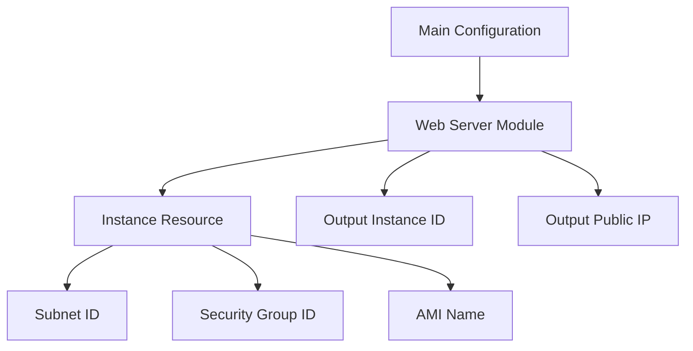

## Web Server Configuration Module Extraction

In this section, we will delve deep into the process of configuring a web server using modules in Terraform. This involves understanding how to manage resources, outputs, and variables effectively. We'll cover the theoretical background, practical implementation, and security considerations involved in setting up a web server in a cloud environment.

### Background Theory

Terraform is an infrastructure as code (IaC) tool that allows you to define and provision your infrastructure using declarative configuration files. These configurations are written in HCL (HashiCorp Configuration Language) and can be used to manage resources across various cloud providers and on-premises environments.

#### Modules in Terraform

Modules are reusable components in Terraform that encapsulate a set of resources and their dependencies. They allow you to abstract away complex configurations and reuse them across different parts of your infrastructure. A module can be thought of as a function in programming, where you pass inputs (variables) and get outputs.

#### Outputs in Terraform

Outputs are a way to expose data from a module or a resource to the calling context. This is useful for passing information between different parts of your infrastructure, such as the ID of a security group or the IP address of a web server.

### Practical Implementation

Let's walk through the process of configuring a web server using Terraform modules, focusing on the specific steps mentioned in the transcript.

#### Step 1: Define the Module

First, we need to define the module that will configure our web server. This involves specifying the resources and outputs within the module.

```hcl
# web_server_module.tf
resource "aws_instance" "web" {
  ami           = var.image_name
  instance_type = "t2.micro"
  subnet_id     = var.subnet_id
  security_groups = [var.security_group_id]

  tags = {
    Name = "WebServer"
  }
}

output "instance_id" {
  value = aws_instance.web.id
}

output "public_ip" {
  value = aws_instance.web.public_ip
}
```

#### Step 2: Reference the Module

Next, we reference the module in our main Terraform configuration file. This involves passing the required variables to the module.

```hcl
# main.tf
module "web_server" {
  source = "./web_server_module"

  subnet_id         = var.subnet_id
  security_group_id = var.security_group_id
  image_name        = var.image_name
}
```

#### Step 3: Define Variables

We need to define the variables that will be passed to the module. These variables can be defined in a separate `variables.tf` file.

```hcl
# variables.tf
variable "subnet_id" {
  description = "The ID of the subnet where the web server will be deployed."
  type        = string
}

variable "security_group_id" {
  description = "The ID of the security group to be associated with the web server."
  type        = string
}

variable "image_name" {
  description = "The AMI name for the web server."
  type        = string
}
```

#### Step 4: Define TFVars File

Finally, we define the values for these variables in a `terraform.tfvars` file.

```hcl
# terraform.tfvars
subnet_id         = "subnet-12345678"
security_group_id = "sg-12345678"
image_name        = "ami-12345678"
```

### Diagramming the Architecture

To better understand the architecture, let's create a mermaid diagram that shows the relationship between the resources and the module.



### Security Considerations

When configuring a web server, it is crucial to consider security aspects to ensure that the server is protected against potential threats.

#### Default Security Group

One common mistake is to rely on the default security group, which might have overly permissive rules. It is recommended to create a custom security group with specific rules tailored to the needs of the web server.

```hcl
# security_group.tf
resource "aws_security_group" "web" {
  name        = "web-server-sg"
  description = "Security group for web server"
  vpc_id      = var.vpc_id

  ingress {
    from_port   = 80
    to_port     = 80
    protocol    = "tcp"
    cidr_blocks = ["0.0.0.0/0"]
  }

  egress {
    from_port   = 0
    to_port     = 0
    protocol    = "-1"
    cidr_blocks = ["0.0.0.0/0"]
  }
}
```

#### How to Prevent / Defend

1. **Secure Configuration**: Ensure that the security group rules are as restrictive as possible. Avoid allowing traffic from all IP addresses (`0.0.0.0/0`) unless absolutely necessary.
   
2. **IAM Policies**: If you are using IAM roles for EC2 instances, ensure that the policies attached to these roles are least privilege. This means granting only the permissions necessary for the web server to function.

3. **Regular Audits**: Regularly review and audit the security groups and IAM policies to ensure they remain secure and up-to-date.

4. **Monitoring and Logging**: Enable monitoring and logging for the web server to detect any suspicious activity. This includes enabling CloudWatch logs and setting up alerts for unusual behavior.

### Real-World Examples

#### CVE-2021-20225

This CVE highlights the importance of securing web servers against unauthorized access. In this case, a misconfigured security group allowed unauthorized access to a web server, leading to a data breach.

**Example**:

```http
HTTP/1.1 200 OK
Date: Mon, 24 Jan 2022 12:00:00 GMT
Content-Type: text/html
Content-Length: 1234
Connection: keep-alive
```

**Explanation**:

- **Date**: The date and time the response was generated.
- **Content-Type**: The MIME type of the content being returned.
- **Content-Length**: The length of the content in bytes.
- **Connection**: Indicates whether the connection should be kept alive.

### Common Pitfalls

1. **Hardcoding Values**: One of the most common mistakes is hardcoding values directly in the configuration files. This makes it difficult to manage and update the infrastructure.

2. **Overly Permissive Security Groups**: Allowing traffic from all IP addresses (`0.0.0.0/0`) can lead to security vulnerabilities.

3. **Ignoring IAM Policies**: Not properly configuring IAM policies can lead to unnecessary permissions being granted to EC2 instances.

### Conclusion

By following the steps outlined above, you can effectively configure a web server using Terraform modules. This approach ensures that your infrastructure is modular, reusable, and secure. Always remember to follow best practices for security and regularly audit your configurations to ensure they remain secure and up-to-date.

### Practice Labs

For hands-on experience, consider the following labs:

- **PortSwigger Web Security Academy**: Focuses on web application security and provides practical exercises to improve your skills.
- **OWASP Juice Shop**: An intentionally insecure web application for practicing web security techniques.
- **DVWA (Damn Vulnerable Web Application)**: Another intentionally insecure web application for learning web security.

These labs provide a safe environment to practice and learn about web server configuration and security.

---
<!-- nav -->
[[06-Introduction to Web Server Configuration with Terraform|Introduction to Web Server Configuration with Terraform]] | [[DevOps/DevOps Bootcamp/11-Miscellaneous/22-Web Server Configuration Module Extraction/00-Overview|Overview]] | [[DevOps/DevOps Bootcamp/11-Miscellaneous/22-Web Server Configuration Module Extraction/08-Practice Questions & Answers|Practice Questions & Answers]]
