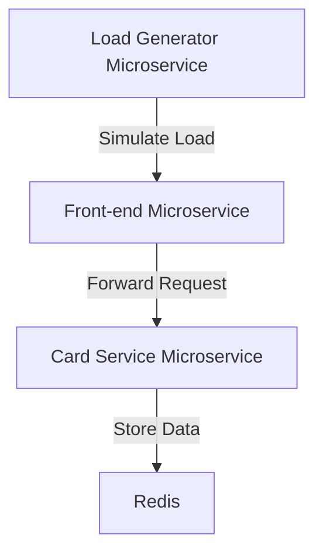

## Microservices Deployment Process Overview

### Introduction to Microservices

Microservices architecture is a design approach where an application is composed of small, independent services that communicate with each other using well-defined APIs. Each microservice is responsible for a specific business function and can be developed, deployed, and scaled independently. This approach allows for greater flexibility and scalability compared to monolithic applications.

In the context of the given lecture, we have several microservices that interact with each other to form a complete application. Let's break down the components and their interactions:

1. **Front-end Microservice**: This is the entry point of the application, handling all requests from the browser.
2. **Card Service Microservice**: This microservice manages the shopping cart functionality and requires Redis for storing data temporarily.
3. **Load Generator Microservice**: This is an optional microservice used for testing the application under load conditions.

### Front-end Microservice

The front-end microservice acts as the primary interface between the user and the backend services. It receives requests from the browser and forwards them to the appropriate backend microservices. This separation of concerns allows the front-end to focus solely on user interaction and presentation logic.

#### Example Scenario

Consider a web application where users can browse products and add items to their shopping cart. The front-end microservice handles the following tasks:

- Rendering the product catalog.
- Handling user interactions such as clicking on a product to view details.
- Forwarding requests to the card service microservice when a user adds an item to the cart.

#### Code Example

Here’s a simplified example of how the front-end microservice might handle a request to add an item to the cart:

```python
from flask import Flask, request
import requests

app = Flask(__name__)

@app.route('/add_to_cart', methods=['POST'])
def add_to_cart():
    product_id = request.json['product_id']
    user_id = request.json['user_id']
    
    # Forward the request to the card service microservice
    response = requests.post('http://card-service/add_item', json={
        'product_id': product_id,
        'user_id': user_id
    })
    
    return response.json()

if __name__ == '__main__':
    app.run(port=5000)
```

### Card Service Microservice

The card service microservice manages the shopping cart functionality. It requires Redis to store data temporarily. Redis is both a message broker and a memory database, making it suitable for storing session data and other transient information.

#### Redis Integration

Redis is used to store the shopping cart data because it provides fast read and write operations and can handle high volumes of data efficiently. Here’s how the card service microservice interacts with Redis:

- When a user adds an item to the cart, the card service microservice stores the item in Redis.
- When a user views their cart, the card service microservice retrieves the items from Redis.

#### Code Example

Here’s a simplified example of how the card service microservice might interact with Redis:

```python
import redis
from flask import Flask, request
import json

app = Flask(__name__)
redis_client = redis.Redis(host='localhost', port=6379, db=0)

@app.route('/add_item', methods=['POST'])
def add_item():
    product_id = request.json['product_id']
    user_id = request.json['user_id']
    
    # Store the item in Redis
    cart_key = f'cart:{user_id}'
    redis_client.hset(cart_key, product_id, json.dumps(request.json))
    
    return {'status': 'success'}

@app.route('/get_cart', methods=['GET'])
def get_cart():
    user_id = request.args.get('user_id')
    
    # Retrieve the cart from Redis
    cart_key = f'cart:{user_id}'
    cart_items = redis_client.hgetall(cart_key)
    
    return {item.decode(): json.loads(value.decode()) for item, value in cart_items.items()}

if __name__ == '__main__':
    app.run(port=5001)
```

### Load Generator Microservice

The load generator microservice is an optional component used for testing the application under load conditions. It simulates user activity by sending a large number of requests to the front-end microservice to ensure the application can handle high traffic.

#### Example Scenario

During development and testing, the load generator microservice can be used to simulate a large number of users accessing the application simultaneously. This helps identify performance bottlenecks and ensures the application can handle real-world usage.

#### Code Example

Here’s a simplified example of how the load generator microservice might generate load:

```python
import requests
import time

def generate_load(num_requests):
    for i in range(num_requests):
        # Simulate a user adding an item to the cart
        response = requests.post('http://front-end/add_to_cart', json={
            'product_id': i % 10,
            'user_id': i % 100
        })
        
        print(f'Request {i}: {response.status_code}')
        time.sleep(0.1)

if __name__ == '__main__':
    generate_load(1000)
```

### Visualizing Microservice Interactions

To understand how these microservices interact with each other, it’s helpful to visualize the connections. A mermaid diagram can provide a clear overview of the communication flow.



### Deploying Microservices

Once we have a clear understanding of the microservices and their interactions, the next step is to deploy them. This involves knowing the Docker image names for each microservice and configuring the deployment environment.

#### Docker Images

Each microservice should be containerized using Docker. The Docker images should be tagged appropriately and stored in a registry such as Docker Hub or Amazon ECR.

#### Example Dockerfile

Here’s a simplified example of a Dockerfile for the front-end microservice:

```Dockerfile
FROM python:3.9-slim

WORKDIR /app

COPY requirements.txt .
RUN pip install --no-cache-dir -r requirements.txt

COPY . .

CMD ["flask", "run", "--host=0.0.0.0"]
```

### Deployment Environment

The microservices can be deployed using a container orchestration platform like Kubernetes. This allows for easy scaling and management of the services.

#### Kubernetes Deployment

Here’s a simplified example of a Kubernetes deployment for the front-end microservice:

```yaml
apiVersion: apps/v1
kind: Deployment
metadata:
  name: front-end-deployment
spec:
  replicas: 3
  selector:
    matchLabels:
      app: front-end
  template:
    metadata:
      labels:
        app: front-end
    spec:
      containers:
      - name: front-end-container
        image: your-docker-registry/front-end:latest
        ports:
        - containerPort: 5000
```

### How to Prevent / Defend

#### Security Considerations

When deploying microservices, it’s crucial to consider security best practices. Here are some key points to keep in mind:

1. **Secure Communication**: Ensure that all communication between microservices is encrypted using TLS.
2. **Authentication and Authorization**: Implement proper authentication and authorization mechanisms to control access to microservices.
3. **Input Validation**: Validate all inputs to prevent injection attacks.
4. **Logging and Monitoring**: Implement comprehensive logging and monitoring to detect and respond to security incidents.

#### Example Secure Configuration

Here’s an example of how to configure a secure connection between microservices using HTTPS:

```yaml
apiVersion: networking.k8s.io/v1
kind: Ingress
metadata:
  name: secure-ingress
spec:
  tls:
  - hosts:
    - your-domain.com
    secretName: tls-secret
  rules:
  - host: your-domain.com
    http:
      paths:
      - path: /
        pathType: Prefix
        backend:
          service:
            name: front-end-service
            port:
              number: 5000
```

### Real-World Examples

#### Recent Breaches

One recent example of a breach involving microservices is the Capital One data breach in 2019. The attacker exploited a misconfigured web application firewall, which allowed unauthorized access to sensitive customer data. This highlights the importance of securing all components of a microservices architecture.

#### CVEs

Another example is CVE-2021-21972, which affected Kubernetes. This vulnerability allowed an attacker to bypass RBAC (Role-Based Access Control) and gain elevated privileges within the cluster. This underscores the need for robust security configurations and regular updates.

### Conclusion

Deploying microservices requires a thorough understanding of the components and their interactions. By following best practices for security and deployment, you can ensure a robust and scalable application. The provided examples and diagrams should help you visualize and implement the microservices architecture effectively.

### Practice Labs

For hands-on practice with microservices deployment, consider the following labs:

- **PortSwigger Web Security Academy**: Offers exercises on securing web applications, including microservices.
- **OWASP Juice Shop**: A deliberately insecure web application for practicing web security.
- **Kubernetes Goat**: A Kubernetes-based security training platform.

These labs provide practical experience in deploying and securing microservices in a controlled environment.

---
<!-- nav -->
[[01-Introduction to Microservices Deployment Process|Introduction to Microservices Deployment Process]] | [[DevOps/DevOps Bootcamp/01-Linux & OS Basics/04-Microservices Deployment Process Overview/00-Overview|Overview]] | [[03-Container Naming and Configuration|Container Naming and Configuration]]
