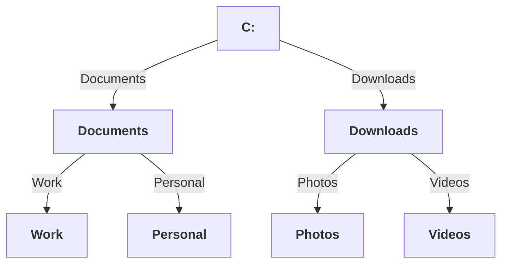
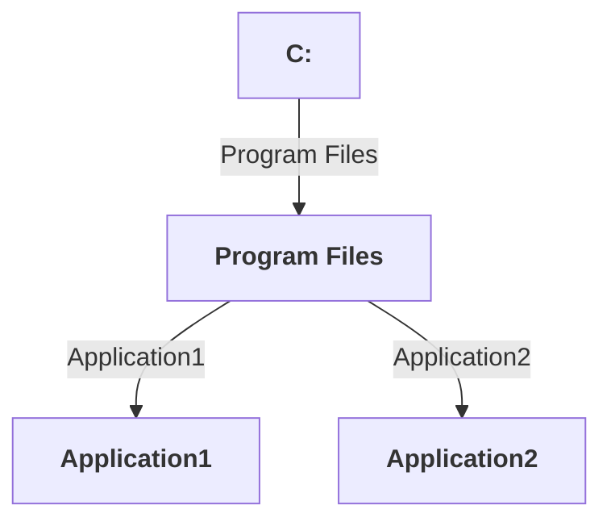
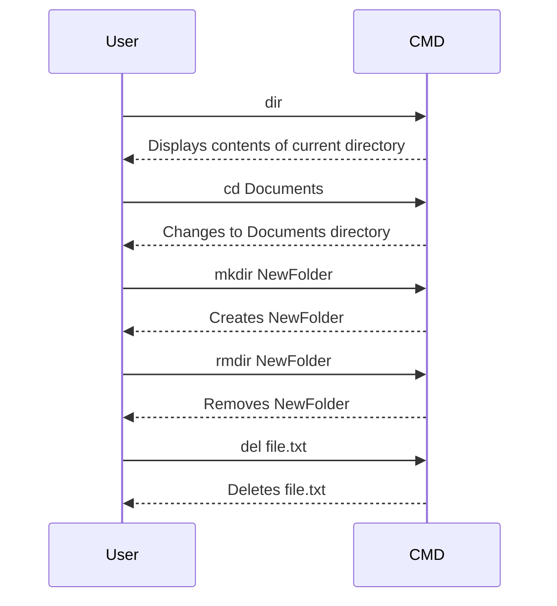
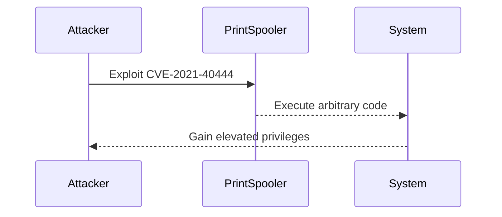
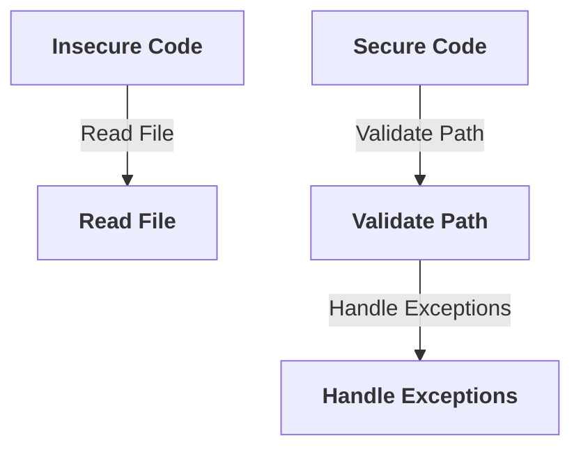

## Overview of Windows File System and Command Line Basics

### Introduction to Windows File System

The Windows file system is fundamentally different from Unix-like systems such as Linux and macOS. One of the most significant differences is the presence of multiple root directories, commonly referred to as drives. Unlike Unix-like systems, which typically have a single root directory (`/`), Windows allows for multiple root directories, such as `C:\`, `D:\`, `E:\`, etc. Each drive can contain its own hierarchical structure of files and folders, making it possible to organize data across multiple physical or logical storage devices.

#### Multiple Root Directories

In Windows, each drive represents a separate root directory. This means that the file system is not a single tree but a forest of trees, each rooted at a different drive letter. For example, `C:\` might represent the primary hard drive, while `D:\` could represent an external USB drive. This design allows for greater flexibility in managing storage resources, especially in environments where multiple storage devices are used.

#### Hierarchical Structure

Within each drive, the file system follows a hierarchical structure similar to Unix-like systems. Files and folders are organized in a tree-like structure, with each folder potentially containing subfolders and files. This hierarchical organization makes it easy to navigate and manage large amounts of data.



### Differences from Unix-like Systems

One of the key differences between Windows and Unix-like systems is the representation of various system components. In Unix-like systems, almost everything is treated as a file, including devices, drivers, and processes. This simplifies the file system model and allows for uniform handling of different types of resources. However, in Windows, these components are treated as distinct entities and are not represented as files.

#### Device and Driver Representation

In Windows, devices and drivers are managed through the Device Manager and are not represented as files within the file system. This separation allows for more specialized management of hardware components, but it can make certain tasks more complex compared to Unix-like systems.

#### Directory Path Syntax

Another significant difference is the syntax used for directory paths. In Unix-like systems, forward slashes (`/`) are used to denote directory separators, whereas in Windows, backward slashes (`\`) are used. This difference can lead to confusion when working with cross-platform applications or scripts.

```mermaid
graph TD
    U[<b>Unix-like</b>] -->|Path| "/home/user/Documents"
    W[<b>Windows</b>] -->|Path| "C:\\Users\\User\\Documents"
```

### Application Installation

In Windows, applications are typically installed in a single directory, usually under the `Program Files` directory on the `C:` drive. This contrasts with Unix-like systems, where applications are often split across multiple directories, such as `/usr/bin`, `/usr/lib`, and `/etc`.

#### Single Installation Directory

This approach simplifies the installation process and makes it easier to manage application files. However, it can also lead to cluttered directories and make it harder to locate specific files.



### Command Line Basics

Windows uses different shell programs compared to Unix-like systems, leading to a different set of commands. While some commands are similar, such as `cd` for changing directories, many others are unique to Windows.

#### Common Commands

- **dir**: Displays the contents of a directory, similar to `ls` in Unix-like systems.
- **cd**: Changes the current directory, similar to Unix-like systems.
- **mkdir**: Creates a new directory, similar to `mkdir` in Unix-like systems.
- **rmdir**: Removes an empty directory, similar to `rmdir` in Unix-like systems.
- **del**: Deletes a file, similar to `rm` in Unix-like systems.

#### Example Commands

Here are some examples of common commands in Windows:



### Real-World Examples and Security Implications

#### CVE-2021-40444: Windows Print Spooler Vulnerability

CVE-2021-40444 is a critical vulnerability in the Windows Print Spooler service. This vulnerability allows an attacker to execute arbitrary code with elevated privileges. The vulnerability arises from improper validation of input parameters, allowing an attacker to manipulate the print spooler service and gain unauthorized access.

**Detection and Prevention:**

- **Detection**: Monitor system logs for unusual activity related to the print spooler service. Look for unexpected changes in permissions or unauthorized access attempts.
- **Prevention**: Apply the latest security patches and updates provided by Microsoft. Disable the print spooler service if it is not required for your environment.



### Secure Coding Practices

When working with the Windows file system and command line, it is essential to follow secure coding practices to prevent common vulnerabilities.

#### Example: Secure File Handling

Consider the following insecure code snippet that reads a file:

```python
# Insecure code
with open("C:\\path\\to\\file.txt", "r") as file:
    content = file.read()
```

To secure this code, ensure proper validation of file paths and handle exceptions appropriately:

```python
# Secure code
import os

file_path = "C:\\path\\to\\file.txt"

if os.path.exists(file_path) and os.path.isfile(file_path):
    try:
        with open(file_path, "r") as file:
            content = file.read()
    except Exception as e:
        print(f"Error reading file: {e}")
else:
    print("File does not exist or is not a regular file")
```

### How to Prevent / Defend

#### Detection

- **Monitor Logs**: Regularly review system logs for suspicious activities, especially related to file operations and command execution.
- **Use Security Tools**: Utilize security tools such as antivirus software, intrusion detection systems (IDS), and endpoint protection platforms (EPP).

#### Prevention

- **Patch Management**: Keep all systems up-to-date with the latest security patches and updates.
- **Least Privilege Principle**: Ensure that users and applications operate with the minimum necessary privileges.
- **Secure Configuration**: Harden the configuration of the Windows operating system by disabling unnecessary services and features.

#### Secure Coding Fixes

Compare the insecure and secure versions of code snippets to understand the importance of secure coding practices.



### Conclusion

Understanding the differences between the Windows file system and command line basics is crucial for effective DevOps practices. By recognizing the unique aspects of the Windows file system and command line, you can better manage and secure your Windows-based environments. Always follow secure coding practices and apply the latest security measures to protect against vulnerabilities and attacks.

### Practice Labs

For hands-on experience with Windows file system and command line basics, consider the following practice labs:

- **PortSwigger Web Security Academy**: Offers a variety of labs focused on web security, including some that touch on Windows command line basics.
- **OWASP Juice Shop**: Provides a vulnerable web application for practicing security testing and exploitation techniques, which can include interactions with the Windows file system.
- **DVWA (Damn Vulnerable Web Application)**: Another web application for practicing security testing, which can involve interacting with the Windows file system.

By engaging with these labs, you can deepen your understanding and practical skills in managing and securing Windows-based environments.

---
<!-- nav -->
[[03-Introduction to Windows File System and Command Line Basics|Introduction to Windows File System and Command Line Basics]] | [[DevOps/DevOps Bootcamp/01-Linux & OS Basics/07-Windows File System and Command Line Basics/00-Overview|Overview]] | [[05-Understanding the Windows File System and Command Line Basics|Understanding the Windows File System and Command Line Basics]]
