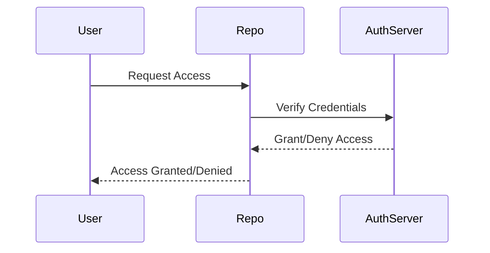

## Remote Git Repositories Overview

### What is a Remote Git Repository?

A remote Git repository is a central location where developers can store and manage their codebase. This repository acts as a hub for collaboration among team members, allowing them to push, pull, and merge changes. Remote repositories are typically hosted on cloud services or on-premises servers within an organization.

#### Why Use Remote Git Repositories?

Remote Git repositories provide several benefits:

1. **Collaboration**: Multiple developers can work on the same project simultaneously.
2. **Backup**: Code is stored in a centralized location, reducing the risk of data loss.
3. **Version Control**: Developers can track changes, revert to previous versions, and maintain a history of modifications.
4. **Access Control**: Permissions can be set to control who can read, write, or modify the code.

### Popular Remote Git Hosting Services

There are several popular remote Git hosting services, including:

1. **GitHub**
2. **GitLab**
3. **Bitbucket**

#### GitHub

GitHub is one of the most widely used platforms for hosting Git repositories. It offers both free and paid plans, with features such as issue tracking, pull requests, and continuous integration.

**Example of Creating a Repository on GitHub:**

```markdown
1. Log in to your GitHub account.
2. Click on the "+" icon in the top-right corner and select "New repository".
3. Enter the repository name, description, and choose whether it should be public or private.
4. Initialize the repository with a README file.
5. Click "Create repository".
```

#### GitLab

GitLab is another popular platform that provides similar features to GitHub, including CI/CD pipelines and issue tracking. GitLab also supports self-hosted installations, allowing organizations to run their own instances.

**Example of Creating a Repository on GitLab:**

```markdown
1. Log in to your GitLab account.
2. Click on the "+ New project" button.
3. Enter the project name, description, and choose whether it should be public or private.
4. Initialize the repository with a README file.
5. Click "Create project".
```

#### Bitbucket

Bitbucket is a Git hosting service owned by Atlassian, which also provides tools like Jira and Confluence. Bitbucket integrates well with other Atlassian products and offers both free and paid plans.

**Example of Creating a Repository on Bitbucket:**

```markdown
1. Log in to your Bitbucket account.
2. Click on the "Repositories" tab and then "Create repository".
3. Enter the repository name, description, and choose whether it should be public or private.
4. Initialize the repository with a README file.
5. Click "Create repository".
```

### Private vs. Public Repositories

When creating a repository, you can choose whether it should be private or public. This decision impacts who can access and contribute to the codebase.

#### Public Repositories

Public repositories are accessible to anyone on the internet. They are commonly used for open-source projects, libraries, and documentation.

**Example of a Public Repository:**

```markdown
https://github.com/tensorflow/tensorflow
```

This repository contains the TensorFlow machine learning library, which is open-source and publicly accessible.

#### Private Repositories

Private repositories are restricted to specific users or teams. They are often used by companies and startups to protect their intellectual property and sensitive information.

**Example of a Private Repository:**

```markdown
https://github.com/mycompany/myproject
```

This repository might contain proprietary code that should only be accessible to authorized team members.

### How to Prevent / Defend Against Unauthorized Access

To ensure the security of your remote Git repositories, follow these best practices:

1. **Use Strong Authentication**: Enable two-factor authentication (2FA) for all accounts.
2. **Limit Access**: Restrict permissions to only those who need them.
3. **Regular Audits**: Periodically review access logs and permissions.
4. **Secure SSH Keys**: Use strong SSH keys and avoid storing them in plaintext.
5. **Monitor Activity**: Set up alerts for suspicious activity.

**Example of Setting Up Two-Factor Authentication on GitHub:**

```markdown
1. Log in to your GitHub account.
2. Go to "Settings" > "Security".
3. Click "Enable two-factor authentication".
4. Follow the prompts to set up 2FA using an authenticator app or SMS.
```

### Real-World Examples and Breaches

Several high-profile breaches have highlighted the importance of securing remote Git repositories:

1. **GitHub Data Breach (2022)**: A vulnerability in GitHub's API allowed attackers to gain unauthorized access to user data. This breach underscores the need for robust security measures and regular audits.

2. **Tesla Source Code Leak (2020)**: Tesla's internal source code was leaked due to misconfigured Git repositories. This incident highlights the risks of improper access controls and the importance of monitoring repository settings.

### Mermaid Diagrams

#### Repository Architecture

```mermaid
graph TD
    User1 -->|Push| RemoteRepo
    User2 -->|Pull| RemoteRepo
    User3 -->|Merge| RemoteRepo
    RemoteRepo -->|Hosted On| CloudProvider
    CloudProvider -->|Examples| [GitHub, GitLab, Bitbucket]
```

#### Access Control Flow



### Conclusion

Remote Git repositories are essential tools for modern software development, providing a centralized location for code storage and collaboration. By understanding the differences between public and private repositories and implementing robust security measures, developers can ensure the integrity and confidentiality of their codebases.

---
<!-- nav -->
[[01-Introduction to Remote Git Repositories|Introduction to Remote Git Repositories]] | [[DevOps/DevOps Bootcamp/02-Version Control (Git)/01-Remote Git Repositories Overview/00-Overview|Overview]] | [[DevOps/DevOps Bootcamp/02-Version Control (Git)/01-Remote Git Repositories Overview/03-Practice Questions & Answers|Practice Questions & Answers]]
