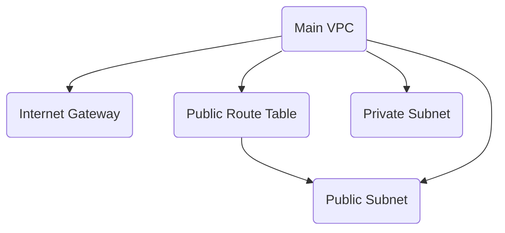

## Overview of Infrastructure as Code (IaC)

Infrastructure as Code (IaC) is a practice that involves managing and provisioning computer data centers through machine-readable definition files, rather than physical hardware configuration or interactive configuration tools. This approach allows for the automation of infrastructure setup, making it easier to manage and scale resources in cloud environments such as AWS. 

### What is IaC?

IaC treats your infrastructure as a set of code files that can be versioned, tested, and deployed just like any other application code. This means that instead of manually setting up servers, databases, and other resources, you define them in code and let the IaC tool handle the provisioning and management.

### Why Use IaC?

The primary benefits of IaC include:

1. **Consistency**: Ensures that your infrastructure is consistent across different environments (development, testing, production).
2. **Reproducibility**: You can easily recreate your entire infrastructure from scratch using the same code.
3. **Version Control**: Allows you to track changes to your infrastructure over time, similar to how you would track changes to your application code.
4. **Automation**: Reduces the need for manual intervention, which can lead to errors and inconsistencies.
5. **Scalability**: Makes it easier to scale your infrastructure as your needs change.

### How Does IaC Work?

IaC tools typically work by defining your infrastructure in a declarative manner. You specify what you want your infrastructure to look like, and the tool takes care of the rest. This includes provisioning the necessary resources, configuring them, and ensuring that they remain in the desired state.

### Common IaC Tools

Some of the most popular IaC tools include:

1. **Terraform**: Developed by HashiCorp, Terraform is a widely-used IaC tool that supports multiple cloud providers, including AWS, Azure, and Google Cloud.
2. **CloudFormation**: AWS’s native IaC tool, which allows you to define your infrastructure using JSON or YAML templates.
3. **Ansible**: An automation tool that can be used for both configuration management and IaC.
4. **Pulumi**: A modern IaC tool that allows you to write infrastructure as code using familiar programming languages like JavaScript, Python, and Go.

### Understanding Terraform

Terraform is one of the most popular IaC tools, particularly for managing infrastructure across multiple cloud providers. Let's dive deeper into how Terraform works and why it is beneficial.

#### What is Terraform?

Terraform is an open-source IaC tool developed by HashiCorp. It allows you to define your infrastructure in a high-level configuration language called HCL (HashiCorp Configuration Language). Terraform then uses this configuration to create and manage your infrastructure.

#### Why Use Terraform?

Terraform offers several advantages over other IaC tools:

1. **Multi-Cloud Support**: Terraform supports multiple cloud providers, allowing you to manage infrastructure across different clouds using a single tool.
2. **State Management**: Terraform maintains a state file that tracks the current state of your infrastructure, making it easier to manage changes and updates.
3. **Modularity**: Terraform supports modular design, allowing you to reuse configurations across different projects.
4. **Community and Ecosystem**: Terraform has a large community and a rich ecosystem of plugins and modules, making it easy to find solutions to common problems.

### Terraform Workflow

Let's walk through the typical workflow of using Terraform to manage your infrastructure.

#### Step 1: Define Your Infrastructure

You start by defining your infrastructure in Terraform configuration files. These files are written in HCL and describe the resources you want to create, such as EC2 instances, S3 buckets, and RDS databases.

```hcl
provider "aws" {
  region = "us-west-2"
}

resource "aws_instance" "example" {
  ami           = "ami-0c55b159cbfafe1f0"
  instance_type = "t2.micro"

  tags = {
    Name = "example-instance"
  }
}
```

In this example, we define an AWS provider and an EC2 instance resource. The `provider` block specifies the AWS region, and the `resource` block defines the EC2 instance, including its AMI and instance type.

#### Step 2: Initialize Terraform

Before you can use Terraform, you need to initialize it. This step downloads the necessary plugins and modules required to interact with your cloud provider.

```bash
terraform init
```

#### Step 3: Plan Your Changes

Once your infrastructure is defined, you can use the `terraform plan` command to see what changes Terraform will make to your infrastructure.

```bash
terraform plan
```

This command generates a plan that shows the actions Terraform will take to bring your infrastructure into the desired state. You can review this plan to ensure that it matches your expectations.

#### Step 4: Apply Your Changes

If the plan looks correct, you can apply the changes using the `terraform apply` command.

```bash
terraform apply
```

This command applies the changes described in the plan, creating or modifying the specified resources.

#### Step 5: Destroy Your Infrastructure

When you're done with your infrastructure, you can destroy it using the `terraform destroy` command.

```bash
terraform destroy
```

This command destroys all the resources defined in your Terraform configuration.

### Real-World Example: Setting Up an AWS VPC

Let's walk through a more complex example of setting up an AWS Virtual Private Cloud (VPC) using Terraform.

#### Step 1: Define the VPC

First, we define the VPC itself.

```hcl
resource "aws_vpc" "main" {
  cidr_block = "10.0.0.0/16"

  tags = {
    Name = "main-vpc"
  }
}
```

#### Step 2: Define Subnets

Next, we define subnets within the VPC.

```hcl
resource "aws_subnet" "public" {
  vpc_id     = aws_vpc.main.id
  cidr_block = "10.0.1.0/24"
  availability_zone = "us-west-2a"

  tags = {
    Name = "public-subnet"
  }
}

resource "aws_subnet" "private" {
  vpc_id     = aws_vpc.main.id
  cidr_block = "1.0.2.0/24"
  availability_zone = "us-west-2b"

  tags = {
    Name = "private-subnet"
  }
}
```

#### Step 3: Define Internet Gateway

We also need an internet gateway to allow traffic to and from the internet.

```hcl
resource "aws_internet_gateway" "main" {
  vpc_id = aws_vpc.main.id

  tags = {
    Name = "main-internet-gateway"
  }
}
```

#### Step 4: Define Route Tables

Finally, we define route tables to control how traffic is routed within the VPC.

```hcl
resource "aws_route_table" "public" {
  vpc_id = aws_vpc.main.id

  route {
    cidr_block = "0.0.0.0/0"
    gateway_id = aws_internet_gateway.main.id
  }

  tags = {
    Name = "public-route-table"
  }
}

resource "aws_route_table_association" "public" {
  subnet_id      = aws_subnet.public.id
  route_table_id = aws_route_table.public.id
}
```

#### Full Terraform Configuration

Here is the full Terraform configuration for setting up an AWS VPC with public and private subnets.

```hcl
provider "aws" {
  region = "us-west-2"
}

resource "aws_vpc" "main" {
  cidr_block = "10.0.0.0/16"

  tags = {
    Name = "main-vpc"
  }
}

resource "aws_subnet" "public" {
  vpc_id     = aws_vpc.main.id
  cidr_block = "10.0.1.0/24"
  availability_zone = "us-west-2a"

  tags = {
    Name = "public-subnet"
  }
}

resource "aws_subnet" "private" {
  vpc_id     = aws_vpc.main.id
  cidr_block = "10.0.2.0/24"
  availability_zone = "us-west-2b"

  tags = {
    Name = "private-subnet"
  }
}

resource "aws_internet_gateway" "main" {
  vpc_id = aws_vpc.main.id

  tags = {
    Name = "main-internet-gateway"
  }
}

resource "aws_route_table" "public" {
  vpc_id = aws_vpc.main.id

  route {
    cidr_block = "0.0.0.0/0"
    gateway_id = aws_internet_gateway.main.id
  }

  tags = {
    Name = "public-route-table"
  }
}

resource "aws_route_table_association" "public" {
  subnet_id      = aws_subnet.public.id
  route_table_id = aws_route_table.public.id
}
```

### Mermaid Diagram: VPC Architecture

To visualize the architecture, we can use a mermaid diagram.



### Benefits of Using Terraform

Using Terraform to manage your infrastructure provides several benefits:

1. **Consistency**: Ensures that your infrastructure is consistent across different environments.
2. **Reproducibility**: You can easily recreate your entire infrastructure from scratch using the same code.
3. **Version Control**: Allows you to track changes to your infrastructure over time.
4. **Automation**: Reduces the need for manual intervention, which can lead to errors and inconsistencies.
5. **Scalability**: Makes it easier to scale your infrastructure as your needs change.

### Pitfalls and Best Practices

While Terraform is a powerful tool, there are some pitfalls to be aware of:

1. **State Management**: Ensure that your state file is properly managed and backed up. Losing the state file can result in losing track of your infrastructure.
2. **Resource Dependencies**: Be mindful of resource dependencies. Terraform will automatically determine dependencies based on the configuration, but it's important to understand how these dependencies work.
3. **Security**: Ensure that your infrastructure is secure. Use IAM roles and policies to restrict access to your resources.
4. **Testing**: Test your infrastructure changes thoroughly before applying them to production. Use tools like `terraform plan` to review the changes before applying them.

### How to Prevent / Defend

#### Detection

To detect issues with your infrastructure, you can use monitoring tools such as AWS CloudWatch and logging services like AWS CloudTrail. These tools can help you identify any unexpected changes or issues with your infrastructure.

#### Prevention

To prevent issues with your infrastructure, follow these best practices:

1. **Use Version Control**: Store your Terraform configuration files in a version control system like Git. This allows you to track changes and revert to previous versions if needed.
2. **Use IAM Roles and Policies**: Restrict access to your resources using IAM roles and policies. This ensures that only authorized users can make changes to your infrastructure.
3. **Use Secure Configurations**: Follow secure configuration guidelines for your resources. For example, use secure settings for your EC2 instances and RDS databases.
4. **Regularly Review Your Infrastructure**: Regularly review your infrastructure to ensure that it remains in the desired state. Use tools like `terraform plan` to review changes before applying them.

### Secure Coding Fixes

Here is an example of a vulnerable Terraform configuration and the corresponding secure configuration.

#### Vulnerable Configuration

```hcl
resource "aws_s3_bucket" "example" {
  bucket = "my-bucket"
  acl    = "public-read"
}
```

#### Secure Configuration

```hcl
resource "aws_s3_bucket" "example" {
  bucket = "my-bucket"
  acl    = "private"
}
```

In the secure configuration, we set the ACL to `private`, which ensures that the bucket is not publicly accessible.

### Conclusion

Using Terraform to manage your infrastructure provides numerous benefits, including consistency, reproducibility, and scalability. By following best practices and using secure configurations, you can ensure that your infrastructure remains secure and reliable.

### Practice Labs

For hands-on experience with Terraform and AWS, consider the following labs:

- **PortSwigger Web Security Academy**: Offers a variety of labs related to web security, including some that involve using Terraform to set up infrastructure.
- **OWASP Juice Shop**: A deliberately insecure web application that can be used to learn about web security. You can use Terraform to set up the infrastructure for the Juice Shop.
- **DVWA (Damn Vulnerable Web Application)**: Another deliberately insecure web application that can be used to learn about web security. You can use Terraform to set up the infrastructure for DVWA.
- **WebGoat**: A deliberately insecure web application that can be used to learn about web security. You can use Terraform to set up the infrastructure for WebGoat.

These labs provide a practical way to apply the concepts you've learned about Terraform and AWS.

---
<!-- nav -->
[[01-Introduction to Automating AWS Setup with Infrastructure Tools|Introduction to Automating AWS Setup with Infrastructure Tools]] | [[DevOps/DevOps Bootcamp/04-Cloud Computing (AWS & DigitalOcean)/07-Automating AWS Setup with Infrastructure Tools/00-Overview|Overview]] | [[DevOps/DevOps Bootcamp/04-Cloud Computing (AWS & DigitalOcean)/07-Automating AWS Setup with Infrastructure Tools/03-Practice Questions & Answers|Practice Questions & Answers]]
