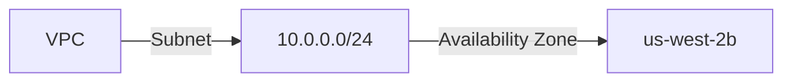
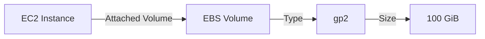
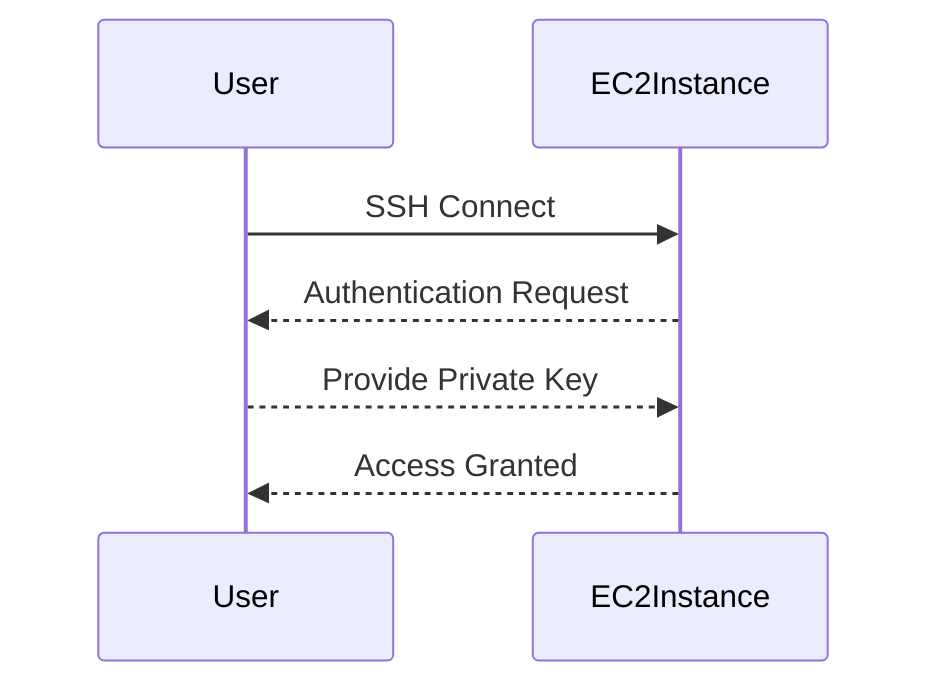

## Overview of EC2 Instances and Networking

In the context of deploying web applications using Amazon Elastic Compute Cloud (EC2) instances, several core concepts need to be understood thoroughly. These include DNS names, security groups, networking configurations, availability zones, storage options, and SSH connectivity. Each of these elements plays a critical role in ensuring that your application is deployed securely and efficiently.

### DNS Names and IP Addresses

DNS (Domain Name System) names provide human-readable aliases for IP addresses. In the context of EC2 instances, both public and private IP addresses can be associated with DNS names. Public IP addresses are accessible from the internet, whereas private IP addresses are used within the VPC (Virtual Private Cloud).

#### Public and Private IP Addresses

- **Public IP Address**: This is assigned to an EC2 instance and is accessible from the internet. It allows external traffic to reach the instance.
- **Private IP Address**: This is assigned within a VPC and is not accessible from the internet. It is used for internal communication between resources within the same VPC.

#### DNS Names

- **Public DNS Name**: This is a DNS name that resolves to the public IP address of the instance.
- **Private DNS Name**: This is a DNS name that resolves to the private IP address of the instance.

### Security Groups

Security groups act as virtual firewalls for your EC2 instances. They control inbound and outbound traffic based on rules defined within them. Each rule specifies the protocol (TCP, UDP, ICMP), port range, and source or destination IP addresses.

#### Example Security Group Rules

```mermaid
graph LR
    A[Inbound Rule] -->|TCP| B[Port Range]
    B -->|80-80| C[Source IP]
    C -->|0.0.0.0/0| D[Description]
    D -->|HTTP Traffic|
```

#### Real-World Example: CVE-2021-20225

CVE-2021-20225 is a vulnerability in the AWS SDK for Java that could allow unauthorized access to EC2 instances due to misconfigured security groups. This highlights the importance of properly configuring security groups to restrict access only to necessary ports and IP ranges.

### Networking Configuration

Networking in EC2 involves configuring subnets, routing tables, and network interfaces. Subnets are segments of a VPC that define the IP address range for instances within that subnet.

#### Subnets and Availability Zones

- **Subnet**: A subset of the VPC’s IP address range. Each subnet is associated with a specific availability zone.
- **Availability Zone**: A distinct location within a region that is engineered to be isolated from failures in other availability zones.

#### Example Subnet Configuration



### Storage Options

Storage for EC2 instances can be provided through EBS (Elastic Block Store) volumes. These volumes can be attached to instances and used for persistent storage.

#### EBS Volumes

- **General Purpose SSD (gp2)**: Provides moderate performance and is suitable for most workloads.
- **Provisioned IOPS SSD (io1)**: Offers high performance and is suitable for I/O-intensive workloads.

#### Example Volume Attachment



### SSH Connectivity

SSH (Secure Shell) is used to securely connect to EC2 instances. The private key associated with the SSH key pair is used to authenticate the connection.

#### SSH Key Pair

- **Key Pair**: A pair of cryptographic keys (public and private) used for authentication.
- **Private Key**: Must be stored securely to prevent unauthorized access.

#### Example SSH Connection



### Securely Storing the Private Key

The private key should be stored in a secure location to prevent unauthorized access. This can be achieved using tools like `ssh-agent` or storing the key in a secure vault.

#### Example Secure Key Storage

```bash
# Store the private key in a secure directory
mkdir ~/.ssh_keys
chmod 700 ~/.ssh_keys
mv my_private_key.pem ~/.ssh_keys/

# Use ssh-agent to manage the key
eval "$(ssh-agent -s)"
ssh-add ~/.ssh_keys/my_private_key.pem
```

### Connecting to the EC2 Instance

Once the private key is securely stored, you can connect to the EC2 instance using SSH.

#### Example SSH Command

```bash
ssh -i ~/.ssh_keys/my_private_key.pem ec2-user@<public-dns-name>
```

### Installing Applications on the EC2 Instance

After connecting to the EC2 instance, you can proceed to install applications such as web servers, databases, etc.

#### Example Application Installation

```bash
# Update package list
sudo yum update -y

# Install Apache web server
sudo yum install httpd -y

# Start Apache service
sudo systemctl start httpd
sudo systemctl enable httpd
```

### How to Prevent / Defend

#### Detecting Misconfigurations

- **AWS Trusted Advisor**: Provides recommendations for optimizing cost, performance, and security.
- **AWS Config**: Tracks changes to your AWS resources and provides a detailed history.

#### Preventing Unauthorized Access

- **IAM Policies**: Define permissions for users and roles.
- **Security Group Rules**: Restrict access to necessary ports and IP ranges.

#### Secure Coding Practices

- **Least Privilege Principle**: Grant only the minimum permissions required.
- **Regular Audits**: Perform regular security audits to identify and mitigate vulnerabilities.

### Conclusion

Deploying web applications using EC2 instances requires a deep understanding of DNS names, security groups, networking configurations, storage options, and SSH connectivity. By following best practices and securing your environment, you can ensure that your application is deployed securely and efficiently.

### Practice Labs

For hands-on practice, consider the following labs:

- **CloudGoat**: A cloud security training platform that includes scenarios for securing EC2 instances.
- **flaws.cloud**: A platform for learning cloud security by identifying and fixing vulnerabilities in AWS environments.

These labs provide practical experience in securing EC2 instances and deploying web applications.

---
<!-- nav -->
[[04-Introduction to Security Groups in AWS EC2|Introduction to Security Groups in AWS EC2]] | [[DevOps/DevOps Bootcamp/04-Cloud Computing (AWS & DigitalOcean)/15-Deploying Web Applications Using EC2 Instances/00-Overview|Overview]] | [[06-Overview of EC2 Services|Overview of EC2 Services]]
