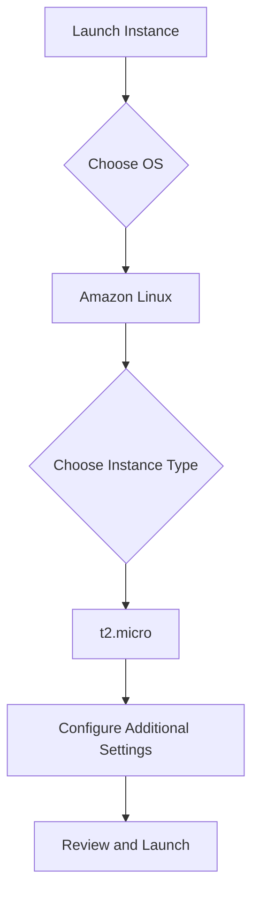
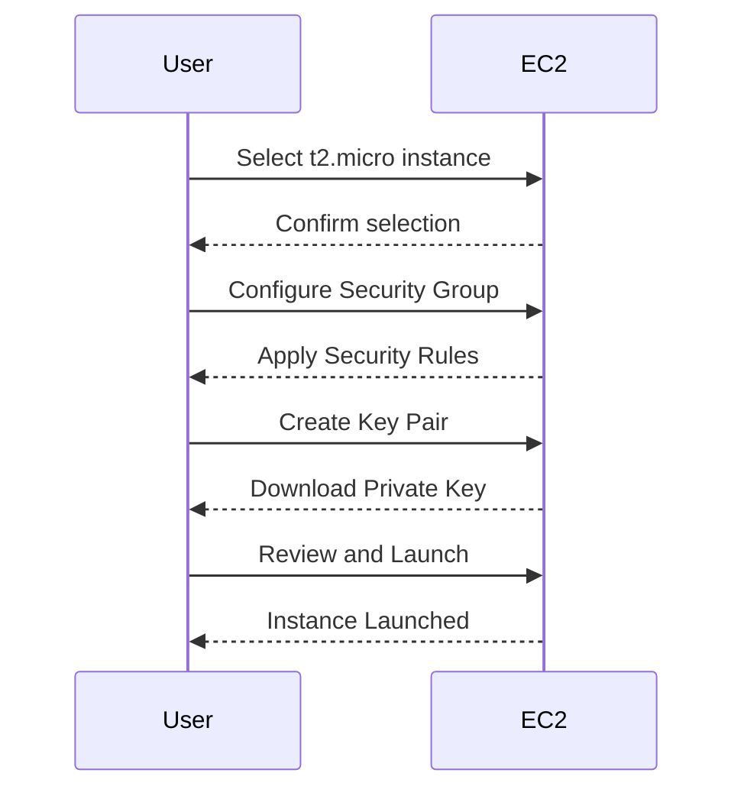

## Overview of EC2 Services

Amazon Elastic Compute Cloud (EC2) is a core service within the Amazon Web Services (AWS) ecosystem. It provides scalable computing capacity in the cloud. EC2 allows users to launch virtual machines, called instances, which run applications in the AWS cloud. These instances can be configured with various operating systems, including different distributions of Linux and Windows Server, as well as Amazon-optimized images.

### Components Related to EC2

When working with EC2, several components are essential:

1. **Instances**: Virtual machines that run your applications.
2. **IP Addresses**: Public and private IP addresses assigned to instances.
3. **Key Value Pairs**: Metadata associated with instances, often used for tagging and management purposes.

### Launching an EC2 Instance

To deploy a web application using EC2 instances, you need to launch an instance. This process involves selecting an appropriate operating system and configuring the instance type based on your resource requirements.

#### Step-by-Step Process

1. **Select the Operating System**:
    - You can choose from a variety of operating systems, such as different distributions of Linux, Windows Server, and Amazon-optimized images.
    - For this example, we will use Amazon Linux, which is optimized by Amazon to perform well on AWS infrastructure.

2. **Choose the Instance Type**:
    - Each instance type offers different configurations of CPU, memory, instance storage, and network performance.
    - The `t2.micro` instance type is a good starting point because it is eligible for the AWS Free Tier, allowing you to use it for free for one year if you qualify.

### Detailed Explanation of Instance Types

Instance types in EC2 are categorized based on their performance characteristics and resource allocation. Here’s a breakdown of the key aspects:

- **CPU**: The number and type of virtual CPUs available.
- **Memory**: The amount of RAM allocated to the instance.
- **Instance Storage**: Local storage provided by the instance.
- **Network Performance**: The bandwidth and throughput capabilities of the instance.

#### Example: t2.micro Instance

The `t2.micro` instance type is designed for low-resource workloads and is ideal for testing and development environments. Here are its specifications:

- **CPU**: 1 vCPU
- **Memory**: 1 GiB
- **Instance Storage**: None
- **Network Performance**: Low



### Configuring Additional Settings

After selecting the instance type, you can configure additional settings such as:

- **Security Groups**: Define firewall rules to control inbound and outbound traffic.
- **Key Pairs**: Generate or select a key pair to securely access the instance.
- **Storage**: Configure the root volume size and type (e.g., SSD or HDD).

#### Example Configuration

Here’s an example of configuring a `t2.micro` instance with a security group and key pair:

1. **Security Group**:
    - Allow SSH (port 22) from your IP address.
    - Allow HTTP (port 80) and HTTPS (port 443) for web traffic.

2. **Key Pair**:
    - Generate a new key pair or use an existing one.



### Common Pitfalls and Best Practices

#### Pitfall: Overprovisioning Resources

Overprovisioning resources can lead to unnecessary costs and underutilization of resources. Always start with a smaller instance type and scale up as needed.

#### Best Practice: Monitoring and Scaling

Use AWS CloudWatch to monitor your instance’s performance and automatically scale resources using Auto Scaling groups.

### How to Prevent / Defend

#### Detection

- **CloudTrail**: Enable AWS CloudTrail to log API calls and user actions.
- **CloudWatch**: Monitor instance metrics and set up alarms for unusual activity.

#### Prevention

- **IAM Policies**: Restrict access to EC2 instances using IAM policies.
- **Security Groups**: Limit inbound and outbound traffic to necessary ports and IP addresses.

#### Secure Coding Fixes

Compare the insecure and secure versions of a web application deployment script:

**Insecure Version**

```bash
#!/bin/bash
aws ec2 run-instances --image-id ami-0c94855ba95c71c99 --count 1 --instance-type t2.micro --key-name my-key-pair --security-group-ids sg-0123456789abcdef0 --subnet-id subnet-0123456789abcdef0
```

**Secure Version**

```bash
#!/bin/bash
# Ensure IAM role has permissions to create EC2 instances
aws ec2 run-instances --image-id ami-0c94855ba95c71c99 --count 1 --instance-type t2.micro --key-name my-key-pair --security-group-ids sg-0123456789abcdef0 --subnet-id subnet-0123456789abcdef0 --iam-instance-profile Name=my-secure-role
```

### Real-World Examples

#### Recent CVEs and Breaches

- **CVE-2021-20225**: A vulnerability in the AWS SDK allowed unauthorized access to EC2 instances.
- **Breaches**: Several high-profile breaches involved misconfigured EC2 instances, leading to data exposure.

### Hands-On Labs

For practical experience, consider the following labs:

- **PortSwigger Web Security Academy**: Focuses on web application security but includes sections on securing backend services hosted on EC2.
- **OWASP Juice Shop**: A deliberately insecure web application for practicing security skills, which can be deployed on EC2.

By thoroughly understanding and implementing these concepts, you can effectively deploy and manage web applications using EC2 instances.

---
<!-- nav -->
[[05-Overview of EC2 Instances and Networking|Overview of EC2 Instances and Networking]] | [[DevOps/DevOps Bootcamp/04-Cloud Computing (AWS & DigitalOcean)/15-Deploying Web Applications Using EC2 Instances/00-Overview|Overview]] | [[07-Accessing the Application from the Browser|Accessing the Application from the Browser]]
