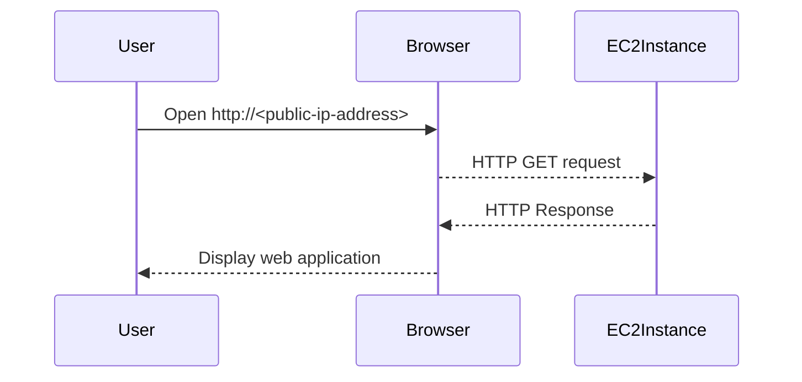

## Accessing the Application from the Browser

### How to Access the Application

Once your Docker container is running and the security group is configured, you can access the application from a browser using the public IP address of your EC2 instance.

1. **Open a Browser**:
   - Open a web browser and navigate to `http://<public-ip-address>`.

2. **View the Application**:
   - You should see your web application running.

### Complete Example

Here is a complete example of accessing the application from a browser:

---
<!-- nav -->
[[06-Overview of EC2 Services|Overview of EC2 Services]] | [[DevOps/DevOps Bootcamp/04-Cloud Computing (AWS & DigitalOcean)/15-Deploying Web Applications Using EC2 Instances/00-Overview|Overview]] | [[08-Configuring EC2 Firewall|Configuring EC2 Firewall]]
