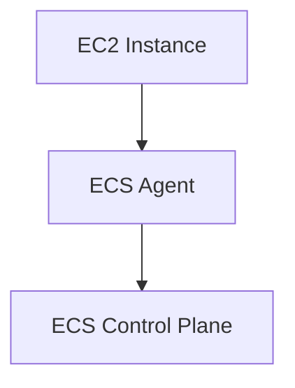
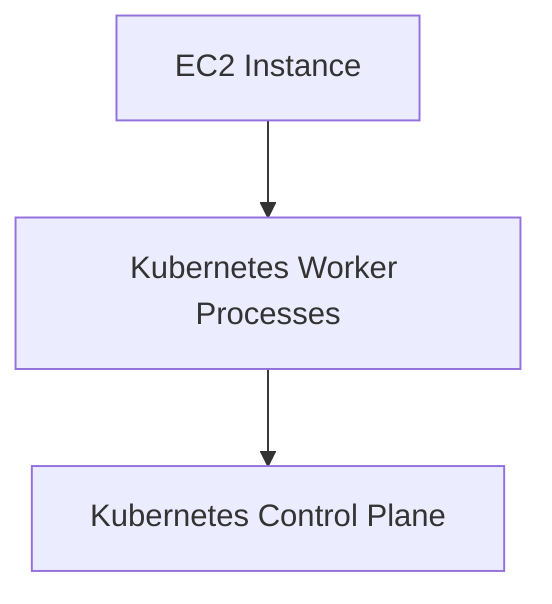
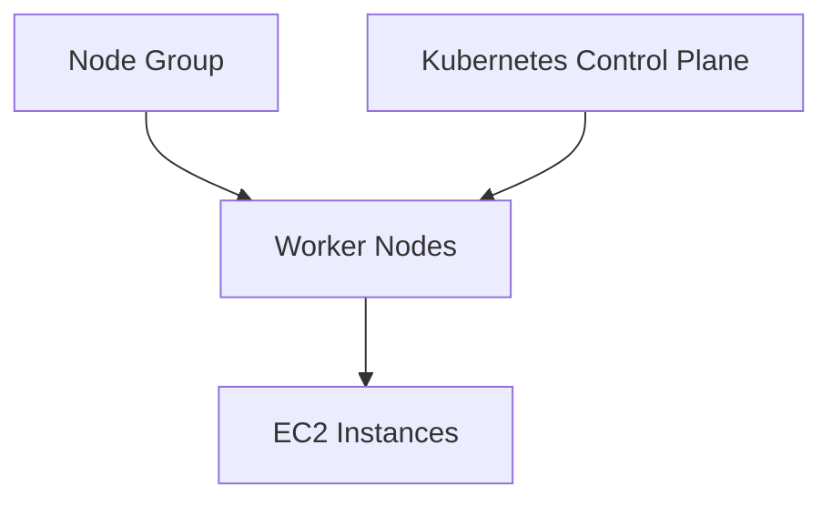

## AWS Container Services Overview

### Introduction to AWS Container Services

AWS provides several services for managing containerized applications, including Amazon Elastic Container Service (ECS) and Amazon Elastic Kubernetes Service (EKS). Both services allow you to run and manage Docker containers at scale, but they differ in their underlying architecture and management requirements.

#### Amazon Elastic Container Service (ECS)

ECS is a fully managed service that allows you to run Docker containers without having to provision or manage any infrastructure. ECS uses a fleet of EC2 instances as the compute layer, and each instance runs an ECS agent that communicates with the ECS control plane.

#### Amazon Elastic Kubernetes Service (EKS)

EKS is a managed service that makes it easy to run Kubernetes on AWS without needing to install and operate your own Kubernetes control plane. EKS supports the open-source Kubernetes API, so you can use existing tools and plugins.

### EC2 Instances and Compute Fleet

In both ECS and EKS, you create EC2 instances to form the compute fleet. These instances serve as the virtual servers that run your containerized applications.

#### ECS Agent Installation

In ECS, each EC2 instance has the ECS agent installed. The ECS agent is responsible for communicating with the ECS control plane and managing the tasks and services running on the instance.



#### Kubernetes Processes in EKS

In EKS, the EC2 instances act as worker nodes and have Kubernetes processes installed. These processes enable communication between the worker nodes and the Kubernetes control plane (also known as the Kubernetes master).



### Managing EC2 Instances

In both ECS and EKS, you need to manage the EC2 instances yourself. This includes managing the operating system and the processes running on them.

#### Manual Management

If you choose to manage the EC2 instances manually, you are responsible for:

- Installing the necessary processes (e.g., container runtime, Kubernetes worker processes).
- Updating the operating system and processes.
- Monitoring the health and performance of the instances.

#### Semi-Managed EC2 Instances in EKS

EKS offers a semi-managed option for EC2 instances through node groups. Node groups can handle some of the heavy lifting for you, making it easier to configure new worker nodes for your cluster.



### Node Groups in EKS

A node group is a collection of worker nodes that share similar configurations. By using node groups, you can automate the installation of necessary processes on the EC2 instances.

#### Benefits of Node Groups

- **Automation**: Node groups automatically install the required processes on the EC2 instances.
- **Scalability**: You can easily scale the number of worker nodes in a node group.
- **Maintenance**: Node groups handle updates and maintenance of the worker nodes.

#### Example Configuration

Here is an example of creating a node group in EKS using the AWS CLI:

```bash
aws eks create-nodegroup \
    --cluster-name my-cluster \
    --nodegroup-name my-nodegroup \
    --scaling-config minSize=1,maxSize=10,desiredSize=3 \
    --subnets subnet-12345678 subnet-87654321 \
    --instance-types t3.medium \
    --ami-type AL2_x86_64
```

This command creates a node group named `my-nodegroup` with a desired size of 3 worker nodes, scaling between 1 and 10 nodes. The worker nodes will use the specified subnets and instance types.

### Full HTTP Request and Response Example

When creating a node group via the AWS API, the full HTTP request and response might look like this:

**Request:**

```http
POST /clusters/my-cluster/nodegroups HTTP/1.1
Host: eks.us-west-2.amazonaws.com
Content-Type: application/json
Authorization: Bearer <your-access-token>

{
  "nodegroupName": "my-nodegroup",
  "scalingConfig": {
    "minSize": 1,
    "maxSize": 10,
    "desiredSize": 3
  },
  "subnets": [
    "subnet-12345678",
    "subnet-87654321"
  ],
  "instanceTypes": [
    "t3.medium"
  ],
  "amiType": "AL2_x86_64"
}
```

**Response:**

```http
HTTP/1.1 200 OK
Content-Type: application/json

{
  "nodegroup": {
    "nodegroupName": "my-nodegroup",
    "status": "CREATING",
    "scalingConfig": {
      "minSize": 1,
      "maxSize": 10,
      "desiredSize": 3
    },
    "subnets": [
      "subnet-12345678",
      "subnet-87654321"
    ],
    "instanceTypes": [
      "t3.medium"
    ],
    "amiType": "AL2_x86_64"
  }
}
```

### Real-World Examples and CVEs

#### Recent Breaches

One notable breach involving container orchestration was the Kubernetes dashboard vulnerability (CVE-2018-1002105). This vulnerability allowed attackers to gain unauthorized access to the Kubernetes cluster by exploiting a flaw in the dashboard authentication mechanism.

#### Secure Configuration

To prevent such vulnerabilities, ensure that:

- You use the latest versions of Kubernetes and its components.
- You disable unnecessary features and services.
- You implement proper authentication and authorization mechanisms.

### How to Prevent / Defend

#### Detection

Regularly monitor your Kubernetes clusters for unusual activity using tools like AWS CloudTrail and Amazon CloudWatch.

#### Prevention

- **Use Managed Services**: Leverage AWS EKS to reduce the burden of managing the Kubernetes control plane.
- **Secure Configurations**: Ensure that your EC2 instances and node groups are configured securely.
- **Patch Management**: Keep your operating systems and processes up to date with the latest security patches.

#### Secure Coding Fixes

Compare the insecure and secure versions of a Kubernetes deployment configuration:

**Insecure Version:**

```yaml
apiVersion: apps/v1
kind: Deployment
metadata:
  name: my-app
spec:
  replicas: 3
  selector:
    matchLabels:
      app: my-app
  template:
    metadata:
      labels:
        app: my-app
    spec:
      containers:
      - name: my-container
        image: my-image:latest
        ports:
        - containerPort: 80
```

**Secure Version:**

```yaml
apiVersion: apps/v1
kind: Deployment
metadata:
  name: my-app
spec:
  replicas: 3
  selector:
    matchLabels:
      app: my-app
  template:
    metadata:
      labels:
        app: my-app
    spec:
      containers:
      - name: my-container
        image: my-image:latest
        ports:
        - containerPort: 80
        securityContext:
          runAsNonRoot: true
          readOnlyRootFilesystem: true
```

### Practice Labs

For hands-on experience with AWS container services, consider the following labs:

- **CloudGoat**: A cloud security training platform that includes scenarios for managing ECS and EKS.
- **flaws.cloud**: A cloud security lab that covers various aspects of AWS services, including container orchestration.

These labs provide practical exercises to reinforce your understanding of AWS container services and best practices for securing them.

By thoroughly understanding the concepts and best practices covered in this chapter, you will be well-equipped to manage containerized applications on AWS effectively and securely.

---
<!-- nav -->
[[DevOps/DevOps Bootcamp/05-Containerization (Docker)/01-AWS Container Services Overview (2)/00-Overview|Overview]] | [[02-Introduction to AWS Container Services|Introduction to AWS Container Services]]
