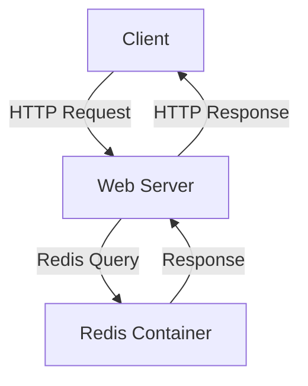
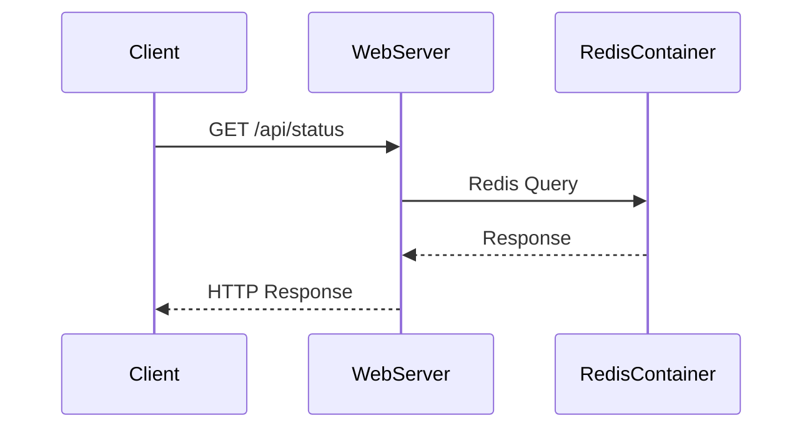

## Docker Basics Commands Overview

### Introduction to Docker Troubleshooting Commands

Docker is a powerful tool for containerizing applications, allowing developers to package their applications along with all their dependencies into a single, portable unit. However, even with Docker's robustness, issues can arise within containers. To effectively troubleshoot these issues, Docker provides several commands that help diagnose and resolve problems. This section will cover essential Docker commands for troubleshooting, including `docker ps`, `docker logs`, and naming containers.

### Understanding `docker ps`

The `docker ps` command is used to list all currently running Docker containers. This command is crucial for monitoring active containers and identifying potential issues.

#### Syntax and Usage

```sh
docker ps [OPTIONS]
```

**Options:**
- `-a`: Show all containers (default shows just running)
- `-q`: Only display container IDs
- `--filter`: Filter output based on conditions provided

#### Example Usage

Let's assume we have two containers running:

```sh
docker ps
```

Output:
```plaintext
CONTAINER ID   IMAGE          COMMAND                  CREATED         STATUS         PORTS     NAMES
1234abcd5678   redis:latest   "docker-entrypoint.s…"   2 hours ago     Up 2 hours     6379/tcp  mystifying_hellman
9876defg4321   nginx:latest   "nginx -g 'daemon of…"   3 hours ago     Up 3 hours     80/tcp    eager_mclean
```

This output shows the container ID, image, command, creation time, status, ports, and names of the running containers.

#### Why `docker ps` Matters

`docker ps` is essential because it provides a quick overview of the current state of your Docker environment. By listing all running containers, you can easily identify which services are active and monitor their statuses.

### Using `docker logs`

When troubleshooting issues within a container, one of the most effective methods is to check the logs produced by the container. The `docker logs` command allows you to view the logs generated by a specific container.

#### Syntax and Usage

```sh
docker logs [OPTIONS] CONTAINER
```

**Options:**
- `-f`: Follow log output
- `--tail`: Number of lines to show from the end of the logs
- `--since`: Show logs since a given timestamp or relative duration

#### Example Usage

Assume your application cannot connect to Redis, and you suspect an issue within the Redis container. You can check the logs of the Redis container using its ID or name.

Using Container ID:
```sh
docker logs 1234abcd5678
```

Using Container Name:
```sh
docker logs mystifying_hellman
```

Output:
```plaintext
1:C 24 Oct 2023 12:00:00.000 # oO0OoO0OoO0Oo Redis is starting oO0OoO0OoO0Oo
1:C 24 Oct 2023 12:00:00.000 # Redis version=4.0.11, bits=64, commit=00000000, modified=0, pid=1, just started
1:C 24 Oct 2023 12:00:00.000 # Configuration loaded
...
```

#### Why `docker logs` Matters

Logs provide detailed information about the operations performed by a container. They can help diagnose issues such as connection failures, configuration errors, or unexpected behavior. By examining logs, you can pinpoint the root cause of a problem and take corrective action.

### Naming Containers

By default, Docker assigns random names to containers, which can make it difficult to manage multiple containers. To simplify management, you can assign custom names to containers using the `--name` option with the `docker run` command.

#### Syntax and Usage

```sh
docker run --name CUSTOM_NAME IMAGE
```

#### Example Usage

Let's create a new container from the Redis 4.0 image and assign it a custom name:

```sh
docker run --name my-redis-container redis:4.0
```

This command starts a new Redis container and assigns it the name `my-redis-container`.

#### Why Naming Containers Matters

Naming containers makes it easier to identify and manage them. Custom names can help differentiate between multiple instances of the same service, making it simpler to track and troubleshoot individual containers.

### Real-World Examples and Recent Breaches

#### Example: CVE-2021-21287

In 2021, a critical vulnerability was discovered in Docker, identified as CVE-2021-21287. This vulnerability allowed attackers to escalate privileges and gain full control over the host system. Proper logging and monitoring could have helped detect and mitigate such attacks.

#### Example: Log4j Vulnerability (CVE-2021-44228)

The Log4j vulnerability affected numerous applications, including those running in Docker containers. By checking container logs, administrators could identify attempts to exploit this vulnerability and take appropriate action.

### How to Prevent / Defend

#### Detection

To detect issues within Docker containers, regularly monitor container logs and statuses. Tools like `docker ps` and `docker logs` should be part of your routine monitoring practices.

#### Prevention

1. **Secure Configuration**: Ensure that Docker is configured securely. Disable unnecessary features and restrict access to sensitive operations.
   
2. **Regular Updates**: Keep Docker and all images up-to-date to protect against known vulnerabilities.

3. **Logging and Monitoring**: Implement comprehensive logging and monitoring solutions to detect anomalies and potential security threats.

4. **Container Isolation**: Use namespaces and cgroups to isolate containers and limit their access to system resources.

#### Secure Coding Fixes

Here’s an example of how to secure a Docker setup:

**Vulnerable Code:**
```Dockerfile
FROM redis:latest
EXPOSE 6379
CMD ["redis-server"]
```

**Secure Code:**
```Dockerfile
FROM redis:latest
EXPOSE 6379
RUN apt-get update && apt-get install -y rsyslog
COPY rsyslog.conf /etc/rsyslog.conf
CMD ["sh", "-c", "rsyslogd && redis-server"]
```

In the secure version, we added logging capabilities using `rsyslog` to ensure that all activities are logged and monitored.

### Complete Example: Full HTTP Request and Response

Consider a scenario where you are troubleshooting a Redis connection issue. Here’s a complete example of how you might use `docker ps` and `docker logs`:

**Full HTTP Request:**

```http
GET /api/status HTTP/1.1
Host: localhost:8080
User-Agent: curl/7.64.1
Accept: */*
```

**Full HTTP Response:**

```http
HTTP/1.1 200 OK
Date: Mon, 24 Oct 2023 12:00:00 GMT
Content-Type: application/json
Content-Length: 37
Connection: keep-alive

{"status": "error", "message": "Redis connection failed"}
```

**Docker Logs:**

```sh
docker logs mystifying_hellman
```

Output:
```plaintext
1:C 24 Oct 2023 12:00:00.000 # oO0OoO0OoO0Oo Redis is starting oO0OoO0OoO0Oo
1:C 24 Oct 2023 12:00:00.000 # Redis version=4.0.11, bits=64, commit=00000000, modified=0, pid=1, just started
1:C 24 Oct 2023 12:00:00.000 # Configuration loaded
...
1:M 24 Oct 2023 12:00:00.000 * Ready to accept connections
...
1:M 24 Oct 2023 12:00:00.000 * Connection accepted from 172.17.0.1:49152
1:C 24 Oct 2023 12:00:00.000 # Connection closed by client
```

### Mermaid Diagrams

#### Network Topology



#### Sequence Diagram



### Practice Labs

For hands-on practice with Docker basics and troubleshooting, consider the following labs:

- **PortSwigger Web Security Academy**: Offers a variety of labs covering Docker and container security.
- **OWASP Juice Shop**: Provides a vulnerable web application that can be containerized using Docker, allowing you to practice troubleshooting and securing containerized applications.
- **Docker Official Documentation**: Offers extensive documentation and tutorials on Docker basics and advanced topics.

By mastering these Docker troubleshooting commands and techniques, you can effectively manage and maintain your containerized applications, ensuring they run smoothly and securely.

---
<!-- nav -->
[[DevOps/DevOps Bootcamp/05-Containerization (Docker)/05-Docker Basics Commands Overview/00-Overview|Overview]] | [[02-Introduction to Docker Basics and Interactive Terminal Access|Introduction to Docker Basics and Interactive Terminal Access]]
