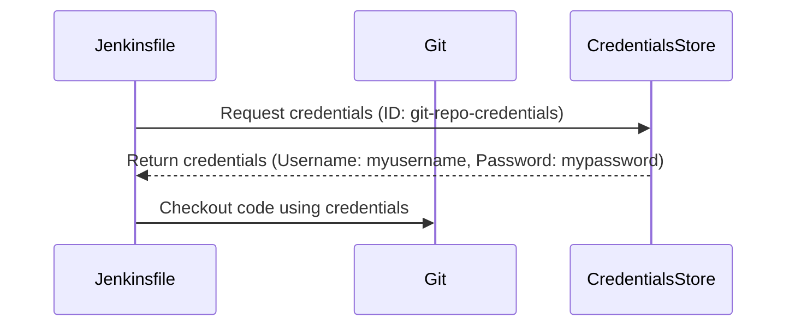

## Jenkins Credentials Management Plugin Overview

### Introduction to Jenkins Credentials Management

Jenkins is a widely-used open-source automation server that provides extensive support for continuous integration and continuous delivery (CI/CD) pipelines. One of the critical aspects of managing Jenkins environments is securely handling credentials such as usernames, passwords, API tokens, and certificates. The Jenkins Credentials Management Plugin is designed to help manage these credentials in a secure and organized manner.

### Types of Credentials in Jenkins

In Jenkins, credentials can be categorized into two main scopes: **System** and **Global**. Understanding these scopes is crucial for effective management and security.

#### System Credentials

**System credentials** are those that are not visible or accessible by Jenkins jobs. These credentials are typically used for internal Jenkins operations and are not exposed to the jobs running within the Jenkins environment. For example, a system credential might be used for authenticating Jenkins itself to external services like a database or a monitoring tool.

**Why System Credentials Matter:**
- **Security:** By keeping certain credentials out of the reach of jobs, you reduce the risk of exposure through misconfigured jobs or malicious actors.
- **Isolation:** System credentials ensure that sensitive information used internally by Jenkins does not leak into the job execution context.

**Example:**
Consider a scenario where Jenkins needs to authenticate to a monitoring service to report build statuses. The credentials used for this authentication would be stored as system credentials, ensuring that they are not accessible to individual jobs.

#### Global Credentials

**Global credentials**, on the other hand, are accessible everywhere within the Jenkins environment. They can be accessed by Jenkins administrators and all build jobs, including pipeline jobs. This means that global credentials are available to any job that needs them, making them highly flexible but also more risky if not managed properly.

**Why Global Credentials Matter:**
- **Convenience:** Global credentials simplify the process of sharing credentials across multiple jobs and pipelines.
- **Consistency:** Using global credentials ensures that the same set of credentials is used consistently across different parts of the Jenkins environment.

**Example:**
Suppose you have a global credential for accessing a remote repository. This credential can be referenced in any pipeline job that needs to pull code from the repository, ensuring consistent access across all jobs.

### Types of Credentials

Jenkins supports various types of credentials, each suited for different use cases:

1. **Username and Password:**
   - **Purpose:** Used for basic authentication to services that require a username and password.
   - **Example:** Accessing a private Git repository using SSH keys.
   - **Syntax:**
     ```plaintext
     Username: myusername
     Password: mypassword
     ```

2. **Certificate:**
   - **Purpose:** Used for SSL/TLS authentication and encryption.
   - **Example:** Authenticating to an HTTPS endpoint using a client certificate.
   - **Syntax:**
     ```plaintext
     Certificate: -----BEGIN CERTIFICATE-----
     MIIDXTCCAkWgAwIBAgIJAOZ...
     -----END CERTIFICATE-----
     ```

3. **Secret File:**
   - **Purpose:** Used for storing sensitive data in a file format.
   - **Example:** Storing a private key for SSH authentication.
   - **Syntax:**
     ```plaintext
     Secret File: /path/to/secret/file
     ```

4. **Secret Text:**
   - **Purpose:** Used for storing plain text secrets.
   - **Example:** Storing an API token or a database password.
   - **Syntax:**
     ```plaintext
     Secret Text: mysecretpassword
     ```

### Creating Credentials in Jenkins

To create credentials in Jenkins, follow these steps:

1. **Navigate to Credentials Management:**
   - Go to `Manage Jenkins` > `Manage Credentials`.
   - Select the domain where you want to store the credentials (e.g., `System`, `Global`).

2. **Create a New Credential:**
   - Click on `Global credentials (unrestricted)` or `System credentials (unrestricted)`.
   - Click on `Add Credentials`.

3. **Fill in the Details:**
   - Choose the type of credential (e.g., `Username with password`).
   - Enter the username and password.
   - Provide a description and an ID for the credential.

4. **Save the Credential:**
   - Click `OK` to save the credential.

### Example: Creating a Username and Password Credential

Let's walk through an example of creating a username and password credential:

1. **Navigate to Credentials Management:**
   - Go to `Manage Jenkins` > `Manage Credentials`.
   - Select `Global credentials (unrestricted)`.

2. **Create a New Credential:**
   - Click on `Add Credentials`.
   - Choose `Username with password` as the credential type.

3. **Fill in the Details:**
   - Enter the username: `myusername`
   - Enter the password: `mypassword`
   - Provide a description: `Git Repository Access`
   - Provide an ID: `git-repo-credentials`

4. **Save the Credential:**
   - Click `OK` to save the credential.

### Referencing Credentials in Jenkins Jobs

Once credentials are created, they can be referenced in Jenkins jobs using their IDs. Here’s an example of how to reference a credential in a Jenkinsfile:

```groovy
pipeline {
    agent any
    stages {
        stage('Checkout') {
            steps {
                git branch: 'main',
                    credentialsId: 'git-repo-credentials',
                    url: 'https://github.com/myrepo/myproject.git'
            }
        }
    }
}
```

### Mermaid Diagram: Credential Reference Flow

A mermaid diagram can help visualize how credentials are referenced in a Jenkins pipeline:



### Pitfalls and Best Practices

#### Common Mistakes

1. **Using Hardcoded Credentials:**
   - **Risk:** Hardcoding credentials in Jenkinsfiles or scripts makes them easily accessible to anyone with access to the code.
   - **Solution:** Always use the Credentials Management Plugin to store and reference credentials securely.

2. **Improper Scoping:**
   - **Risk:** Incorrectly scoping credentials can lead to unnecessary exposure or lack of access.
   - **Solution:** Carefully choose whether a credential should be system or global based on its intended use.

3. **Insufficient Documentation:**
   - **Risk:** Lack of documentation can make it difficult to understand the purpose and usage of credentials.
   - **Solution:** Always provide clear descriptions and comments when creating credentials.

### How to Prevent / Defend

#### Detection

1. **Audit Logs:**
   - Regularly review audit logs to detect unauthorized access or misuse of credentials.
   - Example: Use Jenkins’ built-in audit logging feature to track credential usage.

2. **Credential Scanning Tools:**
   - Use tools like TruffleHog to scan repositories for hardcoded credentials.
   - Example: Integrate TruffleHog into your CI/CD pipeline to automatically detect and alert on hardcoded credentials.

#### Prevention

1. **Secure Storage:**
   - Ensure that credentials are stored securely using the Credentials Management Plugin.
   - Example: Store sensitive credentials as secret text or files rather than plaintext.

2. **Access Control:**
   - Implement strict access control policies to limit who can view and modify credentials.
   - Example: Use Jenkins’ role-based access control (RBAC) to restrict access to credentials based on user roles.

3. **Regular Rotation:**
   - Regularly rotate credentials to minimize the window of opportunity for attackers.
   - Example: Set up automated rotation using tools like HashiCorp Vault.

#### Secure Coding Fixes

Here’s an example of how to securely reference credentials in a Jenkinsfile compared to insecure practices:

**Insecure Example:**
```groovy
pipeline {
    agent any
    stages {
        stage('Checkout') {
            steps {
                git branch: 'main',
                    credentialsId: 'hardcoded-password',
                    url: 'https://github.com/myrepo/myproject.git'
            }
        }
    }
}
```

**Secure Example:**
```groovy
pipeline {
    agent any
    stages {
        stage('Checkout') {
            steps {
                git branch: 'main',
                    credentialsId: 'git-repo-credentials',
                    url: 'https://github.com/myrepo/myproject.git'
            }
        }
    }
}
```

### Real-World Examples and Breaches

#### Recent CVEs and Breaches

1. **CVE-2021-21234: Jenkins Credentials Manager Plugin Vulnerability:**
   - **Description:** A vulnerability in the Jenkins Credentials Manager Plugin allowed unauthorized users to read sensitive credentials.
   - **Impact:** Attackers could gain access to sensitive credentials, leading to potential data breaches.
   - **Mitigation:** Ensure that the Jenkins Credentials Manager Plugin is updated to the latest version and that access controls are strictly enforced.

2. **GitHub Data Breach (2021):**
   - **Description:** A breach at GitHub exposed sensitive data, including credentials stored in repositories.
   - **Impact:** Users had to reset their credentials and review their access controls.
   - **Mitigation:** Use secure storage mechanisms like the Jenkins Credentials Manager Plugin and regularly audit access controls.

### Conclusion

Effective management of credentials in Jenkins is essential for maintaining the security and integrity of your CI/CD pipelines. By understanding the different types of credentials, their scopes, and best practices for creation and usage, you can significantly reduce the risk of unauthorized access and data breaches.

### Practice Labs

For hands-on practice with Jenkins Credentials Management, consider the following labs:

- **PortSwigger Web Security Academy:** Offers a series of labs focused on web application security, including Jenkins-related scenarios.
- **OWASP Juice Shop:** Provides a vulnerable web application that includes Jenkins-related challenges.
- **DVWA (Damn Vulnerable Web Application):** Includes exercises related to web application security, which can be adapted to Jenkins scenarios.

By engaging with these labs, you can deepen your understanding of Jenkins credentials management and apply your knowledge in practical scenarios.

---
<!-- nav -->
[[02-Introduction to Jenkins Credentials Management|Introduction to Jenkins Credentials Management]] | [[DevOps/DevOps Bootcamp/06-CI CD & Build Tools/03-Jenkins Credentials Management Plugin Overview/00-Overview|Overview]] | [[DevOps/DevOps Bootcamp/06-CI CD & Build Tools/03-Jenkins Credentials Management Plugin Overview/04-Practice Questions & Answers|Practice Questions & Answers]]
