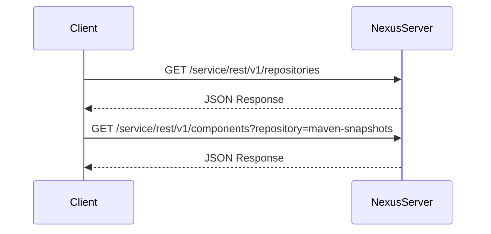

## Nexus Repository Manager Overview

Nexus Repository Manager is a powerful artifact management solution that allows organizations to manage and distribute software artifacts efficiently. It supports various types of repositories such as Maven, npm, Docker, and more. In this chapter, we will delve deep into the Nexus API endpoints used for managing repositories and their components.

### What is Nexus Repository Manager?

Nexus Repository Manager is a central repository manager that provides a single location to store and manage all your software artifacts. It supports different types of repositories, including:

- **Maven**: For Java-based projects.
- **npm**: For Node.js packages.
- **Docker**: For container images.
- **PyPI**: For Python packages.

The primary benefits of using Nexus Repository Manager include:

- **Centralized Artifact Management**: All artifacts are stored in a centralized location, making it easier to manage and distribute them.
- **Security**: Provides robust security features such as authentication, authorization, and access control.
- **Performance**: Optimizes artifact retrieval and distribution, improving build times and reducing network traffic.
- **Integration**: Integrates seamlessly with various CI/CD tools and build systems.

### Repository Management in Nexus

In Nexus, repositories are organized into different types based on the artifact format they support. Each repository can be configured with specific policies, such as retention policies, proxy settings, and access controls.

#### Repository Types

- **Hosted Repositories**: Stores artifacts produced internally.
- **Proxy Repositories**: Acts as a cache for remote repositories.
- **Group Repositories**: Combines multiple hosted and proxy repositories into a single virtual repository.

### API Endpoints for Repository Management

Nexus provides RESTful API endpoints to interact with repositories programmatically. These endpoints allow you to perform various operations such as listing repositories, retrieving repository details, and managing components within repositories.

#### Listing Repositories

To list repositories in Nexus, you can use the following API endpoint:

```http
GET /service/rest/v1/repositories
```

This endpoint returns a JSON response containing details about all repositories. The response includes information such as the repository name, type, format, and URL.

##### Example Request and Response

Let's consider an example where we list repositories using `curl`:

```bash
curl -u admin:admin123 -X GET http://localhost:8081/service/rest/v1/repositories
```

The response will be in JSON format:

```json
{
  "items": [
    {
      "name": "maven-snapshots",
      "type": "maven2",
      "format": "maven2",
      "url": "http://localhost:8081/repository/maven-snapshots/"
    },
    {
      "name": "npm-releases",
      "type": "npm",
      "format": "npm",
      "url": "http://localhost:8081/repository/npm-releases/"
    }
  ]
}
```

### Access Control and Authentication

Access to Nexus repositories is controlled through authentication and authorization mechanisms. Users can be granted different levels of access based on their roles and permissions.

#### User Roles and Permissions

- **Admin**: Full access to all repositories and administrative functions.
- **Developer**: Limited access to specific repositories based on project requirements.
- **Guest**: Read-only access to public repositories.

### Example: Listing Repositories with Different User Roles

Let's consider an example where we list repositories using a user with limited permissions (`developer`) and an admin user.

#### Developer User

When using a developer user, you might only see repositories that the user is authorized to access. For instance, if the user is only allowed to see Maven snapshots, the response will be limited to those repositories.

```bash
curl -u developer:dev123 -X GET http://localhost:8081/service/rest/v1/repositories
```

Response:

```json
{
  "items": [
    {
      "name": "maven-snapshots",
      "type": "maven2",
      "format": "maven2",
      "url": "http://localhost:8081/repository/maven-snapshots/"
    }
  ]
}
```

#### Admin User

When using an admin user, you will see all repositories available in Nexus.

```bash
curl -u admin:admin123 -X GET http://localhost:8081/service/rest/v1/repositories
```

Response:

```json
{
  "items": [
    {
      "name": "maven-snapshots",
      "type": "maven2",
      "format": "maven2",
      "url": "http://localhost:8081/repository/maven-snapshots/"
    },
    {
      "name": "npm-releases",
      "type": "npm",
      "format": "npm",
      "url": "http://localhost:8081/repository/npm-releases/"
    },
    {
      "name": "docker-hosted",
      "type": "docker",
      "format": "docker",
      "url": "http://localhost:8081/repository/docker-hosted/"
    }
  ]
}
```

### Listing Components in a Repository

Another useful API endpoint is for listing components within a specific repository. This can be done using the following endpoint:

```http
GET /service/rest/v1/components?repository=<repository-name>
```

This endpoint returns a JSON response containing details about all components in the specified repository.

##### Example Request and Response

Let's consider an example where we list components in the `maven-snapshots` repository:

```bash
curl -u admin:admin123 -X GET http://localhost:8081/service/rest/v1/components?repository=maven-snapshots
```

Response:

```json
{
  "items": [
    {
      "name": "my-app",
      "version": "1.0-SNAPSHOT",
      "assets": [
        {
          "path": "my-app-1.0-SNAPSHOT.jar",
          "downloadUrl": "http://localhost:8081/repository/maven-snapshots/my-app/1.0-SNAPSHOT/my-app-1.0-SNAPSHOT.jar"
        },
        {
          "path": "my-app-1.0-SNAPSHOT.pom",
          "downloadUrl": "http://localhost:8081/repository/maven-snapshots/my-app/1.0-SNAPSHOT/my-app-1.0-SNAPSHOT.pom"
        }
      ]
    },
    {
      "name": "java-maven-app",
      "version": "2.0-SNAPSHOT",
      "assets": [
        {
          "path": "java-maven-app-2.0-SNAPSHOT.jar",
          "downloadUrl": "http://localhost:8081/repository/maven-snapshots/java-maven-app/2.0-SNAPSHOT/java-maven-app-2.0-SNAPSHOT.jar"
        },
        {
          "path": "java-maven-app-2.0-SNAPSHOT.pom",
          "downloadUrl": "http://localhost:8081/repository/maven-snapshots/java-maven-app/2.0-SNAPSHOT/java-maven-app-2.0-SNAPSHOT.pom"
        }
      ]
    }
  ]
}
```

### Mermaid Diagrams

Let's visualize the interaction between the Nexus server and the client using a sequence diagram.



### Pitfalls and Common Mistakes

- **Incorrect Authentication**: Ensure that the correct credentials are provided. Incorrect credentials will result in unauthorized access errors.
- **Repository Configuration**: Ensure that the repository is correctly configured with the appropriate policies and settings.
- **Network Issues**: Ensure that the client has proper network connectivity to the Nexus server.

### How to Prevent / Defend

#### Detection

- **Audit Logs**: Enable audit logging to track all API requests and responses.
- **Monitoring Tools**: Use monitoring tools to detect unauthorized access attempts and unusual activity patterns.

#### Prevention

- **Strong Authentication**: Use strong authentication mechanisms such as multi-factor authentication (MFA).
- **Role-Based Access Control (RBAC)**: Implement RBAC to ensure that users have only the necessary permissions to access repositories.
- **Secure Configuration**: Ensure that the Nexus server is configured securely, with proper firewall rules and network segmentation.

#### Secure Coding Fixes

##### Vulnerable Code

```bash
curl -u developer:dev123 -X GET http://localhost:8081/service/rest/v1/repositories
```

##### Secure Code

```bash
curl -u developer:dev123 -X GET https://nexus.example.com/service/rest/v1/repositories
```

Ensure that the connection is made over HTTPS to encrypt the communication.

### Real-World Examples

#### Recent CVEs and Breaches

- **CVE-2021-21286**: A vulnerability in Nexus Repository Manager 3.x allowed unauthenticated attackers to upload arbitrary files to the repository. This could lead to remote code execution.
- **CVE-2021-21287**: Another vulnerability in Nexus Repository Manager 3.x allowed authenticated attackers to bypass authentication and gain unauthorized access to repositories.

### Conclusion

In this chapter, we explored the Nexus API endpoints for repository management in detail. We covered the concepts of repository types, access control, and authentication. We also provided examples of how to list repositories and components using the API, along with mermaid diagrams to visualize the interactions. Finally, we discussed common pitfalls and provided secure coding practices to prevent vulnerabilities.

### Practice Labs

For hands-on practice with Nexus Repository Manager, consider the following labs:

- **PortSwigger Web Security Academy**: Offers exercises on securing web applications, including Nexus Repository Manager.
- **OWASP Juice Shop**: A deliberately insecure web application for practicing web security skills.
- **DVWA (Damn Vulnerable Web Application)**: A PHP/MySQL web application that is riddled with vulnerabilities for educational purposes.

These labs provide practical experience in managing and securing Nexus repositories effectively.

---
<!-- nav -->
[[DevOps/DevOps Bootcamp/06-CI CD & Build Tools/36-Nexus API Endpoints for Repository Management/01-Introduction to Nexus Repository Manager|Introduction to Nexus Repository Manager]] | [[DevOps/DevOps Bootcamp/06-CI CD & Build Tools/36-Nexus API Endpoints for Repository Management/00-Overview|Overview]] | [[03-Nexus API Endpoints for Repository Management|Nexus API Endpoints for Repository Management]]
