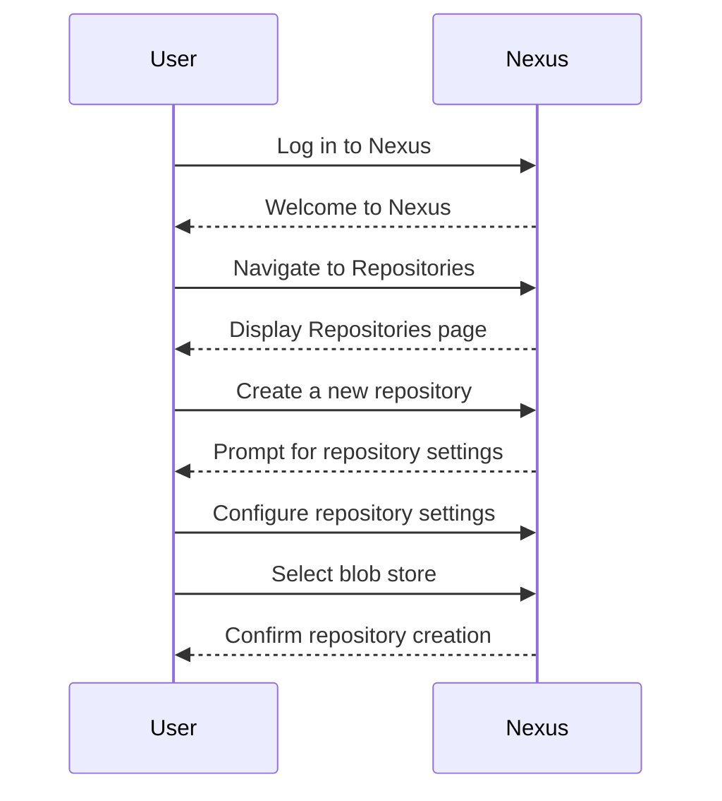
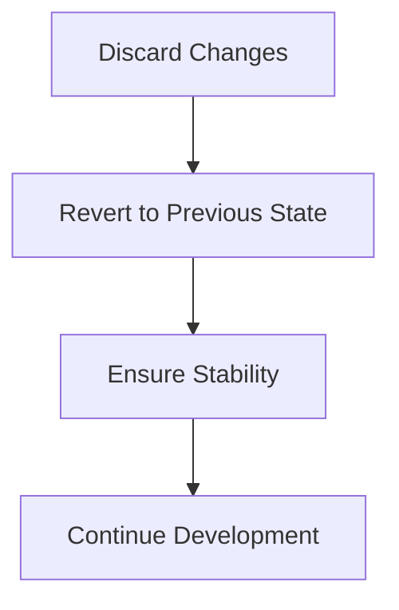
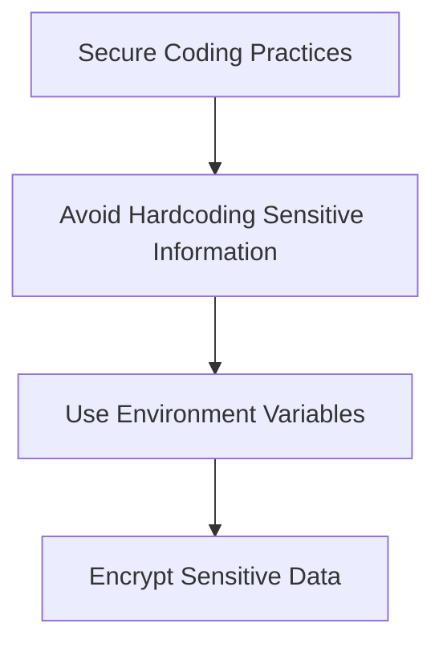

## Nexus Repository Manager Overview

The Nexus Repository Manager is a powerful artifact management solution used in many organizations to manage binary artifacts such as JAR files, WAR files, Docker images, and more. It provides a centralized repository for storing and managing these artifacts, ensuring consistency and reliability across development and deployment processes.

### What is a Blob Store?

A **blob store** is a component within the Nexus Repository Manager that is responsible for storing binary large objects (BLOBs). These BLOBs can be any type of binary data, including compiled code, images, or other files. The blob store acts as a backend storage mechanism, providing efficient and scalable storage for the artifacts managed by Nexus.

#### Why Blob Stores Matter

Blob stores are crucial because they handle the actual storage of the binary data. Without an effective blob store, the Nexus Repository Manager would struggle to manage large volumes of data efficiently. Blob stores ensure that artifacts are stored securely and can be retrieved quickly when needed.

### Default Blob Store Configuration

When you first set up a Nexus Repository Manager instance, it comes with a default blob store. This default blob store is typically named `default` and is automatically attached to any repositories you create unless you specify otherwise.

#### How Blob Stores Work Under the Hood

Blob stores operate by storing binary data in a structured format. Each artifact is broken down into chunks, and these chunks are stored in the blob store. The metadata about the artifact, such as its name, version, and checksum, is stored separately in the Nexus database. This separation allows for efficient retrieval and management of artifacts.

### Creating Repositories and Attaching Blob Stores

When you create a new repository in Nexus, you have the option to attach it to a specific blob store. By default, Nexus will attach the repository to the `default` blob store. However, you can also create custom blob stores and attach them to your repositories.

#### Example: Creating a New Repository

Let's walk through the process of creating a new repository and attaching it to a custom blob store.

1. **Log in to Nexus**: Access the Nexus Repository Manager interface using your credentials.
2. **Navigate to Repositories**: Go to the `Repositories` section in the left-hand menu.
3. **Create a New Repository**: Click on the `+` button to create a new repository.
4. **Configure Repository Settings**: Fill in the necessary details for your repository, such as the repository name, format, and storage type.
5. **Select Blob Store**: In the `Storage` section, select the blob store you want to attach to this repository. You can choose the default blob store or a custom one.



### Discarding Changes and Managing Snapshots

In the context of the Nexus Repository Manager, discarding changes often refers to reverting a repository to its previous state. This is particularly useful when working with snapshot repositories, which are designed to store the latest versions of artifacts during development.

#### Snapshot Repositories

Snapshot repositories are used to store intermediate builds of artifacts. They allow developers to push new versions of their artifacts frequently, ensuring that the latest code changes are available for testing and integration.

#### Discarding Changes

If you need to discard changes made to a repository, you can do so by reverting to a previous state. This is especially important when dealing with snapshot repositories, where you might want to revert to a stable version of an artifact.



### Permanent Attachment of Blob Stores

Once a repository is created and attached to a blob store, this attachment becomes permanent. You cannot change the blob store associated with a repository after it has been created. This ensures consistency and prevents accidental data loss or corruption.

#### Why Permanent Attachment Matters

Permanent attachment of blob stores is a design choice that ensures data integrity and consistency. Once a repository is attached to a blob store, all artifacts stored in that repository are guaranteed to be managed by the same storage mechanism. This prevents issues such as data fragmentation or inconsistent storage policies.

### Real-World Examples and Recent CVEs

While there are no specific CVEs related to the permanent attachment of blob stores, there have been instances where improper management of repositories and blob stores led to data loss or corruption. For example, in 2021, a misconfiguration in a company's Nexus Repository Manager led to the accidental deletion of critical artifacts, causing significant downtime and loss of productivity.

### How to Prevent / Defend

To prevent issues related to blob store management, follow these best practices:

1. **Regular Backups**: Ensure that regular backups of your Nexus Repository Manager are performed. This includes both the metadata and the binary data stored in the blob stores.
2. **Access Controls**: Implement strict access controls to prevent unauthorized modifications to repositories and blob stores.
3. **Monitoring and Alerts**: Set up monitoring and alerts to detect any unusual activity or potential issues with your repositories and blob stores.
4. **Documentation**: Maintain thorough documentation of your repository and blob store configurations. This will help in troubleshooting and recovery scenarios.

#### Secure Coding Practices

When working with Nexus Repository Manager, ensure that you follow secure coding practices. For example, avoid hardcoding sensitive information such as passwords or API keys in your scripts or configurations.



### Complete Example: Full HTTP Request and Response

Here is a complete example of creating a new repository and attaching it to a custom blob store using the Nexus REST API.

#### HTTP Request

```http
POST /service/rest/v1/repositories/raw-hosted HTTP/1.1
Host: nexus.example.com
Authorization: Basic <base64-encoded-credentials>
Content-Type: application/json

{
  "name": "my-custom-repo",
  "type": "raw",
  "format": "raw",
  "storage": {
    "blobStoreName": "custom-blob-store",
    "strictContentValidation": true
  }
}
```

#### HTTP Response

```http
HTTP/1.1 201 Created
Date: Tue, 01 Aug 2023 12:00:00 GMT
Content-Type: application/json

{
  "name": "my-custom-repo",
  "type": "hosted",
  "format": "raw",
  "storage": {
    "blobStoreName": "custom-blob-store",
    "strictContentValidation": true
  },
  "cleanup": {},
  "component": {}
}
```

### Common Pitfalls and Detection

One common pitfall is forgetting to configure the correct blob store when creating a new repository. This can lead to unexpected behavior and data inconsistencies. To detect such issues, regularly review your repository configurations and ensure that they are attached to the correct blob stores.

### Hands-On Labs

For hands-on practice with Nexus Repository Manager, consider the following labs:

- **PortSwigger Web Security Academy**: While primarily focused on web security, this platform offers exercises that can help you understand the broader DevOps ecosystem.
- **OWASP Juice Shop**: This interactive web application provides a comprehensive learning experience for various aspects of web security, including artifact management.
- **DVWA (Damn Vulnerable Web Application)**: Another excellent resource for practicing web security concepts, including those related to artifact management.

By following these guidelines and best practices, you can effectively manage your Nexus Repository Manager and ensure the integrity and availability of your artifacts.

---
<!-- nav -->
[[02-Introduction to Nexus Repository Blob Stores|Introduction to Nexus Repository Blob Stores]] | [[DevOps/DevOps Bootcamp/06-CI CD & Build Tools/38-Nexus Repository Blob Store Management/00-Overview|Overview]] | [[04-Nexus Repository Blob Store Management|Nexus Repository Blob Store Management]]
