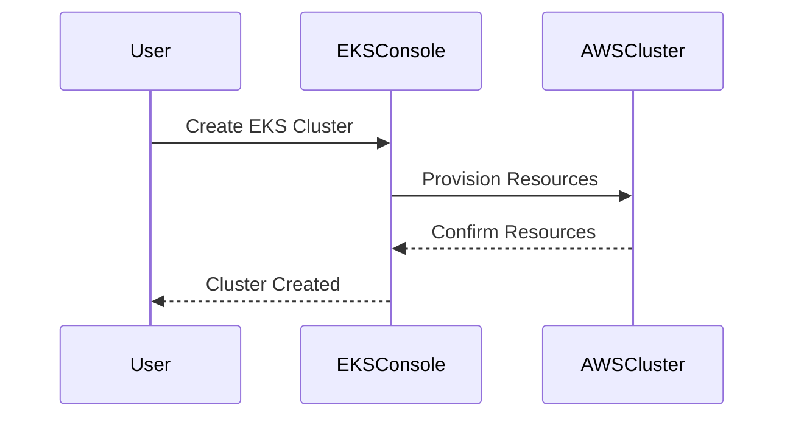
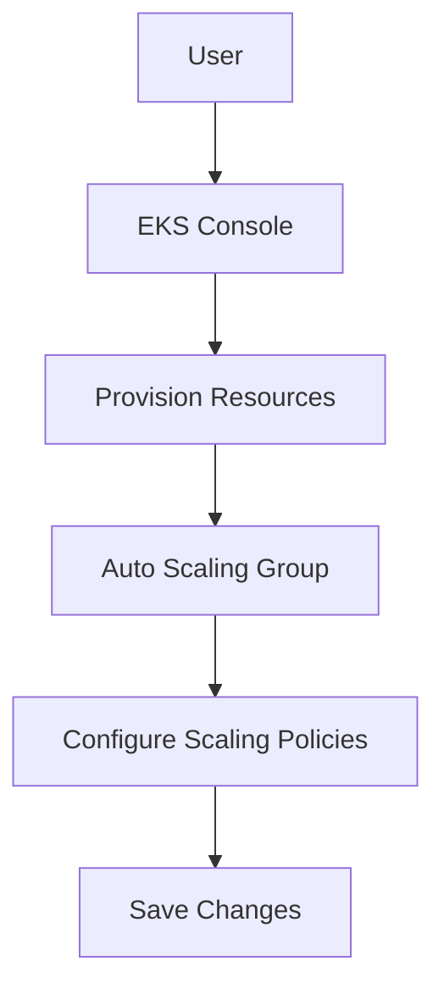
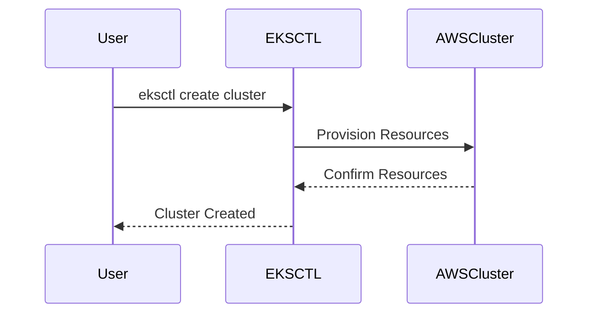
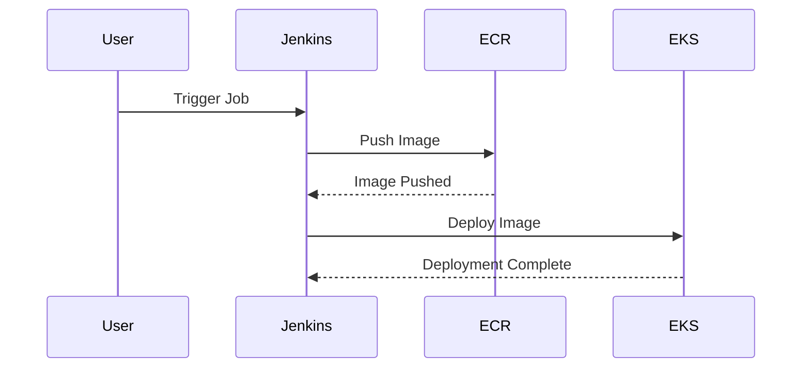

## Overview of Kubernetes on AWS

In the modern application landscape, containerization and orchestration have become essential components for managing scalable and resilient applications. Kubernetes, an open-source system for automating deployment, scaling, and management of containerized applications, has emerged as the de facto standard for orchestrating containers. Meanwhile, Amazon Web Services (AWS) provides a robust Infrastructure as a Service (IaaS) platform that supports various container services. Combining Kubernetes with AWS allows organizations to leverage the strengths of both technologies, making it a popular choice for deploying and managing containerized applications.

### Key Concepts

#### Containerization
Containerization is the process of packaging an application along with its dependencies into a lightweight, portable, and executable package called a container. Containers provide a consistent environment for applications to run reliably across different computing environments. Docker is one of the most widely used containerization platforms.

#### Orchestration
Orchestration refers to the automated management and coordination of containerized applications. Kubernetes is an orchestration tool that manages the deployment, scaling, and operation of containerized applications. It provides a framework for deploying and managing applications in a distributed environment.

#### Infrastructure as a Service (IaaS)
IaaS is a cloud computing model where a provider delivers virtualized computing resources over the internet. AWS is one of the leading IaaS providers, offering a wide range of services including compute, storage, networking, and database services.

### Why Kubernetes on AWS?

The combination of Kubernetes and AWS offers several advantages:

1. **Scalability**: Kubernetes can automatically scale applications based on demand, ensuring optimal resource utilization.
2. **Resilience**: Kubernetes provides mechanisms for fault tolerance and high availability, ensuring that applications remain available even in the event of failures.
3. **Cost Efficiency**: By leveraging AWS services, organizations can optimize their infrastructure costs through features like auto-scaling and spot instances.
4. **Flexibility**: Kubernetes on AWS allows organizations to choose the best-suited services for their specific requirements, whether it be managed Kubernetes services or self-managed clusters.

### AWS Container Services

AWS offers three primary container services:

1. **Elastic Container Service (ECS)**: ECS is a fully managed container orchestration service that allows you to run Docker containers on a cluster of EC2 instances. It integrates seamlessly with other AWS services and provides features like task scheduling, load balancing, and service discovery.
   
2. **Elastic Kubernetes Service (EKS)**: EKS is a managed Kubernetes service that makes it easy to run Kubernetes on AWS without needing to install and operate your own Kubernetes control plane. EKS handles the provisioning, patching, and scaling of the control plane, allowing you to focus on deploying and managing your applications.
   
3. **Fargate**: Fargate is a serverless compute engine for containers that allows you to run containers without having to manage servers or clusters. With Fargate, you can launch and scale containerized applications without provisioning or configuring any servers.

### Deploying Kubernetes on AWS

#### Using EKS Console

To deploy a Kubernetes cluster on AWS using the EKS console, follow these steps:

1. **Create an EKS Cluster**:
    - Navigate to the EKS console in the AWS Management Console.
    - Click on "Get started" to create a new cluster.
    - Provide a name for your cluster and select the VPC and subnets where the cluster will be deployed.
    - Choose the Kubernetes version and IAM role for the worker nodes.
    - Review the settings and click "Next".
    - Configure the worker nodes by selecting the instance type, number of instances, and IAM role.
    - Review the settings and click "Next".
    - Review the summary and click "Create".



2. **Configure Auto-scaling**:
    - Navigate to the EC2 console and select the Auto Scaling Groups.
    - Select the Auto Scaling Group associated with your EKS cluster.
    - Configure the scaling policies based on CPU utilization or other metrics.
    - Save the changes.



#### Using EKSCTL

EKSCTL is a command-line tool that simplifies the creation and management of EKS clusters. To create an EKS cluster using EKSCTL, follow these steps:

1. **Install EKSCTL**:
    - Download and install EKSCTL from the official GitHub repository.
    - Ensure that the AWS CLI is installed and configured with appropriate permissions.

2. **Create an EKS Cluster**:
    - Run the following command to create an EKS cluster:

```bash
eksctl create cluster --name my-cluster --region us-west-2 --node-type t3.medium --nodes 3 --nodes-min 2 --nodes-max 4
```

This command creates an EKS cluster named `my-cluster` in the `us-west-2` region with 3 initial nodes of type `t3.medium`. The cluster will automatically scale between 2 and 4 nodes based on demand.



### Integrating with Jenkins CI/CD Pipeline

Once the EKS cluster is created, you can integrate it with a Jenkins CI/CD pipeline to automate the deployment of containerized applications. Here’s how you can achieve this:

1. **Set Up Jenkins**:
    - Install Jenkins on an EC2 instance or use a managed Jenkins service like AWS CodeBuild.
    - Configure Jenkins to use the AWS credentials for accessing the EKS cluster.

2. **Create a Jenkins Job**:
    - Create a new Jenkins job and configure the build steps to build the Docker image and push it to Amazon Elastic Container Registry (ECR).
    - Add a post-build step to deploy the Docker image to the EKS cluster using `kubectl`.

```bash
# Build Docker image and push to ECR
docker build -t my-image .
aws ecr get-login-password --region us-west-2 | docker login --username AWS --password-stdin <account-id>.dkr.ecr.us-west-2.amazonaws.com
docker tag my-image:latest <account-id>.dkr.ecr.us-west-2.amazonaws.com/my-image:latest
docker push <account-id>.dkr.ecr.us-west-2.amazonaws.com/my-image:latest

# Deploy to EKS cluster
kubectl apply -f deployment.yaml
```

3. **Configure Kubernetes Deployment**:
    - Create a `deployment.yaml` file to define the Kubernetes deployment.

```yaml
apiVersion: apps/v1
kind: Deployment
metadata:
  name: my-deployment
spec:
  replicas: 3
  selector:
    matchLabels:
      app: my-app
  template:
    metadata:
      labels:
        app: my-app
    spec:
      containers:
      - name: my-container
        image: <account-id>.dkr.ecr.us-west-2.amazonaws.com/my-image:latest
        ports:
        - containerPort: 80
```

4. **Run the Jenkins Job**:
    - Trigger the Jenkins job to build the Docker image, push it to ECR, and deploy it to the EKS cluster.



### Common Pitfalls and How to Prevent Them

#### Misconfigured IAM Roles

Misconfigured IAM roles can lead to unauthorized access to AWS resources. Always ensure that IAM roles are properly configured with the minimum necessary permissions.

**Vulnerable Configuration**:
```json
{
  "Version": "2012-10-17",
  "Statement": [
    {
      "Effect": "Allow",
      "Action": "*",
      "Resource": "*"
    }
  ]
}
```

**Secure Configuration**:
```json
{
  "Version": "2012-10-17",
  "Statement": [
    {
      "Effect": "Allow",
      "Action": [
        "ec2:*",
        "eks:*",
        "iam:GetRole",
        "iam:PassRole"
      ],
      "Resource": "*"
    }
  ]
}
```

#### Insecure Network Configurations

Insecure network configurations can expose your EKS cluster to external threats. Always ensure that network policies are properly configured to restrict traffic to and from your cluster.

**Vulnerable Configuration**:
```yaml
apiVersion: networking.k8s.io/v1
kind: NetworkPolicy
metadata:
  name: default-deny
spec:
  podSelector: {}
  ingress:
  - {}
  egress:
  - {}
```

**Secure Configuration**:
```yaml
apiVersion: networking.k8s.io/v1
kind: NetworkPolicy
metadata:
  name: allow-from-same-namespace
spec:
  podSelector: {}
  ingress:
  - from:
    - podSelector: {}
  egress:
  - to:
    - podSelector: {}
```

### Real-World Examples and Breaches

#### CVE-2021-25741

CVE-2021-25741 is a critical vulnerability in Kubernetes that allows attackers to escalate privileges and gain full control of the cluster. This vulnerability affects versions of Kubernetes prior to 1.21.2, 1.20.7, and 1.19.10.

**Impact**:
- Attackers can execute arbitrary commands with root privileges on the master node.
- Full control of the Kubernetes cluster can be gained.

**Mitigation**:
- Upgrade to the latest version of Kubernetes.
- Apply network policies to restrict access to sensitive resources.
- Regularly audit and review IAM roles and permissions.

#### Example Exploit

An attacker could exploit this vulnerability by sending a crafted request to the Kubernetes API server.

```http
POST /api/v1/namespaces/default/pods HTTP/1.1
Host: api-server.example.com
Content-Type: application/json

{
  "apiVersion": "v1",
  "kind": "Pod",
  "metadata": {
    "name": "attacker-pod"
  },
  "spec": {
    "containers": [
      {
        "name": "attacker-container",
        "image": "attacker-image",
        "command": ["/bin/sh", "-c", "echo 'Exploited!'"]
      }
    ]
  }
}
```

**Detection**:
- Monitor for unusual activity in the Kubernetes API logs.
- Use tools like Falco to detect and alert on suspicious behavior.

### Hands-On Labs

To gain practical experience with Kubernetes on AWS, consider the following hands-on labs:

- **Kubernetes Goat**: A hands-on lab for learning Kubernetes security.
- **CloudGoat**: A lab for learning AWS security and compliance.
- **Pacu**: A lab for learning AWS security and penetration testing.

These labs provide a controlled environment to practice and reinforce the concepts covered in this module.

By mastering the combination of Kubernetes and AWS, you will be well-equipped to deploy and manage containerized applications in a scalable and resilient manner.

---
<!-- nav -->
[[01-Introduction to Kubernetes on AWS|Introduction to Kubernetes on AWS]] | [[DevOps/DevOps Bootcamp/09-Container Orchestration (Kubernetes)/28-Kubernetes on AWS Deployment and Management/00-Overview|Overview]] | [[DevOps/DevOps Bootcamp/09-Container Orchestration (Kubernetes)/28-Kubernetes on AWS Deployment and Management/03-Practice Questions & Answers|Practice Questions & Answers]]
