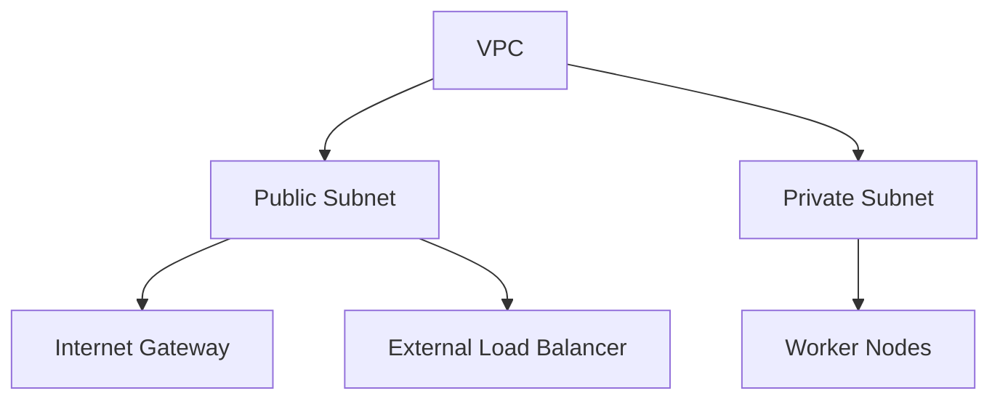
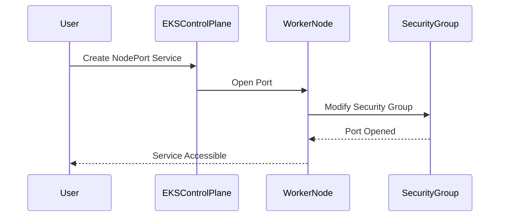

## Overview of EKS Cluster Creation Using AWS Console

When setting up an Amazon Elastic Kubernetes Service (EKS) cluster manually using the AWS Management Console, several key components and configurations need to be understood thoroughly. This includes the creation and configuration of Virtual Private Clouds (VPCs), subnets, roles, and permissions. Each of these elements plays a critical role in ensuring that the EKS cluster operates securely and efficiently.

### Understanding VPCs and Subnets

A Virtual Private Cloud (VPC) is a logically isolated section of the AWS Cloud where you can launch AWS resources in a virtual network that you define. A VPC enables you to have complete control over your network environment, including IP address range, subnets, routing tables, gateways, and security settings.

#### Public and Private Subnets

Subnets within a VPC can be configured as either public or private:

- **Public Subnets**: These subnets have a route to an Internet Gateway (IGW). Resources in public subnets can communicate directly with the internet.
- **Private Subnets**: These subnets do not have a route to an IGW. Resources in private subnets cannot communicate directly with the internet but can communicate with other resources within the VPC.

In the context of an EKS cluster, the distinction between public and private subnets is crucial for managing external access and internal communication.



### Configuring Subnets for EKS

When configuring subnets for an EKS cluster, the following considerations are important:

- **External Load Balancers**: External load balancers need to be placed in public subnets to ensure they are accessible from the internet. This is essential for services that require external access.
- **Worker Nodes**: Worker nodes should typically reside in private subnets to enhance security by limiting their exposure to the internet.

#### Example Configuration

Here’s an example of how you might configure subnets in the AWS Management Console:

1. **Create a VPC**:
    - Open the VPC Dashboard in the AWS Management Console.
    - Click on "Start VPC Wizard".
    - Choose "VPC with Public and Private Subnets".
    - Configure the CIDR block, availability zones, and other details.

2. **Configure Subnets**:
    - After creating the VPC, navigate to the "Subnets" section.
    - Ensure that the public subnets have a route to the Internet Gateway.
    - Ensure that the private subnets do not have a route to the Internet Gateway.

### Role Creation and Permissions

To allow the EKS control plane to manage resources within the VPC, you need to create an IAM role with specific permissions. This role grants the necessary permissions to the EKS control plane to perform actions such as opening ports and modifying security groups.

#### Creating an IAM Role

1. **Navigate to IAM**:
    - Go to the IAM dashboard in the AWS Management Console.
    - Click on "Roles" and then "Create role".

2. **Select Trusted Entity**:
    - Choose "AWS service" as the trusted entity.
    - Select "Elastic Kubernetes Service" as the service that will use this role.

3. **Attach Policies**:
    - Attach policies that grant the necessary permissions. Common policies include:
        - `AmazonEKSClusterPolicy`
        - `AmazonEKSServicePolicy`
        - `AmazonEKSVPCResourceController`

4. **Name the Role**:
    - Provide a name for the role, such as `eks-cluster-role`.

#### Example IAM Role Policy

Here is an example of an IAM role policy that grants the necessary permissions:

```json
{
    "Version": "2012-10-17",
    "Statement": [
        {
            "Effect": "Allow",
            "Action": [
                "ec2:Describe*",
                "ec2:AuthorizeSecurityGroupIngress",
                "ec2:RevokeSecurityGroupIngress",
                "ec2:ModifySubnetAttribute",
                "ec2:CreateTags"
            ],
            "Resource": "*"
        }
    ]
}
```

### Delegating Permissions to the Control Plane

The EKS control plane uses the IAM role to perform various tasks, such as opening ports on worker nodes and modifying security groups. This delegation ensures that the control plane has the necessary permissions to manage the cluster effectively.

#### Example Scenario: Node Port Service

When creating a NodePort service, the worker nodes need to open a port to make the service directly accessible. This involves modifying the security group associated with the worker nodes.



### Best Practices for EKS VPC Configuration

AWS provides best practices for configuring VPCs for EKS clusters. These best practices include:

- **Separate Subnets**: Use separate subnets for public and private resources.
- **Security Groups**: Use security groups to control inbound and outbound traffic.
- **Network ACLs**: Use Network ACLs to provide an additional layer of security.
- **IAM Roles**: Use IAM roles to delegate permissions to the EKS control plane.

#### Example VPC Configuration

Here is an example of a VPC configuration that follows AWS best practices:

```yaml
Resources:
  VPC:
    Type: AWS::EC2::VPC
    Properties:
      CidrBlock: 10.0.0.0/16
      EnableDnsSupport: true
      EnableDnsHostnames: true

  InternetGateway:
    Type: AWS::EC2::InternetGateway

  VPCGatewayAttachment:
    Type: AWS::EC2::VPCGatewayAttachment
    Properties:
      VpcId: !Ref VPC
      InternetGatewayId: !Ref InternetGateway

  PublicSubnet1:
    Type: AWS::EC2::Subnet
    Properties:
      VpcId: !Ref VPC
      CidrBlock: 10.0.1.0/24
      AvailabilityZone: us-west-2a

  PublicSubnet2:
    Type: AWS::EC2::Subnet
    Properties:
      VpcId:  !Ref VPC
      CidrBlock: 10.0.2.0/24
      AvailabilityZone: us-west-2b

  PrivateSubnet1:
    Type: AWS::EC2::Subnet
    Properties:
      VpcId: !Ref VPC
      CidrBlock: 10.0.3.0/24
      AvailabilityZone: us-west-2a

  PrivateSubnet2:
    Type: AWS::EC2::Subnet
    Properties:
      VpcId: !Ref VPC
      CidrBlock: 10.0.4.0/24
      AvailabilityZone: us-west-2b

  PublicRouteTable:
    Type: AWS::EC2::RouteTable
    Properties:
      VpcId: !Ref VPC

  PublicRoute:
    Type: AWS::EC2::Route
    DependsOn: VPCGatewayAttachment
    Properties:
      RouteTableId: !Ref PublicRouteTable
      DestinationCidrBlock: 0.0.0.0/0
      GatewayId: !Ref InternetGateway

  PublicSubnetRouteTableAssociation1:
    Type: AWS::EC2::SubnetRouteTableAssociation
    Properties:
      SubnetId: !Ref PublicSubnet1
      RouteTableId: !Ref PublicRouteTable

  PublicSubnetRouteTableAssociation2:
    Type: AWS::EC2::SubnetRouteTableAssociation
    Properties:
      SubnetId: !Ref PublicSubnet2
      RouteTableId: !Ref PublicRouteTable

  PrivateRouteTable:
    Type: AWS::EC2::RouteTable
    Properties:
      VpcId: !Ref VPC

  PrivateSubnetRouteTableAssociation1:
    Type: AWS::EC2::SubnetRouteTableAssociation
    Properties:
      SubnetId: !Ref PrivateSubnet1
      RouteTableId: !Ref PrivateRouteTable

  PrivateSubnetRouteTableAssociation2:
    Type: AWS::EC2::SubnetRouteTableAssociation
    Properties:
      SubnetId: !Ref PrivateSubnet2
      RouteTableId: !Ref PrivateRouteTable
```

### Real-World Examples and CVEs

Understanding real-world examples and CVEs helps in appreciating the importance of proper configuration and security measures.

#### CVE-2021-20225: AWS EKS Unauthorized Access

CVE-2021-20225 was a vulnerability in AWS EKS that allowed unauthorized access to EKS clusters due to misconfigured IAM roles and permissions. This highlights the importance of properly configuring IAM roles and ensuring that permissions are strictly limited to what is necessary.

#### Secure Configuration Example

To prevent unauthorized access, ensure that IAM roles are tightly controlled and that unnecessary permissions are removed. Here is an example of a secure IAM role policy:

```json
{
    "Version": "2012-10-17",
    "Statement": [
        {
            "Effect": "Allow",
            "Action": [
                "ec2:Describe*",
                "ec2:AuthorizeSecurityGroupIngress",
                "ec2:RevokeSecurityGroupIngress",
                "ec2:ModifySubnetAttribute",
                "ec2:CreateTags"
            ],
            "Resource": "*"
        },
        {
            "Effect": "Deny",
            "Action": [
                "iam:PassRole"
            ],
            "Resource": "*"
        }
    ]
}
```

### How to Prevent / Defend

#### Detection

- **Audit Logs**: Regularly review AWS CloudTrail logs to detect any unauthorized access attempts.
- **Security Groups**: Monitor security group changes to ensure they align with your security policies.

#### Prevention

- **Least Privilege Principle**: Ensure that IAM roles have the minimum set of permissions required.
- **Regular Audits**: Conduct regular audits of IAM roles and permissions to identify and mitigate potential risks.

#### Secure Coding Fixes

Compare the insecure and secure versions of IAM role policies:

**Insecure Version:**

```json
{
    "Version": "2012-10-17",
    "Statement": [
        {
            "Effect": "Allow",
            "Action": [
                "ec2:*",
                "iam:*"
            ],
            "Resource": "*"
        }
    ]
}
```

**Secure Version:**

```json
{
    "Version": "2012-10-17",
    "Statement": [
        {
            "Effect": "Allow",
            "Action": [
                "ec2:Describe*",
                "ec2:AuthorizeSecurityGroupIngress",
                "ec2:RevokeSecurityGroupIngress",
                "ec2:ModifySubnetAttribute",
                "ec2:CreateTags"
            ],
            "Resource": "*"
        },
        {
            "Effect": "Deny",
            "Action": [
                "iam:PassRole"
            ],
            "Resource": "*"
        }
    ]
}
```

### Conclusion

Creating an EKS cluster manually using the AWS Management Console requires a thorough understanding of VPCs, subnets, IAM roles, and permissions. By following best practices and implementing strict security measures, you can ensure that your EKS cluster operates securely and efficiently. Regular audits and monitoring are essential to detect and prevent unauthorized access.

### Practice Labs

For hands-on practice, consider the following labs:

- **PortSwigger Web Security Academy**: Focuses on web application security but can provide valuable insights into securing backend services.
- **OWASP Juice Shop**: A deliberately insecure web application for practicing security testing.
- **DVWA (Damn Vulnerable Web Application)**: Another web application for practicing security testing.
- **WebGoat**: An interactive web application security training tool.

These labs provide practical experience in securing web applications and backend services, which can be applied to securing EKS clusters.

---
<!-- nav -->
[[08-Introduction to VPCs and Subnets|Introduction to VPCs and Subnets]] | [[DevOps/DevOps Bootcamp/09-Container Orchestration (Kubernetes)/29-Manual EKS Cluster Creation Using AWS Console/00-Overview|Overview]] | [[10-Creating an EKS Cluster Manually Using AWS Management Console|Creating an EKS Cluster Manually Using AWS Management Console]]
