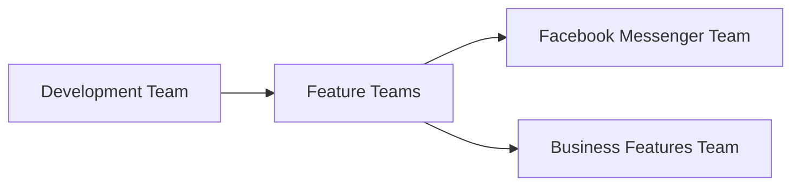
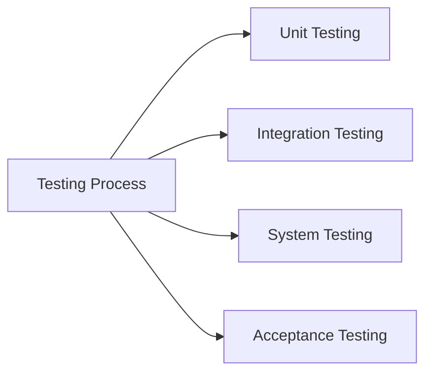

## Overview of Software Development Lifecycle Roles

The software development lifecycle (SDLC) encompasses a series of phases that a software product goes through from conception to retirement. Each phase requires specific roles and responsibilities to ensure the successful delivery of a high-quality product. Let's delve into the roles involved in the SDLC, using a large-scale application like Facebook as an example.

### High-Level Picture of Software Development

In the context of a large organization such as Facebook, the software development process is highly complex and involves numerous specialized roles. These roles are designed to ensure that the application is developed efficiently, tested thoroughly, and deployed securely.

#### Developer Teams

Developers are the backbone of the software development process. They are responsible for coding the application in various programming languages. In a large-scale application like Facebook, developers work in teams, often organized around specific features or modules of the application.



Each feature team focuses on developing and maintaining a specific aspect of the application. For instance, the Facebook Messenger team would be responsible for all aspects related to the messaging functionality, including new features, bug fixes, and performance improvements.

### Responsibilities of Developer Teams

Developer teams have several key responsibilities:

1. **Coding New Functionalities**: Writing code to implement new features and functionalities within the application.
2. **Bug Fixes**: Identifying and fixing bugs or issues within the application.
3. **Code Maintenance**: Ensuring that the codebase remains clean, maintainable, and scalable.
4. **Collaboration**: Working closely with other teams, such as QA and operations, to ensure smooth integration and deployment of the application.

#### Example: Coding a New Feature

Let's consider an example where a developer team is tasked with implementing a new feature in Facebook Messenger. The feature involves adding end-to-end encryption for messages.

```python
# Example Python code for end-to-end encryption
from cryptography.fernet import Fernet

def generate_key():
    return Fernet.generate_key()

def encrypt_message(message, key):
    f = Fernet(key)
    encrypted_message = f.encrypt(message.encode())
    return encrypted_message

def decrypt_message(encrypted_message, key):
    f = Fernet(key)
    decrypted_message = f.decrypt(encrypted_message).decode()
    return decrypted_message

# Generate a key
key = generate_key()

# Encrypt a message
message = "Hello, World!"
encrypted_message = encrypt_message(message, key)

# Decrypt the message
decrypted_message = decrypt_message(encrypted_message, key)

print(f"Original Message: {message}")
print(f"Encrypted Message: {encrypted_message}")
print(f"Decrypted Message: {decrypted_message}")
```

### Testing the Application

Once the development process is complete, the next critical step is testing the application. Testing ensures that the application functions as intended and meets the required quality standards.

#### Quality Assurance (QA) Teams

Quality assurance (QA) teams are responsible for testing the application to identify and fix any defects or issues. They use various testing methodologies, including unit testing, integration testing, system testing, and acceptance testing.



#### Example: Unit Testing

Unit testing involves testing individual components or units of the application to ensure they function correctly. Here’s an example of a unit test for the end-to-end encryption feature:

```python
import unittest
from encryption_module import generate_key, encrypt_message, decrypt_message

class TestEncryption(unittest.TestCase):
    def test_encrypt_decrypt(self):
        key = generate_key()
        message = "Hello, World!"
        encrypted_message = encrypt_message(message, key)
        decrypted_message = decrypt_message(encrypted_message, key)
        self.assertEqual(decrypted_message, message)

if __name__ == '__main__':
    unittest.main()
```

### Common Pitfalls and How to Prevent Them

#### Pitfall: Code Quality Issues

One common pitfall in software development is poor code quality, which can lead to bugs, security vulnerabilities, and maintenance issues.

**How to Prevent:**

1. **Code Reviews**: Implement a code review process where peers review each other's code to catch potential issues.
2. **Static Analysis Tools**: Use static analysis tools like SonarQube or ESLint to automatically check code quality.
3. **Automated Testing**: Ensure comprehensive automated testing to catch issues early.

#### Example: Code Review Process

Here’s an example of a code review checklist:

```markdown
- [ ] Does the code follow the project's coding standards?
- [ ] Are there any obvious bugs or logical errors?
- [ ] Is the code well-documented?
- [ ] Are there any security concerns?
- [ ] Does the code handle edge cases appropriately?
```

### Real-World Examples

#### Recent CVEs and Breaches

Recent CVEs and breaches highlight the importance of robust development practices. For example, the Log4j vulnerability (CVE-2021-44228) affected numerous applications, including Facebook. This vulnerability underscores the need for thorough testing and secure coding practices.

#### Secure Coding Practices

To prevent such vulnerabilities, developers should adhere to secure coding practices. For instance, using parameterized queries to prevent SQL injection attacks.

```sql
-- Vulnerable code
SELECT * FROM users WHERE username = '$username';

-- Secure code
SELECT * FROM users WHERE username = ?;
```

### Conclusion

Understanding the roles in the software development lifecycle is crucial for ensuring the successful delivery of high-quality software products. By breaking down the responsibilities of developer teams and QA teams, and providing practical examples and real-world scenarios, we can better appreciate the complexity and importance of each role in the SDLC.

### Further Reading and Practice Labs

For hands-on practice, consider the following resources:

- **PortSwigger Web Security Academy**: Offers interactive labs to learn about web application security.
- **OWASP Juice Shop**: An intentionally insecure web application for practicing security skills.
- **DVWA (Damn Vulnerable Web Application)**: Another web application for learning about web security vulnerabilities.

By engaging with these resources, you can deepen your understanding of the roles and responsibilities in the software development lifecycle.

---
<!-- nav -->
[[02-Introduction to Roles in the Software Development Lifecycle|Introduction to Roles in the Software Development Lifecycle]] | [[DevOps/DevOps Bootcamp/11-Miscellaneous/19-Understanding Roles in Software Development Lifecycle/00-Overview|Overview]] | [[04-Agile Methodology|Agile Methodology]]
