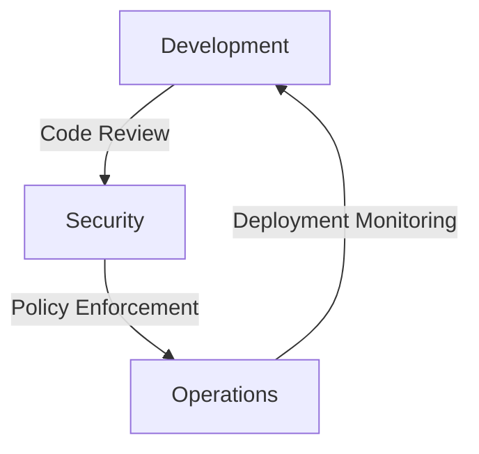

## Introduction to DevSecOps Culture

### What is DevSecOps?

DevSecOps is an approach to software development that integrates security practices throughout the entire software development lifecycle (SDLC). This methodology emphasizes collaboration between development, security, and operations teams to ensure that security is not an afterthought but an integral part of the development process. The goal is to build secure software more efficiently and effectively by embedding security best practices into the continuous integration and continuous deployment (CI/CD) pipeline.

### Why is DevSecOps Important?

The importance of DevSecOps lies in its ability to address the growing complexity and interconnectedness of modern software systems. Traditional approaches to security often involved a separate security team that would review code after it was developed, leading to delays and inefficiencies. In contrast, DevSecOps promotes a culture where everyone is responsible for security, ensuring that security considerations are made at every stage of the development process.

### The Role of Culture in DevSecOps

At the heart of DevSecOps is the culture within an organization. While tools and processes are crucial, the success of DevSecOps ultimately depends on how people work together. A DevSecOps engineer acts as both an architect and an orchestrator of engineering processes. However, even the best architectural plans will fail if the implementation lacks collaboration among different teams.

### Collaboration Between Teams

For DevSecOps to succeed, development, security, and operations teams must collaborate seamlessly. This requires breaking down silos and fostering a culture of shared responsibility and communication. Here’s a breakdown of the roles and responsibilities:

- **Development Team**: Focuses on writing high-quality, secure code. They should be aware of security best practices and integrate security tools into their workflow.
  
- **Security Team**: Provides expertise on security threats and vulnerabilities. They help define security policies and guidelines and assist in implementing security controls.
  
- **Operations Team**: Ensures that the infrastructure is secure and reliable. They manage the deployment and monitoring of applications and handle incident response.

### Mermaid Diagram: DevSecOps Collaboration



This diagram illustrates the continuous feedback loop between development, security, and operations teams. Each team plays a critical role in ensuring that the software is secure and reliable.

### Real-World Examples

Recent breaches and vulnerabilities highlight the importance of a collaborative DevSecOps culture. For instance, the SolarWinds supply chain attack in 2020 demonstrated the risks of not integrating security into the development process. The attackers exploited a trusted software update mechanism, compromising numerous organizations. This incident underscores the need for robust security practices and collaboration across teams.

### How to Implement DevSecOps Culture

Implementing a DevSecOps culture requires a strategic approach. Here are some steps to consider:

1. **Educate and Train**: Ensure that all team members are educated about security best practices and the importance of collaboration. Training programs can help bridge knowledge gaps and foster a culture of shared responsibility.
   
2. **Integrate Security Tools**: Integrate security tools into the CI/CD pipeline. This includes static application security testing (SAST), dynamic application security testing (DAST), and dependency scanning tools. These tools can automatically identify and flag potential security issues during the development process.

3. **Define Clear Policies and Guidelines**: Establish clear security policies and guidelines that all teams must follow. This includes coding standards, secure configuration management, and incident response procedures.

4. **Foster Communication**: Encourage open communication and collaboration between teams. Regular meetings and cross-functional workshops can help break down silos and promote a culture of shared responsibility.

### Example: Secure Coding Practices

Here’s an example of how secure coding practices can be integrated into the development process:

#### Vulnerable Code

```python
def login(username, password):
    # Connect to database
    conn = sqlite3.connect('database.db')
    cursor = conn.cursor()
    
    # Query database
    cursor.execute("SELECT * FROM users WHERE username = '%s' AND password = '%s'" % (username, password))
    user = cursor.fetchone()
    
    if user:
        return True
    else:
        return False
```

#### Secure Code

```python
import sqlite3
from flask import Flask, request

app = Flask(__name__)

@app.route('/login', methods=['POST'])
def login():
    username = request.form['username']
    password = request.form['password']
    
    # Connect to database
    conn = sqlite3.connect('database.db')
    cursor = conn.cursor()
    
    # Query database using parameterized queries
    cursor.execute("SELECT * FROM users WHERE username = ? AND password = ?", (username, password))
    user = cursor.fetchone()
    
    if user:
        return "Login successful"
    else:
        return "Login failed"

if __name__ == '__main__':
    app.run(debug=True)
```

In the secure version, parameterized queries are used to prevent SQL injection attacks. This is a simple yet effective way to enhance security.

### Detection and Prevention

To detect and prevent security issues, organizations can implement various measures:

1. **Static Application Security Testing (SAST)**: Use tools like SonarQube or Fortify to analyze code for potential security vulnerabilities.
   
2. **Dynamic Application Security Testing (DAST)**: Use tools like OWASP ZAP or Burp Suite to test applications for runtime vulnerabilities.
   
3. **Dependency Scanning**: Use tools like Snyk or WhiteSource to scan dependencies for known vulnerabilities.

### How to Prevent / Defend

#### Secure Configuration Management

Secure configuration management is crucial for maintaining the integrity of the infrastructure. Here’s an example of a secure configuration for an Nginx server:

#### Vulnerable Configuration

```nginx
server {
    listen 80;
    server_name example.com;

    location / {
        root /var/www/html;
        index index.html index.htm;
    }
}
```

#### Secure Configuration

```nginx
server {
    listen 80 default_server;
    server_name _;

    location / {
        root /var/www/html;
        index index.html index.htm;
        
        # Enable security headers
        add_header Content-Security-Policy "default-src 'self'";
        add_header X-Content-Type-Options nosniff;
        add_header X-Frame-Options DENY;
        add_header X-XSS-Protection "1; mode=block";
    }

    # Deny access to sensitive files
    location ~* \.(txt|log)$ {
        deny all;
    }
}
```

In the secure configuration, additional security headers are added to protect against common web vulnerabilities. Access to sensitive files is also restricted.

### Conclusion

Adopting a DevSecOps culture is essential for building secure and reliable software. By fostering collaboration between development, security, and operations teams, organizations can integrate security practices throughout the SDLC. This approach not only enhances security but also improves efficiency and reduces the risk of vulnerabilities.

### Practice Labs

To gain hands-on experience with DevSecOps, consider the following labs:

- **PortSwigger Web Security Academy**: Offers interactive labs to learn about web security and secure coding practices.
- **OWASP Juice Shop**: A deliberately insecure web application to practice security testing and vulnerability identification.
- **DVWA (Damn Vulnerable Web Application)**: Another intentionally vulnerable web application for learning web security.

These labs provide practical experience in implementing DevSecOps principles and identifying and mitigating security vulnerabilities.

---
<!-- nav -->
[[DevSecOps/DevSecOps Bootcamp/01-DevSecOps Introduction/01-Adopt DevSecOps in Organizations/03-Why DevSecOps is Important/00-Overview|Overview]] | [[02-Understanding DevSecOps Adoption in Organizations|Understanding DevSecOps Adoption in Organizations]]
