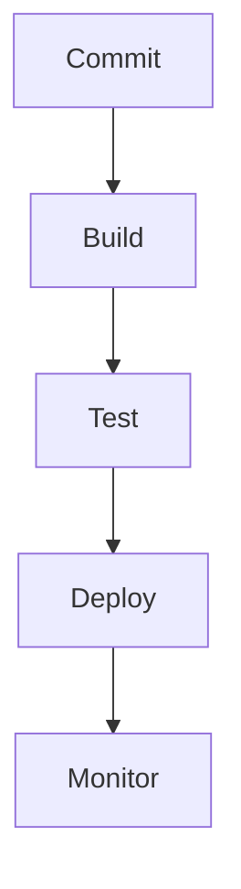
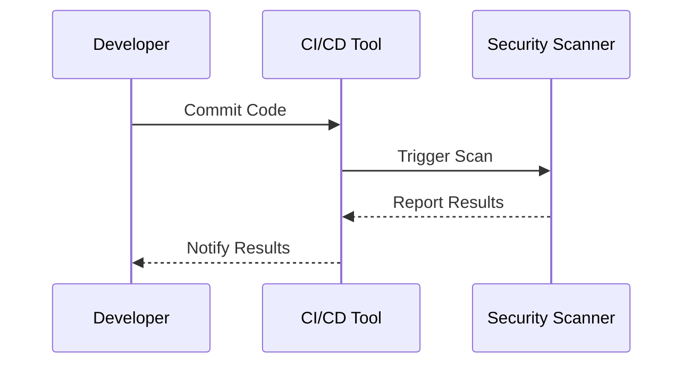

## Understanding DevSecOps Adoption in Organizations

### Introduction to DevSecOps

DevSecOps is a methodology that integrates security practices into the DevOps lifecycle. This approach ensures that security is not an afterthought but is embedded throughout the development, testing, and deployment processes. By doing so, organizations can reduce the risk of vulnerabilities and ensure that their applications are secure from the outset.

### Importance of Culture and Readiness

One of the most significant obstacles to adopting DevSecOps in organizations is the existing culture and the readiness of teams to accept the changes that come with it. While having the right tools and technologies is crucial, the success of DevSecOps largely depends on the willingness of teams to collaborate and share responsibilities.

#### What is the Issue?

Even if you are an expert in DevSecOps, without the right culture in an organization and readiness from the teams, none of these tools or pipelines will work effectively. The following points highlight the key issues:

- **Collaboration**: Teams must work together seamlessly. If developers, testers, and operations teams operate in silos, the benefits of DevSecOps cannot be realized.
- **Shared Responsibility**: Each member of the team should understand that security is everyone’s responsibility. Developers should not think that security is solely the job of the security team.
- **Open Communication**: Teams must communicate openly and frequently. This includes sharing information about vulnerabilities, discussing security practices, and providing feedback.

### Best Practices for Integrating DevSecOps

To integrate DevSecOps into an organization, several best practices can be followed. These practices are based on successful implementations by large companies.

#### Step-by-Step Integration Process

1. **Assess Current State**:
   - Evaluate the current state of your organization’s culture and readiness for DevSecOps.
   - Identify gaps in collaboration, shared responsibility, and open communication.
   - Use tools like surveys and interviews to gather insights from team members.

2. **Develop a Roadmap**:
   - Create a roadmap that outlines the steps required to transition to DevSecOps.
   - Include timelines, milestones, and key performance indicators (KPIs).

3. **Educate and Train**:
   - Provide training sessions to educate team members about DevSecOps principles and practices.
   - Offer workshops and hands-on labs to help team members understand how to implement DevSecOps in their daily tasks.

4. **Implement Tools and Technologies**:
   - Introduce tools and technologies that support DevSecOps, such as continuous integration/continuous deployment (CI/CD) pipelines, static application security testing (SAST), dynamic application security testing (DAST), and dependency scanning tools.
   - Ensure that these tools are integrated into the existing development and deployment processes.

5. **Foster Collaboration**:
   - Encourage cross-functional teams to work together.
   - Implement practices such as pair programming, code reviews, and regular meetings to promote collaboration.

6. **Promote Shared Responsibility**:
   - Ensure that all team members understand that security is everyone’s responsibility.
   - Assign specific roles and responsibilities related to security within the team.

7. **Ensure Open Communication**:
   - Establish channels for open communication, such as regular stand-ups, retrospectives, and feedback sessions.
   - Encourage team members to report vulnerabilities and security concerns without fear of retribution.

### Real-World Examples

#### Recent Breaches and CVEs

Several recent breaches and CVEs highlight the importance of DevSecOps:

- **SolarWinds Supply Chain Attack (CVE-2020-1014)**: This attack compromised the SolarWinds Orion platform, leading to widespread breaches across multiple organizations. The attack underscores the importance of supply chain security and the need for continuous monitoring and testing.
- **Capital One Data Breach (CVE-2019-11510)**: In this breach, an attacker exploited a misconfigured web application firewall to access sensitive customer data. This incident highlights the importance of proper configuration management and regular security assessments.

### Code Examples and Diagrams

#### Example of a CI/CD Pipeline



This diagram represents a basic CI/CD pipeline. Here’s how it works:

1. **Commit**: Developers commit code changes to the repository.
2. **Build**: The code is built automatically using a CI/CD tool.
3. **Test**: Automated tests are run to ensure the code meets quality standards.
4. **Deploy**: The code is deployed to the production environment.
5. **Monitor**: The system is continuously monitored for any issues or vulnerabilities.

#### Example of a Security Scan



This sequence diagram shows how a security scan is triggered during the CI/CD process:

1. **Developer**: Commits code to the repository.
2. **CI/CD Tool**: Triggers a security scan using a security scanner.
3. **Security Scanner**: Performs the scan and reports the results back to the CI/CD tool.
4. **CI/CD Tool**: Notifies the developer of the scan results.

### Pitfalls and Common Mistakes

#### Common Pitfalls

- **Ignoring Culture and Readiness**: Focusing solely on tools and technologies without addressing cultural and readiness issues can lead to failure.
- **Lack of Collaboration**: Siloed teams that do not collaborate effectively can hinder the implementation of DevSecOps.
- **Insufficient Training**: Lack of proper training and education can result in team members not understanding their roles and responsibilities in the DevSecOps process.

#### Common Mistakes

- **Overlooking Continuous Monitoring**: Failing to continuously monitor the system for vulnerabilities can leave the organization exposed to threats.
- **Neglecting Regular Security Assessments**: Not conducting regular security assessments can result in undetected vulnerabilities.
- **Poor Configuration Management**: Misconfigured systems can lead to security breaches.

### How to Prevent / Defend

#### Detection

- **Continuous Monitoring**: Implement continuous monitoring tools to detect any anomalies or suspicious activities.
- **Regular Security Assessments**: Conduct regular security assessments to identify and address vulnerabilities.

#### Prevention

- **Proper Configuration Management**: Ensure that all systems are properly configured and regularly reviewed.
- **Secure Coding Practices**: Implement secure coding practices to prevent common vulnerabilities such as SQL injection, cross-site scripting (XSS), and buffer overflows.

#### Secure-Coding Fixes

Here’s an example of a vulnerable code and its secure version:

**Vulnerable Code**:
```python
import sqlite3

def get_user_data(username):
    conn = sqlite3.connect('database.db')
    cursor = conn.cursor()
    query = f"SELECT * FROM users WHERE username = '{username}'"
    cursor.execute(query)
    return cursor.fetchall()
```

**Secure Code**:
```python
import sqlite3

def get_user_data(username):
    conn = sqlite3.connect('database.db')
    cursor = conn.cursor()
    query = "SELECT * FROM users WHERE username = ?"
    cursor.execute(query, (username,))
    return cursor.fetchall()
```

In the secure version, parameterized queries are used to prevent SQL injection attacks.

### Hands-On Labs

For hands-on practice, consider the following labs:

- **PortSwigger Web Security Academy**: Offers interactive labs to learn about web security.
- **OWASP Juice Shop**: A deliberately insecure web application for practicing web security skills.
- **DVWA (Damn Vulnerable Web Application)**: A PHP/MySQL web application that is riddled with vulnerabilities for educational purposes.
- **WebGoat**: An interactive lab for learning about web application security.

These labs provide practical experience in implementing DevSecOps principles and practices.

### Conclusion

Adopting DevSecOps in organizations requires a comprehensive approach that addresses both technical and cultural aspects. By following best practices, educating team members, and fostering a collaborative environment, organizations can successfully integrate DevSecOps and enhance their overall security posture.

---
<!-- nav -->
[[DevSecOps/DevSecOps Bootcamp/01-DevSecOps Introduction/01-Adopt DevSecOps in Organizations/03-Why DevSecOps is Important/01-Introduction to DevSecOps Culture|Introduction to DevSecOps Culture]] | [[DevSecOps/DevSecOps Bootcamp/01-DevSecOps Introduction/01-Adopt DevSecOps in Organizations/03-Why DevSecOps is Important/00-Overview|Overview]] | [[DevSecOps/DevSecOps Bootcamp/01-DevSecOps Introduction/01-Adopt DevSecOps in Organizations/03-Why DevSecOps is Important/03-Practice Questions & Answers|Practice Questions & Answers]]
