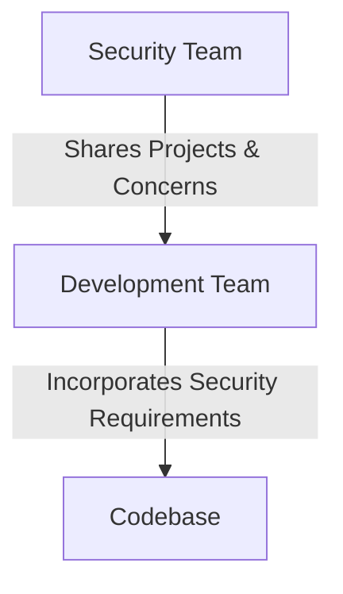
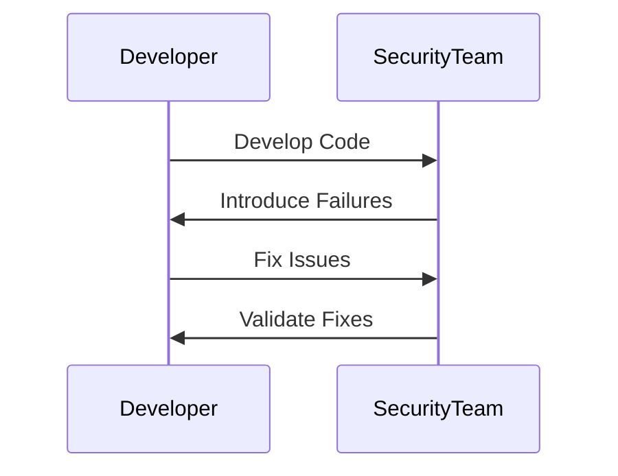
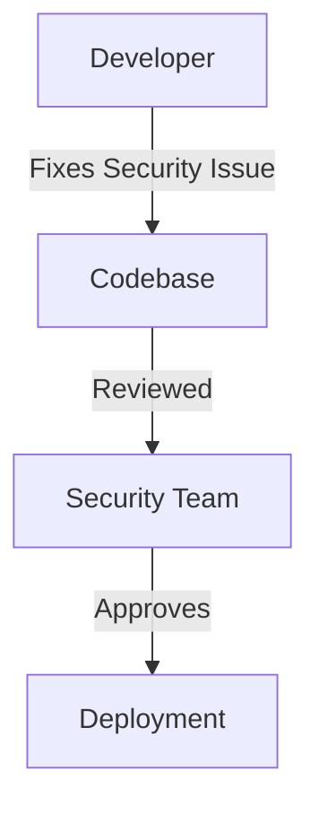
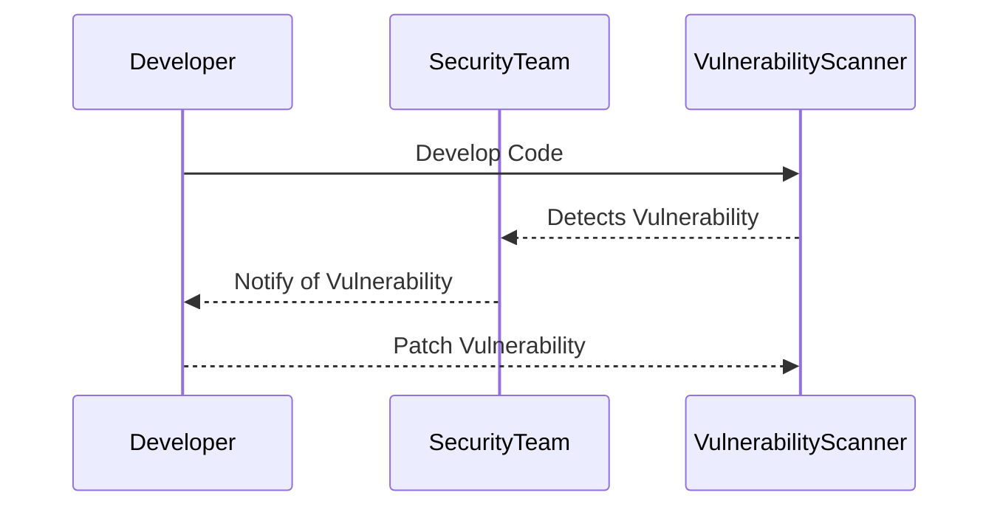

## Introduction to DevSecOps Culture

DevSecOps is a cultural shift within organizations that aims to integrate security practices into the entire software development lifecycle. Traditionally, security was often treated as an afterthought, with dedicated security teams working separately from development and operations teams. This siloed approach led to inefficiencies, delays, and vulnerabilities that were discovered too late in the development process. To overcome these challenges, DevSecOps emphasizes the importance of transparency, early involvement, and shared responsibility among all teams.

### Transparency Between Teams

Transparency is crucial in a DevSecOps environment because it ensures that all stakeholders are aware of the progress and challenges throughout the development cycle. This visibility helps in identifying potential issues early and addressing them proactively.

#### Example: Adobe

Adobe is a prime example of a company that has successfully implemented transparency in its DevSecOps culture. In Adobe, the security teams share their ongoing projects and concerns with the software developers. This open communication allows developers to understand the security requirements and constraints, ensuring that they can incorporate these considerations into their work from the beginning.



**Why Transparency Matters:**
- **Avoid Surprises:** By sharing information, teams can avoid unexpected issues that might arise due to lack of coordination.
- **Faster Resolution:** Issues can be identified and resolved more quickly when everyone is aware of the project status.
- **Improved Trust:** Transparent communication builds trust among team members, fostering a collaborative environment.

### Early Involvement of Security Teams

Early involvement of security teams is another key aspect of DevSecOps. By integrating security practices from the initial stages of development, organizations can ensure that security is not an afterthought but an integral part of the development process.

#### Example: Netflix and Security Chaos Engineering

Netflix is renowned for its innovative approach to DevSecOps through Security Chaos Engineering. This method involves testing systems by intentionally introducing failures and vulnerabilities during the development phase. By doing so, security teams can work closely with developers to identify and mitigate risks early on.



**Why Early Involvement Matters:**
- **Proactive Risk Management:** Identifying and fixing security issues early reduces the likelihood of major vulnerabilities being discovered later.
- **Continuous Improvement:** Regular testing and feedback loops help in continuously improving the security posture of the system.
- **Shared Responsibility:** Developers and security teams work together, ensuring that security is everyone’s responsibility.

### Shared Responsibility for Security

In a DevSecOps environment, security is not solely the responsibility of a dedicated security team. Instead, it is a collective effort where developers, operations teams, and security professionals all play a role in maintaining the security of the system.

#### Example: SLED (Software, Linux, Enterprise, Development)

At SLED, developers are empowered to fix security issues themselves rather than waiting for a separate security team. This approach ensures that security issues are addressed promptly and efficiently, reducing the time-to-resolution.



**Why Shared Responsibility Matters:**
- **Faster Response:** Developers can address security issues immediately, reducing the time required for resolution.
- **Empowerment:** Developers feel more responsible for the security of the system, leading to better overall security practices.
- **Collaboration:** Shared responsibility fosters a collaborative environment where everyone contributes to the security of the system.

### Real-World Examples and Recent Breaches

To understand the importance of DevSecOps, let's look at some recent real-world examples and breaches that highlight the consequences of not adopting a DevSecOps culture.

#### Example: Equifax Data Breach (CVE-2017-5638)

The Equifax data breach in 2017 exposed sensitive personal information of millions of individuals. The breach occurred due to a vulnerability in the Apache Struts framework, which was not patched in a timely manner. This incident underscores the importance of continuous monitoring and proactive security measures.



**Detection and Prevention:**
- **Continuous Monitoring:** Implement continuous monitoring tools to detect vulnerabilities in real-time.
- **Automated Scanning:** Use automated scanning tools like SonarQube or OWASP ZAP to identify and fix vulnerabilities early.
- **Secure Coding Practices:** Follow secure coding guidelines such as OWASP Top Ten to prevent common vulnerabilities.

#### Secure Coding Fix Example

Let's consider a common vulnerability, SQL Injection, and how it can be prevented using secure coding practices.

**Vulnerable Code:**

```sql
SELECT * FROM users WHERE username = '$username' AND password = '$password';
```

**Fixed Code:**

```sql
PreparedStatement stmt = connection.prepareStatement("SELECT * FROM users WHERE username = ? AND password = ?");
stmt.setString(1, username);
stmt.setString(2, password);
ResultSet rs = stmt.executeQuery();
```

**Explanation:**
- **Use Prepared Statements:** Prepared statements help prevent SQL injection by separating the SQL logic from the input data.
- **Input Validation:** Validate user inputs to ensure they meet expected formats and lengths.

### Hands-On Labs for Practice

To gain practical experience with DevSecOps principles, consider the following hands-on labs:

- **PortSwigger Web Security Academy:** Offers interactive labs to practice web application security.
- **OWASP Juice Shop:** A deliberately insecure web application for practicing security testing.
- **DVWA (Damn Vulnerable Web Application):** Another web application with intentional vulnerabilities for security training.

These labs provide real-world scenarios to apply DevSecOps principles and improve your skills in integrating security into the development process.

### Conclusion

Adopting a DevSecOps culture requires a significant shift in organizational mindset and practices. By emphasizing transparency, early involvement, and shared responsibility, organizations can significantly enhance their security posture. Real-world examples and recent breaches highlight the importance of proactive security measures. Through continuous monitoring, secure coding practices, and hands-on training, organizations can effectively implement DevSecOps principles and protect their systems from vulnerabilities.

---
<!-- nav -->
[[DevSecOps/DevSecOps Bootcamp/01-DevSecOps Introduction/01-Adopt DevSecOps in Organizations/Driving Cultural Change Real World Examples of Companies/00-Overview|Overview]] | [[DevSecOps/DevSecOps Bootcamp/01-DevSecOps Introduction/01-Adopt DevSecOps in Organizations/Driving Cultural Change Real World Examples of Companies/02-Driving Cultural Change in Adopting DevSecOps|Driving Cultural Change in Adopting DevSecOps]]
