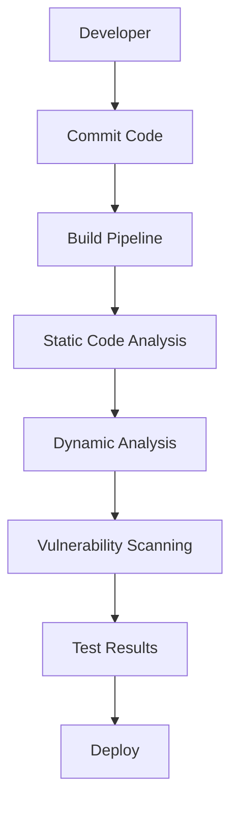
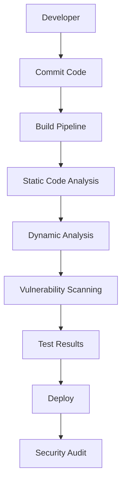
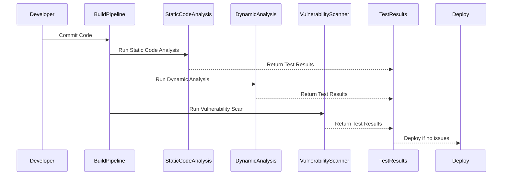
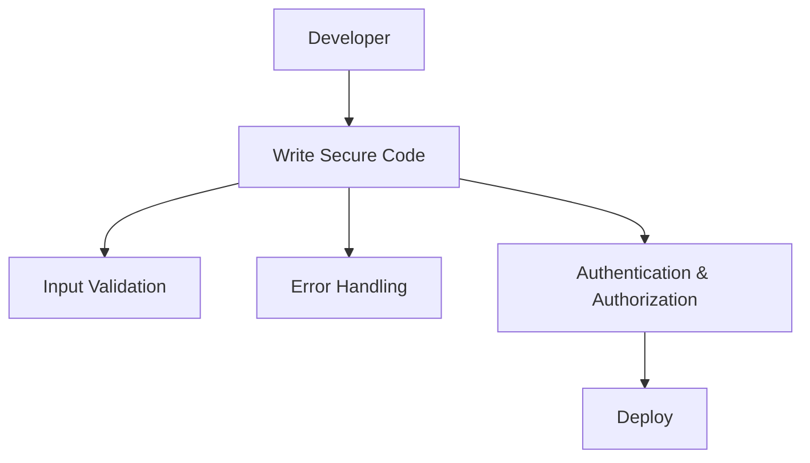
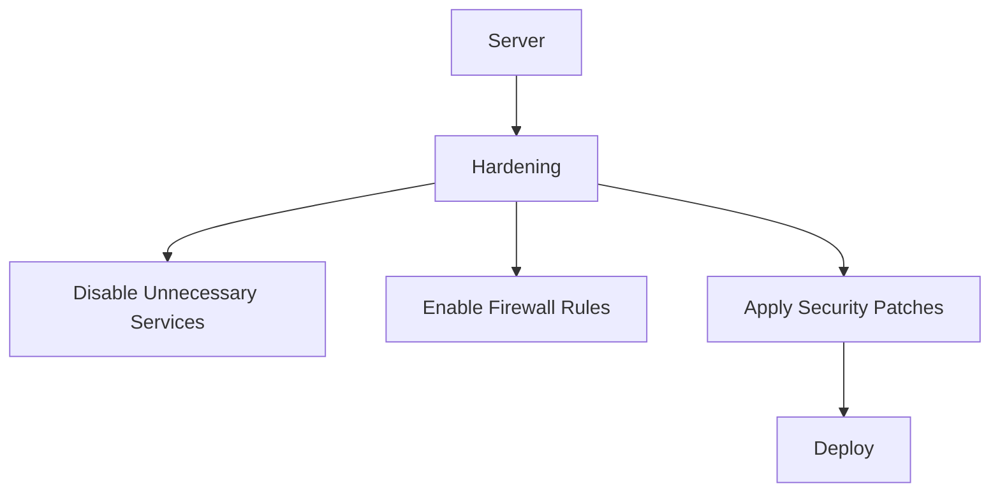

## Driving Cultural Change in Adopting DevSecOps

### Understanding DevSecOps

DevSecOps is a methodology that integrates security practices into the DevOps lifecycle. This approach ensures that security is not an afterthought but is embedded throughout the development, testing, and deployment processes. The goal is to create a culture where security is everyone’s responsibility, making it a natural part of the workflow.

#### What is DevSecOps?

DevSecOps combines the principles of DevOps (Development, Operations) with security practices. Traditionally, security was often treated as a separate function, with dedicated teams responsible for ensuring that applications were secure. However, this approach can lead to delays and inefficiencies, as security checks are performed at the end of the development cycle.

In contrast, DevSecOps aims to integrate security into every stage of the development process. This includes:

- **Continuous Integration (CI)**: Integrating security checks into the build process.
- **Continuous Delivery (CD)**: Ensuring that security is maintained during the delivery phase.
- **Continuous Monitoring**: Continuously monitoring applications for vulnerabilities and threats.

#### Why is DevSecOps Important?

The importance of DevSecOps lies in its ability to address security issues early in the development cycle, reducing the likelihood of vulnerabilities making it to production. By embedding security into the development process, organizations can:

- **Reduce Risk**: Identify and mitigate security risks earlier, reducing the potential for breaches.
- **Improve Efficiency**: Streamline the development process by integrating security checks, reducing the need for manual reviews.
- **Enhance Collaboration**: Foster a collaborative environment where developers, operations, and security teams work together seamlessly.

### Creating a Security-Centric Culture

Creating a culture where security is everyone’s responsibility requires significant effort and commitment. This involves changing mindsets and behaviors across the organization.

#### What Does a Security-Centric Culture Look Like?

A security-centric culture is one where security is integrated into every aspect of the development process. This means:

- **Security Awareness**: All team members understand the importance of security and are aware of the potential risks.
- **Collaboration**: Developers, operations, and security teams work together to ensure that security is maintained throughout the development lifecycle.
- **Continuous Learning**: Regular training and education to keep team members updated on the latest security practices and threats.

#### How to Implement a Security-Centric Culture

Implementing a security-centric culture involves several steps:

1. **Leadership Commitment**: Leadership must demonstrate a strong commitment to security. This includes providing resources, setting goals, and leading by example.
2. **Training and Education**: Regular training sessions to educate team members on security best practices and the latest threats.
3. **Integration of Security Tools**: Embedding security tools into the development process, such as static code analysis, dynamic analysis, and vulnerability scanners.
4. **Regular Audits and Reviews**: Conducting regular security audits and code reviews to identify and address vulnerabilities.

### Real-World Examples of Companies Adopting DevSecOps

Several companies have successfully adopted DevSecOps, demonstrating the benefits of integrating security into the development process.

#### Example 1: Capital One

Capital One is a financial services company that has embraced DevSecOps to improve its security posture. They implemented a continuous integration and delivery pipeline that includes automated security testing.

**How It Works:**

- **Automated Testing**: Capital One uses automated tools to scan code for vulnerabilities during the build process.
- **Security Training**: Regular training sessions for developers to ensure they are aware of security best practices.
- **Collaborative Environment**: Security teams work closely with development teams to ensure that security is integrated into every stage of the development process.

**Mermaid Diagram:**

#### Example 2: Etsy

Etsy, an online marketplace, has also adopted DevSecOps to enhance its security. They have implemented a continuous delivery pipeline that includes security testing.

**How It Works:**

- **Continuous Delivery**: Etsy uses a continuous delivery pipeline that includes automated security testing.
- **Security Champions**: Etsy has appointed security champions within each development team to ensure that security is integrated into the development process.
- **Regular Audits**: Regular security audits and code reviews to identify and address vulnerabilities.

**Mermaid Diagram:**

### Common Pitfalls and How to Avoid Them

Adopting DevSecOps is not without challenges. Some common pitfalls include:

- **Resistance to Change**: Team members may resist changes to their existing workflows.
- **Lack of Resources**: Insufficient resources, such as tools and training, can hinder the adoption of DevSecOps.
- **Inadequate Communication**: Poor communication between development, operations, and security teams can lead to misalignment.

#### How to Avoid These Pitfalls

To avoid these pitfalls, organizations should:

1. **Communicate Clearly**: Ensure that all team members understand the benefits of DevSecOps and the role they play in the process.
2. **Provide Adequate Resources**: Invest in the necessary tools and training to support the adoption of DevSecOps.
3. **Foster Collaboration**: Encourage collaboration between development, operations, and security teams to ensure that security is integrated into every stage of the development process.

### How to Prevent / Defend Against Security Risks

#### Detection

Detecting security risks involves using various tools and techniques to identify vulnerabilities in the development process.

**Tools:**

- **Static Code Analysis**: Tools like SonarQube and Fortify can analyze code for vulnerabilities.
- **Dynamic Analysis**: Tools like Burp Suite and OWASP ZAP can test applications for vulnerabilities during runtime.
- **Vulnerability Scanners**: Tools like Nessus and OpenVAS can scan systems for known vulnerabilities.

**Example:**

#### Prevention

Preventing security risks involves implementing secure coding practices and hardening configurations.

**Secure Coding Practices:**

- **Input Validation**: Validate all user inputs to prevent injection attacks.
- **Error Handling**: Handle errors gracefully to prevent information leakage.
- **Authentication and Authorization**: Implement strong authentication and authorization mechanisms.

**Example:**

**Hardening Configurations:**

- **Server Hardening**: Harden server configurations to reduce attack surfaces.
- **Network Segmentation**: Segment networks to limit the spread of attacks.
- **Least Privilege Principle**: Apply the principle of least privilege to minimize access rights.

**Example:**

### Conclusion

Adopting DevSecOps is crucial for organizations looking to improve their security posture. By integrating security into every stage of the development process, organizations can reduce the likelihood of vulnerabilities making it to production. This requires a cultural shift, where security is everyone’s responsibility, and a commitment to continuous improvement.

### Hands-On Labs

For hands-on practice in adopting DevSecOps, consider the following labs:

- **PortSwigger Web Security Academy**: Offers interactive labs to learn about web application security.
- **OWASP Juice Shop**: A deliberately insecure web application to practice security testing.
- **DVWA (Damn Vulnerable Web Application)**: Another intentionally vulnerable web application for security testing.

These labs provide practical experience in integrating security into the development process, helping to reinforce the concepts learned in this chapter.

---
<!-- nav -->
[[DevSecOps/DevSecOps Bootcamp/01-DevSecOps Introduction/01-Adopt DevSecOps in Organizations/Driving Cultural Change Real World Examples of Companies/01-Introduction to DevSecOps Culture|Introduction to DevSecOps Culture]] | [[DevSecOps/DevSecOps Bootcamp/01-DevSecOps Introduction/01-Adopt DevSecOps in Organizations/Driving Cultural Change Real World Examples of Companies/00-Overview|Overview]] | [[DevSecOps/DevSecOps Bootcamp/01-DevSecOps Introduction/01-Adopt DevSecOps in Organizations/Driving Cultural Change Real World Examples of Companies/03-Driving Cultural Change in Organizations Adopting DevSecOps|Driving Cultural Change in Organizations Adopting DevSecOps]]
