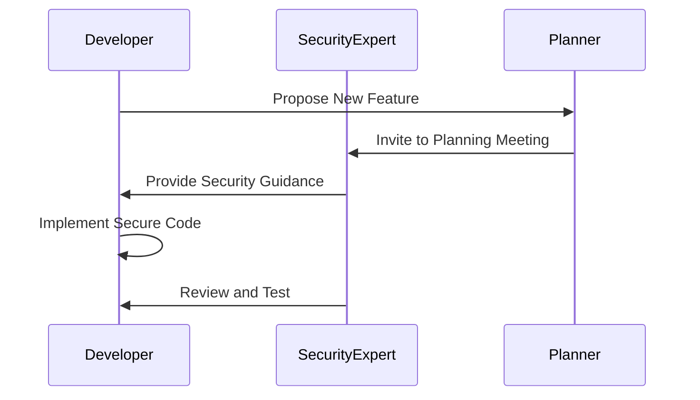
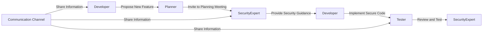
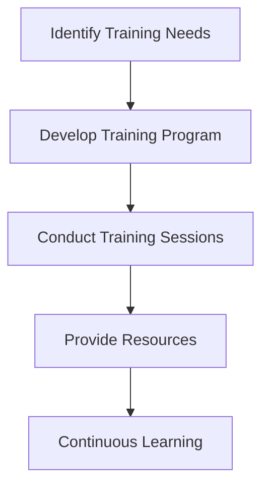
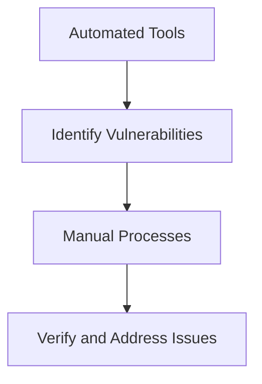
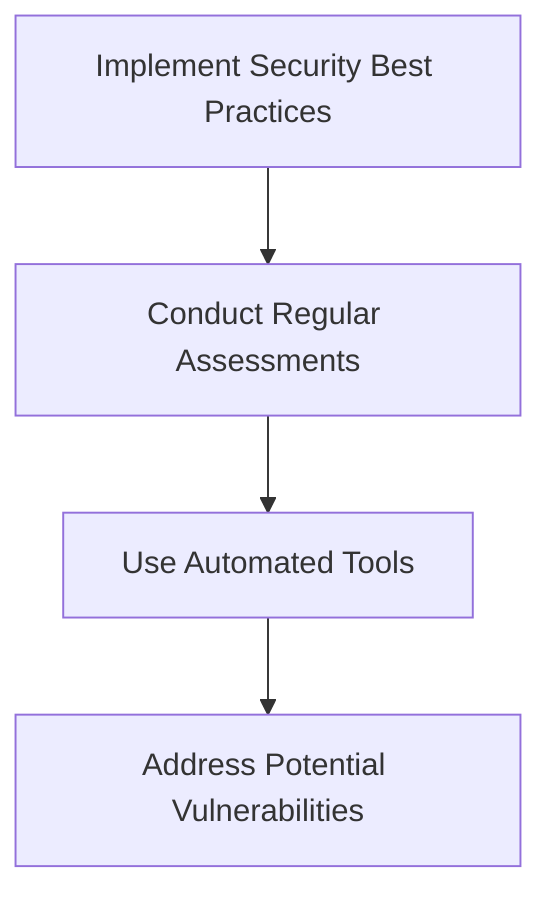
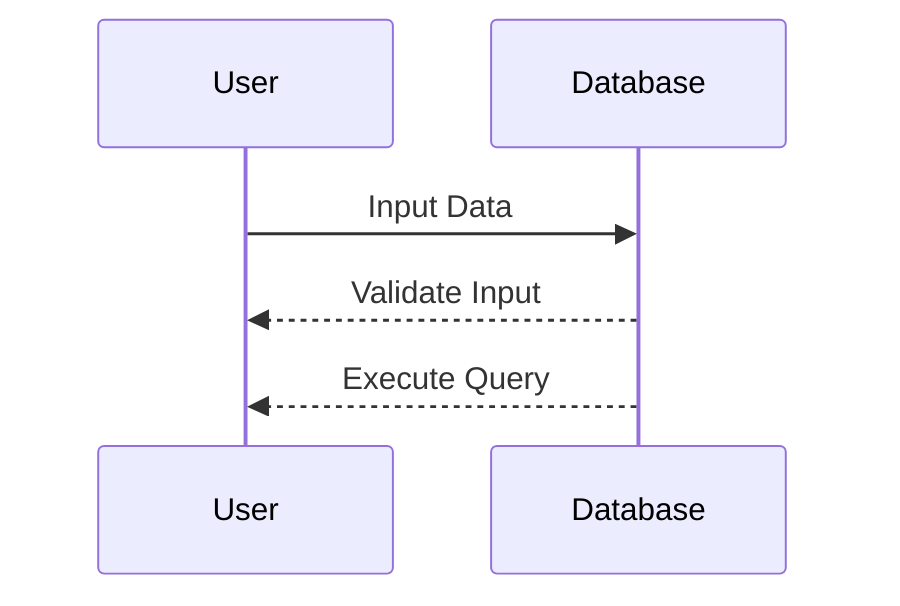
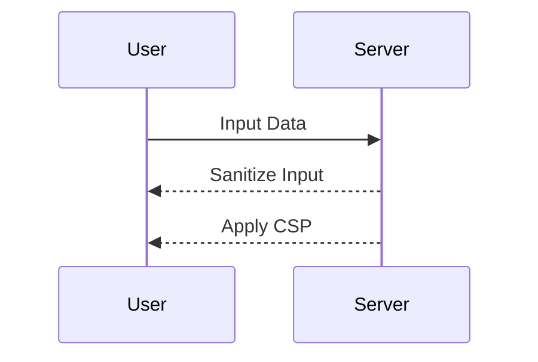
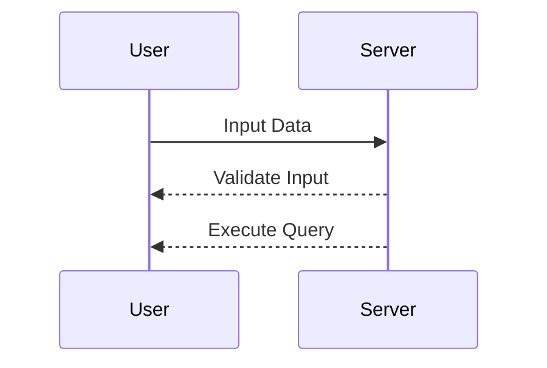

## Driving Cultural Change in Organizations: Adopting DevSecOps

### Introduction to DevSecOps

DevSecOps is an approach that integrates security practices into the entire software development lifecycle, ensuring that security is not an afterthought but a continuous process throughout the development and deployment phases. In traditional software development, security was often considered a separate function, managed by dedicated security teams. However, in DevSecOps, security becomes everyone's responsibility, fostering a culture of shared ownership and accountability.

### Shared Ownership in DevSecOps

The concept of shared ownership is central to DevSecOps. In this model, every engineer, whether a developer, tester, or operations specialist, feels responsible for the security of the software they work on. This shift in mindset is crucial because it ensures that security is considered at every stage of the development process, from initial planning to final deployment.

#### Why Shared Ownership Matters

Shared ownership matters because it helps to identify and mitigate security risks early in the development cycle. By involving security experts from the beginning, teams can catch potential vulnerabilities before they become significant issues. This proactive approach reduces the likelihood of costly security breaches and enhances the overall quality of the software.

#### How Shared Ownership Works

In a shared ownership model, security is integrated into the daily activities of all team members. Developers are trained to recognize and address security concerns, and security experts are involved in the planning and design phases of projects. This collaboration ensures that security is not treated as an isolated task but as an integral part of the development process.

### Real-World Examples of Companies Adopting DevSecOps

To understand how organizations can successfully adopt DevSecOps, let's examine some real-world examples of companies that have implemented this cultural shift.

#### Example 1: Spotify

Spotify is a prime example of a company that has successfully integrated security into its development process. At Spotify, security experts are involved right from the beginning of a new project. They participate in planning meetings and provide guidance to developers from the start, rather than waiting until the end to review the code for security issues.

##### Early Involvement of Security Experts

By involving security experts early in the development process, Spotify can catch potential security issues before they become major problems. This early involvement also allows security experts to educate developers about security best practices, reducing the likelihood of introducing vulnerabilities in the first place.



#### Example 2: Atlassian

Atlassian is another company that has successfully adopted DevSecOps principles. One of the key strategies Atlassian uses is to ensure that communication is simple and open. They use specific communication channels that all teams can access when working on DevSecOps initiatives.

##### Communication Channels

Effective communication is essential for successful DevSecOps adoption. Atlassian uses tools like Slack and Jira to facilitate open and transparent communication among team members. These tools allow developers, security experts, and other stakeholders to collaborate seamlessly and share information about security concerns and best practices.



### Steps to Implement DevSecOps in Your Organization

Adopting DevSecOps requires a strategic approach to cultural change. Here are some steps your organization can take to implement DevSecOps effectively:

#### Step 1: Educate and Train

Educating and training all team members on security best practices is crucial. This includes providing regular training sessions, workshops, and resources to help developers understand security concepts and how to apply them in their daily work.



#### Step 2: Involve Security Experts Early

Involving security experts early in the development process is essential. This means having security experts participate in planning meetings, design sessions, and code reviews. Their expertise can help identify potential security issues before they become major problems.


#### Step 3: Foster Open Communication

Fostering open communication is critical for successful DevSecOps adoption. This includes using communication channels that all team members can access and encouraging transparency and collaboration among team members.


### Common Pitfalls and How to Avoid Them

While adopting DevSecOps can bring significant benefits, there are several common pitfalls that organizations should be aware of and avoid.

#### Pitfall 1: Lack of Buy-In

One common pitfall is a lack of buy-in from team members. Without the support and commitment of all team members, DevSecOps initiatives are unlikely to succeed. To avoid this, it is essential to communicate the benefits of DevSecOps and involve all team members in the process.

#### Pitfall 2: Overlooking Security Best Practices

Another common pitfall is overlooking security best practices. This can happen when teams rush to meet deadlines or when security is not given the same priority as other aspects of the development process. To avoid this, it is essential to prioritize security and ensure that all team members are trained on security best practices.

### How to Prevent and Defend Against Security Risks

Preventing and defending against security risks is a critical aspect of DevSecOps. Here are some strategies to help organizations detect and prevent security issues:

#### Detection

Detecting security issues requires a combination of automated tools and manual processes. Automated tools can help identify potential vulnerabilities, while manual processes can help verify and address these issues.



#### Prevention

Preventing security issues requires a proactive approach. This includes implementing security best practices, conducting regular security assessments, and using automated tools to identify and address potential vulnerabilities.



### Secure Coding Fixes

Secure coding is a critical component of DevSecOps. Here are some examples of secure coding fixes:

#### Example 1: SQL Injection

SQL injection is a common security vulnerability that occurs when user input is not properly validated. To prevent SQL injection, developers should use parameterized queries and validate user input.



#### Example 2: Cross-Site Scripting (XSS)

Cross-site scripting (XSS) is another common security vulnerability that occurs when user input is not properly sanitized. To prevent XSS, developers should sanitize user input and use content security policies (CSP).



### Recent Real-World Examples

Recent real-world examples of security breaches highlight the importance of DevSecOps. For instance, the Equifax breach in 2017 exposed sensitive data of millions of customers due to a vulnerability in Apache Struts. This breach could have been prevented if DevSecOps principles had been followed.

#### Equifax Breach

The Equifax breach occurred due to a vulnerability in Apache Struts, which was not patched in a timely manner. This breach highlights the importance of keeping software up-to-date and conducting regular security assessments.



### Conclusion

Adopting DevSecOps requires a cultural shift within an organization. By fostering a culture of shared ownership, involving security experts early, and fostering open communication, organizations can successfully implement DevSecOps and reduce the likelihood of security breaches. Additionally, by prioritizing security best practices and using automated tools to detect and prevent security issues, organizations can enhance the overall security of their software.

### Practice Labs

For hands-on experience with DevSecOps, consider the following practice labs:

- **PortSwigger Web Security Academy**: Offers interactive labs to learn about web application security.
- **OWASP Juice Shop**: Provides a vulnerable web application to practice security testing.
- **DVWA (Damn Vulnerable Web Application)**: Another vulnerable web application for security testing.
- **WebGoat**: An interactive lab to learn about web application security.

These labs provide practical experience in applying DevSecOps principles and can help organizations improve their security posture.

```markdown

---
<!-- nav -->
[[DevSecOps/DevSecOps Bootcamp/01-DevSecOps Introduction/01-Adopt DevSecOps in Organizations/Driving Cultural Change Real World Examples of Companies/02-Driving Cultural Change in Adopting DevSecOps|Driving Cultural Change in Adopting DevSecOps]] | [[DevSecOps/DevSecOps Bootcamp/01-DevSecOps Introduction/01-Adopt DevSecOps in Organizations/Driving Cultural Change Real World Examples of Companies/00-Overview|Overview]] | [[DevSecOps/DevSecOps Bootcamp/01-DevSecOps Introduction/01-Adopt DevSecOps in Organizations/Driving Cultural Change Real World Examples of Companies/04-Driving Cultural Change in Organizations Real-World Examples of Companies|Driving Cultural Change in Organizations Real-World Examples of Companies]]
