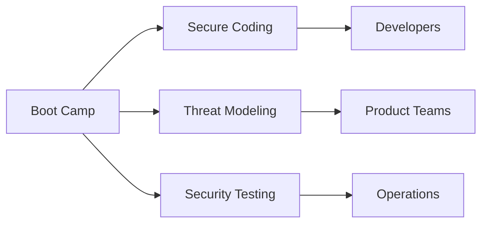
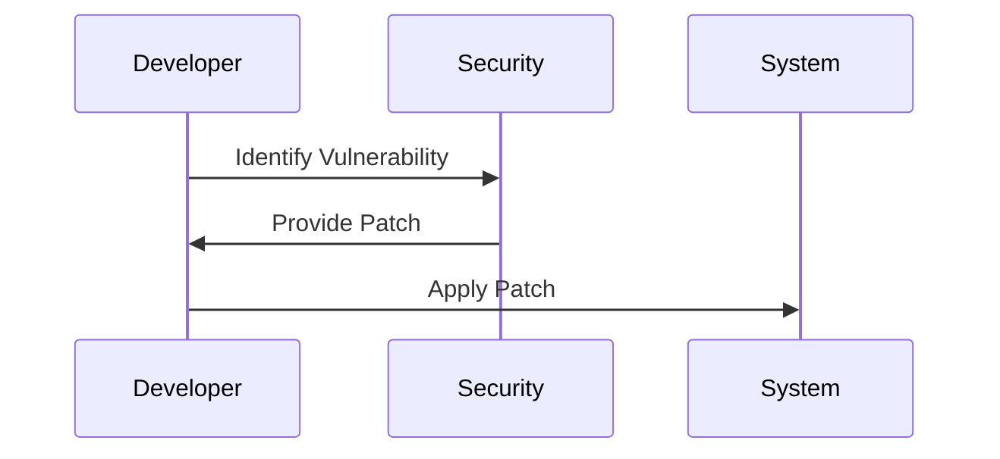
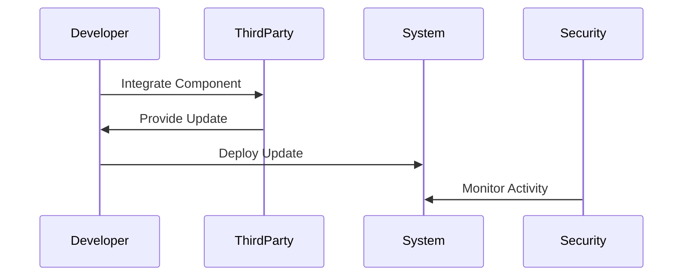
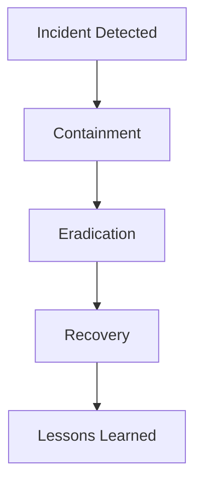

## Driving Cultural Change in Organizations: Real-World Examples of Companies

### Introduction to DevSecOps Culture

DevSecOps is an approach that integrates security practices into the DevOps lifecycle. The goal is to ensure that security is not an afterthought but is embedded throughout the development process. This requires a cultural shift within organizations, where security becomes everyone's responsibility rather than being solely managed by a dedicated security team.

### Importance of Continuous Learning and Training

One of the key aspects of adopting a DevSecOps culture is ensuring that everyone—developers, operations staff, and security engineers—has access to continuous learning opportunities. This includes courses, workshops, and training sessions that keep everyone up to date with the latest security practices.

#### Why Continuous Learning Matters

Continuous learning is crucial because the threat landscape is constantly evolving. New vulnerabilities are discovered regularly, and attackers are always finding new ways to exploit systems. By keeping everyone informed about these developments, organizations can stay ahead of potential threats.

#### Example: Boot Camps and Workshops

For instance, many organizations offer boot camps and workshops that cover topics such as secure coding practices, threat modeling, and security testing. These sessions help ensure that all team members are aware of the latest security trends and techniques.



### Case Study: Capital One

Capital One is a prime example of an organization that successfully implemented a DevSecOps culture. Initially, their teams were working separately, leading to delays and missed security issues. To address this, they made significant changes to their approach.

#### Initial Challenges

At the start, Capital One had teams working in silos. Developers would build features, and then hand them off to the security team for review. This often resulted in delays and missed security issues because the security team was overwhelmed with reviewing numerous features at once.

#### Changes Implemented

To overcome these challenges, Capital One made several key changes:

1. **Involving Security Experts Directly in Product Teams**: Instead of having a separate security team, they integrated security experts directly into the product teams. This ensured that security considerations were part of the development process from the beginning.
   
2. **Using Security Tools**: Developers were given access to security tools that allowed them to identify and fix security issues as they developed new features. This proactive approach helped catch and resolve issues early in the development cycle.

3. **Shared Responsibility**: By making security everyone's responsibility, Capital One ensured that all team members were accountable for maintaining a secure environment.

#### Results

These changes led to significant improvements:

- **Reduction in Security Problems**: Capital One reported a 40% reduction in security issues.
- **Time and Cost Savings**: By catching and fixing issues earlier, they saved a considerable amount of time and money.

### Key Principles of DevSecOps Culture

To create a strong DevSecOps culture, organizations need to focus on several key principles:

1. **Collaboration**: Encourage collaboration between different teams. Developers, operations staff, and security engineers should work together closely to ensure that security is integrated into every aspect of the development process.

2. **Transparency**: Make everything transparent. All team members should have visibility into the development process, including the status of security checks and the progress of feature development.

3. **Shared Responsibility**: Ensure that everyone understands that security is everyone's responsibility. This mindset helps prevent security from being treated as an afterthought.

### Recent Real-World Examples

Recent breaches and vulnerabilities highlight the importance of adopting a DevSecOps culture. Here are a few examples:

#### Example 1: Equifax Data Breach (CVE-2017-5638)

The Equifax data breach in 2017 exposed sensitive information of millions of customers. The breach occurred due to a vulnerability in the Apache Struts framework, which was not patched in a timely manner.

**What Went Wrong:**
- Lack of proper patch management.
- Insufficient collaboration between development and security teams.

**How to Prevent:**

1. **Patch Management**: Implement a robust patch management system to ensure that all known vulnerabilities are addressed promptly.
   
2. **Collaboration**: Ensure that security teams are involved in the development process to identify and mitigate risks early.



#### Example 2: SolarWinds Supply Chain Attack (CVE-2020-1014)

The SolarWinds supply chain attack in 2020 affected numerous organizations, including government agencies and private companies. The attack involved a malicious update to SolarWinds Orion software.

**What Went Wrong:**
- Lack of proper security controls in the software supply chain.
- Insufficient monitoring and detection mechanisms.

**How to Prevent:**

1. **Supply Chain Security**: Implement strict security controls for third-party software components.
   
2. **Monitoring and Detection**: Use tools and processes to monitor and detect suspicious activity in the software supply chain.



### Secure Coding Practices

Secure coding practices are essential in a DevSecOps culture. Here are some key practices:

1. **Input Validation**: Always validate user inputs to prevent injection attacks.
   
2. **Error Handling**: Properly handle errors to avoid exposing sensitive information.
   
3. **Authentication and Authorization**: Implement strong authentication and authorization mechanisms to protect against unauthorized access.

#### Example: SQL Injection Prevention

Consider the following insecure code snippet:

```sql
SELECT * FROM users WHERE username = '$username' AND password = '$password';
```

This code is vulnerable to SQL injection attacks. To prevent this, use parameterized queries:

```sql
SELECT * FROM users WHERE username = ? AND password = ?;
```

#### Secure Code Fix

Here is the corrected version using parameterized queries:

```sql
// Insecure code
SELECT * FROM users WHERE username = '$username' AND password = '$password';

// Secure code
PreparedStatement stmt = connection.prepareStatement("SELECT * FROM users WHERE username = ? AND password = ?");
stmt.setString(1, username);
stmt.setString(2, password);
ResultSet rs = stmt.executeQuery();
```

### Configuration Hardening

Configuration hardening is another critical aspect of DevSecOps. Here are some steps to harden configurations:

1. **Least Privilege Principle**: Ensure that users and services have the minimum privileges necessary to perform their tasks.
   
2. **Regular Audits**: Conduct regular audits to ensure that configurations remain secure.

#### Example: Nginx Configuration Hardening

Here is an example of an insecure Nginx configuration:

```nginx
server {
    listen 80;
    server_name example.com;

    location / {
        root /var/www/html;
        index index.html index.htm;
    }
}
```

To harden this configuration, consider the following:

```nginx
server {
    listen 80 default_server;
    server_name _;

    location / {
        root /var/www/html;
        index index.html index.htm;
        autoindex off;
        deny all;
    }

    location ~* \.(php|jsp|cgi)$ {
        deny all;
    }
}
```

### How to Prevent / Defend

To defend against security threats, organizations should implement the following measures:

1. **Detection**: Use tools and processes to detect security issues early.
   
2. **Prevention**: Implement preventive measures such as secure coding practices and configuration hardening.
   
3. **Response**: Have a plan in place to respond to security incidents.

#### Example: Security Incident Response Plan

Here is an example of a security incident response plan:



### Hands-On Labs

To gain practical experience with DevSecOps concepts, consider the following hands-on labs:

- **PortSwigger Web Security Academy**: Offers interactive labs to learn about web application security.
- **OWASP Juice Shop**: A deliberately insecure web application for practicing security skills.
- **DVWA (Damn Vulnerable Web Application)**: Another intentionally vulnerable web application for learning security.
- **WebGoat**: An interactive lab for learning about web application security.

### Conclusion

Adopting a DevSecOps culture requires a significant cultural shift within organizations. By ensuring continuous learning, fostering collaboration, and implementing secure coding practices, organizations can significantly improve their security posture. Real-world examples like Capital One demonstrate the benefits of integrating security into the development process. By following these principles and best practices, organizations can create a strong DevSecOps culture that helps prevent security issues and saves time and resources.

---
<!-- nav -->
[[DevSecOps/DevSecOps Bootcamp/01-DevSecOps Introduction/01-Adopt DevSecOps in Organizations/Driving Cultural Change Real World Examples of Companies/03-Driving Cultural Change in Organizations Adopting DevSecOps|Driving Cultural Change in Organizations Adopting DevSecOps]] | [[DevSecOps/DevSecOps Bootcamp/01-DevSecOps Introduction/01-Adopt DevSecOps in Organizations/Driving Cultural Change Real World Examples of Companies/00-Overview|Overview]] | [[DevSecOps/DevSecOps Bootcamp/01-DevSecOps Introduction/01-Adopt DevSecOps in Organizations/Driving Cultural Change Real World Examples of Companies/05-Driving Cultural Change in Organizations|Driving Cultural Change in Organizations]]
