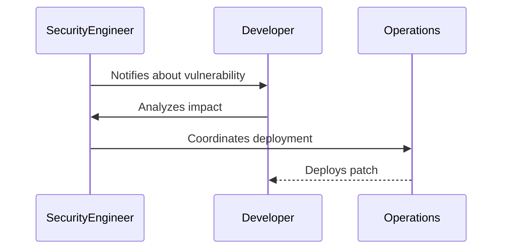
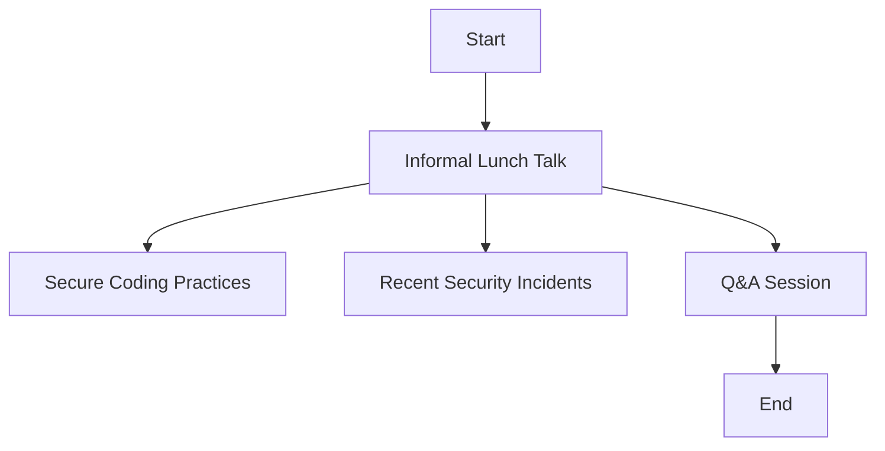
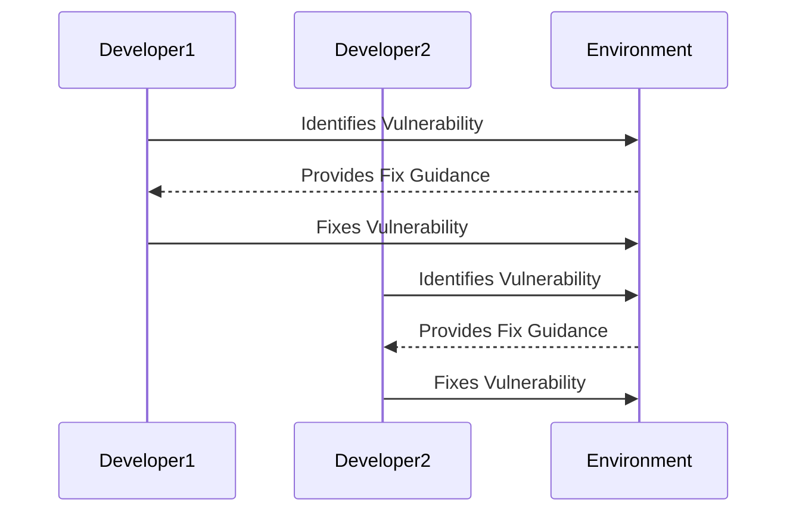
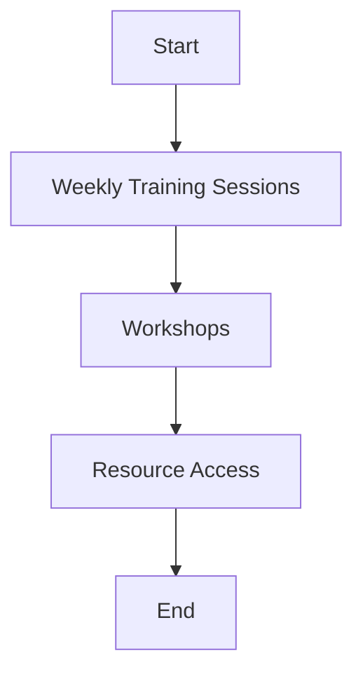

## Driving Cultural Change in Organizations

### Introduction to DevSecOps Cultural Change

Adopting DevSecOps in organizations requires a significant shift in culture, where security is integrated into the development process rather than treated as an afterthought. This cultural change is essential for creating a secure and resilient software ecosystem. In this section, we will explore real-world examples of how companies such as Etsy, Salesforce, and Google have successfully implemented DevSecOps practices to drive cultural change.

### Collaborative Problem-Solving

One of the key aspects of DevSecOps is fostering a collaborative environment where security problems are addressed collectively. When a security issue arises, it is crucial that all relevant stakeholders—developers, security engineers, and operations teams—are involved in resolving the issue promptly.

#### Example: Security Incident Response

Consider a scenario where a critical vulnerability is discovered in a production application. The following steps illustrate how a collaborative approach can be effective:

1. **Immediate Notification**: A security engineer identifies a vulnerability and immediately notifies the development and operations teams.
2. **Collaborative Analysis**: All relevant team members gather to analyze the vulnerability, understand its potential impact, and determine the necessary steps to mitigate it.
3. **Rapid Resolution**: Developers work alongside security engineers to patch the vulnerability, while operations teams ensure the changes are deployed securely and efficiently.

### Engaging Non-Security Professionals

Another critical aspect of DevSecOps is engaging non-security professionals in security activities. This ensures that security is not just the responsibility of a dedicated security team but is integrated into the daily tasks of all team members.

#### Brown Bag Sessions at Etsy

Etsy uses brown bag sessions to promote security awareness among developers. These informal lunch talks provide a relaxed environment for developers to learn about security topics while enjoying their lunch.

**Benefits of Brown Bag Sessions:**
- **Informal Learning**: Developers can learn about security concepts in a low-pressure setting.
- **Knowledge Sharing**: Encourages sharing of security best practices and experiences.
- **Increased Comfort**: Helps developers become more comfortable with security-related discussions.

**Example Brown Bag Session Agenda:**

1. **Introduction to Secure Coding Practices**
2. **Discussion on Recent Security Incidents**
3. **Q&A Session**

### Gamified Learning at Salesforce

Salesforce employs gamified learning to make security more engaging and motivating for developers. One popular method is Capture the Flag (CTF) competitions, where developers compete to find and fix security vulnerabilities.

**Benefits of Gamified Learning:**
- **Fun and Engaging**: Makes security learning enjoyable and less tedious.
- **Competitive Spirit**: Encourages developers to improve their security skills through competition.
- **Practical Experience**: Provides hands-on experience in identifying and fixing security issues.

**Example CTF Scenario:**

1. **Setup**: A simulated environment with known vulnerabilities.
2. **Challenge**: Developers must identify and fix the vulnerabilities within a set time limit.
3. **Scoring**: Points awarded based on the number and complexity of vulnerabilities fixed.

### Continuous Learning at Google

Google emphasizes continuous learning to keep security knowledge up-to-date. This approach involves regular training sessions, workshops, and access to resources that help developers stay informed about the latest security trends and techniques.

**Benefits of Continuous Learning:**
- **Up-to-Date Knowledge**: Ensures developers are aware of the latest security threats and mitigation strategies.
- **Proactive Approach**: Encourages a proactive mindset towards security rather than a reactive one.
- **Skill Development**: Provides opportunities for ongoing skill development and career growth.

**Example Continuous Learning Program:**

1. **Weekly Training Sessions**: Regularly scheduled sessions covering various security topics.
2. **Workshops**: Hands-on workshops focusing on specific security tools and techniques.
3. **Resource Access**: Access to online resources, documentation, and forums for continuous learning.

### Real-World Examples and Case Studies

To further illustrate the effectiveness of these approaches, let's examine some real-world examples and case studies.

#### Case Study: Etsy's Brown Bag Sessions

In 2020, Etsy faced a significant security incident involving a data breach. The company quickly mobilized its teams using brown bag sessions to educate developers on secure coding practices and the importance of security in their daily tasks. This collaborative approach helped Etsy to quickly address the breach and implement robust security measures moving forward.

**Key Takeaways:**
- **Collaboration**: Involving all teams in security discussions helps to quickly address issues.
- **Education**: Informal learning sessions can significantly improve security awareness among developers.

#### Case Study: Salesforce's CTF Competitions

Salesforce regularly conducts CTF competitions to engage developers in security activities. In 2021, a CTF competition led to the discovery of several critical vulnerabilities in their applications. The competitive spirit and practical experience gained from these events helped Salesforce to enhance their overall security posture.

**Key Takeaways:**
- **Engagement**: Gamified learning can significantly increase developer interest in security.
- **Practical Experience**: Hands-on experience in identifying and fixing vulnerabilities improves security skills.

#### Case Study: Google's Continuous Learning Program

Google's continuous learning program has been instrumental in maintaining a high level of security awareness among its developers. In 2022, a series of training sessions and workshops focused on zero-trust architecture helped Google to implement robust security measures across its infrastructure.

**Key Takeaways:**
- **Continuous Improvement**: Regular training and workshops ensure developers stay updated on the latest security trends.
- **Proactive Mindset**: A proactive approach to security helps in preventing incidents before they occur.

### How to Prevent / Defend

Implementing DevSecOps practices effectively requires a combination of cultural change, education, and continuous improvement. Here are some key strategies to prevent and defend against security threats:

#### Cultural Change

- **Promote Collaboration**: Foster a culture where security is a shared responsibility.
- **Encourage Open Communication**: Ensure that security issues are discussed openly and promptly.

#### Education

- **Regular Training**: Conduct regular training sessions and workshops to keep developers informed about the latest security trends.
- **Informal Learning**: Implement informal learning methods such as brown bag sessions to make security education more accessible.

#### Continuous Improvement

- **Gamified Learning**: Use gamified learning methods such as CTF competitions to engage developers in security activities.
- **Access to Resources**: Provide developers with access to resources, documentation, and forums for continuous learning.

### Conclusion

Adopting DevSecOps in organizations requires a significant cultural shift, where security is integrated into the development process. By fostering collaboration, engaging non-security professionals, and promoting continuous learning, organizations can create a secure and resilient software ecosystem. Real-world examples from companies like Etsy, Salesforce, and Google demonstrate the effectiveness of these approaches in driving cultural change and enhancing security.

### Practice Labs

For hands-on practice in implementing DevSecOps practices, consider the following well-known labs:

- **PortSwigger Web Security Academy**: Offers interactive labs to learn about web security and secure coding practices.
- **OWASP Juice Shop**: A deliberately insecure web application for practicing security testing and ethical hacking.
- **DVWA (Damn Vulnerable Web Application)**: A PHP/MySQL web application that is intentionally vulnerable for security testing and training purposes.
- **WebGoat**: An interactive, gamified training application for learning about web application security.

By engaging in these labs, you can gain practical experience in implementing DevSecOps practices and enhancing your organization's security posture.

---
<!-- nav -->
[[DevSecOps/DevSecOps Bootcamp/01-DevSecOps Introduction/01-Adopt DevSecOps in Organizations/Driving Cultural Change Real World Examples of Companies/04-Driving Cultural Change in Organizations Real-World Examples of Companies|Driving Cultural Change in Organizations Real-World Examples of Companies]] | [[DevSecOps/DevSecOps Bootcamp/01-DevSecOps Introduction/01-Adopt DevSecOps in Organizations/Driving Cultural Change Real World Examples of Companies/00-Overview|Overview]] | [[DevSecOps/DevSecOps Bootcamp/01-DevSecOps Introduction/01-Adopt DevSecOps in Organizations/Driving Cultural Change Real World Examples of Companies/06-Practice Questions & Answers|Practice Questions & Answers]]
