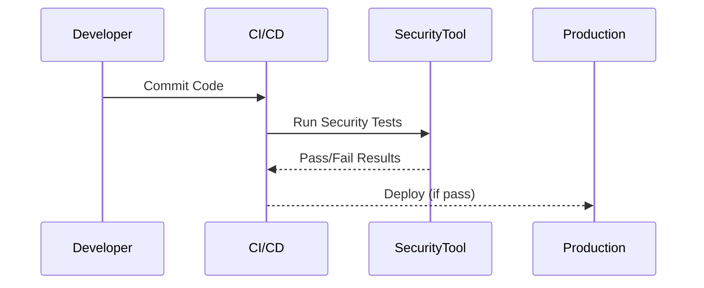
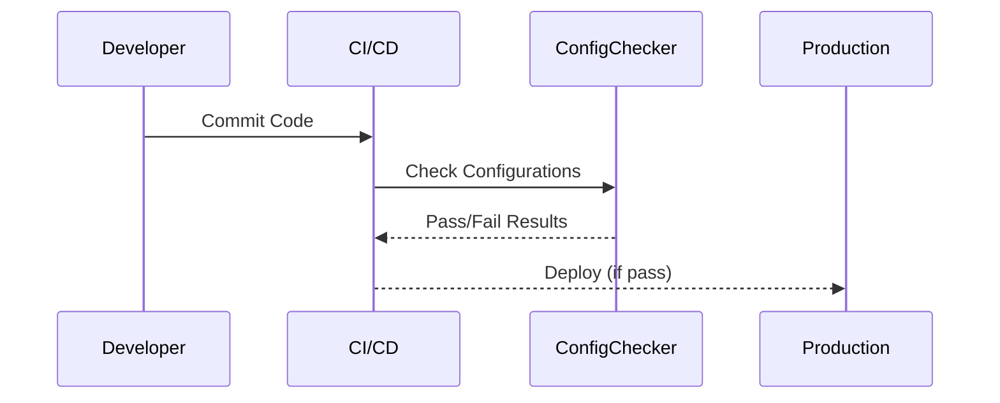
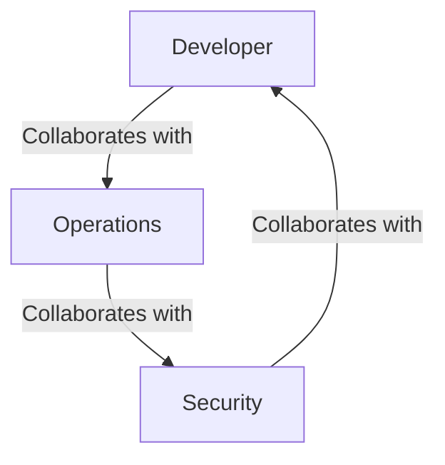
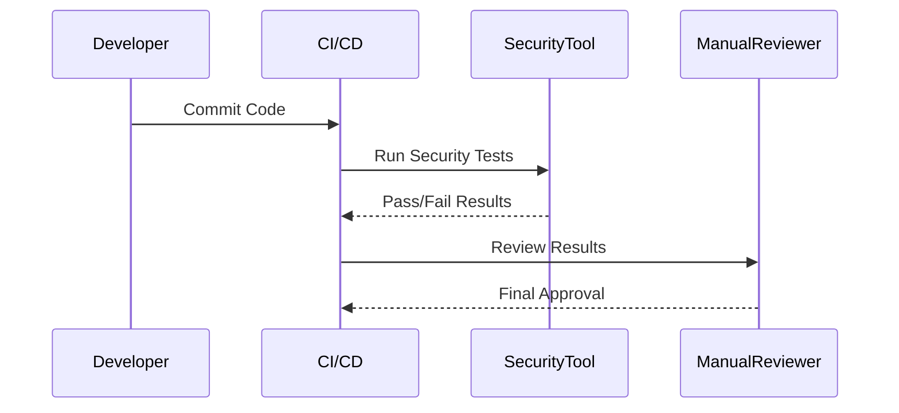
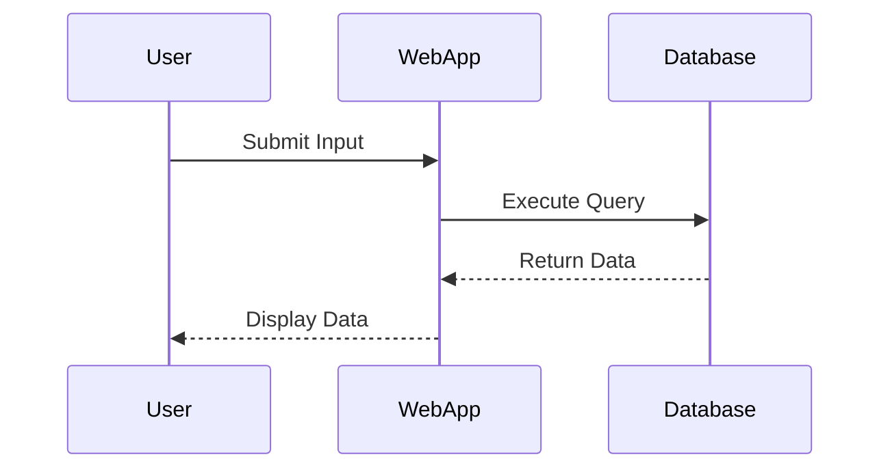
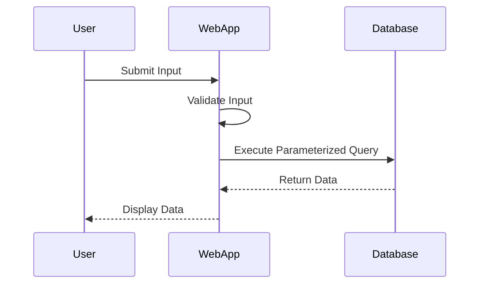

## Introduction to DevSecOps Transformation

### What is DevSecOps?

DevSecOps is an approach to software development that integrates security practices throughout the entire software development lifecycle (SDLC). This methodology aims to ensure that security is not an afterthought but is embedded into every stage of the development process, from planning and coding to testing and deployment. The goal is to create a culture where developers, operations teams, and security professionals work collaboratively to produce secure and reliable software products.

### Why Adopt DevSecOps?

The adoption of DevSecOps is crucial for organizations looking to improve their overall security posture and operational efficiency. By integrating security into the development process, organizations can:

- **Shorten Development Cycles**: Security checks and tests are performed continuously, allowing issues to be identified and resolved early in the development cycle.
- **Reduce Security Incidents**: With security integrated at every stage, vulnerabilities are less likely to make it into production, reducing the number of security incidents.
- **Faster Recovery Times**: In the event of a security breach, having a robust DevSecOps framework allows for quicker identification and resolution of issues.
- **Efficient Value Delivery**: Ultimately, the integration of security ensures that the software delivered to customers is both functional and secure, leading to increased customer satisfaction and trust.

### Key Practices and Principles

To achieve the benefits of DevSecOps, organizations must adopt several key practices and principles:

1. **Continuous Integration and Continuous Deployment (CI/CD)**: Automate the integration and deployment processes to ensure that changes are tested and deployed quickly and reliably.
2. **Automated Security Testing**: Implement automated tools to perform security testing at various stages of the development process.
3. **Security as Code**: Treat security policies and configurations as code, enabling them to be version-controlled and audited alongside application code.
4. **Collaboration and Communication**: Foster a culture of collaboration between developers, operations teams, and security professionals to ensure that everyone is aligned on security goals and responsibilities.

### Real-World Examples

#### Example 1: Equifax Data Breach (CVE-2017-5638)

In 2017, Equifax suffered a massive data breach that exposed sensitive information of over 143 million individuals. The breach was caused by a vulnerability in the Apache Struts web application framework. This incident highlights the importance of continuous security monitoring and patch management. Had Equifax adopted DevSecOps practices, such as regular security audits and automated vulnerability scanning, the breach might have been prevented.



#### Example 2: Capital One Data Breach (CVE-2019-11510)

In 2019, Capital One experienced a data breach that exposed the personal information of over 100 million customers. The breach was due to a misconfiguration in a web application firewall (WAF). This incident underscores the importance of proper configuration management and regular security assessments. A DevSecOps approach would have included automated configuration checks and continuous monitoring to detect such misconfigurations.



### How to Integrate DevSecOps Concepts

To effectively integrate DevSecOps concepts into your organization, follow these steps:

1. **Assess Current State**: Evaluate your current development and security practices to identify areas for improvement.
2. **Define Goals and Metrics**: Establish clear goals and metrics to measure the success of your DevSecOps implementation.
3. **Implement Automation**: Leverage automation tools for continuous integration, continuous deployment, and automated security testing.
4. **Educate Teams**: Provide training and resources to help teams understand and adopt DevSecOps principles.
5. **Monitor and Improve**: Continuously monitor the effectiveness of your DevSecOps practices and make improvements based on feedback and new threats.

### Tools and Technologies

Several tools and technologies are essential for implementing DevSecOps:

- **CI/CD Tools**: Jenkins, GitLab CI, CircleCI
- **Automated Security Testing Tools**: SonarQube, Fortify, Veracode
- **Configuration Management Tools**: Ansible, Puppet, Chef
- **Monitoring and Logging Tools**: Splunk, ELK Stack, Prometheus

### Common Pitfalls and How to Avoid Them

#### Pitfall 1: Lack of Collaboration

**Problem**: Without effective collaboration between developers, operations teams, and security professionals, security issues may be overlooked.

**Solution**: Foster a culture of collaboration through regular meetings, shared documentation, and joint decision-making processes.



#### Pitfall 2: Over-reliance on Automated Tools

**Problem**: Relying solely on automated tools can lead to false positives and negatives, missing critical security issues.

**Solution**: Combine automated tools with manual reviews and regular security assessments to ensure comprehensive coverage.



### How to Prevent / Defend

#### Vulnerable Pattern

Consider a scenario where a web application is vulnerable to SQL injection attacks due to improper input validation.



#### Secure Version

To prevent SQL injection, implement parameterized queries and input validation.



### Full HTTP Request and Response Example

#### Vulnerable HTTP Request

```http
POST /search HTTP/1.1
Host: example.com
Content-Type: application/x-www-form-urlencoded

query=1' OR '1'='1
```

#### Vulnerable HTTP Response

```http
HTTP/1.1 200 OK
Content-Type: text/html

<!DOCTYPE html>
<html>
<head><title>Search Results</title></head>
<body>
<h1>Search Results</h1>
<p>All records returned due to SQL injection.</p>
</body>
</html>
```

#### Secure HTTP Request

```http
POST /search HTTP/1.1
Host: example.com
Content-Type: application/x-www-form-urlencoded

query=1%27+OR+%271%27%3D%271
```

#### Secure HTTP Response

```http
HTTP/1.1 200 OK
Content-Type: text/html

<!DOCTYPE html>
<html>
<head><title>Search Results</title></head>
<body>
<h1>Search Results</h1>
<p>No records found due to proper input validation.</p>
</body>
</html>
```

### Hands-On Labs

For practical experience with DevSecOps, consider the following labs:

- **PortSwigger Web Security Academy**: Offers interactive labs to practice web application security techniques.
- **OWASP Juice Shop**: A deliberately insecure web application for practicing security testing and penetration testing.
- **DVWA (Damn Vulnerable Web Application)**: A PHP/MySQL web application that is riddled with vulnerabilities for educational purposes.
- **WebGoat**: An interactive, gamified training application for learning about web application security.

These labs provide real-world scenarios and challenges to help you apply DevSecOps principles effectively.

### Conclusion

Adopting DevSecOps is a transformative process that requires commitment and collaboration across all teams within an organization. By integrating security into every stage of the development lifecycle, organizations can significantly reduce security risks, improve operational efficiency, and deliver high-quality software products to their customers. Through continuous improvement and the use of modern tools and technologies, organizations can achieve the full potential of DevSecOps and build better teams, processes, and outcomes.

---
<!-- nav -->
[[DevSecOps/DevSecOps Bootcamp/01-DevSecOps Introduction/01-Adopt DevSecOps in Organizations/Final Summary The DevSecOps Transformation/00-Overview|Overview]] | [[02-Introduction to DevSecOps Transformation|Introduction to DevSecOps Transformation]]
