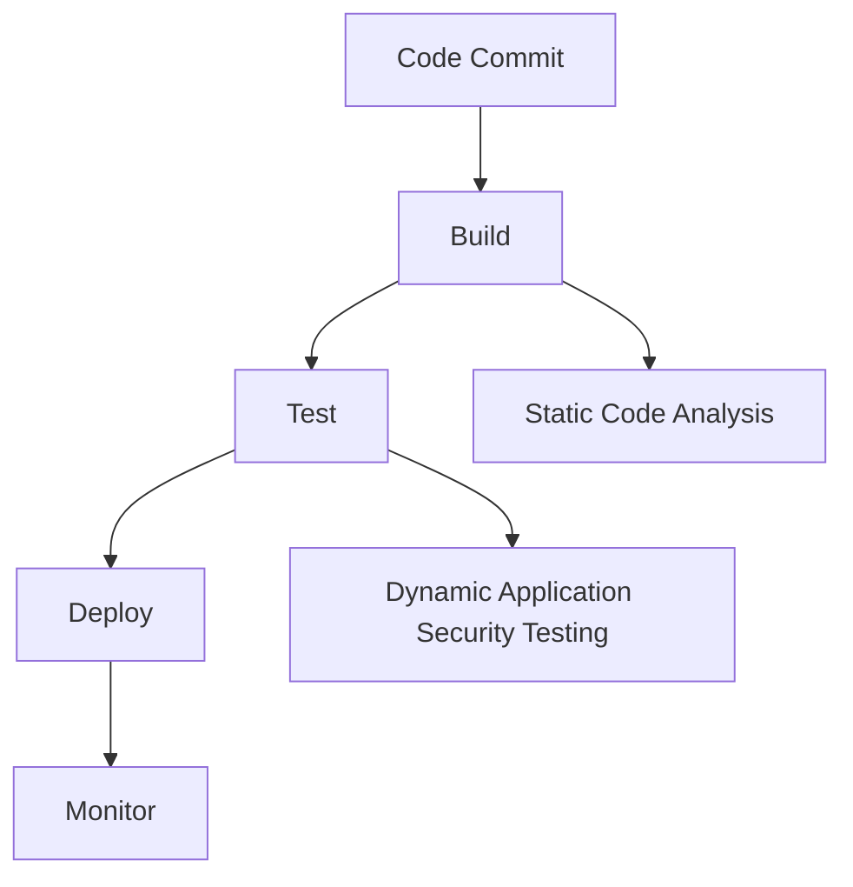

## Introduction to DevSecOps Transformation

DevSecOps is a transformative approach to software development that integrates security practices throughout the entire lifecycle of software development, from design to deployment and maintenance. This approach aims to bridge the gap between traditional development, security, and operations teams by fostering collaboration and shared responsibility. In this chapter, we will delve deep into the principles, practices, and benefits of adopting DevSecOps in organizations, along with practical examples and defensive strategies.

### Core Principles of DevSecOps

At its core, DevSecOps is not merely a set of practices or tools; it is a fundamental shift in how organizations build, secure, and maintain software. The primary goal is to integrate security seamlessly into the development process, ensuring that security is not an afterthought but an integral part of the workflow.

#### Integration of Development, Security, and Operations

Traditionally, development, security, and operations have been treated as separate functions, each with its own goals, responsibilities, and workflows. This separation often leads to inefficiencies and conflicts, as each team may prioritize different aspects of the project:

- **Development**: Focuses on speed and innovation, aiming to roll out new features as quickly as possible.
- **Security**: Prioritizes the protection of assets and data, ensuring compliance with regulations and standards.
- **Operations**: Emphasizes reliability and uptime, ensuring that systems perform consistently and are available to users.

In a DevSecOps environment, these three functions are combined into a unified team, working towards a common goal: delivering reliable, secure software faster. This integration ensures that security is considered at every stage of the development process, leading to more robust and resilient applications.

### Benefits of DevSecOps

The adoption of DevSecOps brings numerous benefits to organizations, including:

- **Improved Security Posture**: By integrating security practices into the development pipeline, organizations can identify and mitigate vulnerabilities earlier in the development cycle.
- **Increased Efficiency**: Collaboration between development, security, and operations teams reduces bottlenecks and streamlines the development process.
- **Faster Time-to-Market**: With security integrated into the development process, organizations can release new features and updates more quickly without compromising on security.
- **Enhanced Compliance**: DevSecOps helps ensure that applications comply with regulatory requirements, reducing the risk of non-compliance penalties.

### Real-World Examples of DevSecOps Success

Several high-profile organizations have successfully implemented DevSecOps, resulting in significant improvements in their security posture and operational efficiency. Here are some recent examples:

- **Netflix**: Netflix has adopted a DevSecOps model, integrating security into their continuous delivery pipeline. They use tools like Spinnaker for CI/CD and Concourse for automated testing and deployment. This approach has enabled Netflix to release new features rapidly while maintaining a strong security stance.
- **Capital One**: Capital One has implemented a DevSecOps framework to enhance their security practices. They use tools like SonarQube for static code analysis and Aqua Security for container security. This has helped them identify and address vulnerabilities early in the development process, reducing the risk of security incidents.

### Implementing DevSecOps in Your Organization

To effectively implement DevSecOps in your organization, you need to consider several key components:

#### Building Secure Pipelines

A secure pipeline is essential for ensuring that security is integrated into every stage of the development process. This includes:

- **Continuous Integration (CI)**: Automate the build and test processes to ensure that code changes are validated before being merged into the main branch.
- **Continuous Delivery (CD)**: Automate the deployment process to ensure that validated code changes can be deployed to production environments quickly and reliably.
- **Static Code Analysis**: Use tools like SonarQube to analyze code for potential security vulnerabilities and coding errors.
- **Dynamic Application Security Testing (DAST)**: Use tools like Burp Suite or OWASP ZAP to test applications for runtime vulnerabilities.



#### Choosing the Right Tools

Selecting the right tools is crucial for implementing DevSecOps effectively. Some popular tools include:

- **Jenkins**: An open-source automation server used for continuous integration and continuous delivery.
- **GitLab**: A web-based Git repository manager that provides CI/CD capabilities.
- **SonarQube**: A static code analysis tool that identifies security vulnerabilities and coding errors.
- **Burp Suite**: A web application security testing tool that performs dynamic analysis.

#### Implementing Compliance

Compliance is a critical aspect of DevSecOps, especially in regulated industries. To ensure compliance, organizations should:

- **Define Security Policies**: Establish clear security policies and guidelines that all teams must follow.
- **Automate Compliance Checks**: Use tools like OpenSCAP to automate compliance checks during the development process.
- **Regular Audits**: Conduct regular audits to ensure that security policies are being followed and that the organization remains compliant with relevant regulations.

### Driving Cultural Change

One of the most challenging aspects of implementing DevSecOps is driving cultural change within the organization. This involves:

- **Collaboration**: Encourage collaboration between development, security, and operations teams to foster a shared sense of responsibility.
- **Training and Education**: Provide training and education to help teams understand the importance of security and how to integrate it into their workflows.
- **Metrics and Feedback**: Use metrics and feedback to measure progress and identify areas for improvement.

### Real-World Example: Recent Breach

Consider the recent breach of SolarWinds, which affected numerous high-profile organizations. The attackers exploited a vulnerability in SolarWinds' Orion software, allowing them to gain unauthorized access to customer networks. This breach highlights the importance of integrating security into the development process to identify and mitigate vulnerabilities early.

#### Vulnerable Code Example

Here is an example of vulnerable code that could lead to a similar breach:

```python
def authenticate_user(username, password):
    # Vulnerable code: SQL injection
    query = f"SELECT * FROM users WHERE username='{username}' AND password='{password}'"
    result = execute_query(query)
    return result
```

#### Secure Code Example

To prevent such vulnerabilities, the code should be rewritten using parameterized queries:

```python
def authenticate_user(username, password):
    # Secure code: Parameterized query
    query = "SELECT * FROM users WHERE username=%s AND password=%s"
    result = execute_query(query, (username, password))
    return result
```

### How to Prevent / Defend

To prevent and defend against security breaches, organizations should:

- **Implement Secure Coding Practices**: Follow secure coding guidelines to prevent common vulnerabilities like SQL injection, cross-site scripting (XSS), and buffer overflows.
- **Use Automated Tools**: Utilize automated tools like static code analyzers and dynamic application security testing tools to identify and mitigate vulnerabilities.
- **Conduct Regular Audits**: Perform regular security audits to ensure that security policies are being followed and that the organization remains compliant with relevant regulations.
- **Train and Educate**: Provide ongoing training and education to help teams understand the importance of security and how to integrate it into their workflows.

### Conclusion

Adopting DevSecOps is a transformative approach that integrates security practices throughout the entire lifecycle of software development. By combining development, security, and operations into a unified team, organizations can deliver reliable, secure software faster. This chapter has provided a comprehensive overview of the principles, practices, and benefits of DevSecOps, along with practical examples and defensive strategies. By following these guidelines, organizations can significantly improve their security posture and operational efficiency.

### Practice Labs

For hands-on experience with DevSecOps, consider the following practice labs:

- **PortSwigger Web Security Academy**: Offers interactive labs to learn web security concepts and techniques.
- **OWASP Juice Shop**: A deliberately insecure web application for practicing web security skills.
- **DVWA (Damn Vulnerable Web Application)**: A PHP/MySQL web application that demonstrates web application vulnerabilities.
- **WebGoat**: An interactive, gamified training application for learning web security.

These labs provide a practical way to apply the concepts learned in this chapter and gain hands-on experience with DevSecOps practices.

---
<!-- nav -->
[[01-Introduction to DevSecOps Transformation Part 1|Introduction to DevSecOps Transformation Part 1]] | [[DevSecOps/DevSecOps Bootcamp/01-DevSecOps Introduction/01-Adopt DevSecOps in Organizations/Final Summary The DevSecOps Transformation/00-Overview|Overview]] | [[03-Building a Feedback Loop for Continuous Improvement|Building a Feedback Loop for Continuous Improvement]]
