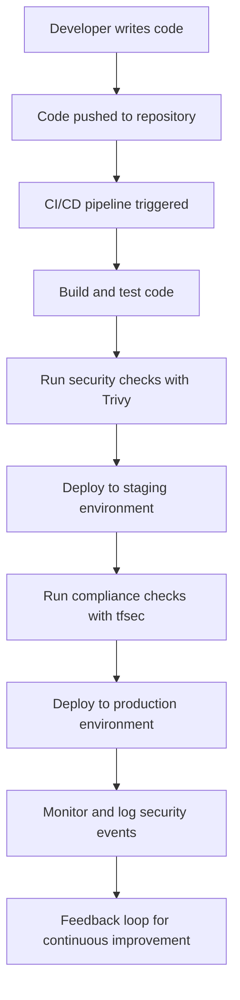

## Empowering Developers in DevSecOps

### Overview of DevSecOps

DevSecOps is a paradigm that integrates security practices into the DevOps lifecycle, ensuring that security is not an afterthought but an integral part of the development process. This approach empowers developers to take control of the security and deployment of their applications, fostering a collaborative environment where security is everyone’s responsibility.

### Cultural Shift in DevSecOps

The core of DevSecOps lies in the cultural shift within an organization. It moves away from a blame culture and siloed work environments towards a collaborative and shared responsibility model, particularly for security. This cultural transformation is crucial because even the best tools in the world will not make much difference without the right mindset and working practices.

#### Importance of Culture Over Tools

While tools, automation, and pipelines are essential components of DevSecOps, they are merely enablers of the underlying culture. The culture of DevSecOps emphasizes:

- **Collaboration**: Teams work together across different disciplines, breaking down silos.
- **Shared Responsibility**: Everyone in the team is responsible for security, not just the security team.
- **Continuous Improvement**: Regular feedback loops and continuous learning are encouraged.

### Automation as a Catalyst for Cultural Change

Automation plays a pivotal role in making these cultural changes easier. By automating routine security tasks, developers can focus on more complex and creative problems. This automation includes:

- **CI/CD Pipelines**: Continuous Integration and Continuous Deployment pipelines ensure that code is tested and deployed automatically.
- **Infrastructure as Code (IaC)**: Using tools like Terraform, Ansible, or CloudFormation to manage infrastructure changes.
- **Automated Compliance Checks**: Tools like Trivy, tfsec, or Checkov to enforce compliance policies.

#### Example: Automating Security Checks with Trivy

Trivy is a tool that scans container images, Git repositories, and local files for vulnerabilities. Here’s how you can integrate Trivy into a CI/CD pipeline using GitHub Actions:

```yaml
name: Security Scan

on:
  push:
    branches: [ main ]
  pull_request:
    branches: [ main ]

jobs:
  build:
    runs-on: ubuntu-latest

    steps:
    - name: Checkout code
      uses: actions/checkout@v2

    - name: Install Trivy
      run: |
        wget https://github.com/aquasecurity/trivy/releases/download/v0.24.1/trivy_0.24.1_Linux-64bit.deb
        sudo dpkg -i trivy_0.24.1_Linux-64bit.deb

    - name: Run Trivy scan
      run: |
        trivy image --severity CRITICAL,HIGH <your-docker-image>
```

This workflow ensures that any critical or high severity vulnerabilities are flagged during the CI/CD process, preventing insecure code from being deployed.

### Compliance in DevSecOps

In traditional models, compliance was often a post-deployment activity, leading to delays and inefficiencies. In DevSecOps, compliance is integrated directly into the development process through automation. This means that compliance checks are performed continuously, ensuring that the application remains compliant throughout its lifecycle.

#### Example: Automated Compliance Checks with tfsec

tfsec is a static analysis tool for finding security issues in your Terraform code. Here’s how you can integrate tfsec into your CI/CD pipeline:

```yaml
name: Terraform Security Scan

on:
  push:
    branches: [ main ]
  pull_request:
    branches: [ main ]

jobs:
  build:
    runs-on: ubuntu-latest

    steps:
    - name: Checkout code
      uses: actions/checkout@v2

    - name: Install tfsec
      run: |
        curl -s https://raw.githubusercontent.com/aquasecurity/tfsec/master/install.sh | sh

    - name: Run tfsec scan
      run: |
        tfsec .
```

This workflow ensures that any security issues in your Terraform code are identified and addressed before deployment.

### Mermaid Diagrams for DevSecOps Workflow

To visualize the DevSecOps workflow, consider the following mermaid diagram:



This diagram illustrates the seamless integration of security and compliance checks into the CI/CD pipeline, ensuring that security is a continuous process rather than a one-time check.

### Common Pitfalls and How to Avoid Them

One of the common pitfalls in adopting DevSecOps is the lack of proper training and awareness among developers. Without a clear understanding of security principles and practices, developers may inadvertently introduce vulnerabilities into their code.

#### Training and Awareness

Organizations should invest in regular training sessions and workshops to educate developers about security best practices. This includes:

- **Secure Coding Practices**: Teaching developers how to write secure code.
- **Security Tools**: Familiarizing them with the security tools they will be using.
- **Incident Response**: Preparing them for handling security incidents.

### Real-World Examples and Case Studies

#### Example: Capital One Data Breach (CVE-2019-11510)

In 2019, Capital One suffered a data breach that exposed sensitive information of over 100 million customers. The breach was caused by a misconfigured web application firewall (WAF) that allowed unauthorized access to the data.

**What Went Wrong:**
- Lack of proper security controls and monitoring.
- Insufficient testing and validation of security configurations.

**How to Prevent:**
- Implement robust security controls and continuous monitoring.
- Regularly test and validate security configurations.

**Secure Configuration Example:**

```json
{
  "webApplicationFirewall": {
    "enabled": true,
    "rules": [
      {
        "ruleId": "rule1",
        "action": "block",
        "match": {
          "method": "GET",
          "path": "/api/data"
        }
      }
    ]
  }
}
```

**Vulnerable Configuration Example:**

```json
{
  "webApplicationFirewall": {
    "enabled": false,
    "rules": []
  }
}
```

### Hands-On Labs for DevSecOps

To gain practical experience with DevSecOps, consider the following hands-on labs:

- **PortSwigger Web Security Academy**: Offers interactive labs to learn web security concepts.
- **OWASP Juice Shop**: A deliberately insecure web application for practicing web security skills.
- **CloudGoat**: Provides scenarios to practice securing AWS environments.
- **Kubernetes Goat**: Offers challenges to secure Kubernetes clusters.

These labs provide a safe environment to experiment with DevSecOps principles and tools, helping to reinforce theoretical knowledge with practical experience.

### Conclusion

Adopting DevSecOps in organizations is not just about implementing new tools and technologies; it is fundamentally about changing the culture and mindset of the organization. By fostering a collaborative and shared responsibility model, integrating security into the development process, and leveraging automation, organizations can achieve both speed and security. The blend of people, culture, and technology is what makes DevSecOps so powerful, enabling teams to innovate quickly while maintaining control and security.

---
<!-- nav -->
[[04-DevSecOps Transformation|DevSecOps Transformation]] | [[DevSecOps/DevSecOps Bootcamp/01-DevSecOps Introduction/01-Adopt DevSecOps in Organizations/Final Summary The DevSecOps Transformation/00-Overview|Overview]] | [[06-How DevSecOps Works|How DevSecOps Works]]
