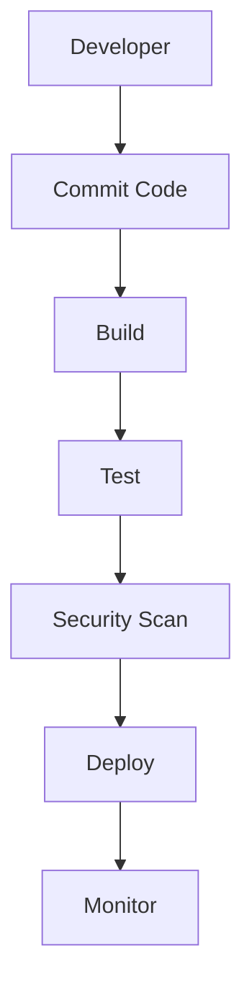

## How DevSecOps Works

To understand how DevSecOps works, let's break down the key components and processes involved.

### Continuous Integration and Continuous Deployment (CI/CD)

CI/CD pipelines are central to DevSecOps. These pipelines automate the build, test, and deployment processes, ensuring that changes are integrated and deployed quickly and reliably. By incorporating security checks into these pipelines, vulnerabilities can be detected and addressed early.



### Security Scanning Tools

Various tools can be integrated into the CI/CD pipeline to perform security scans. These tools analyze the codebase and infrastructure configurations to identify potential vulnerabilities. Some popular security scanning tools include:

- **Static Application Security Testing (SAST)**: Analyzes the source code to find security vulnerabilities.
- **Dynamic Application Security Testing (DAST)**: Tests the application in a runtime environment to identify vulnerabilities.
- **Dependency Check**: Scans for known vulnerabilities in third-party libraries and dependencies.

### Example: Using Trivy for Dependency Scanning

Trivy is a popular open-source tool for dependency scanning. It can be integrated into a CI/CD pipeline to scan for known vulnerabilities in dependencies.

```yaml
# .github/workflows/ci.yml
name: CI

on:
  push:
    branches: [ main ]
  pull_request:
    branches: [ main ]

jobs:
  build:
    runs-on: ubuntu-latest

    steps:
      - name: Checkout code
        uses: actions/checkout@v2

      - name: Install dependencies
        run: |
          pip install -r requirements.txt

      - name: Run Trivy
        run: |
          trivy image --severity CRITICAL,HIGH --exit-code 1 <your-docker-image>
```

### Secure Coding Practices

Secure coding practices are essential in a DevSecOps environment. Developers should follow best practices to minimize the risk of introducing vulnerabilities. This includes:

- **Input Validation**: Ensuring that user inputs are validated to prevent injection attacks.
- **Error Handling**: Properly handling errors to avoid exposing sensitive information.
- **Authentication and Authorization**: Implementing strong authentication mechanisms and proper authorization checks.

### Example: SQL Injection Prevention

Consider a simple login form where a user enters a username and password. To prevent SQL injection, input validation and parameterized queries should be used.

#### Vulnerable Code

```sql
SELECT * FROM users WHERE username = '$username' AND password = '$password';
```

#### Secure Code

```sql
SELECT * FROM users WHERE username = ? AND password = ?;
```

In the secure version, placeholders (`?`) are used to prevent direct insertion of user inputs into the query.

### Infrastructure as Code (IaC)

Infrastructure as Code (IaC) is a practice where infrastructure is defined using code. This allows for version control, automated testing, and consistent deployment. Popular IaC tools include:

- **Terraform**: A tool for building, changing, and versioning infrastructure safely and efficiently.
- **Ansible**: An automation tool that can manage infrastructure and applications.

### Example: Terraform Configuration

Here’s an example of a Terraform configuration for creating an AWS S3 bucket with proper security settings.

#### Vulnerable Configuration

```hcl
resource "aws_s3_bucket" "example" {
  bucket = "my-bucket"
}
```

#### Secure Configuration

```hcl
resource "aws_s3_bucket" "example" {
  bucket = "my-bucket"

  acl = "private"

  server_side_encryption_configuration {
    rule {
      apply_server_side_encryption_by_default {
        sse_algorithm = "AES256"
      }
    }
  }

  versioning {
    enabled = true
  }
}
```

In the secure configuration, the bucket is set to private, encryption is enabled, and versioning is turned on to ensure data integrity.

### Monitoring and Logging

Monitoring and logging are crucial for detecting and responding to security incidents. Tools like Prometheus, Grafana, and ELK stack can be used to monitor the health and security of the system.

### Example: Prometheus Alert Rule

Here’s an example of a Prometheus alert rule to detect unauthorized access attempts.

```yaml
groups:
- name: security
  rules:
  - alert: UnauthorizedAccessAttempt
    expr: sum(increase(http_requests_total{status="401"}[5m])) > 10
    for: 5m
    labels:
      severity: critical
    annotations:
      summary: "Unauthorized access attempt detected"
      description: "There have been more than 10 unauthorized access attempts in the last 5 minutes."
```

### How to Prevent / Defend

To effectively implement DevSecOps and prevent security issues, organizations should adopt the following strategies:

#### Detection

- **Continuous Monitoring**: Use tools like Prometheus and ELK stack to continuously monitor the system for security events.
- **Automated Scanning**: Integrate security scanning tools into the CI/CD pipeline to detect vulnerabilities early.

#### Prevention

- **Secure Coding Practices**: Train developers on secure coding practices and enforce them through code reviews and static analysis tools.
- **Infrastructure as Code**: Use IaC tools to define and manage infrastructure consistently and securely.

#### Secure-Coding Fixes

Compare the vulnerable and secure versions of code to understand the differences and the importance of secure coding practices.

#### Configuration Hardening

Ensure that configurations are hardened to prevent common vulnerabilities. Use tools like Trivy and Terraform to validate and enforce secure configurations.

### Hands-On Labs

To gain practical experience with DevSecOps, consider the following labs:

- **PortSwigger Web Security Academy**: Offers interactive labs to learn about web application security.
- **OWASP Juice Shop**: A deliberately insecure web application for practicing security testing.
- **DVWA (Damn Vulnerable Web Application)**: Another intentionally vulnerable web application for learning security concepts.
- **CloudGoat**: A lab for practicing cloud security in AWS.
- **Pacu**: A tool for automating security assessments in AWS environments.

By integrating security into every aspect of the development process, DevSecOps helps organizations build more secure and reliable software. This transformation requires a cultural shift and the adoption of new tools and practices, but the benefits are significant in terms of reduced risk and improved efficiency.

---
<!-- nav -->
[[05-Empowering Developers in DevSecOps|Empowering Developers in DevSecOps]] | [[DevSecOps/DevSecOps Bootcamp/01-DevSecOps Introduction/01-Adopt DevSecOps in Organizations/Final Summary The DevSecOps Transformation/00-Overview|Overview]] | [[07-Traditional Software Development Silos|Traditional Software Development Silos]]
