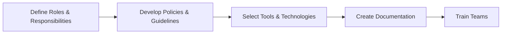
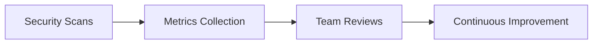

## Introduction to DevSecOps Implementation in Organizations

### What is DevSecOps?

DevSecOps is a philosophy and set of practices that integrates security into the DevOps lifecycle. Traditionally, security was often treated as a separate phase, typically occurring late in the development cycle. However, DevSecOps aims to embed security throughout the entire software development and delivery process, ensuring that security is a shared responsibility among all stakeholders, including developers, operations, and security teams.

### Why Implement DevSecOps?

Implementing DevSecOps is crucial for several reasons:

1. **Early Detection of Vulnerabilities**: By integrating security checks early in the development process, organizations can identify and mitigate vulnerabilities before they become critical issues.
   
2. **Continuous Improvement**: DevSecOps promotes continuous monitoring and improvement of security practices, leading to a more robust and resilient system.
   
3. **Enhanced Collaboration**: It fosters better collaboration between different teams, breaking down silos and promoting a culture of shared responsibility.
   
4. **Compliance and Risk Management**: DevSecOps helps organizations meet regulatory requirements and manage risks more effectively.

### How to Start Implementing DevSecOps

#### Step-by-Step Guide

1. **Establish a Framework**
   - **What**: A framework provides a structured approach to implementing DevSecOps. It includes policies, guidelines, and tools that ensure security is integrated into every stage of the development lifecycle.
   - **Why**: Without a framework, security practices may be inconsistent and ad hoc, leading to gaps and vulnerabilities.
   - **How**: Develop a comprehensive framework that outlines roles, responsibilities, and processes. This should include security policies, coding standards, and tooling recommendations.

2. **Onboarding New Engineers**
   - **What**: Ensure that new engineers, regardless of their role, are quickly brought up to speed on security best practices.
   - **Why**: Junior engineers often lack security knowledge, making them potential weak points in the system. Training them ensures a consistent level of security awareness across the organization.
   - **How**: Create a structured onboarding program that includes security training sessions, documentation, and mentorship from experienced security engineers.

3. **Guidance and Measurement**
   - **What**: As a DevSecOps engineer, your role is to orchestrate processes and provide guidance. This includes creating guideposts and measuring the effectiveness of security measures.
   - **Why**: Continuous measurement allows you to track progress and demonstrate the value of security efforts to stakeholders.
   - **How**: Implement security scans and metrics to monitor improvements over time. Regularly review these metrics with the team to highlight successes and areas for improvement.

### Real-World Examples and Case Studies

#### Recent Breaches and CVEs

1. **SolarWinds Supply Chain Attack (CVE-2020-1014)**
   - **What**: In December 2020, SolarWinds disclosed a supply chain attack where attackers compromised the SolarWinds Orion software update mechanism.
   - **Why**: This breach highlights the importance of securing the entire software supply chain, including third-party dependencies.
   - **How**: Implementing DevSecOps practices such as regular security audits, dependency scanning, and secure coding practices could have helped prevent this attack.

2. **Capital One Data Breach (CVE-2019-11253)**
   - **What**: In July 2019, Capital One suffered a data breach that exposed sensitive customer information.
   - **Why**: The breach occurred due to misconfigured web application firewall rules, highlighting the need for robust security configurations and regular audits.
   - **How**: DevSecOps practices such as automated security testing, configuration management, and regular security reviews could have prevented this breach.

### Detailed Implementation Steps

#### Establishing a Framework



1. **Define Roles & Responsibilities**
   - **What**: Clearly define the roles and responsibilities of each team member involved in the DevSecOps process.
   - **Why**: Clear roles ensure that everyone knows their part in maintaining security.
   - **How**: Document roles and responsibilities in a centralized location accessible to all team members.

2. **Develop Policies & Guidelines**
   - **What**: Create comprehensive security policies and guidelines that cover all aspects of the development lifecycle.
   - **Why**: Policies provide a clear roadmap for security practices and help maintain consistency.
   - **How**: Involve all relevant stakeholders in the policy development process to ensure buy-in and adherence.

3. **Select Tools & Technologies**
   - **What**: Choose appropriate tools and technologies that support DevSecOps practices.
   - **Why**: The right tools can automate many security tasks, reducing the risk of human error.
   - **How**: Evaluate and select tools based on their ability to integrate with existing systems and their effectiveness in addressing specific security needs.

4. **Create Documentation**
   - **What**: Develop detailed documentation that outlines the DevSecOps framework and provides guidance for implementation.
   - **Why**: Documentation serves as a reference for team members and ensures that everyone is on the same page.
   - **How**: Use a combination of written documents, video tutorials, and interactive guides to cater to different learning styles.

5. **Train Teams**
   - **What**: Provide comprehensive training to all team members on the DevSecOps framework and security best practices.
   - **Why**: Training ensures that everyone understands their role and can effectively contribute to the security process.
   - **How**: Offer both initial and ongoing training sessions, including hands-on exercises and real-world scenarios.

#### Onboarding New Engineers


1. **Initial Training**
   - **What**: Conduct initial training sessions for new engineers to introduce them to the DevSecOps framework and security best practices.
   - **Why**: Initial training sets the foundation for security awareness and ensures that new hires are aligned with organizational goals.
   - **How**: Use a mix of classroom-style training, online modules, and hands-on exercises to engage new engineers.

2. **Documentation Access**
   - **What**: Provide new engineers with access to comprehensive documentation that covers all aspects of the DevSecOps framework.
   - **Why**: Documentation serves as a reference and helps new engineers understand the context and rationale behind security practices.
   - **How**: Make documentation easily accessible through a centralized repository or intranet site.

3. **Mentorship Program**
   - **What**: Pair new engineers with experienced mentors who can provide guidance and answer questions.
   - **Why**: Mentorship helps new engineers acclimate to the organization and build confidence in their security skills.
   - **How**: Assign mentors based on expertise and availability, and schedule regular check-ins to ensure progress.

4. **Regular Reviews**
   - **What**: Conduct regular reviews to assess the progress of new engineers and provide feedback.
   - **Why**: Regular reviews help identify areas for improvement and ensure that new engineers are meeting expectations.
   - **How**: Schedule periodic one-on-one meetings and group sessions to discuss progress and address any challenges.

#### Guidance and Measurement



1. **Security Scans**
   - **What**: Implement regular security scans to identify vulnerabilities and weaknesses in the codebase.
   - **Why**: Security scans help proactively identify and mitigate risks before they become critical issues.
   - **How**: Use automated tools such as static application security testing (SAST) and dynamic application security testing (DAST) to perform regular scans.

2. **Metrics Collection**
   - **What**: Collect and analyze metrics to measure the effectiveness of security practices.
   - **Why**: Metrics provide tangible evidence of the impact of security efforts and help identify areas for improvement.
   - **How**: Track metrics such. as the number of vulnerabilities found, the time taken to resolve issues, and the overall security posture of the system.

3. **Team Reviews**
   - **What**: Conduct regular reviews with the team to discuss metrics and identify opportunities for improvement.
   - **Why**: Team reviews foster collaboration and ensure that everyone is aligned on security goals.
   - **How**: Schedule regular meetings to discuss metrics, share insights, and brainstorm solutions to identified issues.

4. **Continuous Improvement**
   - **What**: Continuously improve the DevSecOps framework based on feedback and evolving security threats.
   - **Why**: Continuous improvement ensures that the framework remains effective and relevant in the face of changing security landscapes.
   - **How**: Regularly update policies, guidelines, and tools based on feedback and emerging security trends.

### Common Pitfalls and How to Avoid Them

1. **Lack of Buy-In from Stakeholders**
   - **What**: Failure to gain support from key stakeholders can hinder the successful implementation of DevSecOps.
   - **Why**: Without buy-in, resources and commitment may be lacking, leading to incomplete or ineffective implementation.
   - **How**: Engage stakeholders early in the process and communicate the benefits of DevSecOps. Provide regular updates and involve them in decision-making.

2. **Inconsistent Security Practices**
   - **What**: Inconsistent security practices across different teams can lead to vulnerabilities and inefficiencies.
   - **Why**: Inconsistency undermines the effectiveness of the DevSecOps framework and creates gaps in security.
   - **How**: Establish clear guidelines and enforce consistent practices across all teams. Use automation and standardization to ensure uniformity.

3. **Over-reliance on Automation**
   - **What**: Over-reliance on automation can lead to complacency and missed vulnerabilities.
   - **Why**: While automation is valuable, it cannot replace human judgment and expertise.
   - **How**: Balance automation with manual reviews and expert oversight. Ensure that automation is used to augment, not replace, human involvement.

### How to Prevent / Defend

#### Detection

1. **Automated Security Scans**
   - **What**: Use automated tools to perform regular security scans of the codebase.
   - **Why**: Automated scans help identify vulnerabilities and weaknesses that may be missed during manual reviews.
   - **How**: Integrate tools such as SAST and DAST into the continuous integration/continuous deployment (CI/CD) pipeline to perform scans automatically.

2. **Real-Time Monitoring**
   - **What**: Implement real-time monitoring to detect and respond to security incidents.
   - **Why**: Real-time monitoring enables quick identification and mitigation of security threats.
   - **How**: Use tools such as intrusion detection systems (IDS) and security information and event management (SIEM) systems to monitor network traffic and system logs.

#### Prevention

1. **Secure Coding Practices**
   - **What**: Follow secure coding practices to minimize the risk of introducing vulnerabilities.
   - **Why**: Secure coding practices help prevent common security issues such as SQL injection, cross-site scripting (XSS), and buffer overflows.
   - **How**: Train developers on secure coding principles and use static analysis tools to identify and fix security issues.

2. **Configuration Management**
   - **What**: Implement configuration management to ensure that systems are configured securely.
   - **Why**: Configuration management helps prevent misconfigurations that can lead to security vulnerabilities.
   - **How**: Use tools such as Ansible, Puppet, or Chef to manage system configurations and enforce security policies.

#### Secure-Coding Fixes

**Vulnerable Code Example**

```python
import sqlite3

def login(username, password):
    conn = sqlite3.connect('database.db')
    cursor = conn.cursor()
    cursor.execute(f"SELECT * FROM users WHERE username='{username}' AND password='{password}'")
    result = cursor.fetchone()
    conn.close()
    return result is not None
```

**Fixed Code Example**

```python
import sqlite3

def login(username, password):
    conn = sqlite3.connect('database.db')
    cursor = conn.cursor()
    cursor.execute("SELECT * FROM users WHERE username=? AND password=?", (username, password))
    result = cursor.fetchone()
    conn.close()
    return result is not None
```

**Explanation**: The original code is vulnerable to SQL injection because it directly interpolates user input into the SQL query. The fixed code uses parameterized queries, which prevent SQL injection attacks by treating user input as data rather than executable code.

#### Configuration Hardening

**Example Configuration File (nginx.conf)**

**Vulnerable Configuration**

```nginx
server {
    listen 80;
    server_name example.com;

    location / {
        root /var/www/html;
        index index.html index.htm;
    }
}
```

**Hardened Configuration**

```nginx
server {
    listen 80 default_server;
    server_name example.com;

    location / {
        root /var/www/html;
        index index.html index.htm;
        autoindex off;
        deny all;
    }

    location ~* \.(php|jsp|cgi)$ {
        deny all;
    }
}
```

**Explanation**: The hardened configuration disables directory listing (`autoindex off`) and denies access to certain file types (`deny all` for `.php`, `.jsp`, and `.cgi` files). These changes help prevent unauthorized access and reduce the risk of exploitation.

### Hands-On Labs

For practical experience in implementing DevSecOps, consider the following labs:

1. **PortSwigger Web Security Academy**
   - **URL**: https://portswigger.net/web-security
   - **Description**: Offers a wide range of labs covering various web security topics, including SQL injection, XSS, and CSRF.

2. **OWASP Juice Shop**
   - **URL**: https://owasp.org/www-project-juice-shop/
   - **Description**: A deliberately insecure web application designed for security training and research.

3. **DVWA (Damn Vulnerable Web Application)**
   - **URL**: https://github.com/ethicalhack3r/DVWA
   - **Description**: A PHP/MySQL web application that is riddled with vulnerabilities for educational purposes.

These labs provide a safe environment to practice and reinforce the concepts learned in this chapter.

### Conclusion

Implementing DevSecOps in organizations requires a structured approach that integrates security into every aspect of the development lifecycle. By establishing a robust framework, onboarding new engineers effectively, providing guidance and measurement, and continuously improving the process, organizations can significantly enhance their security posture. Through real-world examples, detailed implementation steps, and hands-on labs, this chapter aims to provide a comprehensive guide to adopting DevSecOps in organizations.

---
<!-- nav -->
[[DevSecOps/DevSecOps Bootcamp/01-DevSecOps Introduction/01-Adopt DevSecOps in Organizations/How to start implementing DevSecOps in Organizations Practical Tips/00-Overview|Overview]] | [[02-Introduction to DevSecOps Implementation in Organizations|Introduction to DevSecOps Implementation in Organizations]]
