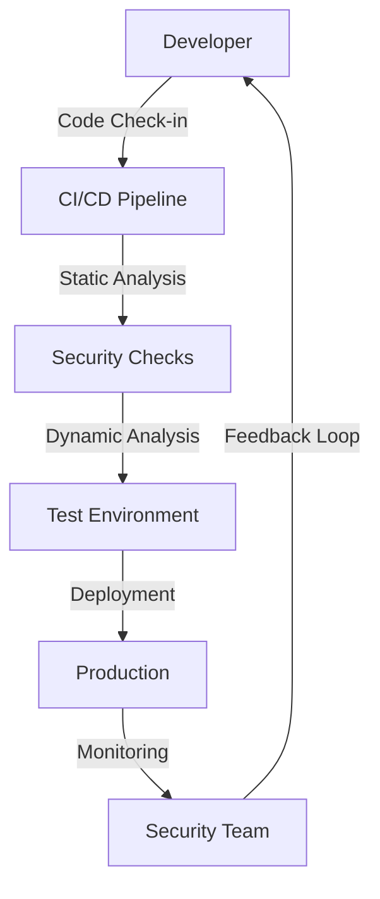

## Introduction to DevSecOps Implementation

Adopting DevSecOps in an organization is a transformative process that aims to integrate security practices throughout the software development lifecycle (SDLC). This approach ensures that security is not an afterthought but is embedded in every phase of development, testing, and deployment. However, implementing DevSecOps can be challenging due to resistance to change, existing workloads, and the complexity of integrating security into an already established workflow.

### Understanding Resistance to Change

Change is inherently difficult because it disrupts the status quo and pushes individuals out of their comfort zones. In the context of DevSecOps, resistance can stem from several factors:

- **Fear of the Unknown**: Team members might be apprehensive about new processes and tools.
- **Existing Workloads**: Teams may already be overwhelmed with their current responsibilities.
- **Lack of Understanding**: Without proper training and education, team members might not see the value in DevSecOps.

#### Overcoming Resistance

To overcome resistance, it is crucial to communicate the benefits of DevSecOps clearly and provide adequate training and support. Here are some strategies:

- **Education and Training**: Conduct workshops and training sessions to familiarize team members with DevSecOps principles and tools.
- **Leadership Buy-In**: Ensure that leadership is fully committed to the transition and communicates this commitment to the entire organization.
- **Pilot Projects**: Start with small pilot projects to demonstrate the benefits and build confidence.

### Siloed Engineering Teams

In many organizations, engineering teams are often siloed into distinct groups such as developers, operations, and security. Each team has its own set of responsibilities and goals, which can make the integration of DevSecOps challenging.

#### Developer Team Responsibilities

Developers are typically focused on delivering new features and functionalities. Their primary tasks include:

- Writing and checking in code.
- Meeting project deadlines.
- Ensuring the quality of the code they produce.

#### Operations Team Responsibilities

The operations team is responsible for ensuring the reliability and stability of the application. Their tasks include:

- Learning and implementing new technologies like Kubernetes.
- Migrating applications to new environments.
- Monitoring and maintaining the application to prevent outages.

#### Security Team Responsibilities

The security team is tasked with ensuring the security of the application and the organization. Their responsibilities include:

- Analyzing compliance requirements.
- Learning and using security tools and systems.
- Identifying and mitigating security vulnerabilities.

### Integrating DevSecOps Principles

To effectively integrate DevSecOps principles, it is essential to break down the silos and foster collaboration among the different teams. Here’s how to achieve this:

#### Step-by-Step Integration Process

1. **Define Clear Objectives**: Establish clear goals for the DevSecOps initiative, such as reducing the time to detect and fix security issues.
2. **Cross-Functional Teams**: Form cross-functional teams that include representatives from development, operations, and security.
3. **Automated Testing and Deployment**: Implement automated testing and deployment pipelines to ensure that security checks are integrated into the development process.
4. **Continuous Monitoring**: Set up continuous monitoring to detect and respond to security incidents in real-time.
5. **Regular Training and Feedback**: Provide regular training and feedback to ensure that team members are up-to-date with the latest security practices and tools.

### Real-World Examples and Case Studies

#### Recent Breaches and CVEs

One recent example of a breach that could have been mitigated with better DevSecOps practices is the SolarWinds supply chain attack (CVE-2020-1014). This attack involved a malicious update to the SolarWinds Orion software, which was then distributed to thousands of customers. The attackers were able to gain access to sensitive networks and steal data.

**How DevSecOps Could Have Helped:**

- **Supply Chain Security**: Implementing strict controls and monitoring for third-party software updates.
- **Automated Security Scanning**: Using automated tools to scan for vulnerabilities in code and dependencies.
- **Continuous Monitoring**: Setting up real-time monitoring to detect unusual activity and respond quickly.

#### Code Example: Automated Security Scanning

```python
# Example of a Python script using Bandit for static code analysis
import bandit

def run_bandit_analysis(file_path):
    """
    Run Bandit static code analysis on the given file.
    """
    bandit.baseline = True
    results = bandit.main(['--recursive', '--output', 'json', file_path])
    return results

file_path = 'path/to/source_code.py'
results = run_bandit_analysis(file_path)
print(results)
```

### Mermaid Diagrams

#### Cross-Functional Team Collaboration



### Common Pitfalls and How to Avoid Them

#### Lack of Automation

One common pitfall is the lack of automation in the DevSecOps pipeline. Without automation, manual processes can introduce delays and human errors.

**How to Avoid:**

- **Implement CI/CD Pipelines**: Use tools like Jenkins, GitLab CI, or CircleCI to automate the build, test, and deployment processes.
- **Integrate Security Tools**: Use tools like SonarQube, Bandit, or OWASP ZAP to automatically scan for security vulnerabilities.

#### Insufficient Training

Another pitfall is insufficient training for team members. Without proper training, team members may not understand the importance of DevSecOps principles and may not know how to implement them effectively.

**How to Avoid:**

- **Provide Regular Training**: Offer regular training sessions and workshops to keep team members up-to-date with the latest security practices and tools.
- **Encourage Continuous Learning**: Encourage team members to attend conferences, read industry publications, and participate in online forums to stay informed about the latest developments in DevSec-ops.

### How to Prevent / Defend

#### Detection and Prevention

To effectively detect and prevent security issues, it is essential to implement a combination of automated tools and manual processes.

**Detection:**

- **Real-Time Monitoring**: Use tools like Splunk, ELK Stack, or Graylog to monitor logs and detect unusual activity.
- **Anomaly Detection**: Implement machine learning-based anomaly detection to identify patterns that deviate from normal behavior.

**Prevention:**

- **Secure Coding Practices**: Follow secure coding guidelines and best practices to reduce the likelihood of introducing vulnerabilities.
- **Configuration Hardening**: Harden configurations of servers, databases, and other infrastructure components to minimize attack surfaces.

#### Secure-Coding Fixes

Here is an example of a vulnerable code snippet and its secure counterpart:

**Vulnerable Code:**

```python
# Vulnerable code: SQL Injection
query = f"SELECT * FROM users WHERE username='{username}' AND password='{password}'"
cursor.execute(query)
```

**Secure Code:**

```python
# Secure code: Parameterized Query
query = "SELECT * FROM users WHERE username=%s AND password=%s"
cursor.execute(query, (username, password))
```

### Hands-On Labs

For hands-on practice, consider the following labs:

- **PortSwigger Web Security Academy**: Offers interactive labs to learn about web security vulnerabilities and how to mitigate them.
- **OWASP Juice Shop**: A deliberately insecure web application for practicing web security skills.
- **DVWA (Damn Vulnerable Web Application)**: Another intentionally vulnerable web application for learning web security.

### Conclusion

Implementing DevSecOps in an organization requires a comprehensive approach that addresses the challenges of resistance to change, existing workloads, and the need for collaboration among different teams. By breaking down silos, automating processes, providing regular training, and implementing robust detection and prevention mechanisms, organizations can successfully adopt DevSecOps principles and improve their overall security posture.

---
<!-- nav -->
[[02-Introduction to DevSecOps Implementation in Organizations|Introduction to DevSecOps Implementation in Organizations]] | [[DevSecOps/DevSecOps Bootcamp/01-DevSecOps Introduction/01-Adopt DevSecOps in Organizations/How to start implementing DevSecOps in Organizations Practical Tips/00-Overview|Overview]] | [[04-Introduction to DevSecOps Part 1|Introduction to DevSecOps Part 1]]
