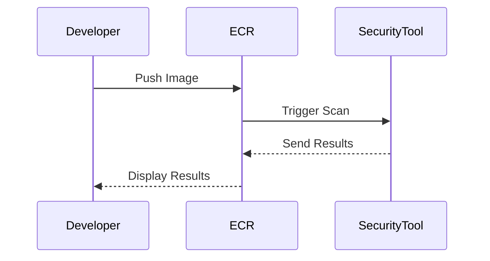
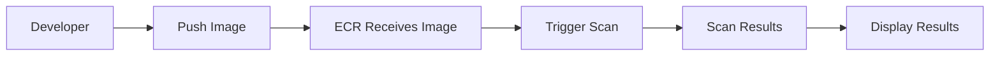
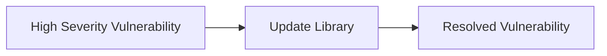
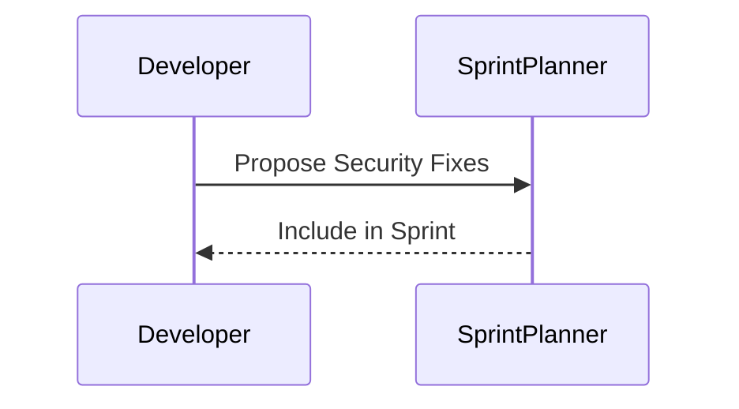
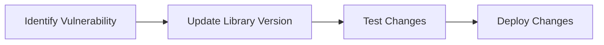

## Introduction to DevSecOps

### What is DevSecOps?

DevSecOps is an approach to software development that integrates security practices throughout the entire software development lifecycle (SDLC). Instead of treating security as a separate phase or a set of checks performed at the end of the development process, DevSecOps aims to make security a core component of the development culture and workflow. This means that security considerations are embedded into every stage of the development process, from planning and design to coding, testing, and deployment.

### Why DevSecOps Matters

In today’s fast-paced software development environment, traditional security approaches often struggle to keep up with the rapid release cycles and continuous integration/continuous delivery (CI/CD) pipelines. DevSecOps addresses this challenge by ensuring that security is not an afterthought but an integral part of the development process. This helps organizations to:

- **Reduce Security Risks:** By identifying and addressing security vulnerabilities early in the development cycle, organizations can significantly reduce the likelihood of security breaches.
- **Improve Developer Productivity:** Integrating security into the development workflow can streamline processes and reduce the time spent on fixing security issues later.
- **Enhance Product Quality:** Security-focused development leads to higher-quality products that are more resilient to attacks.

### How to Start Implementing DevSecOps

Implementing DevSec,Ops requires a strategic and phased approach. The key is to start small and gradually build momentum. Here’s a detailed guide on how to begin:

### Step 1: Start with Image Scanning

One of the most effective ways to introduce DevSecOps is by starting with image scanning. This involves scanning container images stored in repositories such as Docker or Amazon Elastic Container Registry (ECR).

#### What is Image Scanning?

Image scanning is the process of analyzing container images to identify potential security vulnerabilities, such as known vulnerabilities in libraries or dependencies. This helps ensure that the images used in production are secure.

#### Why Start with Image Scanning?

Starting with image scanning is beneficial because it does not disrupt the developer workflow. Unlike adding code scanning steps directly into the development pipeline, which can be overwhelming, image scanning can be performed independently and provide valuable insights without affecting the immediate development process.

#### Example: ECR Scanning

Amazon ECR provides built-in image scanning capabilities. When an image is pushed to ECR, the service automatically scans the image for known vulnerabilities and provides a report.



#### How to Perform ECR Scanning

To enable ECR scanning, you need to configure your ECR repository to perform scans automatically. Here’s how you can do it:

1. **Enable Image Scanning:**
   - Navigate to the ECR console.
   - Select the repository you want to scan.
   - Enable image scanning.

2. **View Scan Results:**
   - After pushing an image, navigate to the ECR console.
   - View the scan results for the image.



### Step 2: Identify Low-Hanging Fruits

Once you have the scan results, the next step is to identify the low-hanging fruits—issues that are high severity but easy to fix. These issues can serve as quick wins and help build momentum for further security improvements.

#### What Are Low-Hanging Fruits?

Low-hanging fruits are security issues that are relatively simple to address but have a significant impact on the overall security posture. They are typically high-severity issues that can be resolved with minimal effort.

#### Example: High Severity Vulnerability

Suppose the ECR scan identifies a high-severity vulnerability in a library used by your application. This vulnerability could allow an attacker to execute arbitrary code on the server. Fixing this issue would involve updating the library to a version that patches the vulnerability.



### Step 3: Plan with Developers

After identifying the low-hanging fruits, the next step is to plan with the developers to address these issues. This involves integrating security fixes into the existing development workflow.

#### Why Plan with Developers?

Planning with developers ensures that security fixes are integrated seamlessly into the development process. This helps to avoid disruptions and ensures that developers are motivated to work on security issues.

#### Example: Sprint Planning

Most engineering teams work in sprints, where they plan tasks for each sprint and focus on completing those tasks. To integrate security fixes, you can plan these fixes as part of the sprint planning process.



### Step 4: Implement Security Fixes

Once the security fixes are planned, the next step is to implement them. This involves updating the codebase to address the identified vulnerabilities.

#### Example: Updating a Library

Suppose the identified vulnerability is in a library used by your application. To fix this, you need to update the library to a version that patches the vulnerability.



#### Code Example: Updating a Library

Here’s an example of how you might update a library in a Python project:

**Before:**

```python
# requirements.txt
requests==2.22.0
```

**After:**

```python
# requirements.txt
requests==2.25.1
```

### Step 5: Monitor and Iterate

After implementing the security fixes, it’s important to monitor the changes and iterate based on feedback.

#### Monitoring

Monitoring involves tracking the effectiveness of the implemented security fixes and ensuring that new vulnerabilities are identified and addressed promptly.

#### Iteration

Iteration involves continuously improving the security process based on feedback and new threats. This may involve refining the scanning process, expanding the scope of security checks, or introducing new security practices.

### Real-World Examples

#### Example: CVE-2021-44228 (Log4j)

CVE-2021-44228, also known as Log4Shell, was a critical vulnerability in the Apache Log4j library. This vulnerability allowed attackers to execute arbitrary code on affected systems. By implementing image scanning and identifying low-hanging fruits, organizations were able to quickly address this vulnerability and mitigate the risk.

#### Example: Equifax Breach (2017)

The Equifax breach in 2017 exposed sensitive data of millions of customers due to a vulnerability in the Apache Struts framework. By integrating security into the development process, organizations can prevent similar breaches by identifying and addressing vulnerabilities early.

### How to Prevent / Defend

#### Detection

Detection involves using tools and processes to identify security vulnerabilities. This includes:

- **Automated Scanning Tools:** Tools like ECR scanning, SonarQube, and OWASP ZAP can help identify vulnerabilities.
- **Manual Reviews:** Regular code reviews and security audits can help catch issues that automated tools might miss.

#### Prevention

Prevention involves implementing measures to avoid security vulnerabilities. This includes:

- **Code Reviews:** Regular code reviews can help catch security issues early.
- **Dependency Management:** Using tools like Snyk or Dependabot to manage dependencies and track vulnerabilities.
- **Secure Coding Practices:** Following secure coding guidelines and best practices.

#### Secure-Coding Fixes

Here’s an example of a vulnerable code and its secure version:

**Vulnerable Code:**

```python
import requests

def fetch_data(url):
    response = requests.get(url)
    return response.text
```

**Secure Code:**

```python
import requests

def fetch_data(url):
    response = requests.get(url, timeout=10)
    if response.status_code == 200:
        return response.text
    else:
        raise Exception("Failed to fetch data")
```

### Conclusion

Implementing DevSecOps requires a strategic and phased approach. By starting with image scanning, identifying low-hanging fruits, planning with developers, implementing security fixes, and monitoring and iterating, organizations can effectively integrate security into their development process. This not only reduces security risks but also enhances product quality and developer productivity.

### Practice Labs

For hands-on practice with DevSecOps concepts, consider the following labs:

- **PortSwigger Web Security Academy:** Offers interactive labs to learn about web security and DevSecOps practices.
- **OWASP Juice Shop:** A deliberately insecure web application for learning about web security.
- **DVWA (Damn Vulnerable Web Application):** A PHP/MySQL web application that is riddled with vulnerabilities for educational purposes.
- **WebGoat:** An interactive training application designed to teach web application security lessons.

By engaging with these labs, you can gain practical experience in implementing DevSecOps principles and techniques.

---
<!-- nav -->
[[05-Introduction to DevSecOps Part 2|Introduction to DevSecOps Part 2]] | [[DevSecOps/DevSecOps Bootcamp/01-DevSecOps Introduction/01-Adopt DevSecOps in Organizations/How to start implementing DevSecOps in Organizations Practical Tips/00-Overview|Overview]] | [[07-Introduction to Implementing DevSecOps in Organizations Part 1|Introduction to Implementing DevSecOps in Organizations Part 1]]
