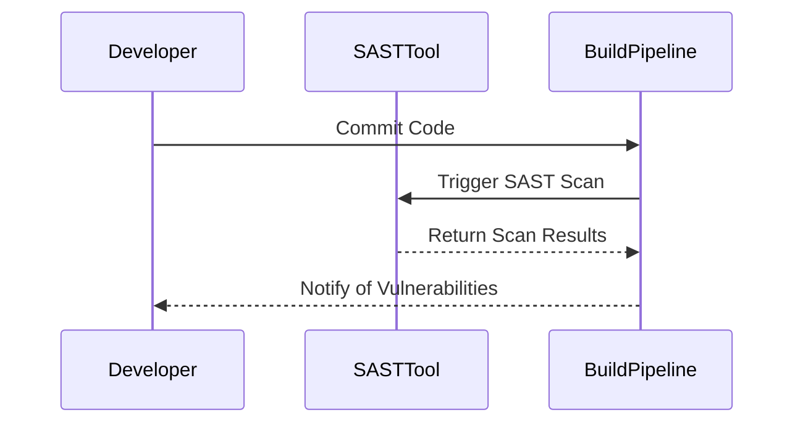

## Introduction to Implementing DevSecOps in Organizations

Implementing DevSecOps in an organization requires a strategic approach that integrates security practices into the development lifecycle. This chapter will delve into practical tips and strategies for starting the implementation process, focusing on how to address security issues effectively and non-intrusively.

### Understanding DevSecOps

DevSecOps is a methodology that combines the principles of DevOps with security practices. The goal is to ensure that security is integrated throughout the entire software development lifecycle (SDLC), rather than being treated as an afterthought. This approach helps organizations to build more secure applications and reduce the risk of vulnerabilities.

#### Key Concepts

- **Continuous Integration (CI)**: Automating the integration of code changes from multiple contributors into a shared repository.
- **Continuous Delivery (CD)**: Automating the deployment of applications to production environments.
- **Security Scanning**: Using automated tools to identify security vulnerabilities in code and configurations.

### Starting with Security Issue Fixing

One effective way to begin implementing DevSecOps is by addressing security issues directly with the development team. This can be done through a series of steps that involve identifying, fixing, and educating the team about security vulnerabilities.

#### Identifying Security Issues

The first step is to identify security issues within the application. This can be achieved through various methods:

- **Static Application Security Testing (SAST)**: Analyzing the source code to find security vulnerabilities.
- **Dynamic Application Security Testing (DAST)**: Simulating attacks on the running application to identify vulnerabilities.
- **Dependency Scanning**: Checking third-party libraries and dependencies for known vulnerabilities.

##### Example: Static Application Security Testing (SAST)



#### Fixing Security Issues

Once security issues are identified, the next step is to fix them. This involves working closely with the development team to address the vulnerabilities.

##### Example: Fixing Hard-Coded Secrets

Consider a scenario where hard-coded secrets are found in the codebase. This is a critical issue that needs immediate attention.

**Vulnerable Code:**

```python
# Vulnerable code with hard-coded secret
API_KEY = "abc123"
```

**Fixed Code:**

```python
# Fixed code using environment variables
import os
API_KEY = os.getenv("API_KEY")
```

#### Educating the Team

After fixing the issues, it is crucial to educate the team about the importance of security practices. This can be done through various means:

- **Training Sessions**: Conduct regular training sessions to educate developers about security best practices.
- **Documentation**: Provide comprehensive documentation on security policies and procedures.
- **Feedback Loops**: Establish feedback loops to continuously improve security practices.

### Adding Security Scans to the Pipeline

Another effective strategy is to integrate security scans into the CI/CD pipeline. This ensures that security checks are performed automatically as part of the development process.

#### Example: Adding Secret Scanning to the Pipeline

One common practice is to add secret scanning to the pipeline. This involves using tools like `git-secrets` or `TruffleHog` to detect hard-coded secrets in the codebase.

**Pipeline Configuration Example:**

```yaml
stages:
  - build
  - test
  - deploy

build:
  stage: build
  script:
    - echo "Building the application"

test:
  stage: test
  script:
    - echo "Running unit tests"
    - git-secrets --register-allowance .gitsecret_allowances
    - git-secrets --scan .

deploy:
  stage: deploy
  script:
    - echo "Deploying the application"
```

#### Handling False Positives

Security tools sometimes generate false positives, which can lead to unnecessary disruptions in the development process. It is important to handle these false positives appropriately.

##### Example: Filtering False Positives

To filter out false positives, you can configure the security tool to ignore certain patterns or directories.

**Configuration Example:**

```yaml
git-secrets --add .gitsecret_ignore_patterns
```

**Ignore Patterns File:**

```plaintext
# .gitsecret_ignore_patterns
/test/
/docs/
```

### Acting as a Teacher

In many cases, the person implementing DevSecOps acts as a teacher for the development team. This involves sharing unique knowledge and expertise that many software engineers may not possess.

#### Educating About Security Best Practices

Educating the team about security best practices is essential for building a culture of security within the organization. This can be achieved through various methods:

- **Regular Training Sessions**: Conduct regular training sessions to keep the team updated on the latest security trends and practices.
- **Documentation**: Provide comprehensive documentation on security policies and procedures.
- **Feedback Loops**: Establish feedback loops to continuously improve security practices.

### Real-World Examples

Real-world examples can help illustrate the importance of implementing DevSecOps practices. Here are some recent CVEs and breaches that highlight the need for robust security measures:

#### Example: CVE-2021-44228 (Log4Shell)

CVE-2021-44228, also known as Log4Shell, is a critical vulnerability in the Apache Log4j library. This vulnerability allowed attackers to execute arbitrary code on affected systems, leading to widespread exploitation.

**Impact:**
- **Exploitation:** Many organizations were exploited due to this vulnerability, leading to data breaches and system compromises.
- **Mitigation:** Organizations had to quickly patch their systems and implement additional security measures to mitigate the risk.

**Secure Coding Practice:**
- **Dependency Management:** Regularly update dependencies and monitor for known vulnerabilities.
- **Input Validation:** Validate and sanitize inputs to prevent injection attacks.

#### Example: SolarWinds Supply Chain Attack

The SolarWinds supply chain attack is one of the most significant cyberattacks in recent history. Hackers compromised the SolarWinds software update mechanism, allowing them to inject malicious code into the updates.

**Impact:**
- **Compromise:** Many organizations, including government agencies and large corporations, were compromised due to this attack.
- **Mitigation:** Organizations had to review their supply chain security practices and implement additional controls to prevent similar attacks.

**Secure Coding Practice:**
- **Supply Chain Security:** Implement strict controls and monitoring for software supply chains.
- **Code Signing:** Use code signing to verify the integrity of software updates.

### How to Prevent / Defend

#### Detection

Detecting security issues is crucial for preventing breaches. This can be achieved through various methods:

- **Automated Scanning Tools**: Use tools like SAST, DAST, and dependency scanners to detect vulnerabilities.
- **Logging and Monitoring**: Implement logging and monitoring to detect suspicious activities and potential breaches.

#### Prevention

Preventing security issues requires a combination of technical and organizational measures:

- **Secure Coding Practices**: Follow secure coding practices to prevent common vulnerabilities.
- **Access Controls**: Implement strict access controls to limit access to sensitive information and systems.
- **Regular Audits**: Conduct regular audits to ensure compliance with security policies and procedures.

#### Secure Coding Fixes

Here are some examples of secure coding fixes for common vulnerabilities:

##### Example: SQL Injection

**Vulnerable Code:**

```sql
SELECT * FROM users WHERE username = '$username';
```

**Fixed Code:**

```sql
PreparedStatement stmt = connection.prepareStatement("SELECT * FROM users WHERE username = ?");
stmt.setString(1, username);
ResultSet rs = stmt.executeQuery();
```

##### Example: Cross-Site Scripting (XSS)

**Vulnerable Code:**

```html
<p>User input: <%= user_input %></p>
```

**Fixed Code:**

```html
<p>User input: <%= escape(user_input) %></p>
```

### Conclusion

Implementing DevSecOps in an organization requires a strategic approach that integrates security practices into the development lifecycle. By following the practical tips and strategies outlined in this chapter, organizations can effectively address security issues, educate the development team, and establish a culture of security.

### Practice Labs

For hands-on experience with DevSecOps, consider the following practice labs:

- **PortSwigger Web Security Academy**: Offers interactive labs to learn about web application security.
- **OWASP Juice Shop**: A deliberately insecure web application for practicing web security skills.
- **DVWA (Damn Vulnerable Web Application)**: A PHP/MySQL web application that is riddled with vulnerabilities for educational purposes.
- **WebGoat**: An interactive, gamified training application to teach web application security lessons.

These labs provide real-world scenarios and challenges to help you master DevSecOps practices.

---
<!-- nav -->
[[07-Introduction to Implementing DevSecOps in Organizations Part 1|Introduction to Implementing DevSecOps in Organizations Part 1]] | [[DevSecOps/DevSecOps Bootcamp/01-DevSecOps Introduction/01-Adopt DevSecOps in Organizations/How to start implementing DevSecOps in Organizations Practical Tips/00-Overview|Overview]] | [[09-Convincing Stakeholders to Adopt DevSecOps|Convincing Stakeholders to Adopt DevSecOps]]
