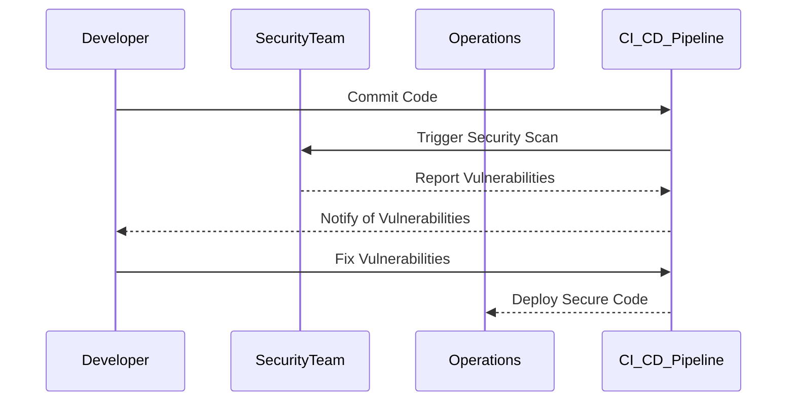

## Convincing Stakeholders to Adopt DevSecOps

### Building Trust and Demonstrating Impact

One of the primary challenges in adopting DevSecOps is gaining the trust of stakeholders. This involves demonstrating the tangible benefits of integrating security into the development process. Here’s how you can build trust and convince stakeholders:

#### Early Discovery of Security Issues

By integrating security early in the development process, you can identify and address security issues before they become critical. This reduces the likelihood of security breaches and minimizes the cost of fixing vulnerabilities.

#### Learning from Security Issues

When security issues are discovered, they should be used as learning opportunities. Teams should analyze the root causes of these issues and implement measures to prevent similar problems in the future. This iterative process helps improve the overall security posture of the organization.

#### Faster Fixing and Deployment

With security integrated into the CI/CD pipeline, security checks are performed continuously. This means that when issues are found, they can be fixed quickly and deployed without significant delays. This leads to faster time-to-market and improved customer satisfaction.

### Real-World Example: Equifax Breach

The Equifax breach in 2017 is a stark reminder of the consequences of poor security practices. The breach exposed sensitive data of over 143 million individuals. One of the key factors contributing to this breach was the lack of proper security controls and the failure to patch known vulnerabilities in a timely manner. Had Equifax adopted a DevSecOps approach, the security issues could have been identified and addressed earlier, potentially preventing the breach.



### Steps to Implement DevSecOps

#### Step 1: Shift Security Left

Integrate security into the early stages of the development process. This involves:

- **Static Application Security Testing (SAST)**: Scanning source code for vulnerabilities.
- **Dynamic Application Security Testing (DAST)**: Testing applications in a runtime environment.
- **Dependency Check**: Analyzing dependencies for known vulnerabilities.

#### Step 2: Automate Security Testing

Use automated tools to perform security tests continuously. This includes:

- **Code Scanning Tools**: Tools like SonarQube, Fortify, and Veracode.
- **Infrastructure as Code (IaC) Scanning**: Tools like Checkov and TFSec for scanning IaC files.
- **Container Scanning**: Tools like Clair and Trivy for scanning container images.

#### Step 3: Implement Continuous Integration and Continuous Deployment (CI/CD)

Ensure that security checks are part of the CI/CD pipeline. This involves:

- **Automated Builds**: Automatically building and testing code changes.
- **Automated Security Checks**: Running security scans as part of the build process.
- **Automated Deployment**: Automatically deploying code changes to production environments.

#### Step 4: Foster Collaboration and Communication

Encourage collaboration between developers, security teams, and operations teams. This involves:

- **Regular Security Meetings**: Regularly discussing security issues and sharing knowledge.
- **Security Training**: Providing training sessions to educate team members about security best practices.
- **Shared Responsibility**: Ensuring that everyone understands their role in maintaining security.

### Real-World Example: Capital One Breach

The Capital One breach in 2019 exposed the personal information of over 100 million customers. One of the key factors contributing to this breach was the lack of proper access controls and the failure to monitor and respond to suspicious activity. Had Capital One adopted a DevSecOps approach, the security issues could have been identified and addressed earlier, potentially preventing the breach.


### Common Pitfalls and How to Avoid Them

#### Lack of Automation

**Pitfall**: Relying solely on manual security checks can lead to delays and human errors.

**Solution**: Automate security testing using tools like SonarQube, Fortify, and Veracode. Ensure that these tools are integrated into the CI/CD pipeline.

#### Inadequate Training

**Pitfall**: Developers may not be aware of security best practices, leading to insecure coding practices.

**Solution**: Provide regular security training sessions to educate developers about security best practices. Encourage developers to follow secure coding guidelines.

#### Poor Communication

**Pitfall**: Lack of communication between developers, security teams, and operations teams can lead to security issues being overlooked.

**Solution**: Foster a culture of collaboration and communication. Hold regular security meetings to discuss security issues and share knowledge.

### How to Prevent / Defend

#### Detection

**Detection Mechanisms**: Use tools like SIEM (Security Information and Event Management) systems to monitor and detect security incidents. Implement logging and monitoring to track security events.

#### Prevention

**Prevention Mechanisms**: Implement access controls and least privilege principles to minimize the risk of unauthorized access. Use encryption to protect sensitive data.

#### Secure Coding Fixes

**Vulnerable Code Example**:
```python
# Vulnerable Code
import os
import subprocess

def execute_command(command):
    subprocess.run(command, shell=True)
```

**Secure Code Example**:
```python
# Secure Code
import os
import subprocess

def execute_command(command):
    subprocess.run(command.split(), check=True)
```

#### Configuration Hardening

**Example Configuration**:
```yaml
# Vulnerable Configuration
apiVersion: v1
kind: Pod
metadata:
  name: my-pod
spec:
  containers:
  - name: my-container
    image: my-image
    ports:
    - containerPort: 8080
```

**Hardened Configuration**:
```yaml
# Hardened Configuration
apiVersion: v1
kind: Pod
metadata:
  name: my-pod
spec:
  containers:
  - name: my-container
    image: my-image
    ports:
    - containerPort: 8080
    securityContext:
      runAsUser: 1000
      runAsGroup: 3000
      readOnlyRootFilesystem: true
```

### Conclusion

Adopting DevSecOps is crucial for ensuring the security of software systems. By integrating security into the early stages of the development process, automating security testing, and fostering collaboration and communication, organizations can significantly reduce the risk of security breaches. Real-world examples like the Equifax and Capital One breaches highlight the importance of adopting a DevSecOps approach.

### Hands-On Labs

For hands-on practice with DevSecOps, consider the following labs:

- **PortSwigger Web Security Academy**: Offers interactive labs to practice web application security.
- **OWASP Juice Shop**: An intentionally insecure web application for practicing security testing.
- **DVWA (Damn Vulnerable Web Application)**: A PHP/MySQL web application that demonstrates web application vulnerabilities.
- **WebGoat**: An interactive, gamified training application for learning web application security.

These labs provide practical experience in applying DevSecOps principles and techniques.

---
<!-- nav -->
[[08-Introduction to Implementing DevSecOps in Organizations|Introduction to Implementing DevSecOps in Organizations]] | [[DevSecOps/DevSecOps Bootcamp/01-DevSecOps Introduction/01-Adopt DevSecOps in Organizations/How to start implementing DevSecOps in Organizations Practical Tips/00-Overview|Overview]] | [[10-Getting Everyone On Board with Access and Permissions Management|Getting Everyone On Board with Access and Permissions Management]]
