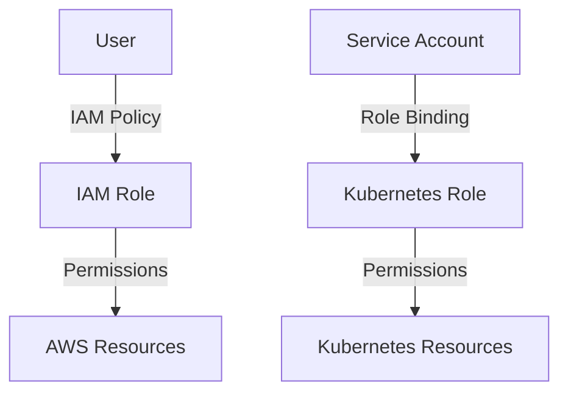

## Getting Everyone On Board with Access and Permissions Management

### Background Theory

Access and permissions management is a critical aspect of DevSecOps, ensuring that only authorized personnel have access to specific resources within an organization’s infrastructure. This is particularly important in cloud environments like AWS and container orchestration platforms like Kubernetes. Proper management of access and permissions helps prevent unauthorized access, which can lead to data breaches and other security incidents.

### AWS Infrastructure Access and Permissions

In AWS, Identity and Access Management (IAM) is used to manage access to AWS services and resources. IAM allows you to create and manage AWS users and groups, and define permissions that control their access to AWS resources.

#### IAM Policies and Roles

IAM policies are JSON documents that specify permissions. They can be attached to IAM users, groups, or roles. IAM roles are similar to users but are intended to be assumed by entities such as EC2 instances or Lambda functions.

```json
{
    "Version": "2012-10-17",
    "Statement": [
        {
            "Effect": "Allow",
            "Action": [
                "ec2:Describe*"
            ],
            "Resource": "*"
        }
    ]
}
```

This policy allows the user to describe EC2 resources. 

#### Pitfalls and Best Practices

One common pitfall is granting overly broad permissions, such as `AdministratorAccess`, which provides full access to all AWS services. This increases the risk of accidental or malicious actions.

**How to Prevent / Defend**

1. **Least Privilege Principle**: Grant users only the permissions necessary to perform their job functions.
2. **Regular Audits**: Periodically review IAM policies to ensure they are still appropriate.
3. **Use Managed Policies**: AWS provides managed policies that cover common use cases, reducing the risk of errors.

### Kubernetes Cluster Access and Permissions

Kubernetes uses Role-Based Access Control (RBAC) to manage access to resources within the cluster. RBAC allows you to define roles and role bindings to grant permissions to users or service accounts.

#### Roles and Role Bindings

Roles define a set of permissions, while role bindings associate roles with users or groups.

```yaml
apiVersion: rbac.authorization.k8s.io/v1
kind: Role
metadata:
  namespace: default
  name: pod-reader
rules:
- apiGroups: [""]
  resources: ["pods"]
  verbs: ["get", "watch", "list"]
---
apiVersion: rbac.authorization.k8s.io/v1
kind: RoleBinding
metadata:
  name: read-pods
  namespace: default
subjects:
- kind: User
  name: johndoe
  apiGroup: rbac.authorization.k8s.io
roleRef:
  kind: Role
  name: pod-reader
  apiGroup: rbac.authorization.k8s.io
```

This role binding grants the user `johndoe` permission to read pods in the `default` namespace.

#### Pitfalls and Best Practices

A common pitfall is granting cluster-admin privileges to users or service accounts unnecessarily, which can lead to unauthorized access to sensitive resources.

**How to Prevent / Defend**

1. **Least Privilege Principle**: Grant users only the permissions necessary to perform their tasks.
2. **Regular Audits**: Periodically review RBAC configurations to ensure they are still appropriate.
3. **Use Namespaces**: Isolate resources using namespaces to limit the scope of permissions.

### Collaboration and Training

Getting everyone on board with access and permissions management requires collaboration and training. Ensure that all team members understand the importance of proper access controls and are trained on how to use them effectively.

### Mermaid Diagrams



---
<!-- nav -->
[[09-Convincing Stakeholders to Adopt DevSecOps|Convincing Stakeholders to Adopt DevSecOps]] | [[DevSecOps/DevSecOps Bootcamp/01-DevSecOps Introduction/01-Adopt DevSecOps in Organizations/How to start implementing DevSecOps in Organizations Practical Tips/00-Overview|Overview]] | [[11-Implementing Kubernetes Security Best Practices|Implementing Kubernetes Security Best Practices]]
