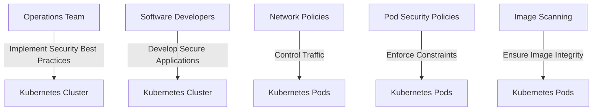

## Implementing Kubernetes Security Best Practices

### Background Theory

Kubernetes is a powerful tool for managing containerized applications, but it also introduces significant security challenges. Properly securing Kubernetes clusters requires a combination of best practices and tools.

### Securing Kubernetes Clusters

To secure Kubernetes clusters, implement best practices such as:

1. **Network Policies**: Use network policies to control traffic between pods.
2. **Pod Security Policies**: Use pod security policies to enforce security constraints on pods.
3. **Image Scanning**: Use image scanning tools to ensure that images are free from vulnerabilities.

#### Example Network Policy

```yaml
apiVersion: networking.k8s.io/v1
kind: NetworkPolicy
metadata:
  name: deny-all
spec:
  podSelector: {}
  policyTypes:
  - Ingress
  - Egress
```

This network policy denies all ingress and egress traffic.

#### Pitfalls and Best Practices

One common pitfall is not properly securing etcd, the key-value store used by Kubernetes to store cluster state. Unauthorized access to etcd can compromise the entire cluster.

**How to Prevent / Defend**

1. **Secure etcd**: Use TLS encryption and mutual authentication to secure etcd.
2. **Use RBAC**: Use RBAC to control access to etcd.
3. **Use Monitoring Tools**: Use monitoring tools to detect and respond to suspicious activity.

### Collaborating with Operations and Software Developers

Collaboration between operations and software developers is essential for implementing Kubernetes security best practices. Ensure that both teams understand the importance of security and are trained on how to implement best practices.

### Mermaid Diagrams



---
<!-- nav -->
[[10-Getting Everyone On Board with Access and Permissions Management|Getting Everyone On Board with Access and Permissions Management]] | [[DevSecOps/DevSecOps Bootcamp/01-DevSecOps Introduction/01-Adopt DevSecOps in Organizations/How to start implementing DevSecOps in Organizations Practical Tips/00-Overview|Overview]] | [[12-Introducing Automation with Terraform|Introducing Automation with Terraform]]
