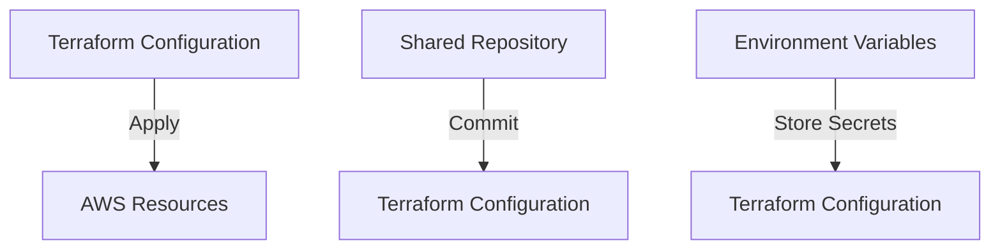

## Introducing Automation with Terraform

### Background Theory

Terraform is an open-source infrastructure as code (IaC) tool that enables you to define and provision infrastructure resources using declarative configuration files. By automating infrastructure provisioning, Terraform helps reduce human error and ensures consistency across environments.

### Setting Up Shared Repository

To collaborate on infrastructure changes, set up a shared repository where Terraform configuration files are stored. This allows team members to contribute to and review infrastructure changes.

#### Example Terraform Configuration

```hcl
provider "aws" {
  region = "us-west-2"
}

resource "aws_instance" "example" {
  ami           = "ami-0c55b159cbfafe1f0"
  instance_type = "t2.micro"

  tags = {
    Name = "example-instance"
  }
}
```

This configuration creates an EC2 instance in the `us-west-2` region.

#### Pitfalls and Best Practices

One common pitfall is not properly managing secrets, such as API keys or access tokens, in Terraform configuration files. This can lead to unauthorized access if the files are committed to a public repository.

**How to Prevent / Defend**

1. **Use Environment Variables**: Store sensitive information in environment variables rather than hardcoding them in configuration files.
2. **Use Terraform State Encryption**: Encrypt the Terraform state file to protect sensitive data.
3. **Use Version Control**: Use a private repository to store Terraform configuration files and restrict access to authorized personnel.

### Optimizing Terraform Workflows

If the team is already using Terraform, you can optimize the workflow by identifying and implementing best practices.

#### Example Optimization

```hcl
resource "aws_security_group" "example" {
  name        = "example-sg"
  description = "Example security group"

  ingress {
    from_port   = 80
    to_port     = 80
    protocol    = "tcp"
    cidr_blocks = ["0.0.0.0/0"]
  }

  egress {
    from_port   = 0
    to_port     = 0
    protocol    = "-1"
    cidr_blocks = ["0.0.0.0/0"]
  }
}
```

This configuration defines a security group with rules for inbound and outbound traffic.

#### Pitfalls and Best Practices

One common pitfall is not properly managing dependencies between resources, which can lead to inconsistent states.

**How to Prevent / Defend**

1. **Use Data Sources**: Use data sources to retrieve information about existing resources and ensure consistency.
2. **Use Lifecycle Hooks**: Use lifecycle hooks to manage resource creation and deletion.
3. **Use Modules**: Use modules to encapsulate reusable components and reduce duplication.

### Mermaid Diagrams



---
<!-- nav -->
[[11-Implementing Kubernetes Security Best Practices|Implementing Kubernetes Security Best Practices]] | [[DevSecOps/DevSecOps Bootcamp/01-DevSecOps Introduction/01-Adopt DevSecOps in Organizations/How to start implementing DevSecOps in Organizations Practical Tips/00-Overview|Overview]] | [[13-Tools for Code Scanning and Dependency Scanning|Tools for Code Scanning and Dependency Scanning]]
