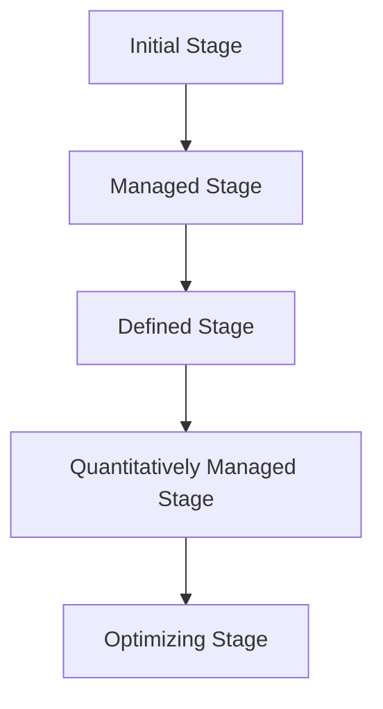
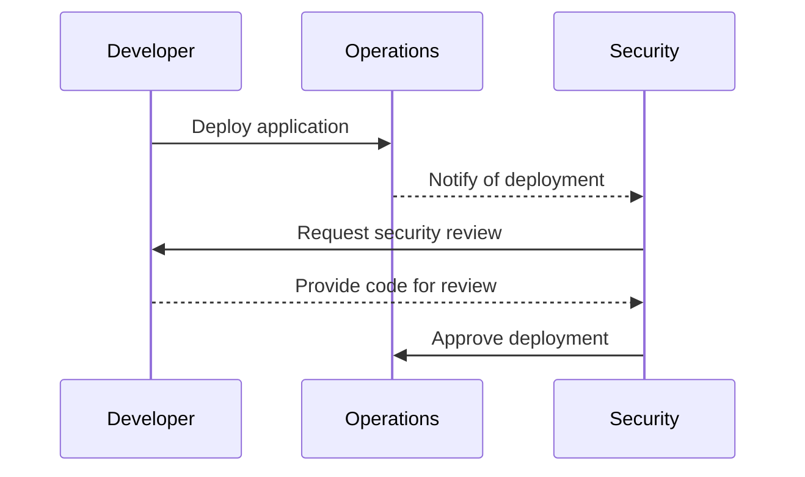
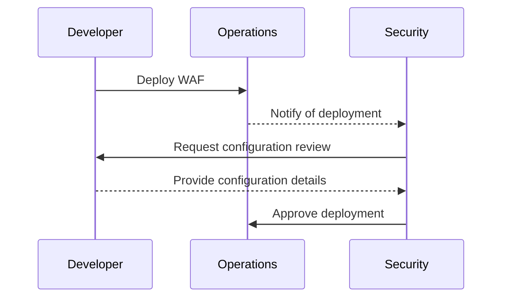

## Introduction to DevSecOps Maturity Models

Implementing a successful DevSecOps process is a marathon, not a sprint. This means that organizations must be prepared to invest significant amounts of effort and time to achieve sustainable change. A key aspect of this process is ensuring that the changes made are embedded and sustained over time, preventing a regression to previous practices. To manage this effectively, organizations often turn to maturity models, which provide a structured approach to assessing and improving their processes.

### What is a Maturity Model?

A maturity model is a framework used to assess the development or maturity level of an organization's processes, systems, or practices. It typically consists of several stages or levels, each representing a different degree of sophistication and effectiveness. By mapping an organization's current state against these stages, leaders can identify areas for improvement and set goals for future development.

#### Why Use a Maturity Model?

Maturity models serve several critical purposes:

1. **Assessment**: They provide a standardized way to evaluate the current state of an organization's processes.
2. **Goal Setting**: They help in setting realistic and achievable goals for improvement.
3. **Benchmarking**: They enable organizations to compare their performance against industry standards.
4. **Continuous Improvement**: They encourage a culture of continuous improvement by highlighting areas that need attention.

### DevSecOps Maturity Models

In the context of DevSecOps, maturity models are particularly useful because they address the integration of security into the software development lifecycle (SDLC). Two prominent maturity models in this space are the DevSecOps Maturity Model from the DevSecOps Foundation and the Capability Maturity Model Integration (CMMI).

#### DevSecOps Maturity Model

The DevSecOps Maturity Model from the DevSecOps Foundation is designed to help organizations assess and improve their DevSecOps capabilities. It breaks down the journey into several stages, each representing a different level of maturity.

##### Stages of the DevSecOps Maturity Model

1. **Initial Stage**:
   - **Description**: At this stage, security is often an afterthought, and there is little to no integration between development, operations, and security teams.
   - **Challenges**: Organizations face frequent security incidents due to lack of coordination and communication.
   - **Example**: A recent breach where a company failed to implement basic security controls, leading to unauthorized access to sensitive data.

2. **Managed Stage**:
   - **Description**: Basic processes are in place, but they are often ad hoc and inconsistently applied.
   - **Challenges**: Inconsistent application of security practices leads to vulnerabilities.
   - **Example**: A company implements some security measures but fails to enforce them consistently across all projects.

3. **Defined Stage**:
   - **Description**: Standardized processes are established and documented.
   - **Challenges**: Ensuring that all team members adhere to the defined processes.
   - **Example**: A company creates a set of security guidelines but struggles to ensure compliance across all teams.

4. **Quantitatively Managed Stage**:
   - **Description**: Processes are measured and analyzed to identify areas for improvement.
   - **Challenges**: Collecting and analyzing data to drive decision-making.
   - **Example**: A company uses metrics to track security incidents and identifies trends to improve processes.

5. **Optimizing Stage**:
   - **Description**: Continuous improvement is embedded into the culture, and innovation is encouraged.
   - **Challenges**: Maintaining a culture of continuous improvement.
   - **Example**: A company regularly reviews and updates its security practices based on feedback and emerging threats.

### How to Implement a Maturity Model

Implementing a maturity model involves several steps:

1. **Assessment**: Evaluate the current state of your organization's DevSecOps practices using the chosen maturity model.
2. **Planning**: Develop a roadmap for improvement, identifying specific actions to move through each stage.
3. **Execution**: Implement the planned actions, ensuring consistent application of processes.
4. **Monitoring**: Regularly assess progress and adjust plans as needed.
5. **Embedding**: Ensure that new practices become part of the organizational culture.

#### Example: Moving from Initial to Defined Stage

Let's consider an example of moving from the Initial Stage to the Defined Stage:

1. **Current State**: Security is an afterthought, and there is little coordination between development, operations, and security teams.
2. **Actions**:
   - Establish a cross-functional team to define security requirements.
   - Document security policies and procedures.
   - Train team members on new processes.
3. **Expected Result**: Improved coordination and consistency in applying security practices.



### Real-World Examples and Case Studies

To illustrate the importance of maturity models, let's look at some recent real-world examples:

#### Example 1: Equifax Data Breach (CVE-2017-5638)

Equifax suffered a massive data breach in 2017, affecting over 143 million customers. The breach was caused by a vulnerability in Apache Struts, which was not patched in a timely manner. This incident highlights the importance of having robust security practices in place, including regular patch management and vulnerability assessments.



#### Example 2: Capital One Data Breach (CVE-2019-11510)

Capital One experienced a data breach in 2019, exposing sensitive information of over 100 million customers. The breach was caused by a misconfigured web application firewall (WAF) that allowed unauthorized access to customer data. This incident underscores the importance of proper configuration management and regular security audits.



### How to Prevent / Defend

To prevent similar incidents and ensure the sustainability of DevSecOps practices, organizations should focus on the following:

1. **Regular Audits**: Conduct regular security audits to identify and mitigate vulnerabilities.
2. **Patch Management**: Implement a robust patch management process to ensure timely application of security patches.
3. **Configuration Management**: Ensure proper configuration of security tools and systems to prevent misconfigurations.
4. **Training and Awareness**: Provide regular training and awareness programs to educate team members on security best practices.

#### Secure Coding Practices

Secure coding practices are essential to prevent vulnerabilities. Here’s an example of a vulnerable code snippet and its secure counterpart:

**Vulnerable Code:**

```python
def login(username, password):
    if username == "admin" and password == "password":
        return True
    else:
        return False
```

**Secure Code:**

```python
import hashlib

def hash_password(password):
    return hashlib.sha256(password.encode()).hexdigest()

def login(username, hashed_password):
    stored_hashed_password = get_stored_password(username)
    if stored_hashed_password == hashed_password:
        return True
    else:
        return False
```

### Conclusion

Adopting a DevSecOps maturity model is crucial for organizations aiming to integrate security into their SDLC. By following a structured approach, organizations can assess their current state, set realistic goals, and continuously improve their processes. Real-world examples and case studies highlight the importance of robust security practices, and secure coding practices are essential to prevent vulnerabilities. By embedding these practices into the organizational culture, organizations can achieve sustainable DevSecOps maturity.

### Practice Labs

For hands-on experience with DevSecOps concepts, consider the following labs:

- **PortSwigger Web Security Academy**: Offers interactive labs to learn about web security vulnerabilities and mitigation techniques.
- **OWASP Juice Shop**: A deliberately insecure web application to practice security testing and ethical hacking.
- **DVWA (Damn Vulnerable Web Application)**: A PHP/MySQL web application that contains numerous security vulnerabilities.
- **WebGoat**: An interactive, gamified training application to learn about web application security.

These labs provide practical experience in applying DevSecOps principles and securing applications against common vulnerabilities.

---
<!-- nav -->
[[DevSecOps/DevSecOps Bootcamp/01-DevSecOps Introduction/02-Adopting DevSecOps in Your Software Development Lifecycle/01-DevSecOps Progress and Maturity Models/00-Overview|Overview]] | [[DevSecOps/DevSecOps Bootcamp/01-DevSecOps Introduction/02-Adopting DevSecOps in Your Software Development Lifecycle/01-DevSecOps Progress and Maturity Models/02-Practice Questions & Answers|Practice Questions & Answers]]
