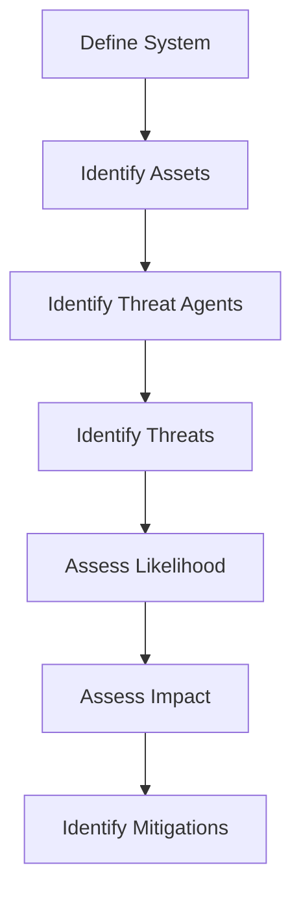

## Positioning DevSecOps within the Software Development Lifecycle (SDLC)

### Introduction to DevSecOps

DevSecOps is an approach to software development that integrates security practices throughout the entire software development lifecycle (SDLC). This methodology aims to ensure that security is not an afterthought but is embedded into every stage of the development process. By doing so, organizations can reduce the likelihood of security vulnerabilities and improve the overall security posture of their applications.

### Understanding the SDLC

The SDLC consists of several phases, including planning, design, implementation, testing, deployment, and maintenance. Each phase presents unique opportunities and challenges for integrating security practices.

#### Planning Phase

During the planning phase, the project's goals, scope, and requirements are defined. This is a critical time to introduce security considerations into the project plan.

**Threat Modeling**

Threat modeling is a structured approach to identifying potential threats and vulnerabilities in a system. It helps teams understand the risks associated with their application and prioritize mitigation efforts.

**Coding Standards**

Coding standards are guidelines that dictate how code should be written. Secure coding standards specifically focus on writing code that is less susceptible to common vulnerabilities such as SQL injection, cross-site scripting (XSS), and buffer overflows.

**TREP Modeling**

TREP stands for Threat Risk and Exposure Profile. TREP modeling is a more advanced form of threat modeling that provides a detailed assessment of the risks and exposures associated with a system. It requires significant investment in training and experience to be effective.

**Example: OWASP Top Ten Vulnerabilities**

The Open Web Application Security Project (OWASP) maintains a list of the top ten web application security risks. These include:

- Injection
- Broken Authentication
- Sensitive Data Exposure
- XML External Entities (XXE)
- Broken Access Control
- Security Misconfiguration
- Cross-Site Scripting (XSS)
- Insecure Deserialization
- Using Components with Known Vulnerabilities
- Insufficient Logging & Monitoring

By addressing these risks during the planning phase, organizations can significantly reduce the likelihood of security vulnerabilities.

**Mermaid Diagram: Threat Modeling Process**



### Code Section

Once the planning phase is complete, the next phase is the code section, where actual coding takes place. This is a crucial phase for integrating security practices.

**Static Code Analysis**

Static code analysis is the process of examining source code without executing it. This technique helps identify potential security vulnerabilities and coding errors. Static code analysis tools can automatically scan code for issues such as:

- SQL Injection
- Cross-Site Scripting (XSS)
- Buffer Overflows
- Improper Input Validation

**Example: SonarQube**

SonarQube is a popular static code analysis tool that supports multiple programming languages. It provides detailed reports on code quality and security issues.

**Code Example: Vulnerable vs. Secure Code**

Consider the following example of a SQL injection vulnerability:

**Vulnerable Code:**
```sql
SELECT * FROM users WHERE username = '$username' AND password = '$password';
```

**Secure Code:**
```sql
PreparedStatement stmt = connection.prepareStatement("SELECT * FROM users WHERE username = ? AND password = ?");
stmt.setString(1, username);
stmt.setString(2, password);
ResultSet rs = stmt.executeQuery();
```

In the secure code, parameterized queries are used to prevent SQL injection attacks.

**How to Prevent / Defend**

- **Detection**: Use static code analysis tools like SonarQube to identify potential vulnerabilities.
- **Prevention**: Implement secure coding standards and use parameterized queries to prevent SQL injection.
- **Secure Coding Fix**: Replace vulnerable code with secure code as shown above.
- **Configuration Hardening**: Ensure that the database server is configured securely, with least privilege access control.

### Implementation Phase

During the implementation phase, the actual coding and development work takes place. This is a critical phase for ensuring that security practices are followed.

**Developer Engagement**

Winning over the developers is essential when introducing security practices into their build pipelines. Developers may resist changes that they perceive as slowing down their workflow. Therefore, it is important to communicate the benefits of security practices and provide training and support.

**Example: Real-World Breach**

In 2017, Equifax suffered a massive data breach due to a vulnerability in Apache Struts. The breach exposed sensitive information of over 143 million individuals. This breach highlights the importance of keeping software up-to-date and implementing security best practices.

**Code Example: Vulnerable vs. Secure Code**

Consider the following example of a cross-site scripting (XSS) vulnerability:

**Vulnerable Code:**
```html
<p>User input: <%= user_input %></p>
```

**Secure Code:**
```html
<p>User input: <%= h(user_input) %></p>
```

In the secure code, the `h` function is used to escape user input, preventing XSS attacks.

**How to Prevent / Defend**

- **Detection**: Use static code analysis tools to identify potential XSS vulnerabilities.
- **Prevention**: Implement secure coding standards and use escaping functions to prevent XSS.
- **Secure Coding Fix**: Replace vulnerable code with secure code as shown above.
- **Configuration Hardening**: Ensure that the web server is configured securely, with proper input validation and output encoding.

### Testing Phase

The testing phase is crucial for identifying and fixing security vulnerabilities before the application is deployed.

**Dynamic Application Security Testing (DAST)**

Dynamic application security testing (DAST) involves testing the application while it is running. This technique helps identify vulnerabilities that may not be detected through static code analysis alone.

**Example: Burp Suite**

Burp Suite is a popular DAST tool that can be used to test web applications for vulnerabilities such as SQL injection, XSS, and CSRF.

**Code Example: Vulnerable vs. Secure Code**

Consider the following example of a cross-site request forgery (CSRF) vulnerability:

**Vulnerable Code:**
```html
<form action="/submit" method="POST">
    <input type="text" name="data">
    <input type="submit" value="Submit">
</form>
```

**Secure Code:**
```html
<form action="/submit" method="POST">
    <input type="hidden" name="csrf_token" value="<%= csrf_token %>">
    <input type="text" name="data">
    <input type="submit" value="Submit">
</form>
```

In the secure code, a CSRF token is included in the form to prevent CSRF attacks.

**How to Prevent / Defend**

- **Detection**: Use DAST tools like Burp Suite to identify potential CSRF vulnerabilities.
- **Prevention**: Implement secure coding standards and use CSRF tokens to prevent CSRF.
- **Secure Coding Fix**: Replace vulnerable code with secure code as shown above.
- **Configuration Hardening**: Ensure that the web server is configured securely, with proper CSRF protection mechanisms.

### Deployment Phase

The deployment phase involves deploying the application to a production environment. This is a critical phase for ensuring that the application is secure.

**Continuous Integration/Continuous Deployment (CI/CD)**

Continuous integration/continuous deployment (CI/CD) is a practice that involves automating the build, test, and deployment processes. This helps ensure that security practices are followed consistently throughout the development process.

**Example: Jenkins**

Jenkins is a popular CI/CD tool that can be used to automate the build, test, and deployment processes. Jenkins can integrate with static code analysis tools and DAST tools to ensure that security practices are followed.

**Code Example: Vulnerable vs. Secure Code**

Consider the following example of a configuration vulnerability:

**Vulnerable Configuration:**
```yaml
server:
  port: 8080
  contextPath: /
```

**Secure Configuration:**
```yaml
server:
  port: 8080
  contextPath: /
  ssl:
    enabled: true
    key-store: classpath:keystore.jks
    key-store-password: changeit
    key-alias: tomcat
    key-password: changeit
```

In the secure configuration, SSL is enabled to encrypt communication between the client and server.

**How to Prevent / Defend**

- **Detection**: Use CI/CD tools like Jenkins to automate the build, test, and deployment processes.
- **Prevention**: Implement secure coding standards and use secure configurations to prevent vulnerabilities.
- **Secure Configuration Fix**: Replace vulnerable configuration with secure configuration as shown above.
- **Configuration Hardening**: Ensure that the server is configured securely, with proper encryption and access controls.

### Maintenance Phase

The maintenance phase involves ongoing monitoring and updating of the application. This is a critical phase for ensuring that the application remains secure.

**Patch Management**

Patch management involves keeping the application and its dependencies up-to-date with the latest security patches. This helps ensure that known vulnerabilities are addressed.

**Example: CVE-2021-44228**

CVE-2021-44228 is a critical vulnerability in the Log4j library. This vulnerability allows attackers to execute arbitrary code on the server. Organizations must ensure that they are using the latest version of Log4j to mitigate this vulnerability.

**Code Example: Vulnerable vs. Secure Code**

Consider the following example of a dependency vulnerability:

**Vulnerable Dependency:**
```json
{
  "dependencies": {
    "log4j": "^2.14.1"
  }
}
```

**Secure Dependency:**
```json
{
  "dependencies": {
    "log4j": "^2.17.1"
  }
}
```

In the secure dependency, the latest version of Log4j is used to mitigate the vulnerability.

**How to Prevent / Defend**

- **Detection**: Use tools like OWASP Dependency Check to identify potential dependency vulnerabilities.
- **Prevention**: Implement secure coding standards and use the latest versions of dependencies to prevent vulnerabilities.
- **Secure Dependency Fix**: Replace vulnerable dependency with secure dependency as shown above.
- **Configuration Hardening**: Ensure that the application is configured securely, with proper dependency management and patching.

### Conclusion

Adopting DevSecOps in your software development lifecycle (SDLC) requires a strategic approach that integrates security practices throughout each phase of the development process. By following the steps outlined in this chapter, organizations can significantly reduce the likelihood of security vulnerabilities and improve the overall security posture of their applications.

### Practice Labs

To gain hands-on experience with DevSecOps, consider the following practice labs:

- **PortSwigger Web Security Academy**: Offers interactive labs for learning web application security.
- **OWASP Juice Shop**: A deliberately insecure web application for practicing web security skills.
- **DVWA (Damn Vulnerable Web Application)**: A PHP/MySQL web application that is intentionally vulnerable for educational purposes.
- **WebGoat**: An interactive, gamified training application for learning web security.

These labs provide practical experience in applying DevSecOps principles and techniques to real-world scenarios.

### Additional Resources

For further reading and resources on DevSecOps, consider the following:

- **OWASP Top Ten Project**: Provides a comprehensive list of the top web application security risks.
- **SonarQube Documentation**: Offers detailed documentation on using SonarQube for static code analysis.
- **Burp Suite Documentation**: Provides detailed documentation on using Burp Suite for dynamic application security testing.
- **Jenkins Documentation**: Offers detailed documentation on using Jenkins for continuous integration/continuous deployment.

By leveraging these resources, organizations can gain a deeper understanding of DevSecOps and implement it effectively in their software development lifecycle.

---
<!-- nav -->
[[01-Introduction to DevSecOps in the Software Development Lifecycle (SDLC)|Introduction to DevSecOps in the Software Development Lifecycle (SDLC)]] | [[DevSecOps/DevSecOps Bootcamp/01-DevSecOps Introduction/02-Adopting DevSecOps in Your Software Development Lifecycle/02-Positioning DevSecOps within the SDLC/00-Overview|Overview]] | [[DevSecOps/DevSecOps Bootcamp/01-DevSecOps Introduction/02-Adopting DevSecOps in Your Software Development Lifecycle/02-Positioning DevSecOps within the SDLC/03-Practice Questions & Answers|Practice Questions & Answers]]
