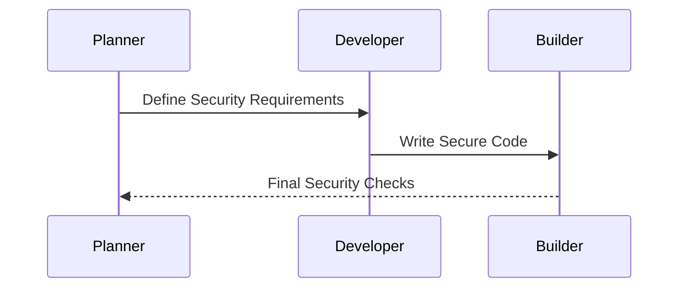

## Designing DevSecOps for Planning, Coding, and Building Phases

### Planning Phase

#### What Happens in the Planning Phase?

In the planning phase, teams define the project scope, requirements, and timelines. This is also the time to establish security policies and procedures.

#### Why is Security Important in the Planning Phase?

Establishing security policies early ensures that security is considered from the outset. This helps prevent costly rework later in the development cycle.

#### How to Implement Security in the Planning Phase?

1. **Define Security Requirements**: Clearly outline security requirements and expectations.
2. **Risk Assessment**: Conduct a risk assessment to identify potential security threats.
3. **Security Policies**: Develop and document security policies and procedures.

### Real-World Example: Risk Assessment

Consider a recent breach at a healthcare provider. The breach occurred because the organization did not conduct a thorough risk assessment during the planning phase. By conducting a risk assessment, the organization could have identified potential vulnerabilities and taken preventive measures.

### Coding Phase

#### What Happens in the Coding Phase?

During the coding phase, developers write the actual code for the application. This is a critical phase for implementing security practices.

#### Why is Security Important in the Coding Phase?

Security vulnerabilities often originate from insecure coding practices. Ensuring that developers follow secure coding guidelines can significantly reduce the risk of vulnerabilities.

#### How to Implement Security in the Coding Phase?

1. **Code Reviews**: Conduct regular code reviews to identify and fix security issues.
2. **Automated Tools**: Use automated tools like SAST and DAST to scan code for vulnerabilities.
3. **Dependency Scanning**: Regularly scan dependencies for known vulnerabilities.

### Real-World Example: Code Review

Consider a recent breach at a social media platform. The breach occurred due to a vulnerability in the code that was not caught during code reviews. By implementing a robust code review process, the platform could have identified and fixed the vulnerability earlier.

### Building Phase

#### What Happens in the Building Phase?

The building phase involves compiling the code and preparing it for deployment. This is also the time to perform final security checks.

#### Why is Security Important in the Building Phase?

Final security checks ensure that the application is free from vulnerabilities before deployment. This helps prevent security issues from reaching production.

#### How to Implement Security in the Building Phase?

1. **Automated Builds**: Use automated build processes to ensure consistency and security.
2. **Security Checks**: Perform final security checks using tools like SAST and DAST.
3. **Dependency Updates**: Ensure that all dependencies are up to date and free from known vulnerabilities.

### Real-World Example: Automated Builds

Consider a recent breach at a financial services company. The breach occurred because the company did not use automated builds, leading to inconsistent and potentially insecure deployments. By implementing automated builds, the company could have ensured that all deployments were secure.

### How to Prevent / Defend

**Detection**: Regularly review and update security policies and procedures to ensure they remain effective.

**Prevention**: Implement robust security practices in each phase of the development lifecycle.

**Secure-Coding Fix**: Ensure that all team members are trained in secure coding practices and regularly review code for vulnerabilities.

---
<!-- nav -->
[[DevSecOps/DevSecOps Bootcamp/01-DevSecOps Introduction/02-Adopting DevSecOps in Your Software Development Lifecycle/03-Module Summary/01-Introduction to DevSecOps|Introduction to DevSecOps]] | [[DevSecOps/DevSecOps Bootcamp/01-DevSecOps Introduction/02-Adopting DevSecOps in Your Software Development Lifecycle/03-Module Summary/00-Overview|Overview]] | [[03-Selecting a Maturity Model|Selecting a Maturity Model]]
