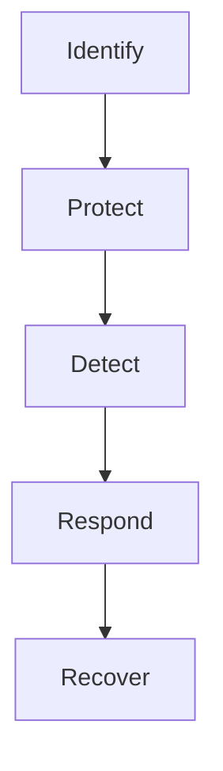
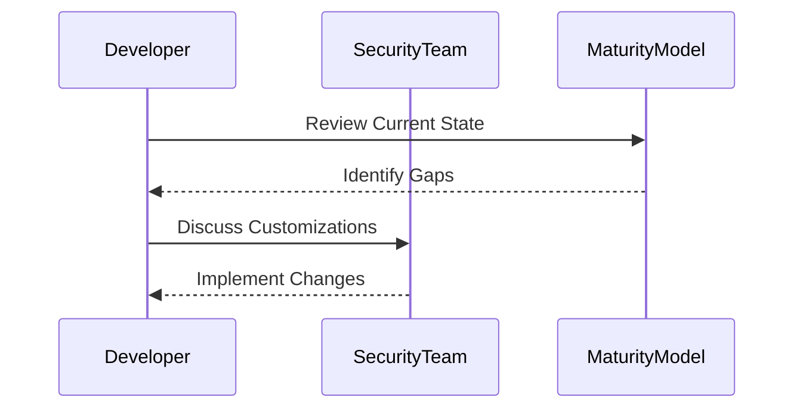

## Selecting a Maturity Model

### What is a Maturity Model?

A maturity model is a framework that helps organizations assess their current state and plan for future improvements. Common maturity models used in DevSecOps include:

- **NIST Cybersecurity Framework (CSF)**: Provides a structure for managing cybersecurity risks.
- **COBIT (Control Objectives for Information and Related Technologies)**: Offers a comprehensive framework for IT governance and management.
- **DevSecOps Maturity Model**: Specifically designed for DevSecOps, focusing on security practices integrated into the DevOps lifecycle.

### Benefits of Using a Maturity Model

Using a maturity model provides several benefits:

1. **Structured Roadmap**: Helps organizations define a clear path for improvement.
2. **Benchmarking**: Allows comparison against industry standards and best practices.
3. **Customization**: Can be tailored to fit the unique needs of an organization.

### Real-World Example: NIST CSF Implementation

Consider a recent breach at a major financial institution. The breach occurred due to outdated security practices and lack of continuous monitoring. By adopting the NIST CSF, the institution could have identified and addressed these gaps earlier. The NIST CSF includes functions such as Identify, Protect, Detect, Respond, and Recover, which provide a structured approach to improving security posture.

### Customizing a Maturity Model

While maturity models provide a solid foundation, it's essential to customize them to fit your organization's specific needs. For example, if your organization heavily relies on open-source components, you might want to emphasize dependency scanning and regular updates.

### How to Prevent / Defend

**Detection**: Regularly review and update your maturity model to ensure it remains aligned with your organization's evolving needs.

**Prevention**: Customize the maturity model to address specific pain points and integrate security practices into daily operations.

**Secure-Coding Fix**: Ensure that all team members understand the importance of security and are trained to follow best practices.

---
<!-- nav -->
[[02-Designing DevSecOps for Planning, Coding, and Building Phases|Designing DevSecOps for Planning, Coding, and Building Phases]] | [[DevSecOps/DevSecOps Bootcamp/01-DevSecOps Introduction/02-Adopting DevSecOps in Your Software Development Lifecycle/03-Module Summary/00-Overview|Overview]] | [[DevSecOps/DevSecOps Bootcamp/01-DevSecOps Introduction/02-Adopting DevSecOps in Your Software Development Lifecycle/03-Module Summary/04-Conclusion|Conclusion]]
