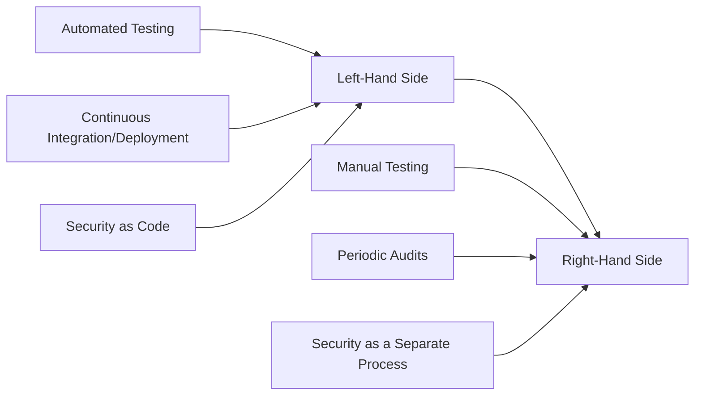

## Introduction to DevSecOps Manifesto

The DevSecOps Manifesto is a guiding document that outlines the principles and priorities for integrating security into the DevOps process. It is inspired by the Agile Manifesto, which has been widely adopted in software development to prioritize working software over comprehensive documentation, customer collaboration over contract negotiation, responding to change over following a plan, and individuals and interactions over processes and tools.

### Structure of the DevSecOps Manifesto

The DevSecOps Manifesto emphasizes certain activities over others, prioritizing the items on the left-hand side over those on the right-hand side. This structure ensures that security is integrated into the development lifecycle rather than being treated as an afterthought.

### Key Principles of the DevSecOps Manifesto

1. **Automated Testing**: Prioritize automated testing over manual testing to ensure consistency and speed.
2. **Continuous Integration/Deployment**: Emphasize continuous integration and deployment over periodic releases to maintain a steady flow of updates.
3. **Security as Code**: Integrate security practices into the codebase rather than treating it as a separate process.

---
<!-- nav -->
[[DevSecOps/DevSecOps Bootcamp/01-DevSecOps Introduction/03-Debunking DevSecOps Myths/01-Common DevSecOps Myths/00-Overview|Overview]] | [[02-Common DevSecOps Myths|Common DevSecOps Myths]]
