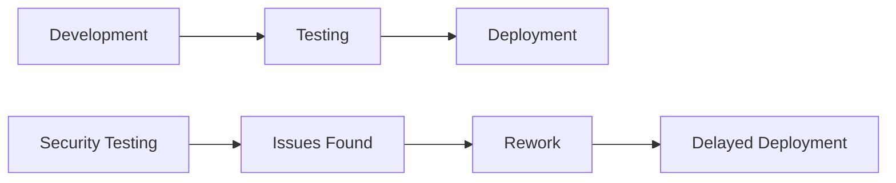
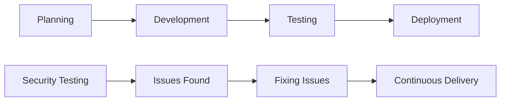
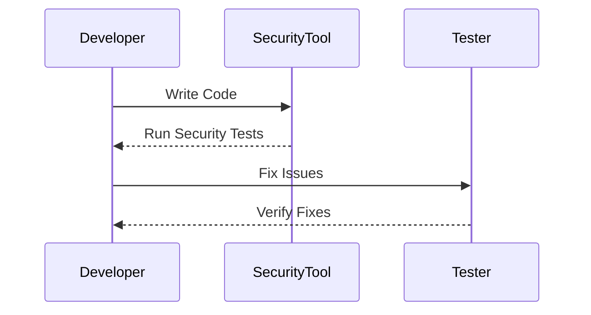

## Traditional Approaches to Security

### Background Theory

In traditional software development lifecycles, security testing was often conducted as a separate phase, typically after the development phase but before the software was deployed to production. This approach, often referred to as the "waterfall model," involved a linear progression through various stages of development, testing, and deployment. 

#### Why This Approach Was Used

This approach was used because it allowed for a structured and systematic way to ensure that the software met certain quality standards before being released. However, it had several significant drawbacks:

1. **Late Identification of Issues**: Since security testing was done late in the lifecycle, any issues found would require extensive rework, which could delay the project significantly.
2. **Increased Cost**: Fixing issues later in the development process is generally more expensive due to the amount of rework required.
3. **Dependence on External Teams**: Developers often had to wait for security teams to test their code, leading to delays and a lack of control over the development process.

### Real-World Example

A notable example of the consequences of this approach is the Heartbleed bug (CVE-2014-0160). This vulnerability in OpenSSL was discovered in 2014 and affected millions of websites. The bug was present in the code for about two years before it was detected. The late discovery led to widespread panic and significant efforts to patch systems, highlighting the risks associated with delayed security testing.



### DevSecOps: A New Paradigm

### Background Theory

DevSecOps is an approach that integrates security practices into the entire software development lifecycle, from planning to deployment. The goal is to make security a shared responsibility among all team members, including developers, operations staff, and security professionals. This approach aims to identify and mitigate security risks early in the development process, thereby reducing the overall cost and time required to deliver secure software.

#### Key Principles of DevSecOps

1. **Shift Left**: This principle emphasizes integrating security practices as early as possible in the development process. By doing so, issues can be identified and addressed before they become more complex and costly to fix.
2. **Continuous Integration and Continuous Delivery (CI/CD)**: DevSecOps leverages CI/CD pipelines to automate security testing and ensure that security checks are performed continuously throughout the development process.
3. **Collaboration**: DevSecOps promotes collaboration between developers, operations, and security teams to ensure that security is considered at every stage of the development process.

### Real-World Example

One real-world example of DevSecOps in action is the implementation of automated security testing in the CI/CD pipeline of a major tech company like Google. Google uses tools like OSS-Fuzz to automatically find vulnerabilities in open-source software. This approach ensures that security is integrated into the development process, reducing the likelihood of vulnerabilities making it to production.



### Myth Debunking: DevSecOps Saves Time and Increases Developer Speed

### Background Theory

One common myth about DevSecOps is that it slows down the development process by introducing additional security checks. However, this is a misconception. In reality, DevSecOps can actually save time and increase developer speed by identifying and fixing issues earlier in the development process.

#### How DevSecOps Saves Time

1. **Early Issue Detection**: By integrating security testing into the development process, issues can be identified and fixed early, reducing the amount of rework required.
2. **Automated Testing**: Automated security testing tools can run tests continuously, providing immediate feedback to developers. This allows developers to address issues promptly, rather than waiting for a separate testing phase.
3. **Reduced Dependencies**: With DevSecOps, developers are no longer dependent on external security teams to test their code. This reduces the time spent waiting for security reviews and allows developers to have more control over their work.

### Real-World Example

Consider the case of a company that implemented DevSecOps practices and saw a significant reduction in the time required to fix security issues. Before implementing DevSecOps, the company would often spend weeks or even months fixing security issues found during the testing phase. After implementing DevSecOps, these issues were identified and fixed within days, significantly reducing the time required to deliver secure software.



### Myth Debunking: DevSecOps Does Not Result in Loss of Control

### Background Theory

Another common myth about DevSecOps is that it results in developers giving up control and being unable to plan their work effectively. However, this is also a misconception. In reality, DevSecOps actually empowers developers by giving them more control over their work and allowing them to plan more effectively.

#### How DevSecOps Empowers Developers

1. **Control Over Work**: With DevSecOps, developers are no longer dependent on external security teams to test their code. This means that developers can run security checks at the best possible opportunity, allowing them to fix issues quickly and easily.
2. **Better Planning**: By integrating security testing into the development process, developers can better plan their work. They can identify potential security issues early and plan their work accordingly, reducing the likelihood of unexpected delays.
3. **Improved Collaboration**: DevSecOps promotes collaboration between developers, operations, and security teams. This collaboration ensures that security is considered at every stage of the development process, reducing the likelihood of security issues making it to production.

### Real-World Example

Consider the case of a company that implemented DevSecOps practices and saw a significant improvement in the ability of developers to plan their work. Before implementing DevSecOps, developers would often spend significant amounts of time waiting for security reviews, leading to delays and a lack of control over their work. After implementing DevSecOps, developers were able to run security checks themselves, allowing them to fix issues quickly and plan their work more effectively.


### How to Prevent / Defend Against Misconceptions About DevSecOps

### Detection

To detect misconceptions about DevSecOps, it is important to regularly communicate with stakeholders and gather feedback. This can be done through regular meetings, surveys, and other forms of communication. By gathering feedback, you can identify areas where misconceptions may exist and take steps to address them.

### Prevention

To prevent misconceptions about DevSecOps, it is important to provide regular training and education to all team members. This can be done through regular training sessions, workshops, and other forms of education. By providing regular training and education, you can ensure that all team members understand the principles of DevSecOps and how it can benefit the development process.

### Secure Coding Fixes

To demonstrate the benefits of DevSecOps, consider the following example of a vulnerable code snippet and its secure counterpart.

#### Vulnerable Code Snippet

```python
def login(username, password):
    if username == "admin" and password == "password":
        return True
    else:
        return False
```

#### Secure Code Snippet

```python
import hashlib

def login(username, password):
    hashed_password = hashlib.sha256(password.encode()).hexdigest()
    if username == "admin" and hashed_password == "5e884898da28047151d0e56f8dc6292773603d0d6aabbdd62a11ef721d1542d8":
        return True
    else:
        return False
```

### Configuration Hardening

To further secure your environment, consider the following configuration hardening steps:

1. **Enable Security Features**: Ensure that all security features are enabled and configured correctly. This includes features such as firewalls, intrusion detection systems, and encryption.
2. **Regular Audits**: Conduct regular audits to ensure that your environment remains secure. This can be done through regular security assessments and penetration testing.
3. **Patch Management**: Ensure that all systems are kept up-to-date with the latest security patches. This can be done through regular patch management processes.

### Conclusion

By debunking common myths about DevSecOps, you can ensure that your team understands the benefits of this approach and how it can improve the development process. By integrating security practices into the entire software development lifecycle, you can identify and mitigate security risks early, reducing the overall cost and time required to deliver secure software.

---
<!-- nav -->
[[03-Learning Objectives|Learning Objectives]] | [[DevSecOps/DevSecOps Bootcamp/01-DevSecOps Introduction/03-Debunking DevSecOps Myths/02-More DevSecOps Myths/00-Overview|Overview]] | [[DevSecOps/DevSecOps Bootcamp/01-DevSecOps Introduction/03-Debunking DevSecOps Myths/02-More DevSecOps Myths/05-Practice Questions & Answers|Practice Questions & Answers]]
