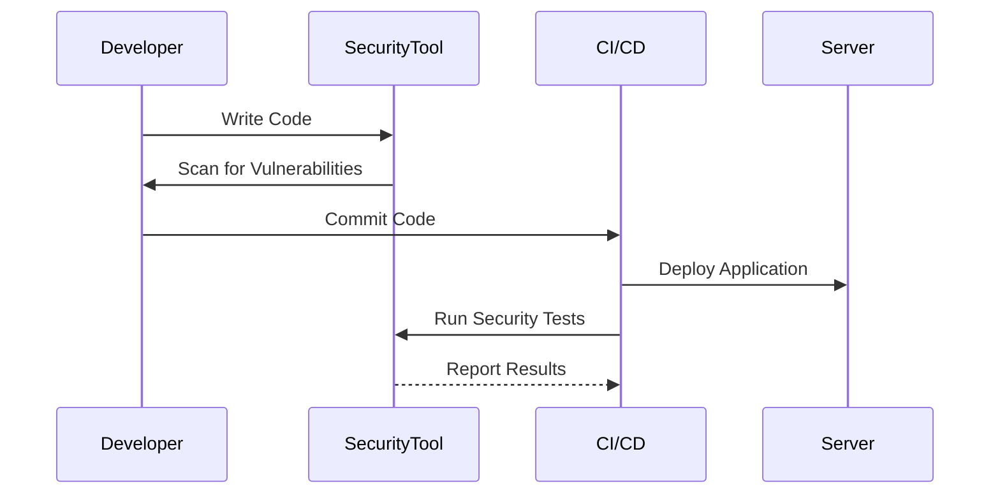
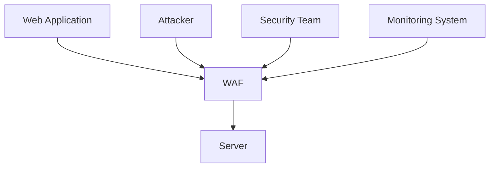

## Introduction to DevSecOps

DevSecOps is an approach to software development that integrates security practices throughout the entire software development lifecycle (SDLC). This methodology aims to ensure that security is not an afterthought but is embedded into every phase of the development process, from planning and coding to testing and deployment. By doing so, DevSecOps helps organizations build more secure applications and reduce the risk of vulnerabilities being exploited.

### What is DevSecOps?

DevSecOps is a combination of three key concepts:

- **Development (Dev):** The process of writing and maintaining code.
- **Security (Sec):** Practices and tools used to protect systems and data from unauthorized access and other threats.
- **Operations (Ops):** The management and maintenance of IT infrastructure and services.

In traditional software development, security was often treated as a separate phase, typically occurring late in the development cycle. This approach led to several issues, including increased costs, delays, and a higher likelihood of vulnerabilities making it into production. DevSecOps addresses these challenges by integrating security into every stage of the development process.

### Why is DevSecOps Important?

The importance of DevSecOps lies in its ability to shift security left—meaning that security considerations are made earlier in the development process. This approach offers several benefits:

- **Early Detection:** Identifying and fixing security issues early in the development cycle reduces the cost and complexity of remediation.
- **Continuous Integration:** Security checks can be automated and integrated into continuous integration/continuous delivery (CI/CD) pipelines, ensuring that security is a consistent part of the development process.
- **Collaboration:** DevSecOps promotes collaboration between developers, security teams, and operations staff, leading to better communication and shared responsibility for security.

### How Does DevSecOps Work?

DevSecOps operates on the principle of integrating security practices into the SDLC. This involves several key steps:

1. **Planning:** Security requirements and risks are identified during the planning phase.
2. **Coding:** Developers follow secure coding practices and use tools to identify potential vulnerabilities.
3. **Testing:** Automated security tests are run continuously to detect and address issues.
4. **Deployment:** Security configurations and policies are applied during deployment.
5. **Monitoring:** Post-deployment monitoring ensures that security controls remain effective.

### Real-World Examples

To understand the impact of DevSecOps, let's look at some real-world examples:

#### Example 1: Equifax Data Breach (CVE-2017-5638)

In 2017, Equifax suffered a massive data breach that exposed sensitive personal information of millions of customers. The breach was caused by a vulnerability in Apache Struts, a popular web application framework. The vulnerability was known, but Equifax failed to patch their systems in a timely manner.

**What Went Wrong?**
- Lack of proper security testing and patch management.
- Delayed response to known vulnerabilities.

**How to Prevent / Defend:**
- Implement a robust patch management system.
- Regularly scan for vulnerabilities using tools like Nessus or Qualys.
- Automate security testing in CI/CD pipelines.



#### Example 2: Capital One Data Breach (CVE-2019-11510)

In 2019, Capital One experienced a data breach that exposed the personal information of over 100 million customers. The breach was caused by a misconfiguration in a web application firewall (WAF) that allowed unauthorized access to sensitive data.

**What Went Wrong?**
- Misconfigured WAF settings.
- Lack of proper monitoring and alerting.

**How to Prevent / Defend:**
- Implement strict configuration management practices.
- Use tools like AWS Config or Azure Policy to enforce compliance.
- Monitor and log all access attempts to sensitive resources.



### Secure Coding Practices

Secure coding is a critical component of DevSecOps. Developers must follow best practices to minimize the risk of introducing vulnerabilities into their code. Here are some key secure coding practices:

1. **Input Validation:** Ensure that all user inputs are validated to prevent injection attacks.
2. **Error Handling:** Properly handle errors to avoid exposing sensitive information.
3. **Authentication and Authorization:** Implement strong authentication mechanisms and enforce least privilege principles.
4. **Data Encryption:** Encrypt sensitive data both in transit and at rest.
5. **Code Reviews:** Conduct regular code reviews to identify and fix security issues.

#### Example: SQL Injection Prevention

SQL injection is a common vulnerability that occurs when untrusted data is included in a SQL query. To prevent SQL injection, developers should use parameterized queries.

**Vulnerable Code:**

```sql
SELECT * FROM users WHERE username = '$username';
```

**Secure Code:**

```sql
PreparedStatement stmt = connection.prepareStatement("SELECT * FROM users WHERE username = ?");
stmt.setString(1, username);
ResultSet rs = stmt.executeQuery();
```

### Continuous Integration/Continuous Delivery (CI/CD)

CI/CD pipelines are essential for implementing DevSecOps. These pipelines automate the build, test, and deployment processes, allowing security checks to be integrated seamlessly.

#### Example: Jenkins CI/CD Pipeline

Jenkins is a popular open-source automation server that can be used to implement CI/CD pipelines. Here’s an example of a Jenkins pipeline that includes security testing:

```yaml
pipeline {
    agent any
    stages {
        stage('Build') {
            steps {
                sh 'mvn clean package'
            }
        }
        stage('Test') {
            steps {
                sh 'mvn test'
            }
        }
        stage('Security Test') {
            steps {
                sh 'dependency-check --project MyProject --scan target'
            }
        }
        stage('Deploy') {
            steps {
                sh 'scp target/myapp.jar user@server:/opt/myapp/'
            }
        }
    }
}
```

### Monitoring and Logging

Monitoring and logging are crucial for detecting and responding to security incidents. Tools like ELK Stack (Elasticsearch, Logstash, Kibana) can be used to collect, analyze, and visualize logs.

#### Example: ELK Stack Configuration

Here’s an example of an ELK Stack configuration:

```json
{
  "input": {
    "type": "log",
    "path": "/var/log/*.log"
  },
  "output": {
    "elasticsearch": {
      "hosts": ["localhost:9200"]
    }
  }
}
```

### Hands-On Labs

To gain practical experience with DevSecOps, consider the following hands-on labs:

- **PortSwigger Web Security Academy:** Offers interactive labs to learn about web security vulnerabilities and how to mitigate them.
- **OWASP Juice Shop:** An intentionally insecure web application for practicing web security skills.
- **DVWA (Damn Vulnerable Web Application):** Another intentionally insecure web application for learning web security.

### Conclusion

DevSecOps is a comprehensive approach to integrating security into the software development lifecycle. By following secure coding practices, automating security checks in CI/CD pipelines, and implementing robust monitoring and logging, organizations can significantly reduce the risk of security vulnerabilities. The examples and practices discussed in this chapter provide a solid foundation for implementing DevSecOps in your organization.

---
<!-- nav -->
[[DevSecOps/DevSecOps Bootcamp/01-DevSecOps Introduction/03-Debunking DevSecOps Myths/03-Module Summary/00-Overview|Overview]] | [[02-Empowering Developers through DevSecOps|Empowering Developers through DevSecOps]]
