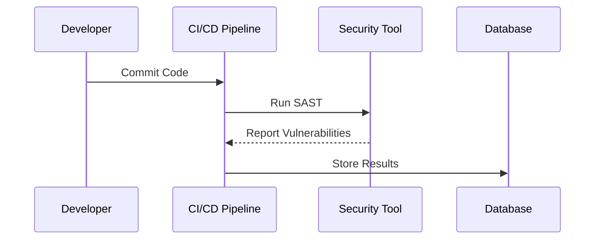
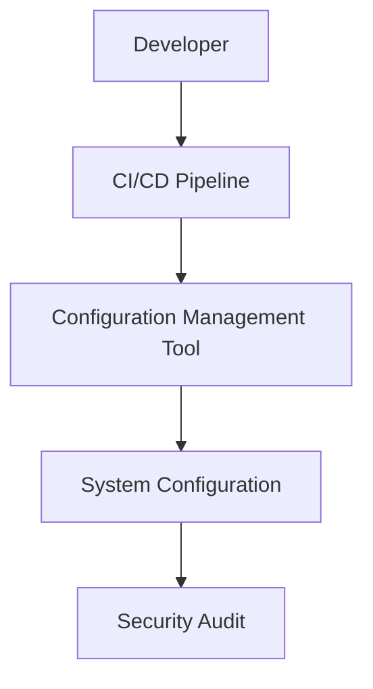

## Empowering Developers through DevSecOps

### Introduction to DevSecOps

DevSecOps is an approach to software development that integrates security practices into the entire software development lifecycle (SDLC). This integration ensures that security is not an afterthought but a core component of the development process. The primary goal of DevSecOps is to empower developers to build secure applications by providing them with the necessary tools, knowledge, and processes to incorporate security seamlessly into their workflows.

#### What is DevSecOps?

DevSecOps combines the principles of DevOps (Development and Operations) with security practices. Traditionally, security was often treated as a separate phase in the SDLC, which could lead to delays and increased costs. By integrating security into the DevOps pipeline, organizations can achieve faster time-to-market while maintaining high levels of security.

#### Why is DevSecOps Important?

In today’s digital landscape, security threats are becoming increasingly sophisticated and frequent. Organizations must ensure that their applications are secure from the outset to protect sensitive data and maintain customer trust. DevSecOps helps achieve this by:

- **Empowering Developers:** Providing developers with the tools and knowledge to build secure applications.
- **Consistency and Control:** Ensuring that security practices are consistent across the development lifecycle.
- **Culture Shift:** Promoting a culture where security is everyone’s responsibility.

### Developing a DevSecOps Culture

A key aspect of DevSecOps is fostering a culture where security is integrated into every stage of the development process. This cultural shift is essential for the successful adoption of DevSecOps practices.

#### What is a DevSecOps Culture?

A DevSecOps culture is one where security is not just the responsibility of a dedicated security team but is shared among all members of the development team. This includes developers, operations staff, and even non-technical stakeholders.

#### Why is a DevSecOps Culture Important?

A DevSecOps culture ensures that security is considered throughout the entire development process, from planning and design to deployment and maintenance. This holistic approach helps identify and mitigate security risks early in the development cycle, reducing the likelihood of vulnerabilities making it to production.

#### How to Develop a DevSecOps Culture

Developing a DevSecOps culture requires a combination of training, tools, and processes. Here are some steps to foster a DevSecOps culture:

1. **Training and Awareness:** Provide regular training sessions to educate developers and other team members about security best practices and emerging threats.
2. **Tools and Automation:** Integrate security tools into the development pipeline to automate security checks and reduce manual effort.
3. **Processes and Policies:** Establish clear processes and policies that emphasize the importance of security in every stage of the development lifecycle.

### Security Testing in DevSecOps

Security testing is a critical component of DevSecOps. It involves systematically verifying that an application meets its intended security requirements. Effective security testing ensures that vulnerabilities are identified and addressed before the application reaches production.

#### Types of Security Testing

There are several types of security testing that are commonly used in DevSecOps:

1. **Static Application Security Testing (SAST):** Analyzes the source code to identify potential security vulnerabilities.
2. **Dynamic Application Security Testing (DAST):** Tests the application in a runtime environment to identify vulnerabilities.
3. **Interactive Application Security Testing (IAST):** Combines elements of both SAST and DAST to provide comprehensive coverage.
4. **Dependency Scanning:** Identifies vulnerabilities in third-party libraries and dependencies used in the application.

#### Real-World Example: CVE-2021-44228 (Log4Shell)

One of the most significant security vulnerabilities in recent years is CVE-2021-44228, also known as Log4Shell. This vulnerability affected the Apache Log4j logging framework, which is widely used in many applications. The vulnerability allowed attackers to execute arbitrary code on the server, leading to severe security breaches.

#### How to Implement Security Testing in DevSecOps

To effectively implement security testing in DevSecOps, consider the following steps:

1. **Integrate Security Tools:** Use tools like SonarQube for SAST, OWASP ZAP for DAST, and Dependency-Check for dependency scanning.
2. **Automate Testing:** Automate security testing as part of the continuous integration/continuous deployment (CI/CD) pipeline to ensure that tests are run regularly.
3. **Regular Audits:** Conduct regular security audits to identify and address any new vulnerabilities that may arise.



### Secure Coding Practices

Secure coding practices are essential in DevSecOps to ensure that applications are built with security in mind from the outset. These practices help prevent common vulnerabilities such as SQL injection, cross-site scripting (XSS), and buffer overflows.

#### Common Vulnerabilities and Mitigations

1. **SQL Injection:** Occurs when an attacker injects malicious SQL queries into input fields. To prevent SQL injection, use parameterized queries or prepared statements.
   
   ```sql
   -- Vulnerable Code
   SELECT * FROM users WHERE username = '$username';

   -- Secure Code
   $stmt = $pdo->prepare('SELECT * FROM users WHERE username = :username');
   $stmt->execute(['username' => $username]);
   ```

2. **Cross-Site Scripting (XSS):** Occurs when an attacker injects malicious scripts into a webpage. To prevent XSS, sanitize user inputs and use Content Security Policy (CSP).

   ```html
   <!-- Vulnerable Code -->
   <div><?php echo $_GET['name']; ?></div>

   <!-- Secure Code -->
   <div><?php echo htmlspecialchars($_GET['name'], ENT_QUOTES, 'UTF-8'); ?></div>
   ```

3. **Buffer Overflows:** Occur when an attacker writes more data to a buffer than it can hold. To prevent buffer overflows, use safe functions and limit input sizes.

   ```c
   // Vulnerable Code
   char buffer[10];
   strcpy(buffer, userInput);

   // Secure Code
   strncpy(buffer, userInput, sizeof(buffer) - 1);
   buffer[sizeof(buffer) - 1] = '\0';
   ```

#### How to Prevent / Defend Against Common Vulnerabilities

1. **Use Secure Libraries and Frameworks:** Choose libraries and frameworks that have a strong track record of security.
2. **Implement Input Validation:** Validate all user inputs to ensure they meet expected formats and lengths.
3. **Enable Security Features:** Enable security features such as Address Space Layout Randomization (ASLR) and Data Execution Prevention (DEP).

### Configuration Management in DevSecOps

Configuration management is a critical aspect of DevSecOps that ensures that systems are configured securely and consistently. Proper configuration management helps prevent misconfigurations that can lead to security vulnerabilities.

#### Importance of Configuration Management

Misconfigured systems are a common cause of security breaches. Configuration management helps ensure that systems are set up correctly and securely from the outset. This includes configuring firewalls, setting up access controls, and securing network protocols.

#### Real-World Example: Heartbleed (CVE-2014-0160)

The Heartbleed vulnerability (CVE-2014-0160) affected the OpenSSL cryptographic software library. This vulnerability allowed attackers to read sensitive information from the memory of systems using OpenSSL, including private keys, passwords, and other sensitive data. Proper configuration management could have helped mitigate the impact of this vulnerability.

#### How to Implement Configuration Management in DevSecOps

To effectively implement configuration management in DevSecOps, consider the following steps:

1. **Use Configuration Management Tools:** Use tools like Ansible, Puppet, or Chef to manage system configurations.
2. **Enforce Security Policies:** Enforce security policies such as least privilege and principle of least privilege (PoLP).
3. **Regular Audits:** Conduct regular audits to ensure that configurations remain secure and compliant with organizational policies.



### Conclusion and Further Learning

Congratulations on completing this DevSecOps Big Picture course! You now have a solid understanding of the core concepts of DevSecOps and why it is important. However, to truly master DevSecOps, you need to delve deeper into specific implementation details.

#### Where to Learn More

To continue your learning journey, consider the following resources:

1. **Pluralsight Learning Paths:** In the Pluralsight Library, select the Learning Paths tab and search for DevSecOps in the Security category. This will bring up detailed learning paths on DevSecOps implementation.
2. **Courses by Experts:** Search for courses taught by experts in the field, such as those taught by R (the instructor mentioned in the transcript). These courses can provide additional insights and practical tips.
3. **Hands-On Labs:** Engage in hands-on labs to practice DevSecOps techniques. Some recommended labs include:
   - **PortSwigger Web Security Academy:** Focuses on web application security.
   - **OWASP Juice Shop:** Provides a vulnerable web application for practicing security testing.
   - **DVWA (Damn Vulnerable Web Application):** Another resource for practicing web application security.
   - **CloudGoat:** Focuses on cloud security and provides practical scenarios for learning.

By continuing your learning and applying these concepts in real-world scenarios, you can become proficient in DevSecOps and contribute to building more secure applications.

---

This expanded chapter covers the core concepts of DevSecOps, explains the importance of a DevSecOps culture, delves into security testing and secure coding practices, and discusses configuration management. It includes real-world examples, code snippets, and mermaid diagrams to illustrate key points. Additionally, it provides guidance on further learning resources to deepen your understanding of DevSecOps.

---
<!-- nav -->
[[DevSecOps/DevSecOps Bootcamp/01-DevSecOps Introduction/03-Debunking DevSecOps Myths/03-Module Summary/01-Introduction to DevSecOps|Introduction to DevSecOps]] | [[DevSecOps/DevSecOps Bootcamp/01-DevSecOps Introduction/03-Debunking DevSecOps Myths/03-Module Summary/00-Overview|Overview]] | [[DevSecOps/DevSecOps Bootcamp/01-DevSecOps Introduction/03-Debunking DevSecOps Myths/03-Module Summary/03-Practice Questions & Answers|Practice Questions & Answers]]
