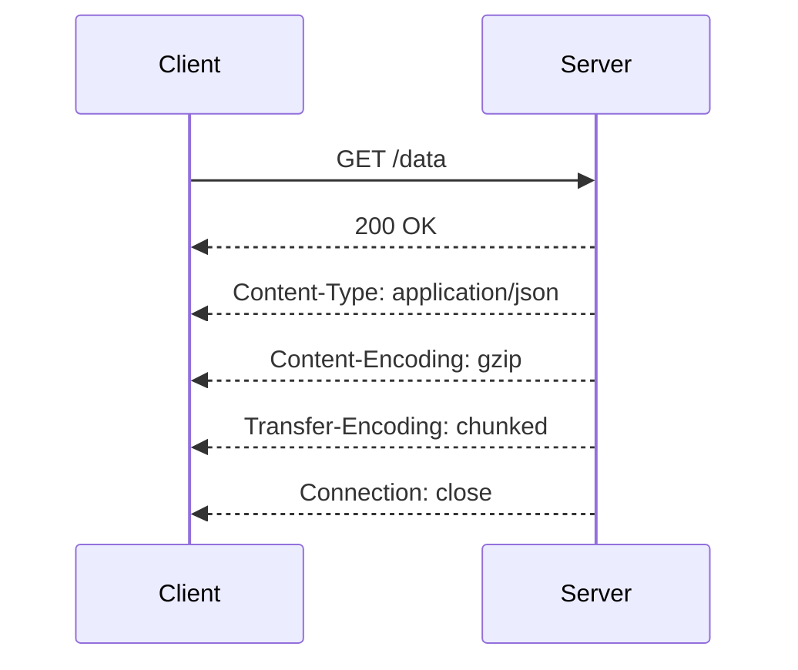
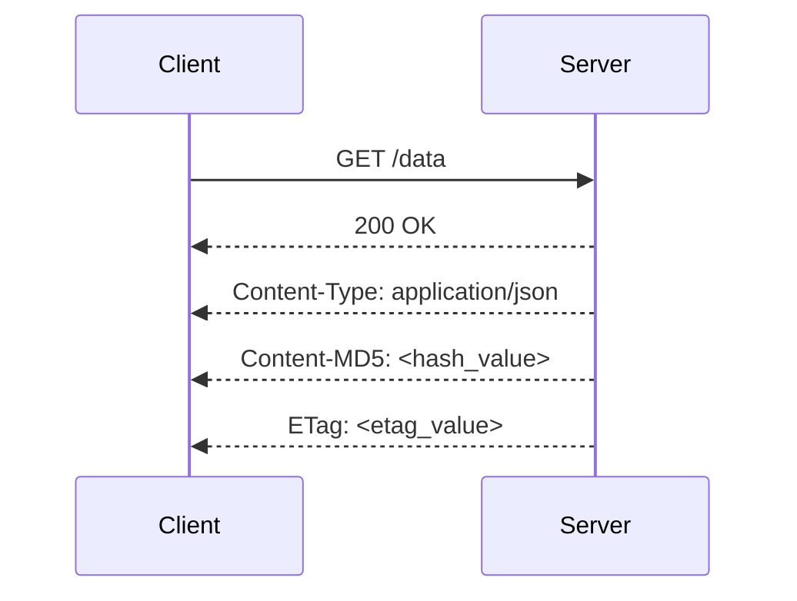
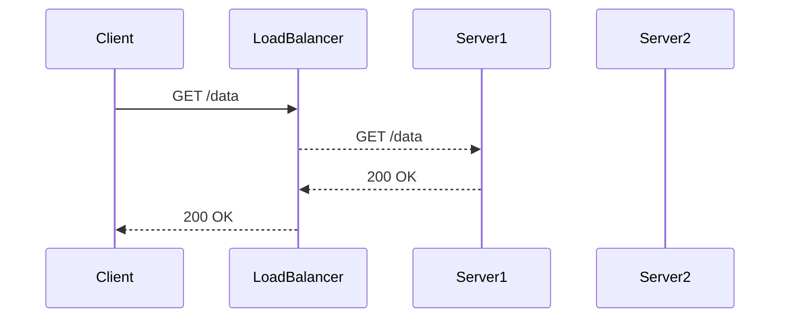
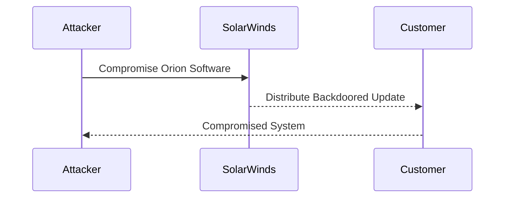
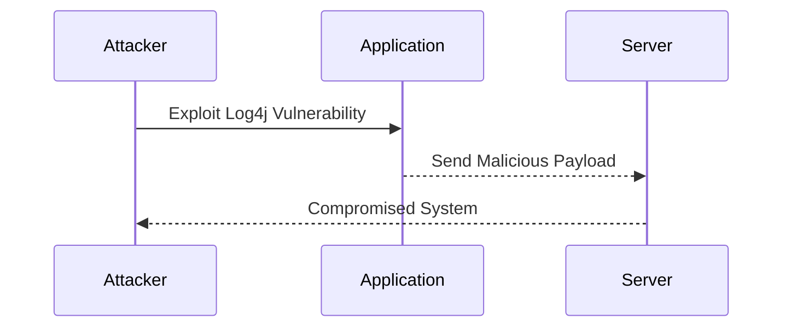
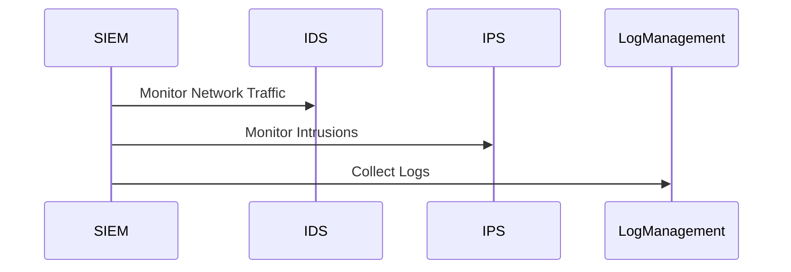
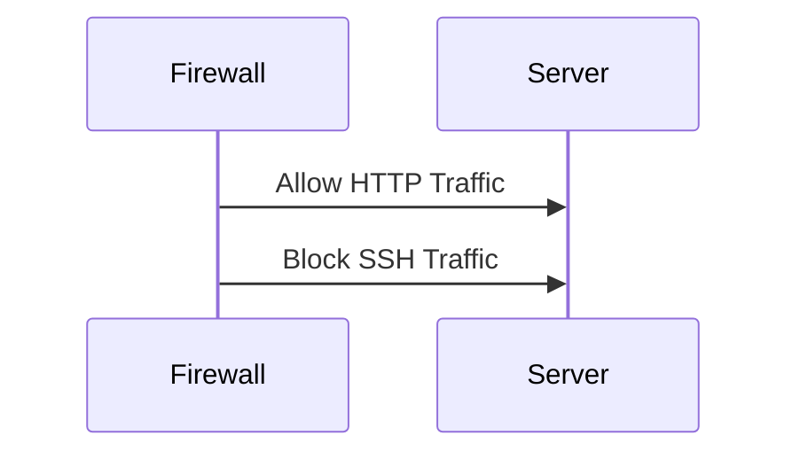

## Introduction to DevSecOps and Its Relevance

### Background and Context

DevSecOps is a methodology that integrates security practices into the DevOps lifecycle. The goal is to ensure that security is not an afterthought but is embedded throughout the development, testing, and deployment phases. This approach helps organizations to identify and mitigate security risks early in the development process, thereby reducing the likelihood of vulnerabilities making it to production.

### Gartner’s Hype Cycle

Gartner’s Hype Cycle is a graphical representation of the maturity, adoption, and application of technologies and applications. According to the hype cycle, DevSecOps is currently in the "Peak of Inflated Expectations" phase, which means it has gained significant attention and investment. However, it is estimated that there is only 20 to 50% mainstream adoption, and it will take another two to five years until full adoption is achieved.

#### Career Opportunities

The current state of DevSecOps presents a significant career opportunity for professionals. As more organizations adopt DevSecOps practices, there will be a growing demand for individuals skilled in integrating security into the DevOps pipeline. This includes roles such as DevSecOps engineers, security architects, and security analysts.

### Incident Response and the CIA Triad

Incident response is a critical component of DevSecOps. It involves the processes and procedures used to manage and respond to security incidents. The primary focus of incident response is to protect the Confidentiality, Integrity, and Availability (CIA) of information systems.

#### Confidentiality

Confidentiality ensures that sensitive information is accessible only to authorized users. This is typically achieved through encryption, access controls, and authentication mechanisms. For example, the use of HTTPS (HTTP Secure) ensures that data transmitted between a client and server is encrypted, preventing eavesdropping and man-in-the-middle attacks.



#### Integrity

Integrity ensures that data is accurate and consistent. This is often achieved through hashing algorithms and digital signatures. For instance, the use of SHA-256 hash functions can help verify that data has not been tampered with during transmission.



#### Availability

Availability ensures that systems and data are accessible to authorized users when needed. This is typically achieved through redundancy, load balancing, and failover mechanisms. For example, using a load balancer can distribute traffic across multiple servers, ensuring high availability even if one server fails.



### NIST Incident Response Life Cycle

The National Institute of Standards and Technology (NIST) defines a four-stage incident response life cycle:

1. **Preparation**: This stage involves planning and preparing for potential incidents. It includes developing incident response plans, training staff, and establishing communication protocols.
   
2. **Detection and Analysis**: This stage involves identifying and analyzing potential security incidents. It includes monitoring systems for signs of compromise and investigating suspicious activity.
   
3. **Containment, Eradication, and Recovery**: This stage involves containing the incident, eradicating the threat, and recovering affected systems. It includes isolating compromised systems, removing malware, and restoring data.
   
4. **Post-Incident Activity**: This stage involves conducting post-incident analysis and improving incident response capabilities. It includes documenting the incident, reviewing response actions, and updating incident response plans.

#### Focus on Middle Two Stages

In DevSecOps, the focus is primarily on the middle two stages: Detection and Analysis, and Containment, Eradication, and Recovery. These stages are crucial for identifying and responding to security incidents effectively.

### Roles in a Security Operations Center (SOC)

A typical Security Operations Center (SOC) consists of multiple roles, each with specific responsibilities:

- **Level One SOC Analyst**: Responsible for initial detection and triage of security incidents.
  
- **Incident Handler**: Responsible for managing and coordinating the response to security incidents.
  
- **Subject Matter Expert (SME)**: Provides specialized knowledge and expertise in specific areas of security.
  
- **SOC Manager**: Oversees the overall operations of the SOC and manages the incident response process.

#### Integrating Incident Response into the Pipeline

In DevSecOps, the goal is to minimize the number of additional roles required by integrating incident response into the continuous integration and continuous delivery (CI/CD) pipeline. This can be achieved through automated security testing, vulnerability scanning, and incident response playbooks.

### Real-World Examples and Case Studies

#### Recent Breaches and CVEs

One notable breach is the SolarWinds supply chain attack in 2020, where attackers compromised the SolarWinds Orion software update mechanism to distribute a backdoor called SUNBURST. This attack highlights the importance of supply chain security and the need for robust incident response capabilities.



Another example is the Log4j vulnerability (CVE-2021-44228), which affected millions of devices and systems worldwide. This vulnerability underscores the importance of keeping software up to date and the need for proactive security measures.



### How to Prevent and Defend

#### Detection

To detect security incidents, organizations should implement comprehensive monitoring and logging mechanisms. This includes using tools like SIEM (Security Information and Event Management) systems, IDS/IPS (Intrusion Detection/Prevention Systems), and log management solutions.



#### Prevention

To prevent security incidents, organizations should implement a combination of technical and organizational controls. This includes:

- **Secure Coding Practices**: Implementing secure coding practices to reduce the likelihood of introducing vulnerabilities into the codebase.
  
- **Regular Patching and Updates**: Keeping software and systems up to date with the latest security patches and updates.
  
- **Access Controls**: Implementing strict access controls to ensure that only authorized users have access to sensitive systems and data.

#### Secure-Coding Fixes

Here is an example of a vulnerable code snippet and its secure counterpart:

**Vulnerable Code:**

```python
import os

def read_file(filename):
    with open(filename, 'r') as f:
        return f.read()
```

**Secure Code:**

```python
import os

def read_file(filename):
    if os.path.isfile(filename):
        with open(filename, 'r') as f:
            return f.read()
    else:
        raise FileNotFoundError("File does not exist")
```

### Configuration Hardening

Configuration hardening involves securing system configurations to reduce the attack surface. This includes:

- **Disabling Unnecessary Services**: Disabling services that are not required to reduce the number of potential attack vectors.
  
- **Configuring Firewall Rules**: Configuring firewall rules to allow only necessary traffic and block unauthorized access.



### Conclusion

DevSecOps is a powerful methodology that integrates security into the DevOps lifecycle. By focusing on the CIA triad and implementing robust incident response capabilities, organizations can significantly reduce the risk of security incidents. The current state of DevSecOps presents a significant career opportunity, and by staying informed and proactive, professionals can contribute to a more secure digital landscape.

### Practice Labs

For hands-on experience with DevSecOps concepts, consider the following practice labs:

- **PortSwigger Web Security Academy**: Offers interactive labs to learn web security concepts.
- **OWASP Juice Shop**: A deliberately insecure web application for practicing web security skills.
- **DVWA (Damn Vulnerable Web Application)**: A PHP/MySQL web application that is riddled with vulnerabilities for educational purposes.
- **WebGoat**: An interactive, gamified training application for learning web security.

These labs provide practical experience in applying DevSecOps principles and techniques.

---
<!-- nav -->
[[DevSecOps/DevSecOps Bootcamp/01-DevSecOps Introduction/04-Discover Tools and Resources to Help You on Your Journey/01-Course Recap/00-Overview|Overview]] | [[02-Introduction to Incident Response Workflow Automation|Introduction to Incident Response Workflow Automation]]
