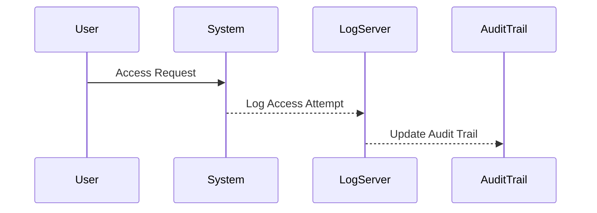

## Storing and Protecting Evidence and Audit Trails

### Importance of Evidence and Audit Trails

In the realm of DevSecOps, maintaining robust evidence and audit trails is crucial for ensuring accountability, compliance, and security. These records serve as critical artifacts that can help in identifying and responding to security incidents, as well as providing a historical context for decision-making processes. Evidence and audit trails encompass a wide range of data, including logs, transaction records, access controls, and system configurations.

#### What Are Evidence and Audit Trails?

Evidence refers to any data that can be used to prove or disprove an event or action. In the context of DevSecOps, this could include log files, system configurations, and user activity records. Audit trails, on the other hand, are a chronological record of system activities that can be used to reconstruct events and identify potential security breaches or unauthorized actions.

#### Why Are They Important?

1. **Accountability**: Evidence and audit trails provide a means to hold individuals accountable for their actions within the system. This is particularly important in environments where multiple users have access to sensitive information or systems.
   
2. **Compliance**: Many regulatory frameworks require organizations to maintain detailed records of system activities. For example, the General Data Protection Regulation (GDPR) mandates that organizations keep records of processing activities to demonstrate compliance.

3. **Incident Response**: During a security incident, audit trails can be invaluable in understanding the sequence of events leading up to the breach. This can help in identifying the root cause and implementing measures to prevent similar incidents in the future.

4. **Forensic Analysis**: In the event of a security breach, audit trails can be used for forensic analysis to determine the extent of the damage and the methods used by attackers.

### Protecting Evidence and Audit Trails

Given the critical nature of evidence and audit trails, it is essential to implement robust mechanisms to protect them from deletion or tampering. Here are some key strategies:

#### Backup Strategies

1. **Regular Backups**: Ensure that regular backups of all critical data are performed. This includes both evidence and audit trail data. Regular backups can help in recovering data in case of accidental deletion or corruption.

2. **Offsite Storage**: Store backups in a secure offsite location to protect against physical threats such as natural disasters or theft. Cloud storage solutions can be effective for this purpose.

3. **Version Control**: Maintain versioned backups to ensure that older versions of data can be recovered if needed. This is particularly useful in scenarios where data is accidentally overwritten or corrupted.

#### Secure Storage

1. **Encryption**: Encrypt all evidence and audit trail data to protect it from unauthorized access. Encryption ensures that even if data is stolen, it cannot be read without the appropriate decryption keys.

2. **Access Controls**: Implement strict access controls to ensure that only authorized personnel can access evidence and audit trail data. This includes using role-based access control (RBAC) systems to limit access based on job roles and responsibilities.

3. **Audit Logs**: Maintain detailed audit logs of all access attempts to evidence and audit trail data. This can help in detecting and responding to unauthorized access attempts.

### Real-World Examples

#### Example: Equifax Data Breach (CVE-2017-5638)

The Equifax data breach in 2017 exposed sensitive personal information of millions of customers. One of the key issues identified was the lack of proper logging and auditing mechanisms. Had Equifax maintained robust audit trails, it might have been able to detect and respond to the breach more effectively.



### How to Prevent / Defend

#### Detection

1. **Monitoring Tools**: Use monitoring tools to continuously monitor access to evidence and audit trail data. Tools like Splunk, ELK Stack, and Graylog can be used to aggregate and analyze log data.

2. **Anomaly Detection**: Implement anomaly detection mechanisms to identify unusual patterns in access attempts. Machine learning algorithms can be trained to detect deviations from normal behavior.

#### Prevention

1. **Encryption**: Encrypt all evidence and audit trail data at rest and in transit. Use strong encryption algorithms such as AES-256.

2. **Access Controls**: Implement strict access controls to ensure that only authorized personnel can access evidence and audit trail data. Use RBAC systems to enforce least privilege principles.

3. **Regular Audits**: Conduct regular audits to ensure that evidence and audit trail data is being properly protected. This includes reviewing access logs and verifying that backups are being performed correctly.

#### Secure Coding Fixes

Here is an example of how to securely store and protect audit trail data using Python:

```python
import os
import json
from cryptography.fernet import Fernet

# Generate a key for encryption
key = Fernet.generate_key()
cipher_suite = Fernet(key)

# Function to encrypt data
def encrypt_data(data):
    return cipher_suite.encrypt(json.dumps(data).encode())

# Function to decrypt data
def decrypt_data(encrypted_data):
    return json.loads(cipher_suite.decrypt(encrypted_data).decode())

# Sample audit trail data
audit_trail = {
    "timestamp": "2023-10-01T12:00:00Z",
    "user_id": "user123",
    "action": "login",
    "result": "success"
}

# Encrypt the audit trail data
encrypted_audit_trail = encrypt_data(audit_trail)

# Store the encrypted data in a secure location
with open("audit_trail.enc", "wb") as f:
    f.write(encrypted_audit_trail)

# Decrypt the data for verification
decrypted_audit_trail = decrypt_data(encrypted_audit_trail)
print(decrypted_audit_trail)
```

### Complete Example: Full HTTP Request and Response

Here is an example of a full HTTP request and response for accessing audit trail data:

```http
GET /api/audit-trail HTTP/1.1
Host: example.com
Authorization: Bearer <access_token>
Accept: application/json

HTTP/1.1 200 OK
Content-Type: application/json
Date: Mon, 02 Oct 2023 12:00:00 GMT
Content-Length: 123

{
    "audit_trail": [
        {
            "timestamp": "2023-10-01T12:00:00Z",
            "user_id": "user123",
            "action": "login",
            "result": "success"
        },
        {
            "timestamp": "2023-10-01T12:05:00Z",
            "user_id": "user456",
            "action": "logout",
            "result": "success"
        }
    ]
}
```

### Hands-On Labs

To gain practical experience with storing and protecting evidence and audit trails, consider the following labs:

- **PortSwigger Web Security Academy**: Offers modules on logging and monitoring, which cover the importance of maintaining robust audit trails.
- **OWASP Juice Shop**: Provides a real-world application environment where you can practice securing audit trails and handling sensitive data.
- **DVWA (Damn Vulnerable Web Application)**: Allows you to explore various web application vulnerabilities and learn how to secure audit trails effectively.

By following these guidelines and practicing with real-world tools and environments, you can ensure that your evidence and audit trails are properly stored and protected, thereby enhancing the overall security posture of your organization.

---
<!-- nav -->
[[02-Introduction to Incident Response Workflow Automation|Introduction to Incident Response Workflow Automation]] | [[DevSecOps/DevSecOps Bootcamp/01-DevSecOps Introduction/04-Discover Tools and Resources to Help You on Your Journey/01-Course Recap/00-Overview|Overview]] | [[DevSecOps/DevSecOps Bootcamp/01-DevSecOps Introduction/04-Discover Tools and Resources to Help You on Your Journey/01-Course Recap/04-Practice Questions & Answers|Practice Questions & Answers]]
